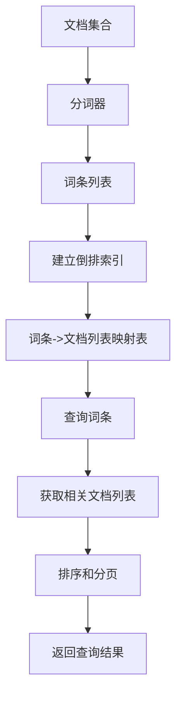

好的,我会按照您提供的要求和模板,尽力写一篇高质量的技术博客文章。

# Lucene原理与代码实例讲解

## 1. 背景介绍

### 1.1 问题的由来

在当今信息时代,海量的非结构化数据如网页、文档、电子邮件等快速增长,如何高效地存储、检索和管理这些数据成为一个巨大的挑战。传统的数据库系统更适合处理结构化数据,而全文检索则是解决非结构化数据检索问题的有效方案。

全文检索(Full-Text Search)是一种在一大批充满自然语言词语的数据中,查找需要的信息的技术。与传统的数据库查询不同,全文检索会从整个文本中提取出关键词并建立索引,然后根据查询关键词快速找到相关文档。

Apache Lucene就是一个优秀的开源全文检索引擎库,它提供了全文索引和搜索功能,可以嵌入到应用程序中使用。Lucene以高性能、灵活性和可扩展性而著称,广泛应用于各种需要添加搜索功能的系统中。

### 1.2 研究现状

全文检索技术经过多年的发展,已经取得了长足的进步。主流的开源全文检索引擎有Lucene、Solr、Elasticsearch等。其中,Lucene作为底层核心库,为上层搜索引擎提供索引和搜索的基本功能。

Lucene最初由Doug Cutting在1997年开发,后捐赠给Apache软件基金会,成为Apache旗下的顶级开源项目。它采用Java语言编写,支持跨平台,可运行在任何具有Java虚拟机的环境中。Lucene广受欢迎的原因在于它提供了高度可扩展的索引和搜索API,支持多种查询语法和各种排序算法,并具有高度优化的查询性能。

目前,Lucene已经发展到9.x版本,拥有活跃的开发者社区。越来越多的知名公司和项目采用了Lucene作为全文检索的核心组件,如Wikipedia、Twitter、Apache Solr、Elasticsearch等。

### 1.3 研究意义 

深入理解Lucene的原理和实现方式,对于提高全文检索系统的性能、可扩展性和可维护性至关重要。掌握Lucene不仅可以在实际项目中灵活地集成和定制搜索功能,还能更好地优化查询效率,处理特殊的搜索需求。

此外,Lucene作为成熟的开源项目,其设计思想和优秀的算法也值得我们学习和借鉴。通过剖析Lucene的源代码,可以领悟到许多编码技巧和最佳实践,提高自己的编程能力。

本文将全面介绍Lucene的核心概念、索引和搜索的工作原理、相关算法的实现细节,并结合大量的代码示例,旨在帮助读者透彻理解Lucene,掌握在实际项目中使用Lucene的方法。

### 1.4 本文结构

本文共分为9个部分:

1. 背景介绍
2. 核心概念与联系
3. 核心算法原理与具体操作步骤
4. 数学模型和公式详细讲解与举例说明  
5. 项目实践:代码实例和详细解释说明
6. 实际应用场景
7. 工具和资源推荐
8. 总结:未来发展趋势与挑战
9. 附录:常见问题与解答

## 2. 核心概念与联系

在深入探讨Lucene的原理之前,我们先来了解一些核心概念,为后续的学习打下基础。

### 2.1 倒排索引

倒排索引(Inverted Index)是Lucene的核心数据结构,用于存储映射文档到其中包含的词条的关系。与传统的正向索引相反,倒排索引的基本思想是:

- 对于每个词条,存储一个记录其在哪些文档中出现的列表
- 每个记录包含文档ID、词条频率(TF)等元数据

这种索引结构使得Lucene可以快速找到包含某个词条的文档,而不需要顺序扫描所有文档。



### 2.2 分词器

分词器(Analyzer)是Lucene中将原始文本转换为词条流的重要组件。分词器通常包含三个步骤:

1. 将文本按照某些规则分割为单词(例如空格、标点符号等)
2. 将单词转换为规范化的词条(例如小写、去除词尾等)
3. 删除无用的词条(例如常用词、停用词等)

Lucene提供了许多内置的分词器,如标准分词器(StandardAnalyzer)、白空格分词器(WhitespaceAnalyzer)等,也支持自定义分词器以满足特殊需求。

### 2.3 索引文件结构

Lucene将索引数据存储在文件系统中,索引由多个子文件组成,每个子文件负责存储特定类型的数据。主要的索引文件包括:

- 段(Segments)文件:.cfs、.cfe等,存储倒排索引数据
- 字典(Dictionaries)文件:.doc等,存储文档相关元数据
- 规范(Norms)文件:.nvd、.nvm等,存储词条权重
- 存储(Stored)文件:.fdx、.fdt等,存储原始文档数据
- 锁(Lock)文件:write.lock,用于防止多个索引过程同时写入

了解索引文件结构有助于我们理解Lucene的内部工作机制。

### 2.4 查询解析器

Lucene提供了多种查询语法,如基于字符串的查询、基于对象的查询等,用于描述搜索条件。查询解析器(QueryParser)负责将查询语法解析为Lucene可以理解的查询对象(Query)。

常用的查询语法包括:

- 词条查询:搜索包含特定词条的文档
- 短语查询:搜索包含特定短语的文档 
- 布尔查询:使用AND、OR、NOT等逻辑运算符组合多个查询条件
- 通配符查询:使用?和*匹配前缀或后缀
- ...

掌握查询语法有助于我们更好地利用Lucene的搜索功能。

### 2.5 评分与排序

Lucene会为每个搜索结果计算一个评分,用于表示文档与查询的相关性程度。评分是基于多个因素综合计算的,主要包括:

- 词条频率(TF):词条在文档中出现的频率
- 反向文档频率(IDF):词条在整个索引中的稀有程度
- 字段权重:不同字段对评分的贡献权重
- ...

评分越高,表示文档与查询越相关。Lucene默认会按照评分对结果进行排序,也支持基于其他字段进行自定义排序。

通过理解Lucene的评分和排序机制,我们可以优化查询,提高搜索的相关性和准确性。

上述这些核心概念相互关联、环环相扣,共同构建了Lucene的全文检索功能。在后续章节中,我们将进一步深入探讨它们的原理和实现细节。

## 3. 核心算法原理与具体操作步骤  

### 3.1 算法原理概述

Lucene的核心算法主要包括:

1. **索引构建算法**:将原始文档转换为高效的倒排索引结构
2. **布尔查询算法**:基于布尔运算快速检索满足查询条件的文档集
3. **评分与排序算法**:计算文档与查询的相关性评分,并对结果进行排序

这些算法相互协作,共同实现了Lucene高效的全文检索功能。

#### 3.1.1 索引构建算法

索引构建算法的主要步骤如下:

1. **分词**:将原始文档内容通过分词器转换为词条流
2. **创建文档**:为每个文档创建一个Lucene内部的文档对象
3. **创建域**:将文档对象的各个字段数据转换为域对象
4. **建立倒排索引**:遍历文档集合,为每个域中的词条创建一个倒排索引项,记录该词条所在的文档信息
5. **存储索引**:将内存中的倒排索引数据刷新到磁盘的索引文件中

索引构建是一个相对耗费资源的过程,但索引一旦构建完成,后续的查询就可以获得极高的性能。

#### 3.1.2 布尔查询算法  

布尔查询算法用于根据查询条件快速检索出满足条件的文档集合。算法原理如下:

1. **查询解析**:将查询语句解析为树状的查询对象结构
2. **查找子查询**:从倒排索引中获取每个子查询的文档集
3. **集合运算**:根据查询对象的逻辑运算符(AND、OR、NOT等),对子查询的文档集进行集合运算,得到最终结果集
4. **增加约束**:对结果集根据其他条件(如范围、权重等)进行进一步过滤

布尔查询算法的优势在于计算高效,并支持复杂的查询条件组合。

#### 3.1.3 评分与排序算法

评分算法用于计算每个文档与查询的相关性得分,排序算法则根据得分对结果集进行排序。算法原理如下:

1. **计算词条权重**:基于TF-IDF等模型计算每个词条的权重
2. **计算字段权重**:根据不同字段的重要性给予不同的权重
3. **计算文档评分**:遍历文档中的词条,累加其词条权重和字段权重的乘积,得到文档最终评分
4. **排序结果集**:按照文档评分由高到低对结果集进行排序

Lucene还提供了多种可插拔的相似度算法,用于自定义评分计算逻辑。

这些核心算法保证了Lucene的高效性和灵活性,使其能够在海量数据场景下提供高性能的全文检索服务。

### 3.2 算法步骤详解

接下来,我们将对上述核心算法的具体实现步骤进行详细讲解。

#### 3.2.1 索引构建算法步骤

1. **分词**

   Lucene通过分词器(Analyzer)将原始文档内容转换为词条流。常用的分词器有StandardAnalyzer、WhitespaceAnalyzer等。

   ```java
   // 创建标准分词器
   Analyzer analyzer = new StandardAnalyzer();
   // 获取分词器的TokenStream
   TokenStream tokenStream = analyzer.tokenStream("myField", new StringReader("The quick brown fox..."));
   // 遍历TokenStream获取每个词条
   CharTermAttribute term = tokenStream.addAttribute(CharTermAttribute.class);
   tokenStream.reset();
   while (tokenStream.incrementToken()) {
       System.out.println(term.toString());
   }
   tokenStream.close();
   ```

2. **创建文档**

   使用IndexWriter创建一个内部的Document对象,用于存储文档数据。

   ```java
   Document doc = new Document();
   doc.add(new TextField("contents", new StringReader("This is the document contents...")));
   doc.add(new StringField("docId", "1", Field.Store.YES));
   ```

3. **创建域**

   Document对象的每个字段数据都会被转换为一个Field域对象,存储在内存的数据结构中。

4. **建立倒排索引**

   IndexWriter会遍历文档集合,为每个域中的词条创建一个倒排索引项,记录该词条所在的文档信息。

   ```java
   Directory directory = FSDirectory.open(Paths.get("/path/to/index"));
   IndexWriterConfig config = new IndexWriterConfig(analyzer);
   IndexWriter indexWriter = new IndexWriter(directory, config);
   indexWriter.addDocument(doc);
   ```

5. **存储索引**

   IndexWriter会定期将内存中的倒排索引数据刷新到磁盘的索引文件中,以节省内存空间。

#### 3.2.2 布尔查询算法步骤

1. **查询解析**

   使用QueryParser将查询语句解析为树状的查询对象结构。

   ```java
   QueryParser parser = new QueryParser("contents", analyzer);
   Query query = parser.parse("quick OR brown AND fox");
   ```

2. **查找子查询**

   从倒排索引中获取每个子查询的文档集。

3. **集合运算**

   根据查询对象的逻