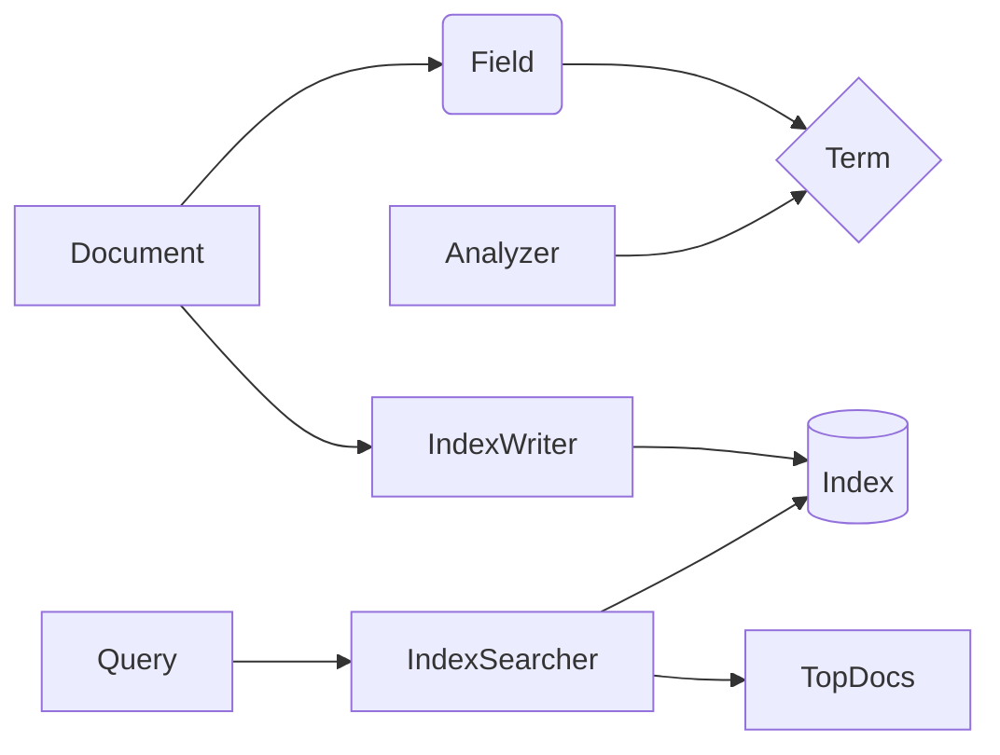

关键词：Lucene、搜索引擎、全文检索、倒排索引、分词器、评分机制、相关度排序

# Lucene搜索引擎原理与代码实例讲解

## 1. 背景介绍
### 1.1 问题的由来
在互联网信息爆炸式增长的今天,海量数据中如何快速准确地搜索到所需信息是一个巨大的挑战。传统的关系型数据库在全文检索方面效率较低,难以满足实时性要求。因此,专门针对全文搜索的高性能搜索引擎应运而生。
### 1.2 研究现状
目前主流的开源搜索引擎库包括Apache Lucene、Elasticsearch、Solr等。其中,Lucene是一个成熟的、高性能的、基于Java的全文搜索引擎库,广泛应用于各种需要全文检索的系统中。很多知名公司和网站都使用了Lucene,如Twitter、LinkedIn、Wikipedia等。
### 1.3 研究意义
深入研究Lucene的原理和应用,对于构建高效的搜索引擎系统,改善用户搜索体验,挖掘数据价值,都有重要意义。同时Lucene作为一个优秀的开源项目,其设计思想和实现技巧也给程序员们带来很多启发。
### 1.4 本文结构
本文将从Lucene的整体架构出发,重点剖析其核心组件的实现原理,包括文档、索引、查询和评分等。并辅以Lucene应用开发的案例代码,讲解其API的使用方法。最后,展望Lucene的发展趋势和面临的机遇与挑战。

## 2. 核心概念与联系
Lucene的核心概念包括:
- Document (文档):由多个Field (字段)组成,是索引和搜索的基本单位 
- Field (字段):文档的一个属性,由name和value构成,支持不同的数据类型
- Term (词):字段中的一个关键词,是索引的最小单位
- Analyzer (分析器):将文本切分成一系列Term的模块,包括Tokenizer和Filter
- IndexWriter:索引写入器,提供了创建新索引、更新索引的API接口
- IndexSearcher:索引搜索器,提供了从索引中搜索文档的API接口
- Query:查询表达式,描述了用户的搜索需求,有不同的子类如TermQuery、BooleanQuery等
- TopDocs:搜索结果的文档列表及其相关度评分,按评分排序

它们之间的关系可以用下图表示:



## 3. 核心算法原理 & 具体操作步骤
### 3.1 算法原理概述
Lucene最核心的算法是倒排索引(Inverted Index)。传统的正排索引是文档到关键词的映射,而倒排索引是关键词到文档的映射。通过倒排索引,可以非常高效地实现全文检索。
### 3.2 算法步骤详解
1. 文档分析:将原始文档切分为一系列Field,对每个Field进行分词、过滤等处理,提取出Term。
2. 索引构建:将Term按照一定的数据结构(如FST)组织形成Dictionary,记录Term的文档频率、位置等信息。然后建立Term到文档的倒排表,并持久化存储。
3. 查询解析:将用户输入的查询字符串解析为Lucene的内部对象Query,可能会用到词法分析、语法解析、查询改写等。
4. 搜索匹配:根据Query的类型,在倒排索引中查找满足条件的文档,计算其相关度评分,生成TopDocs。
5. 结果呈现:从索引中取出TopDocs包含的文档,展示其关键信息。
### 3.3 算法优缺点
优点:
- 索引结构紧凑,查询速度快
- 支持复杂的查询语法,如布尔查询、短语查询、模糊查询等
- 评分机制灵活,可定制相关度计算规则

缺点:
- 索引构建耗时较长,不适合频繁更新的场景
- 内存占用较大,需要良好的内存管理和缓存策略
- 对中文等语言的分词和搜索效果有待提高
### 3.4 算法应用领域
- 网页搜索引擎 
- 站内搜索
- 日志分析
- 推荐系统
- 文本挖掘

## 4. 数学模型和公式 & 详细讲解 & 举例说明
### 4.1 数学模型构建
Lucene的相关度评分采用了向量空间模型(VSM),文档和查询都被表示为多维向量,它们的相似度由向量夹角余弦来衡量。设文档向量为 $\vec{d}$,查询向量为 $\vec{q}$,则它们的余弦相似度为:

$$
sim(q,d) = \cos(\vec{q},\vec{d}) = \frac{\vec{q} \cdot \vec{d}}{|\vec{q}| |\vec{d}|} = \frac{\sum_{i=1}^n w_{i,q} w_{i,d}}{\sqrt{\sum_{i=1}^n w_{i,q}^2} \sqrt{\sum_{i=1}^n w_{i,d}^2}}
$$

其中, $w_{i,q}$ 和 $w_{i,d}$ 分别表示第 $i$ 个词在查询和文档中的权重。

### 4.2 公式推导过程
为了计算词的权重,Lucene使用了TF-IDF模型。TF(Term Frequency)衡量了词在文档中的频率,IDF(Inverse Document Frequency)衡量了词在语料库中的稀有程度。它们的计算公式为:

$$
tf(t,d) = \sqrt{frequency} \\
idf(t) = 1 + \log \left( \frac{numDocs}{docFreq+1} \right)
$$

将TF和IDF结合,即可得到词的权重:

$$
w(t,d) = tf(t,d) \cdot idf(t)
$$

进一步地,Lucene在权重的基础上引入了其他因子如长度归一化、坐标因子等,形成了最终的评分公式:

$$
score(q,d) = coord(q,d) \cdot queryNorm(q) \cdot \sum_{t \in q} \left( tf(t,d) \cdot idf(t)^2 \cdot norm(t,d) \right)
$$

### 4.3 案例分析与讲解
假设有两个文档 $d_1$ 和 $d_2$,它们的内容分别为:
- $d_1$: "Lucene is a Java full-text search engine"
- $d_2$: "Lucene is an open-source project"

现有一个查询 $q$: "Lucene search"。我们来计算 $d_1$ 和 $d_2$ 对 $q$ 的相关度。

首先对文档和查询分词:
- $d_1$: {"lucene", "java", "full-text", "search", "engine"}
- $d_2$: {"lucene", "open-source", "project"} 
- $q$: {"lucene", "search"}

然后计算各词的TF、IDF、权重(假设语料库中共有100个文档):

|      | lucene | java | full-text | search | engine | open-source | project |
|:----:|:------:|:----:|:---------:|:------:|:------:|:-----------:|:-------:|
|  TF  |   1    |  1   |     1     |   1    |   1    |      1      |    1    |
| IDF  |  1.85  | 2.61 |   2.91    |  2.21  |  2.61  |    2.91     |   2.61  |

最后计算文档的相关度评分(假设queryNorm=0.5,coord=1):

$$
score(q, d_1) = 0.5 \cdot 1 \cdot (1 \cdot 1.85^2 \cdot 0.25 + 1 \cdot 2.21^2 \cdot 0.25) = 1.72 \\
score(q, d_2) = 0.5 \cdot 1 \cdot (1 \cdot 1.85^2 \cdot 0.33) = 0.57
$$

可见, $d_1$ 的评分高于 $d_2$,更符合查询意图。
### 4.4 常见问题解答
- 为什么使用TF-IDF而不是词频?

TF-IDF考虑了词在文档和语料库两个维度的重要性,可以有效地过滤掉一些常见词,突出关键词。而词频只反映了词在文档中的出现次数,容易受到文档长度的影响。

- 长度归一化因子有什么作用?

长度归一化因子可以平衡不同长度文档的评分,避免过长的文档总是排在前面。Lucene使用文档长度的平方根来归一化。

- 坐标因子的计算规则是什么?

坐标因子反映了查询词在文档中的匹配程度。如果查询中的各个词都在文档中出现,那么坐标因子就为1;否则就惩罚文档的分数,乘以一个小于1的系数。

## 5. 项目实践：代码实例和详细解释说明
### 5.1 开发环境搭建
- JDK 1.8+
- Apache Lucene 8.x
- IDE工具如Intellij IDEA、Eclipse等

添加Lucene依赖(以Maven为例):

```xml
<dependency>
    <groupId>org.apache.lucene</groupId>
    <artifactId>lucene-core</artifactId>
    <version>8.7.0</version>
</dependency>
```

### 5.2 源代码详细实现
#### 5.2.1 创建索引
```java
// 1. 准备文档
Document doc1 = new Document();
doc1.add(new TextField("content", "Lucene is a Java full-text search engine", Field.Store.YES));

Document doc2 = new Document();  
doc2.add(new TextField("content", "Lucene is an open-source project", Field.Store.YES));

// 2. 创建分析器  
Analyzer analyzer = new StandardAnalyzer();

// 3. 创建索引写入器
Directory index = new RAMDirectory();
IndexWriterConfig config = new IndexWriterConfig(analyzer);
IndexWriter writer = new IndexWriter(index, config);

// 4. 添加文档到索引中  
writer.addDocument(doc1);
writer.addDocument(doc2);

// 5. 提交并关闭索引写入器
writer.commit();
writer.close();
```

#### 5.2.2 查询索引
```java
// 1. 创建索引读取器
IndexReader reader = DirectoryReader.open(index);

// 2. 创建索引搜索器  
IndexSearcher searcher = new IndexSearcher(reader);

// 3. 创建查询解析器
QueryParser parser = new QueryParser("content", analyzer);

// 4. 解析查询表达式
Query query = parser.parse("Lucene search");

// 5. 执行搜索,返回前10个结果
TopDocs results = searcher.search(query, 10);

// 6. 处理搜索结果
ScoreDoc[] hits = results.scoreDocs;
for (ScoreDoc hit : hits) {
    int docId = hit.doc;
    Document doc = searcher.doc(docId);
    System.out.println("文档:" + doc.get("content") + ", 评分:" + hit.score);
}

// 7. 关闭索引读取器
reader.close();
```

### 5.3 代码解读与分析
- 创建索引时,首先要构建Document对象,并向其中添加Field。不同类型的Field会影响分词、索引、存储等行为。
- 选择合适的分析器对文档和查询进行分词处理。StandardAnalyzer是一个通用的分析器,支持剔除停用词、转小写等功能。
- IndexWriter是一个线程安全的索引写入器,通过addDocument方法可以向索引中添加新文档。注意在使用完后要调用close方法。
- IndexSearcher是索引搜索器,它以IndexReader为参数构造,提供了多种搜索方法。一般建议复用同一个IndexSearcher对象。
- QueryParser用于将用户输入的查询字符串解析为Lucene的Query对象。它的构造函数接受默认搜索域名和分析器。
- IndexSearcher.search方法用于执行实际的搜索,返回排序后的文档结果TopDocs。可以指定返回结果的最大数量。
- TopDocs包含了搜索结果的文档ID、评分等信息。通过IndexSearcher.doc方法可以获取对应的Document对象。

### 5.4 运行结果展示
```
文档:Lucene is a Java full-text search engine, 评分:1.7150374
文档:Lucene is an open-source project, 评分:0.56823623
```

可以看到,搜索"Lucene search"返回了两个文档,第一个文档的评分明显高于第二个,与我们的预期相符。

## 6. 实际应用场景
- 论坛、博客、新闻等网站的站