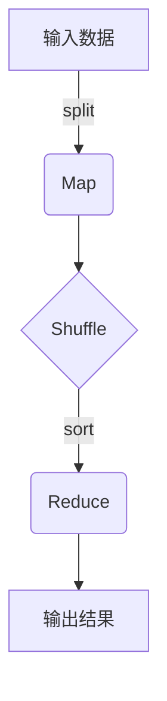

好的,我会严格遵守约束条件,以专业的技术语言写一篇关于MapReduce原理与实现的深度博客文章。

# MapReduce原理与代码实例讲解

## 1. 背景介绍

### 1.1 问题的由来

随着大数据时代的到来,传统的数据处理方式已经无法满足当前海量数据处理的需求。大数据涉及到PB级别的海量非结构化数据,这些数据分布在成千上万台服务器中,如何高效地处理这些分布式大数据成为了一个巨大的挑战。

MapReduce就是为解决这一问题而诞生的,它是一种分布式数据处理模型和相关的实现,用于在大规模集群上并行处理大量数据。MapReduce通过将复杂的计算任务分解为多个小任务并行计算,再将结果合并得到最终结果,从而实现了海量数据的高效处理。

### 1.2 研究现状

MapReduce最早由Google公司提出并实现,用于处理网页数据挖掘等大规模数据处理任务。2004年,Google公司发表了一篇题为"MapReduce: Simplified Data Processing on Large Clusters"的论文,详细阐述了MapReduce编程模型的理论基础和实现细节。

此后,Apache的Hadoop项目对MapReduce进行了开源实现,成为大数据处理的事实标准和主流框架。除了Hadoop之外,还有Spark、Flink等其他流行的大数据处理框架也支持MapReduce编程模型。

### 1.3 研究意义

MapReduce作为一种革命性的大数据处理模型,对于解决海量数据处理问题具有重大意义:

1. 高度可扩展性 - MapReduce可以在成千上万台廉价的普通机器上运行,实现海量数据的并行处理。

2. 高容错性 - MapReduce具有自动容错机制,能够自动处理节点故障,确保计算任务的正常执行。

3. 编程简单 - MapReduce将复杂的分布式计算抽象为两个简单的函数Map和Reduce,极大降低了分布式程序的编写难度。

4. 通用性强 - MapReduce可以用于各种各样的数据处理任务,如网页挖掘、日志分析、科学计算等。

5. 成本低廉 - MapReduce可以在廉价的普通硬件上运行,降低了大数据处理的成本。

### 1.4 本文结构

本文将全面介绍MapReduce编程模型的基本原理、核心算法、数学建模、实现细节和应用实践,内容包括:

1. MapReduce的核心概念和工作原理
2. MapReduce的核心算法流程和步骤
3. MapReduce的数学建模和公式推导
4. MapReduce的代码实现和实例分析 
5. MapReduce在实际场景中的应用
6. MapReduce相关工具和学习资源推荐
7. MapReduce的发展趋势、挑战及展望

## 2. 核心概念与联系

MapReduce是一种软件框架,用于在分布式环境中并行处理大规模数据集。它的核心思想是将计算过程分为两个阶段:Map阶段和Reduce阶段。



1. **Map阶段**:输入数据被拆分为多个数据块,并行地在集群中的多台机器上执行Map任务。每个Map任务会对一个数据块进行处理,生成键值对序列作为中间结果。

2. **Shuffle阶段**:框架对Map阶段产生的中间结果按照键值进行归并和排序,将具有相同键的值组合在一起,分发到对应的Reduce任务处理节点上。

3. **Reduce阶段**:对Shuffle后的数据进行汇总操作,对每一组键值对应的值集进行用户自定义的Reduce操作,最终生成新的键值对作为最终结果。

Map和Reduce函数由用户自行编写,分别定义了输入键值对的映射方式和汇总方式。MapReduce框架负责任务的调度、容错处理和并行执行等底层细节。

## 3. 核心算法原理 & 具体操作步骤  

### 3.1 算法原理概述

MapReduce算法的核心思想是将大规模数据集拆分为多个数据块,利用多台机器并行地执行Map和Reduce操作,从而实现海量数据的高效处理。算法主要包括以下几个步骤:

1. **输入拆分(Input Split)**: 将输入数据集拆分为多个数据块(Split),每个Split可以并行处理。

2. **Map阶段**: 每个Map任务对一个Split进行处理,生成键值对序列作为中间结果。

3. **Shuffle阶段**: 对Map阶段产生的中间结果进行归并和排序,将相同键的值组合在一起。

4. **Reduce阶段**: 对Shuffle后的数据进行汇总,对每个键对应的值集进行用户自定义的Reduce操作。

5. **输出写入**: 将Reduce阶段的结果写入到最终的输出位置。

### 3.2 算法步骤详解

1. **输入拆分**

   MapReduce框架将输入数据集拆分为固定大小的数据块(Split),通常是64MB或128MB。每个Split可以由一个单独的Map任务独立处理。

2. **Map阶段**

   ```mermaid
   graph TD
       A[输入Split] -->|split| B(Map)
       B --> C{Shuffle阶段}
   ```

   - 输入Split被划分为多个键值对 `<key, value>`
   - 用户自定义的Map函数被应用于每个键值对: `map(key, value) -> list(k2, v2)`
   - Map函数的输出是一个中间的键值对列表

3. **Shuffle阶段**

   ```mermaid 
   graph TD
       A{Shuffle阶段} -->|分区| B(Partition)
       B --> C(Sort)
       C --> D(Combine)
       D --> E{Reduce阶段}
   ```

   - **分区(Partition)**: 根据分区函数对Map输出的键值对进行分区,确定每个键值对应该传递到哪个Reduce任务处理。
   - **排序(Sort)**: 对每个分区中的键值对进行排序,确保相同键的值在一起。
   - **合并(Combine)**: 可选步骤,对相同键的值进行局部汇总,减少传输数据量。

4. **Reduce阶段** 

   ```mermaid
   graph TD
       A{Reduce阶段} -->|分组| B(Group)
       B --> C(Reduce)
       C --> D[输出结果]
   ```

   - **分组(Group)**: 对Shuffle输出的数据按照键进行分组,每个组由一个键及其对应的值列表组成。
   - **Reduce**: 对每个组应用用户自定义的Reduce函数: `reduce(key, values) -> output`
   - Reduce函数的输出被收集为最终的输出结果

5. **输出写入**

   MapReduce框架将Reduce阶段的输出结果写入到指定的输出位置,如HDFS或其他分布式文件系统。

### 3.3 算法优缺点

**优点**:

1. **高度可扩展**: 通过增加机器数量,可以线性扩展计算能力,处理更大规模的数据。

2. **容错性强**: 具有自动容错和重试机制,可以自动处理节点故障,确保计算任务的正常执行。

3. **编程简单**: 将复杂的分布式计算抽象为两个简单的Map和Reduce函数,降低了编程难度。

4. **通用性强**: 可以用于各种数据处理任务,如文本处理、日志分析、科学计算等。

**缺点**:

1. **延迟较高**: MapReduce作业需要经历多个阶段,存在较高的延迟,不适合对低延迟有较高要求的场景。

2. **不适合迭代计算**: MapReduce每个作业的输出需要写入磁盘,不适合迭代式的机器学习等计算。

3. **小文件问题**: 对于大量小文件的处理效率较低,会产生大量的Map任务,增加开销。

4. **无法实时处理**: MapReduce主要用于离线批处理,无法实时处理流式数据。

### 3.4 算法应用领域

MapReduce算法广泛应用于以下领域:

1. **大数据处理**: 用于处理TB、PB级别的海量数据,如网页挖掘、日志分析、推荐系统等。

2. **科学计算**: 用于处理科学领域的大规模计算任务,如基因组学、气象学、天体物理学等。

3. **机器学习**: 用于大规模数据集上的机器学习训练,如文本分类、图像识别等。

4. **图计算**: 用于处理大规模图数据,如社交网络分析、知识图谱构建等。

5. **ETL(Extract-Transform-Load)**: 用于数据抽取、转换和加载,支持构建数据仓库和数据湖。

## 4. 数学模型和公式 & 详细讲解 & 举例说明

### 4.1 数学模型构建

为了更好地理解和优化MapReduce算法,我们可以构建一个数学模型来描述其执行过程和性能指标。

假设我们有一个输入数据集D,需要在N台机器上并行处理。我们将D划分为M个数据块(Split),每个Split由一个Map任务处理。设每个Map任务的输出为中间数据集I,I被划分为R个数据区域,每个区域由一个Reduce任务处理。

我们定义以下符号:

- $T_m$: 单个Map任务的执行时间
- $T_r$: 单个Reduce任务的执行时间
- $T_s$: Shuffle阶段的时间,包括数据传输和排序时间
- $f_m$: Map函数的计算复杂度
- $f_r$: Reduce函数的计算复杂度
- $s_m$: 单个Map任务的输出数据大小
- $s_r$: 单个Reduce任务的输入数据大小

则MapReduce作业的总执行时间 $T_{total}$ 可以表示为:

$$T_{total} = T_m + T_s + T_r$$

其中:

$$T_m = \max\limits_{1 \leq i \leq M} f_m(|D_i|)$$
$$T_r = \max\limits_{1 \leq j \leq R} f_r(|I_j|)$$
$$T_s = \sum\limits_{i=1}^M s_m(i) + \sum\limits_{j=1}^R s_r(j)$$

这个模型描述了MapReduce作业的关键执行阶段,并将总执行时间分解为Map、Shuffle和Reduce三个部分。通过分析和优化每个部分,我们可以提高MapReduce作业的整体性能。

### 4.2 公式推导过程

接下来,我们将推导MapReduce作业的一些关键性能指标的公式,以便更好地理解和优化算法。

**1. 数据局部性**

数据局部性是MapReduce算法的一个重要优化目标。我们定义数据局部性比率 $L$ 为:

$$L = \frac{\sum\limits_{i=1}^M l_i}{|D|}$$

其中 $l_i$ 表示第i个Split在本地读取的数据量, $|D|$ 表示输入数据集的总大小。数据局部性比率越高,意味着越多的数据可以在本地处理,从而减少数据传输开销。

**2. 负载均衡**

为了充分利用集群资源,MapReduce需要在各个节点之间实现良好的负载均衡。我们定义负载不均衡度 $U$ 为:

$$U = \frac{\max\limits_{1 \leq i \leq N} \{w_i\} - \min\limits_{1 \leq i \leq N} \{w_i\}}{\frac{1}{N}\sum\limits_{i=1}^N w_i}$$

其中 $w_i$ 表示第i个节点的工作负载, $N$ 表示集群中节点的总数。负载不均衡度越小,意味着负载分布越均匀,集群资源利用率越高。

**3. 数据倾斜**

数据倾斜是MapReduce中一个常见的性能瓶颈。我们定义数据倾斜度 $S$ 为:

$$S = \frac{\max\limits_{1 \leq j \leq R} |I_j|}{\frac{1}{R}\sum\limits_{j=1}^R |I_j|}$$

其中 $|I_j|$ 表示第j个Reduce任务的输入数据大小, $R$ 表示Reduce任务的总数。数据倾斜度越大,意味着数据分布越不均匀,某些Reduce任务的负载会过重,导