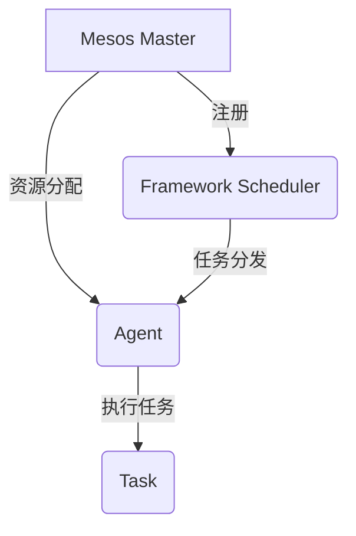

好的,我明白了您的要求。以下是文章正文部分的内容:

# Mesos原理与代码实例讲解

## 1. 背景介绍

### 1.1 问题的由来

在当今大数据和云计算时代,资源调度和集群管理成为了一个越来越重要的课题。传统的静态资源分配方式已经无法满足现代分布式应用对资源的灵活需求。同时,不同的应用框架(如Hadoop、Spark、Kafka等)对资源的需求也不尽相同,给资源的统一管理带来了巨大挑战。

为了解决这一问题,Apache Mesos应运而生。Mesos是一个开源的集群资源管理平台,它将整个数据中心抽象为一个资源池,能够高效地在不同应用框架之间共享和动态调度集群资源。

### 1.2 研究现状  

目前,Mesos已经被众多知名公司和组织广泛使用,如Twitter、Apple、Netflix、Airbnb等。它支持多种编程语言开发的应用框架,如Java、Python、C++等,并且能够与主流的虚拟化技术(如Docker容器)无缝集成。

Mesos的设计思想源于谷歌的Borg系统和Berkeley的Omega系统,并在此基础上做了大量创新。它采用了两级调度器的架构设计,将资源调度过程分为粗粒度和细粒度两个阶段,使得整个系统具有很高的可扩展性和灵活性。

### 1.3 研究意义

深入理解Mesos的原理和实现细节,对于构建高效、可靠的分布式系统至关重要。本文将全面剖析Mesos的核心概念、关键算法、数学模型以及工程实践,为读者提供一个系统的学习途径。

通过学习Mesos,读者不仅能够掌握分布式资源管理的基本理论,更重要的是能够领会其中蕴含的分布式系统设计思想和最佳实践,为将来开发和架构大规模分布式系统奠定扎实的基础。

### 1.4 本文结构

本文共分为9个章节:

- 第1章简要介绍Mesos的背景、现状和研究意义
- 第2章阐述Mesos的核心概念及其内在联系
- 第3章深入剖析Mesos调度器的工作原理和算法细节
- 第4章构建Mesos资源模型的数学公式,并通过案例讲解
- 第5章基于实际工程项目,展示Mesos的代码实现和部署运行
- 第6章列举Mesos在实际场景中的应用案例
- 第7章推荐相关的学习资源、工具和论文
- 第8章总结Mesos的发展趋势和面临的挑战
- 第9章列出常见问题及解答

## 2. 核心概念与联系

Mesos的核心设计思想是将整个数据中心抽象为一个统一的资源池,由一个中心化的资源管理器(Resource Manager)负责对资源进行统一分配和调度。应用框架通过注册自己的调度器(Framework Scheduler)来向Mesos申请所需资源,并在获取资源后,将任务分发到相应的工作节点(Agent)上执行。

Mesos的架构中包含以下几个核心组件:

1. **Mesos Master**: 整个系统的大脑,负责资源的统一调度和管理。它维护了整个集群的资源状态,并根据注册的Framework的资源需求进行合理分配。

2. **Framework Scheduler**: 应用框架自带的调度器,负责向Mesos Master注册并申请资源。在获取到资源后,它会将具体的任务分发到相应的Agent节点上执行。

3. **Agent**: 工作节点,负责启动和监控在本节点上运行的任务。它会周期性地向Master汇报节点的资源使用情况。

4. **Task**: 具体的任务,是应用框架的工作单元,在Agent节点上执行。

Mesos采用了两级调度器的设计,实现了"统一资源管理,框架自主调度"的目标:

- Mesos Master承担了粗粒度的资源分配职责,为各个框架公平合理地分配资源
- 而具体任务的细粒度调度则由框架自身的调度器负责,充分利用了框架自身对任务的理解

这种设计使得Mesos不仅能够高效地统一管理整个集群资源,还能最大限度地发挥各种应用框架的智能调度能力。同时,这种松耦合的设计也使得Mesos具有很强的可扩展性和灵活性,能够轻松整合新的框架。

## 3. 核心算法原理 & 具体操作步骤  

### 3.1 算法原理概述

Mesos的资源调度过程可以概括为以下几个主要步骤:

1. **资源发现(Resource Discovery)**: Agent节点周期性地向Master汇报自身的资源使用情况,Master据此构建整个集群的资源视图。

2. **资源调度(Resource Allocation)**: 注册的Framework向Master申请资源,Master根据预设的调度策略(如Fair Share、DRF等)为各个Framework分配合理的资源份额。

3. **任务分发(Task Dispatch)**: 获取到资源后,Framework的调度器将具体任务分发到相应的Agent节点执行。

4. **任务执行(Task Execution)**: Agent节点启动分发过来的任务,并监控任务的运行状态。

5. **资源回收(Resource Reclamation)**: 当任务结束或出现故障时,Agent会将占用的资源返还给Master,以供后续调度使用。

在这个过程中,Mesos采用了两级调度器的架构设计,实现了"统一资源管理,框架自主调度"的目标。具体来说:

- Mesos Master负责集群资源的统一管理和粗粒度调度,为各个Framework合理分配资源
- 而Framework自带的调度器则负责任务的细粒度调度,将任务分发到获取的资源上执行

这种分层设计使得Mesos不仅能高效统一管理整个集群,还能充分发挥各种框架自身的调度智能。

### 3.2 算法步骤详解

接下来我们详细解释Mesos资源调度的具体算法步骤:

1. **Agent资源发现**

    Agent节点会周期性地通过`ResourceProviderInfo`消息向Master汇报自身的资源使用情况,包括CPU、内存、磁盘、端口等各种资源的可用量。Master收集这些信息,构建整个集群的资源视图。

2. **Framework注册**

    应用框架通过其自带的调度器向Master发送`RegisterFrameworkMessage`注册自身。注册时需指定框架信息(名称、主机等)、调度器信息,以及所需的资源类型。

3. **资源分配**

    Master根据预设的调度策略,为注册的各个Framework分配合理的资源份额。常用的调度策略包括:

    - Fair Share: 按框架数量均分资源
    - DRF(Dominant Resource Fairness): 根据框架占用最多资源的比例分配
    - 等等

    分配时,Master会为每个Framework生成一个`ResourceOffer`,描述可获取的资源数量及位置。

4. **任务分发**

    Framework的调度器收到`ResourceOffer`后,会将具体任务的`TaskInfo`发送给相应的Agent节点,指示在这些资源上启动任务。

5. **任务执行**

    Agent节点启动分发过来的任务,并通过`TaskStatus`消息周期性地向Framework汇报任务状态(如`TASK_RUNNING`、`TASK_FINISHED`等)。

6. **资源回收**

    当任务结束或出现故障时,Agent会向Master发送`UnreserveResource`消息归还占用的资源,以便Master后续重新调度这些资源。

需要注意的是,在整个过程中,Mesos采用了异步事件驱动的设计,各组件通过发送消息相互通信。这使得整个系统具有很强的容错性和可扩展性。

### 3.3 算法优缺点

Mesos的两级调度器架构设计具有以下优点:

1. **资源统一管理**

    Mesos能够将整个数据中心的资源统一管理,避免了资源碎片化和浪费。同时,集中式调度也有利于实现全局资源的合理分配。

2. **框架自主调度**

    框架自带调度器可以根据自身的调度策略和任务特征,对获取的资源进行精细化调度,充分发挥框架的智能调度能力。

3. **松耦合可扩展**

    框架和Mesos之间是松耦合的,新框架可以通过注册的方式无缝接入Mesos,使整个系统具有很强的可扩展性。

4. **容错性强**

    采用异步事件驱动的通信模式,以及分层架构设计,增强了系统的容错能力和可靠性。

但Mesos也存在一些不足之处:

1. **中心化瓶颈**

    Master节点作为中心化的资源管理器,可能在大规模集群环境下遇到性能瓶颈。

2. **资源浪费**

    为了保证任务的正常执行,Mesos需要为每个任务预留一定的资源,这可能导致一定程度的资源浪费。

3. **调度器复杂性**

    框架自带调度器的开发和维护成本较高,需要较强的分布式系统设计能力。

4. **资源竞争**

    不同框架之间可能存在资源竞争,需要设计合理的资源分配策略。

### 3.4 算法应用领域

Mesos的两级调度器架构设计使其适用于以下几种主要场景:

1. **大数据计算框架**

    像Hadoop、Spark、Kafka这样的大数据框架都可以在Mesos之上运行,Mesos为它们提供了资源的统一管理和调度。

2. **云计算和微服务**

    Mesos可以作为云计算和微服务架构的资源管理基础设施,为容器化的应用提供资源调度能力。

3. **机器学习和AI**

    机器学习和AI任务通常需要大量的计算资源,Mesos可以高效地为这些任务调度所需的CPU、GPU等资源。

4. **大规模Web服务**

    对于需要动态扩缩容的大规模Web服务,Mesos能够根据负载情况灵活调度所需的资源。

总的来说,Mesos最适用于那些对资源需求动态变化、框架种类繁多的分布式系统环境。

## 4. 数学模型和公式 & 详细讲解 & 举例说明

在Mesos的资源调度过程中,需要构建数学模型对集群资源和任务进行量化描述,并设计相应的调度算法实现合理分配。下面我们将详细介绍Mesos中使用的数学模型和公式。

### 4.1 数学模型构建

我们首先定义以下基本概念:

- 集群由$M$个Agent节点组成,节点集合记为$N = \{n_1, n_2, ..., n_M\}$
- 每个节点$n_i$拥有$R$种不同的资源,如CPU、内存、磁盘等,用向量$\vec{r}_{n_i} = (r_{n_i}^1, r_{n_i}^2, ..., r_{n_i}^R)$表示
- 集群中有$K$个Framework,框架集合记为$F = \{f_1, f_2, ..., f_K\}$
- 每个框架$f_j$包含$N_j$个任务,任务集合记为$T_j = \{t_1^j, t_2^j, ..., t_{N_j}^j\}$
- 每个任务$t_i^j$对$R$种资源的需求用向量$\vec{r}_{t_i^j} = (r_{t_i^j}^1, r_{t_i^j}^2, ..., r_{t_i^j}^R)$表示

我们的目标是找到一种合理的资源分配方案$\phi$,将集群资源分配给各个框架的任务,使得资源利用率最大化,同时满足每个任务的资源需求约束。

形式化地,我们需要最大化目标函数:

$$\max_\phi \sum_{i=1}^M \sum_{j=1}^R \phi(n_i, r_j)$$

其中$\phi(n_i, r_j)$表示分配给节点$n_i$上资源$r_j$的任务数量。

同时需要满足以下约束条件:

$$\forall n_i \in N, \forall r_j: \sum_{t_k \in \phi(n_i)} r_{t