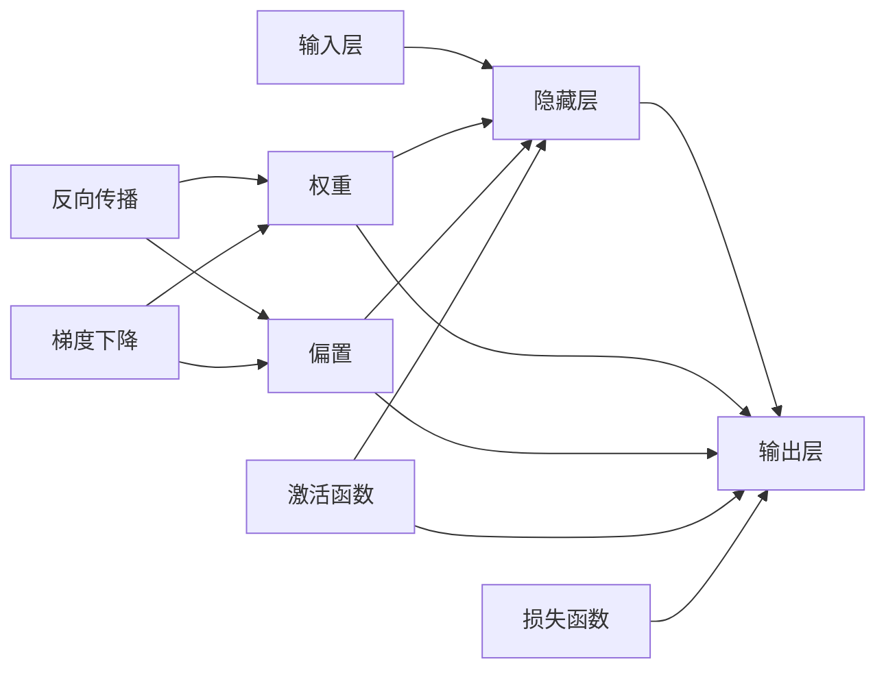

# Neural Networks (NN) 原理与代码实战案例讲解

关键词：神经网络、深度学习、反向传播、梯度下降、TensorFlow、PyTorch

## 1. 背景介绍
### 1.1 问题的由来
人工智能的发展历程中,神经网络(Neural Networks,NN)一直扮演着至关重要的角色。神经网络是一种模仿人脑神经元连接关系,进行信息处理和模式识别的数学模型。它具有强大的非线性映射能力和自适应学习能力,在模式识别、自然语言处理、计算机视觉等领域取得了巨大成功。

### 1.2 研究现状
近年来,随着深度学习的兴起,神经网络再次成为研究热点。一系列基于深度神经网络的模型如卷积神经网络(CNN)、循环神经网络(RNN)、长短期记忆网络(LSTM)等被广泛应用,在图像分类、语音识别、机器翻译等任务上取得了突破性进展,甚至在某些特定任务上已经超越了人类的表现。

### 1.3 研究意义
深入理解神经网络的原理,掌握其核心算法和数学模型,对于从事人工智能相关研究和应用的学者和工程师来说至关重要。同时,神经网络强大的特征提取和表示学习能力,为解决复杂问题提供了新的思路和方法。

### 1.4 本文结构
本文将从神经网络的基本概念出发,系统阐述其核心原理和关键技术。内容涵盖神经元模型、网络架构、学习算法、损失函数、激活函数、正则化等方方面面。此外,本文还将通过实际的代码案例,演示如何使用流行的深度学习框架TensorFlow和PyTorch来构建和训练神经网络模型。

## 2. 核心概念与联系

神经网络是一个由大量简单的处理单元(即神经元)组成的大规模并行分布式处理系统。各个神经元之间通过权重连接,通过调整权重来学习输入与输出之间的映射关系。下面我们来看看神经网络涉及的一些核心概念:

- 神经元(Neuron):神经网络的基本组成单位,接收一组输入信号,通过非线性变换产生输出。
- 权重(Weight):神经元之间连接的强度,代表了连接的重要性。
- 偏置(Bias):神经元的阈值,控制神经元被激活的难易程度。
- 激活函数(Activation Function):对神经元的加权输入进行非线性变换,如Sigmoid、Tanh、ReLU等。
- 损失函数(Loss Function):衡量网络预测输出与真实标签之间的差异,如均方误差、交叉熵等。
- 前向传播(Forward Propagation):信息从输入层经隐藏层传播到输出层的过程。
- 反向传播(Backpropagation):利用链式法则,将损失函数的梯度反向传播到每个神经元,指导权重的更新。
- 梯度下降(Gradient Descent):通过沿损失函数梯度的反方向更新权重,使网络逐步收敛到最优解。

这些概念环环相扣,共同构成了神经网络的理论基础。下图展示了它们之间的联系:



## 3. 核心算法原理 & 具体操作步骤

### 3.1 算法原理概述

神经网络的学习过程本质上是一个参数优化问题。给定训练数据集,我们希望找到一组最优的权重和偏置参数,使得网络的预测输出与真实标签尽可能接近。这个过程主要依赖于反向传播算法和梯度下降优化算法。

### 3.2 算法步骤详解

1. 前向传播:
   - 输入数据通过网络的各层进行传播,每个神经元接收前一层的输出,计算加权和并施加激活函数。
   - 逐层计算,直到获得网络的预测输出。
2. 损失计算:
   - 将网络预测输出与真实标签进行比较,计算损失函数值。
   - 损失函数刻画了预测值与真实值的差异程度。
3. 反向传播:
   - 根据损失函数,计算网络输出对各个权重和偏置的梯度。
   - 利用链式法则,将梯度逐层反向传播到每个神经元。
4. 参数更新:
   - 根据反向传播得到的梯度信息,使用梯度下降算法更新权重和偏置。
   - 权重更新公式:$w = w - \eta \frac{\partial L}{\partial w}$,其中$\eta$为学习率。
5. 迭代优化:
   - 重复步骤1-4,直到达到预设的迭代次数或满足一定的收敛条件。
   - 每次迭代使网络逐步优化,损失函数值不断减小。

### 3.3 算法优缺点

反向传播和梯度下降是神经网络学习的核心算法,具有以下优点:
- 可以有效地训练多层网络,实现复杂非线性函数的拟合。
- 通过梯度信息指导参数更新,使网络逐步收敛到最优解。
- 可以处理大规模数据集,具有良好的泛化能力。

但同时也存在一些缺点:
- 容易陷入局部最优,难以达到全局最优解。
- 对参数初始化和学习率敏感,不当的设置会影响收敛速度和效果。
- 训练时间较长,计算复杂度高,对硬件要求较高。

### 3.4 算法应用领域

反向传播和梯度下降算法是现代神经网络的基石,广泛应用于以下领域:
- 计算机视觉:图像分类、目标检测、语义分割等。
- 自然语言处理:文本分类、情感分析、机器翻译等。
- 语音识别:声学模型训练、语言模型训练等。
- 推荐系统:用户行为预测、个性化推荐等。

## 4. 数学模型和公式 & 详细讲解 & 举例说明

### 4.1 数学模型构建

我们以一个简单的三层全连接神经网络为例,构建其数学模型。假设输入层有$n$个神经元,隐藏层有$m$个神经元,输出层有$k$个神经元。我们用$x_i$表示输入层第$i$个神经元的值,$h_j$表示隐藏层第$j$个神经元的值,$o_l$表示输出层第$l$个神经元的值。隐藏层和输出层神经元的计算公式如下:

$$
h_j = f(\sum_{i=1}^{n} w_{ij}^{(1)} x_i + b_j^{(1)}) \\
o_l = g(\sum_{j=1}^{m} w_{jl}^{(2)} h_j + b_l^{(2)})
$$

其中,$f$和$g$分别是隐藏层和输出层的激活函数,$w_{ij}^{(1)}$是输入层第$i$个神经元到隐藏层第$j$个神经元的权重,$b_j^{(1)}$是隐藏层第$j$个神经元的偏置,$w_{jl}^{(2)}$是隐藏层第$j$个神经元到输出层第$l$个神经元的权重,$b_l^{(2)}$是输出层第$l$个神经元的偏置。

### 4.2 公式推导过程

接下来,我们推导反向传播算法中的关键公式。假设损失函数为$L$,我们需要计算$L$对各层权重和偏置的梯度。根据链式法则,有:

$$
\frac{\partial L}{\partial w_{jl}^{(2)}} = \frac{\partial L}{\partial o_l} \frac{\partial o_l}{\partial w_{jl}^{(2)}} = \delta_l^{(2)} h_j \\
\frac{\partial L}{\partial b_l^{(2)}} = \frac{\partial L}{\partial o_l} \frac{\partial o_l}{\partial b_l^{(2)}} = \delta_l^{(2)} \\
\frac{\partial L}{\partial w_{ij}^{(1)}} = \frac{\partial L}{\partial h_j} \frac{\partial h_j}{\partial w_{ij}^{(1)}} = \delta_j^{(1)} x_i \\
\frac{\partial L}{\partial b_j^{(1)}} = \frac{\partial L}{\partial h_j} \frac{\partial h_j}{\partial b_j^{(1)}} = \delta_j^{(1)}
$$

其中,$\delta_l^{(2)} = \frac{\partial L}{\partial o_l} g'(z_l^{(2)})$,$\delta_j^{(1)} = (\sum_{l=1}^{k} \delta_l^{(2)} w_{jl}^{(2)}) f'(z_j^{(1)})$,$z_l^{(2)} = \sum_{j=1}^{m} w_{jl}^{(2)} h_j + b_l^{(2)}$,$z_j^{(1)} = \sum_{i=1}^{n} w_{ij}^{(1)} x_i + b_j^{(1)}$。

### 4.3 案例分析与讲解

下面我们以一个二分类问题为例,说明如何应用上述公式进行反向传播和参数更新。假设我们有一个样本$(x,y)$,其中$x$是特征向量,$y$是类别标签(0或1)。我们使用交叉熵损失函数:

$$
L = -y \log(o) - (1-y) \log(1-o)
$$

其中,$o$是网络的预测输出。根据公式(1)-(4),我们可以计算出各层权重和偏置的梯度:

$$
\delta^{(2)} = o - y \\
\delta^{(1)} = (w^{(2)})^T \delta^{(2)} \odot f'(z^{(1)}) \\
\frac{\partial L}{\partial w^{(2)}} = \delta^{(2)} h^T \\
\frac{\partial L}{\partial b^{(2)}} = \delta^{(2)} \\
\frac{\partial L}{\partial w^{(1)}} = \delta^{(1)} x^T \\
\frac{\partial L}{\partial b^{(1)}} = \delta^{(1)}
$$

然后,我们使用梯度下降法更新权重和偏置:

$$
w^{(2)} := w^{(2)} - \eta \frac{\partial L}{\partial w^{(2)}} \\
b^{(2)} := b^{(2)} - \eta \frac{\partial L}{\partial b^{(2)}} \\
w^{(1)} := w^{(1)} - \eta \frac{\partial L}{\partial w^{(1)}} \\ 
b^{(1)} := b^{(1)} - \eta \frac{\partial L}{\partial b^{(1)}}
$$

通过多次迭代,网络的权重和偏置会不断更新,使得预测输出与真实标签越来越接近。

### 4.4 常见问题解答

Q: 反向传播算法为什么要使用链式法则?
A: 链式法则可以将复杂的梯度计算分解为多个简单的梯度计算,使得误差能够逐层传播到每个神经元,指导参数的更新。这是反向传播算法的核心思想。

Q: 梯度消失和梯度爆炸问题是如何产生的?
A: 当网络层数较深时,梯度在反向传播过程中会不断乘以权重矩阵,导致梯度指数级衰减(梯度消失)或指数级增长(梯度爆炸),使得网络难以训练。合适的权重初始化策略和梯度裁剪技术可以缓解这些问题。

## 5. 项目实践：代码实例和详细解释说明

本节我们将使用Python和TensorFlow框架,实现一个简单的三层全连接神经网络,并应用于手写数字识别任务。

### 5.1 开发环境搭建

首先,我们需要安装TensorFlow库:

```bash
pip install tensorflow
```

然后,导入所需的库:

```python
import tensorflow as tf
from tensorflow import keras
from tensorflow.keras import layers
```

### 5.2 源代码详细实现

我们使用Keras Sequential API构建网络:

```python
model = keras.Sequential([
    layers.Dense(128, activation='relu', input_shape=(784,)),
    layers.Dense(64, activation='relu'),
    layers.Dense(10, activation='softmax')
])
```

这里我们