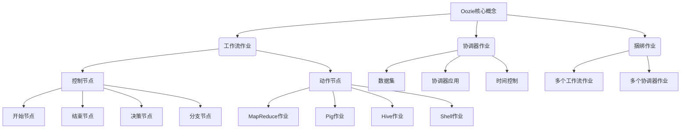
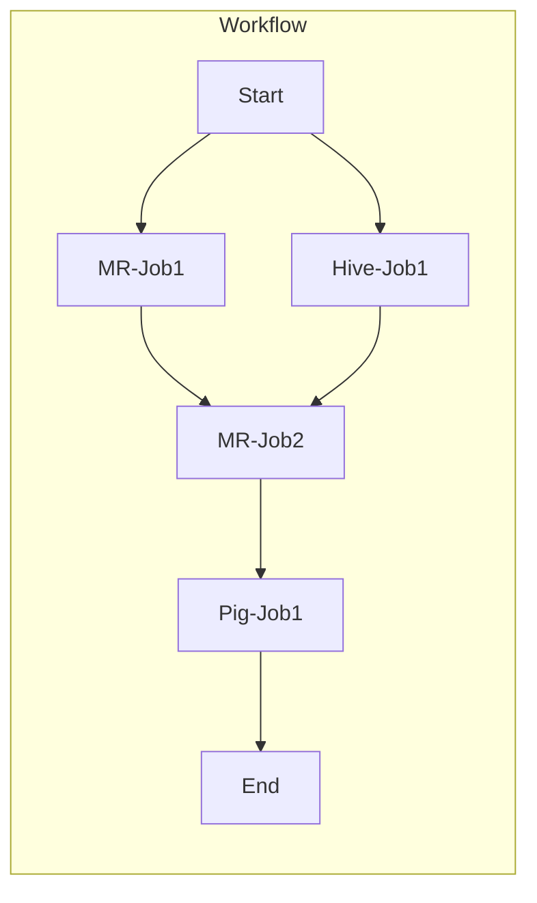

# Oozie原理与代码实例讲解

## 1. 背景介绍

### 1.1 问题的由来

在大数据时代,数据量急剧增长,单个作业已经无法满足复杂的数据处理需求。大数据处理通常需要多个作业按特定顺序有条不紊地执行,这就产生了对工作流调度系统的需求。Apache Oozie应运而生,旨在对Hadoop作业进行有效的工作流调度和协调管理。

### 1.2 研究现状

目前,Apache Oozie作为Apache Hadoop生态系统中的关键组件,已经广泛应用于各大公司和机构的大数据平台中。它提供了强大的工作流调度能力,能够有效协调各种Hadoop作业(如MapReduce、Pig、Hive和Sqoop等)的执行,大大简化了复杂数据处理流程的管理。

### 1.3 研究意义

深入理解Oozie的原理和实现细节,对于构建高效、可靠的大数据处理平台至关重要。本文将全面剖析Oozie的核心概念、架构设计、算法实现和代码细节,并通过实例讲解其实际应用,旨在帮助读者掌握Oozie的本质,提升大数据处理能力。

### 1.4 本文结构  

本文首先介绍Oozie的核心概念和架构设计,然后深入探讨其工作流调度算法的原理和实现细节,包括数学模型和公式推导。接着通过代码实例详细解释Oozie的开发和使用方法,并分析其在实际场景中的应用。最后,总结Oozie的发展趋势和面临的挑战,并给出相关资源推荐。

## 2. 核心概念与联系

Oozie提供了三种核心作业类型:

1. **工作流作业(Workflow Job)**: 定义了一系列有向无环图(DAG)的控制节点和动作节点,用于协调多个Hadoop作业的执行。
   - 控制节点负责控制作业流程,包括开始、结束、决策和分支等。
   - 动作节点表示实际的任务,可执行MapReduce、Pig、Hive、Shell等Hadoop作业。

2. **协调器作业(Coordinator Job)**: 基于时间触发器和数据可用性,周期性地执行工作流作业。它由数据集、协调器应用和时间控制三部分组成。

3. **捆绑作业(Bundle Job)**: 将多个工作流作业和协调器作业捆绑在一起作为一个逻辑执行单元,实现更高层次的作业组织和管理。

这三种作业类型紧密相关,共同构建了Oozie强大的工作流调度和协调能力。

## 3. 核心算法原理 & 具体操作步骤  

### 3.1 算法原理概述

Oozie的核心算法是基于有向无环图(DAG)的工作流调度算法,用于协调多个Hadoop作业的执行顺序和依赖关系。该算法遵循以下基本原则:

1. **拓扑排序**: 根据作业之间的依赖关系,对作业进行拓扑排序,确保先决条件作业先于依赖作业执行。

2. **并行执行**: 没有依赖关系的作业可以并行执行,提高整体效率。

3. **容错与重试**: 如果某个作业失败,算法会自动重试或回滚到适当状态,确保工作流的正确性和完整性。

4. **状态跟踪**: 算法实时跟踪每个作业的执行状态,以便进行正确的调度决策。

### 3.2 算法步骤详解

Oozie工作流调度算法的具体步骤如下:

1. **解析作业定义**: 解析XML或其他格式定义的工作流作业,构建有向无环图(DAG)表示。

2. **拓扑排序**: 对DAG进行拓扑排序,得到一个线性的执行序列。

3. **提交作业**: 按照拓扑序,依次提交作业到Hadoop集群执行。

4. **状态跟踪**: 持续跟踪每个作业的执行状态(等待、运行中、成功、失败等)。

5. **决策控制**: 根据控制节点(如决策节点)的结果,动态调整后续作业的执行路径。

6. **失败处理**: 如果某个作业失败,根据配置进行重试或回滚操作。

7. **并行执行**: 对于没有依赖关系的作业,并行提交执行,提高效率。

8. **完成检测**: 当所有作业执行完成且符合最终条件时,标记整个工作流作业完成。

该算法通过有向无环图模型精确描述作业依赖关系,并基于拓扑排序和状态跟踪实现高效可靠的工作流调度,保证了Hadoop作业之间的正确协调。

### 3.3 算法优缺点

**优点**:

1. **可扩展性强**: 能够有效管理和协调大规模的Hadoop作业。
2. **容错性好**: 能自动处理作业失败,进行重试或回滚。
3. **可视化**: 通过DAG直观展示作业依赖关系。
4. **灵活性高**: 支持复杂的控制流结构,如决策、分支等。

**缺点**:

1. **学习成本高**: 配置工作流定义文件较为复杂。
2. **延迟高**: 对于短小作业,调度开销可能较大。
3. **单点故障**: Oozie服务器单点可能导致整个系统不可用。
4. **扩展性受限**: 对于非Hadoop作业的支持有限。

### 3.4 算法应用领域

Oozie工作流调度算法广泛应用于以下领域:

1. **大数据处理**: 在Hadoop生态系统中协调各种大数据处理作业。
2. **数据仓库**: 构建数据仓库ETL(提取、转换、加载)流程。
3. **机器学习**: 管理机器学习模型训练和评估的工作流。
4. **数据分析**: 实现复杂的数据分析流程自动化。
5. **自动化运维**: 执行自动化运维任务,如备份、监控等。

## 4. 数学模型和公式 & 详细讲解 & 举例说明

### 4.1 数学模型构建

为了形式化描述Oozie工作流调度问题,我们构建如下数学模型:

假设有一个工作流作业$W$,它包含$n$个动作节点$A=\{a_1,a_2,...,a_n\}$和$m$个控制节点$C=\{c_1,c_2,...,c_m\}$。我们用一个有向无环图$G=(V,E)$来表示$W$,其中:

- $V=A\cup C$是图$G$的节点集合
- $E\subseteq V\times V$是图$G$的有向边集合,表示节点之间的依赖关系

我们定义一个布尔矩阵$D$,其中$D_{ij}=1$当且仅当存在一条有向边从节点$v_i$指向节点$v_j$,即$(v_i,v_j)\in E$,否则$D_{ij}=0$。

令$\pi$为一个拓扑排序,它是节点集合$V$的一个排列,满足$\forall(v_i,v_j)\in E,\pi^{-1}(v_i)<\pi^{-1}(v_j)$,即所有依赖边都是从左向右的。

我们的目标是找到一个拓扑排序$\pi^*$,使得它能最大程度并行执行没有依赖关系的节点,从而最小化整个工作流的makespan(完成时间)。

### 4.2 公式推导过程  

为了求解最优拓扑排序$\pi^*$,我们需要定义一个目标函数,它描述了makespan的计算方式。

假设每个节点$v_i$的执行时间为$t_i$,我们定义$\pi$中第$k$个节点的启动时间为$s_k$,完成时间为$c_k$,则有如下递推公式:

$$
\begin{aligned}
s_k &= \max\limits_{(v_i,v_j)\in E,\pi(j)=k}\{c_i\} \\
c_k &= s_k + t_{\pi(k)}
\end{aligned}
$$

其中,$s_k$取决于所有前驱节点的完成时间的最大值。

那么,整个工作流的makespan为:

$$
makespan(\pi) = \max\limits_{1\leq k\leq |V|}\{c_k\}
$$

我们的目标是最小化$makespan(\pi)$,即:

$$
\pi^* = \arg\min\limits_\pi makespan(\pi)
$$

这是一个经典的作业店调度问题(Job Shop Scheduling Problem),已被证明是NP-硬问题。因此,我们需要使用启发式或近似算法来求解$\pi^*$。

### 4.3 案例分析与讲解

考虑一个简单的工作流作业案例,包含6个节点:

我们有$V=\{A,B,C,D,E,F\}$,依赖关系矩阵$D$如下:

$$
D=\begin{bmatrix}
0&1&1&0&0&0\\
0&0&0&1&0&0\\
0&0&0&1&0&0\\
0&0&0&0&1&0\\
0&0&0&0&0&1\\
0&0&0&0&0&0
\end{bmatrix}
$$

假设各节点的执行时间为:$t_A=0,t_B=2,t_C=3,t_D=1,t_E=4,t_F=0$。

一个可能的拓扑排序是$\pi_1=\{A,B,C,D,E,F\}$,它的makespan为:

$$
\begin{aligned}
s_1&=0,&c_1&=0\\
s_2&=0,&c_2&=2\\
s_3&=0,&c_3&=3\\
s_4&=\max\{2,3\}=3,&c_4&=4\\
s_5&=4,&c_5&=8\\
s_6&=8,&c_6&=8
\end{aligned}
$$

因此,$makespan(\pi_1)=8$。

另一个拓扑排序$\pi_2=\{A,B,C,D,F,E\}$的makespan为:

$$
\begin{aligned}
s_1&=0,&c_1&=0\\
s_2&=0,&c_2&=2\\
s_3&=0,&c_3&=3\\
s_4&=\max\{2,3\}=3,&c_4&=4\\
s_5&=4,&c_5&=4\\
s_6&=4,&c_6&=8
\end{aligned}
$$

因此,$makespan(\pi_2)=8$。

我们可以看到,不同的拓扑排序可能会导致不同的makespan。在这个例子中,$\pi_1$和$\pi_2$都是最优解,因为它们都达到了最小makespan 8。

通过这个案例,我们可以直观地理解Oozie工作流调度算法的核心思想:通过拓扑排序来最大程度并行执行没有依赖关系的作业,从而缩短整体执行时间。

### 4.4 常见问题解答

1. **为什么需要拓扑排序?**

   拓扑排序是为了确保作业的执行顺序满足依赖关系的约束,避免先执行依赖作业而导致错误。

2. **Oozie是如何实现并行执行的?**

   Oozie会同时提交所有没有前驱依赖的作业,实现最大程度的并行执行。

3. **失败作业的重试策略是什么?**

   Oozie允许为每个作业配置重试次数和重试间隔,如果达到最大重试次数仍然失败,则标记