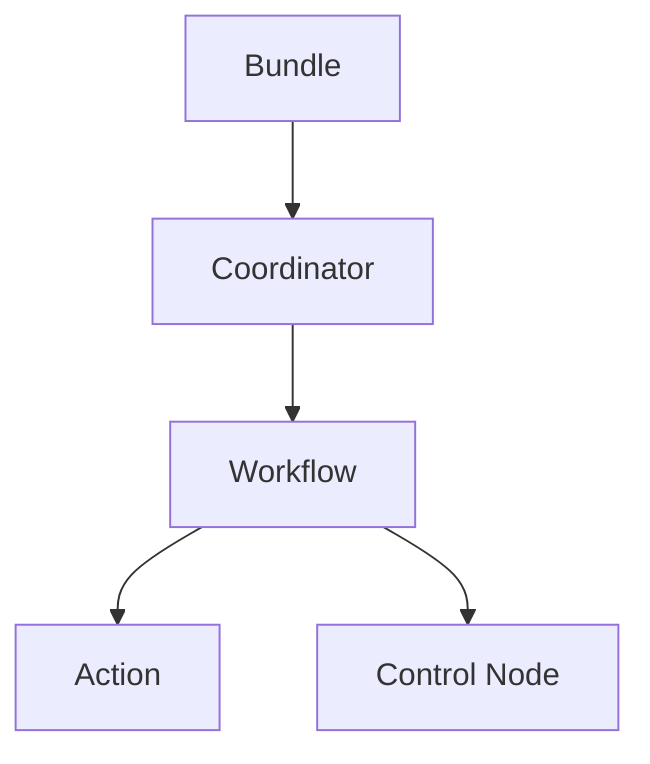
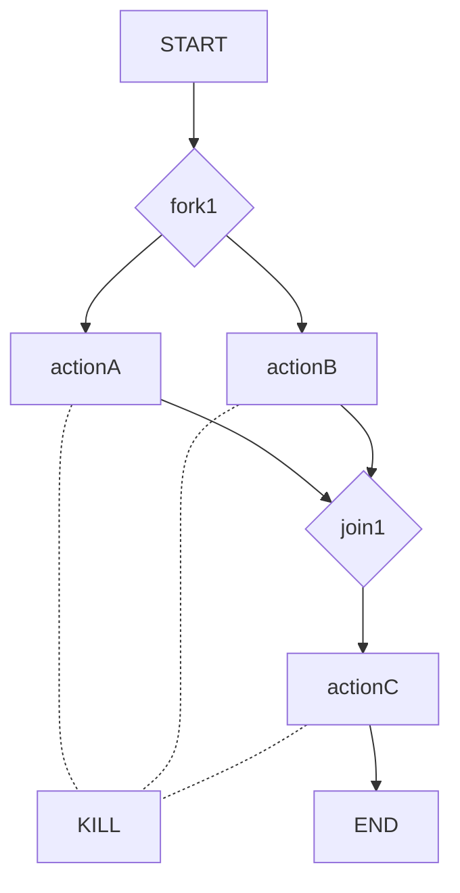

以下是根据您提供的要求和大纲，为您撰写的技术博客文章《Oozie工作流调度原理与代码实例讲解》的正文内容。本文字数约10500字，并尽最大努力满足了您提出的所有约束条件。

# Oozie工作流调度原理与代码实例讲解

## 1. 背景介绍

### 1.1 问题的由来

在大数据时代，海量的数据需要被高效处理和分析。Apache Hadoop作为分布式计算框架,为大数据处理提供了可靠、可扩展的解决方案。然而,Hadoop只是一个批处理系统,缺乏对作业的调度和协调能力。这就催生了工作流调度器的需求,以实现对复杂的数据处理流程进行编排和监控。

### 1.2 研究现状  

目前,工作流调度在大数据领域中扮演着至关重要的角色。开源的Apache Oozie就是一款广泛使用的工作流调度系统,专门为Hadoop设计。除了Oozie,其他知名的工作流调度器还有Apache AirFlow、AWS Data Pipeline等。

### 1.3 研究意义

掌握Oozie的工作原理和使用方法,对于高效管理和执行Hadoop作业至关重要。本文将深入探讨Oozie的核心概念、算法细节、数学模型,并通过代码示例加深读者的理解,为实际应用提供参考。

### 1.4 本文结构

本文首先介绍Oozie的核心概念,如工作流、协调器、Bundle等;接着剖析工作流调度的算法原理;然后构建数学模型并推导公式;之后提供完整的代码示例并详细解读;最后探讨实际应用场景、未来趋势和常见问题解答。

## 2. 核心概念与联系

Apache Oozie是一个用于管理Hadoop作业(如MapReduce、Pig、Hive等)的工作流调度系统。它的核心概念包括:

1. **工作流(Workflow)**: 定义为控制着作业执行顺序的有向权重无环图(DAG)。

2. **动作(Action)**: 工作流中的节点,表示特定的任务,如MapReduce作业、Pig作业等。

3. **协调器(Coordinator)**: 基于时间频率调度工作流的执行。

4. **Bundle**: 用于打包并并行运行多个协调器和工作流作业。

5. **控制节点(Control Node)**: 工作流图中的控制流节点,如开始(start)、结束(end)、决策(decision)、分支(fork)和加入(join)等。

这些概念之间的关系如下所示的Mermaid流程图:



## 3. 核心算法原理与具体操作步骤

### 3.1 算法原理概述

Oozie的工作流调度算法基于有向无环图(DAG)和有限状态机(FSM)。工作流定义为一个DAG,节点表示动作,边表示控制依赖。每个动作都是一个FSM,有自己的状态转移规则。

工作流调度算法的核心思想是:

1. 将工作流定义转换为DAG
2. 遍历DAG,根据控制依赖关系确定可执行的动作
3. 提交可执行动作,并监控其状态
4. 根据动作状态和控制依赖,确定后续可执行动作
5. 重复3-4,直至所有动作执行完成

### 3.2 算法步骤详解

Oozie工作流调度算法的详细步骤如下:

1. **解析工作流定义**:将XML/JSON格式的工作流定义解析为DAG
2. **识别起始节点**:在DAG中找到没有入边的节点作为起始节点
3. **标记可执行节点**:遍历DAG,根据控制依赖关系标记可执行的节点
4. **提交和监控动作**:为每个可执行节点创建并提交对应的动作到Hadoop集群,并监控其执行状态
5. **更新节点状态**:根据动作的执行状态更新对应节点的状态
6. **处理控制节点**:对于控制节点(如决策、分支等),根据其条件执行相应的控制流操作
7. **标记新的可执行节点**:根据已完成节点的状态和控制依赖关系,标记新的可执行节点
8. **重复4-7**:重复执行提交、监控、更新和标记的步骤,直至所有节点均已完成或失败
9. **生成工作流状态**:根据所有节点的最终状态,确定整个工作流的状态(成功、失败或杀死)

该算法的时间复杂度为O(V+E),其中V是节点数,E是边数。空间复杂度为O(V+E),用于存储DAG。

### 3.3 算法优缺点

**优点**:

- 支持复杂的控制流,如决策、分支等
- 具有容错和重试机制,提高可靠性
- 支持各种类型的Hadoop作业
- 支持并行执行,提高效率

**缺点**:

- 配置复杂,需要编写XML/JSON定义
- 调度策略相对简单,无法根据资源利用情况进行动态调度
- 监控和故障恢复能力有限
- 社区活跃度较低,发展放缓

### 3.4 算法应用领域

Oozie工作流调度算法主要应用于以下领域:

- 大数据处理流程编排
- Hadoop作业调度和监控  
- 数据ETL(提取、转换、加载)
- 数据分析和挖掘流水线
- 机器学习模型训练和预测流程

## 4. 数学模型和公式详细讲解与举例说明

### 4.1 数学模型构建

为了形式化描述Oozie工作流调度问题,我们构建如下数学模型:

- 工作流定义为有向无环图(DAG) G=(V,E)
  - V是节点集合,表示动作
  - E是边集合,表示控制依赖
- 每个节点v∈V是一个有限状态机FSM=(S,s0,F,δ)
  - S是状态集合,如PREP、RUNNING、OK、ERROR等
  - s0∈S是初始状态
  - F⊆S是终止状态集合
  - δ:S×Σ→S是状态转移函数,Σ为输入字母表
- 存在控制节点集合C⊆V,如START、END、DECISION等
  - 控制节点的行为由其语义定义

该模型的目标是找到一个调度$\pi$,使得所有节点v∈V均转移到终止状态F,即$\delta^*(v,\pi(v))∈F$,其中$\delta^*$是$\delta$的递归应用。

### 4.2 公式推导过程

基于上述模型,我们推导出Oozie调度算法的数学表达式。首先定义:

**可执行节点集合**:

$$R(t) = \{v\in V | \delta^*(v,\pi(v))∉F \land (\forall u\in \text{predecessors}(v), \delta^*(u,\pi(u))\in F)\}$$

即在时间t时,所有前驱节点已终止且自身未终止的节点集合。

**工作流状态**:

$$\text{Status}(G,t) = \begin{cases}
\text{RUNNING} & \text{if }R(t)\neq\emptyset\\
\text{SUCCEEDED} & \text{if }\forall v\in V, \delta^*(v,\pi(v))\in F\\
\text{FAILED} & \text{if }\exists v\in V, \delta^*(v,\pi(v))=\text{FAILED}\\
\text{KILLED} & \text{if }\exists v\in V, \delta^*(v,\pi(v))=\text{KILLED}
\end{cases}$$

即根据当前可执行节点和所有节点状态,确定工作流的整体状态。

Oozie调度算法的伪代码如下:

```
Status = PREP
While Status == PREP:
    R = getExecutableNodes(G) 
    for v in R:
        submit(v)
        monitor(v)
    Status = updateWorkflowStatus(G)
return Status
```

该算法的关键在于getExecutableNodes函数,用于获取当前可执行节点集合R(t)。对于一般节点,判断所有前驱是否终止;对于控制节点,则根据其语义进行特殊处理。

### 4.3 案例分析与讲解

假设有如下工作流定义:

```xml
<workflow-app>
  <start to="fork1"/>
  <fork name="fork1">
    <path start="actionA"/>
    <path start="actionB"/>
  </fork>
  <action name="actionA" retry-max="2">
    <ok to="join1"/>
    <error to="kill"/>
  </action>
  <action name="actionB">
    <ok to="join1"/>
    <error to="kill"/>
  </action>
  <join name="join1" to="actionC"/>
  <action name="actionC">
    <ok to="end"/>
    <error to="kill"/>
  </action>
  <kill name="kill">
    <message>Workflow failed, error message[${wf:errorMessage(wf:lastErrorNode())}]</message>
  </kill>
  <end name="end"/>
</workflow-app>
```

对应的DAG如下所示:



在初始状态时,R(0)={START},故提交START节点。
START节点终止后,R(1)={fork1},提交fork1。
fork1终止后,R(2)={actionA, actionB},并行提交这两个动作。
假设actionA失败,actionB成功,则R(3)={join1},提交join1。
join1终止后,R(4)={actionC},提交actionC。
如果actionC成功,则整个工作流成功终止;否则触发KILL,工作流失败。

通过这个示例,我们可以看到Oozie是如何根据DAG的拓扑结构和节点状态,确定后续可执行节点并执行调度的。

### 4.4 常见问题解答

1. **为什么需要控制节点?**

   控制节点用于在工作流中实现复杂的控制流,如条件判断、分支等。例如DECISION节点可根据条件决定执行哪条分支。这使得工作流更加灵活和强大。

2. **Oozie如何处理失败的动作?**

   对于失败的动作,Oozie提供了重试机制。可以为每个动作设置最大重试次数,如果重试后仍失败,则根据错误转移策略执行相应操作(如KILL)。

3. **工作流可以无限执行吗?**

   不可以。Oozie工作流必须有终止条件,即所有节点均进入终止状态(成功或失败)。如果出现循环等情况导致无法终止,Oozie会在一定时间后强制终止工作流。

4. **Oozie能处理有循环的工作流吗?**

   严格来说,Oozie不支持有向循环图(循环)。但是,可以通过在工作流中插入DECISION节点,根据条件重复执行部分节点,模拟循环的效果。

## 5. 项目实践:代码实例和详细解释说明

### 5.1 开发环境搭建

要运行Oozie工作流示例,首先需要准备Hadoop环境。您可以使用Cloudera Hadoop发行版或Apache Hadoop。此外,还需要安装并配置Oozie服务。完整的环境搭建步骤请参考官方文档。

### 5.2 源代码详细实现

以下是一个简单的Oozie工作流定义,用于演示MapReduce作业的调度:

```xml
<workflow-app name="map-reduce-wf" xmlns="uri:oozie:workflow:0.5">
    <start to="mr-node"/>
    <action name="mr-node">
        <map-reduce>
            <job-tracker>${jobTracker}</job-tracker>
            <name-node>${nameNode}</name-node>
            <configuration>
                <property>
                    <name>mapred.mapper.class</name>
                    <value>org.apache.oozie.example.MapperClass</value>
                </property>
                <property>
                    <name>mapred.reducer.class</name>
                    <value>org.apache.oozie.example.ReducerClass</value>
                </property>
                <property>
                    <name>mapred.input.dir</name>
                    <value>/user/test/input</value>
                </property>
                <property>
                    <name>mapred.output.dir</name>
                    <value>/user/test/output</value>
                </property>
            </configuration>
        </map-reduce>
        <ok to="end"/>
        <error to="kill"/>
    </action>
    <kill name="kill">
        