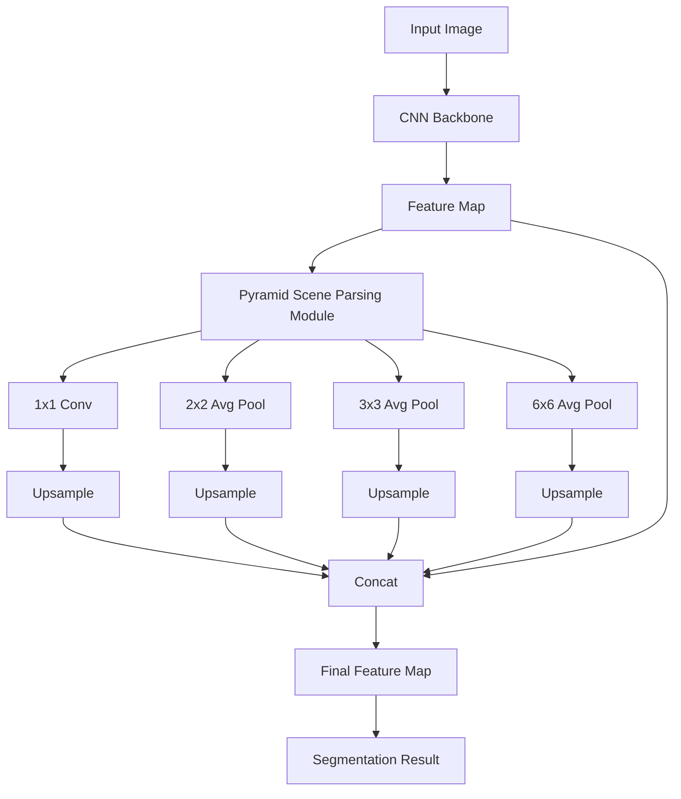

# PSPNet原理与代码实例讲解

关键词：PSPNet, 语义分割, 金字塔池化, 多尺度特征融合, 深度学习

## 1. 背景介绍
### 1.1 问题的由来
随着深度学习的快速发展,计算机视觉领域取得了巨大的进步。语义分割作为计算机视觉中的一个重要任务,旨在为图像中的每个像素分配一个语义标签,实现像素级别的场景理解。传统的语义分割方法主要基于手工设计的特征,难以捕捉复杂场景中的上下文信息,导致分割精度受限。

### 1.2 研究现状
近年来,深度学习技术为语义分割任务带来了新的突破。一系列基于卷积神经网络(CNN)的语义分割模型被相继提出,如FCN、SegNet、DeepLab等。这些模型通过端到端的训练,自动学习高层语义特征,大大提升了语义分割的性能。然而,现有方法仍然存在一些局限性,如对不同尺度目标的感知能力不足,容易丢失小目标和细节信息等。

### 1.3 研究意义
为了进一步提高语义分割的精度,需要设计更加有效的特征提取和融合机制。PSPNet(Pyramid Scene Parsing Network)就是在这样的背景下提出的一种新颖的语义分割模型。它通过引入金字塔池化模块,在不同尺度下提取和融合特征,增强了模型对多尺度信息的利用能力。PSPNet在多个数据集上取得了state-of-the-art的性能,展现出了巨大的应用前景。

### 1.4 本文结构
本文将全面介绍PSPNet的原理和实现。首先,我们将阐述PSPNet中的核心概念和模块设计。然后,详细讲解PSPNet的算法原理和关键步骤。接着,我们将推导PSPNet涉及的数学模型和公式,并给出案例分析。此外,我们还将提供PSPNet的代码实例和详细解读。最后,探讨PSPNet的实际应用场景、未来发展趋势与挑战,并总结全文。

## 2. 核心概念与联系

PSPNet的核心是金字塔场景解析(Pyramid Scene Parsing)模块。该模块借鉴了空间金字塔池化(Spatial Pyramid Pooling)的思想,通过多尺度池化操作,获取不同感受野的特征表示。

具体来说,金字塔场景解析模块首先对卷积神经网络提取的特征图进行不同尺度的平均池化,得到多个不同感受野的特征图。然后,使用1x1卷积对这些特征图进行降维,并通过上采样操作使其恢复到原始特征图的尺寸。最后,将这些不同尺度的特征图与原始特征图进行拼接,得到融合后的特征表示。

通过金字塔场景解析模块,PSPNet能够有效地捕捉不同尺度下的上下文信息,增强了模型对多尺度目标的感知能力。同时,多尺度特征的融合也有助于提高分割结果的精细程度,更好地保留物体的边界和细节。

下图展示了PSPNet的整体架构和金字塔场景解析模块:

## 3. 核心算法原理 & 具体操作步骤
### 3.1 算法原理概述
PSPNet的核心是在卷积神经网络的基础上引入金字塔场景解析模块。该模块通过多尺度池化和特征融合,增强了模型对不同尺度目标的感知能力。具体来说,PSPNet的算法原理可以分为以下几个关键步骤:

1. 使用预训练的卷积神经网络(如ResNet)提取图像的特征表示。
2. 对提取的特征图应用金字塔场景解析模块,在不同尺度下进行池化和特征融合。
3. 将融合后的特征图输入到分割头网络,生成像素级别的分割结果。
4. 使用交叉熵损失函数和反向传播算法训练整个网络。

### 3.2 算法步骤详解
下面我们对PSPNet的算法步骤进行详细说明:

步骤1:特征提取
PSPNet使用预训练的卷积神经网络作为骨干网络,提取图像的高层语义特征。常用的骨干网络包括ResNet、Xception等。通过骨干网络,可以得到具有丰富语义信息的特征图。

步骤2:金字塔场景解析
对骨干网络提取的特征图应用金字塔场景解析模块。该模块包括以下操作:

a. 多尺度池化:对特征图进行不同尺度的平均池化,得到多个不同感受野的特征图。常用的池化尺度包括1x1、2x2、3x3、6x6等。
b. 特征降维:使用1x1卷积对池化后的特征图进行降维,减少特征通道数。
c. 上采样:将降维后的特征图通过双线性插值进行上采样,恢复到原始特征图的尺寸。
d. 特征拼接:将上采样后的多尺度特征图与原始特征图在通道维度上进行拼接,得到融合后的特征表示。

步骤3:分割头网络
将融合后的特征图输入到分割头网络中,生成像素级别的分割结果。分割头网络通常包括一系列的卷积和上采样操作,将特征图的尺寸逐步恢复到输入图像的大小。最后使用Softmax激活函数,得到每个像素属于各个类别的概率。

步骤4:训练和优化
使用交叉熵损失函数度量预测结果与真实标签之间的差异,并通过反向传播算法更新网络的参数。常用的优化算法包括SGD、Adam等。在训练过程中,还可以使用数据增强、学习率调整等技巧,提高模型的泛化能力和收敛速度。

### 3.3 算法优缺点
PSPNet的主要优点包括:

1. 通过金字塔场景解析模块,有效地捕捉多尺度上下文信息,增强了模型对不同大小目标的感知能力。
2. 多尺度特征的融合有助于提高分割结果的精细程度,更好地保留物体的边界和细节。
3. 端到端的训练方式,无需手工设计特征,降低了人工干预的需求。

PSPNet的主要缺点包括:

1. 模型的参数量较大,训练和推理的计算开销较高,对硬件资源的要求较高。
2. 对于极小目标和复杂场景,分割精度仍有提升空间。

### 3.4 算法应用领域
PSPNet在语义分割领域取得了优异的性能,具有广泛的应用前景。主要应用领域包括:

1. 自动驾驶:对道路场景进行精确的语义分割,识别车道线、车辆、行人等关键元素。
2. 医学影像分析:对医学图像进行组织和器官的分割,辅助疾病诊断和治疗。
3. 遥感图像分析:对卫星和航拍图像进行土地利用分类、地物提取等。
4. 视频监控:对监控视频中的人员、车辆等目标进行分割和跟踪。
5. 增强现实:对真实场景进行语义分割,实现虚拟对象的逼真融合。

## 4. 数学模型和公式 & 详细讲解 & 举例说明
### 4.1 数学模型构建
PSPNet的数学模型可以表示为一个映射函数$f$,将输入图像$\mathbf{X}$映射为像素级别的分割结果$\mathbf{Y}$:

$$\mathbf{Y} = f(\mathbf{X};\mathbf{\Theta})$$

其中,$\mathbf{\Theta}$表示PSPNet的可学习参数,包括卷积核权重、偏置等。

PSPNet的损失函数采用交叉熵损失,用于度量预测结果与真实标签之间的差异。对于每个像素$i$,交叉熵损失定义为:

$$\mathcal{L}_i = -\sum_{c=1}^{C} y_{i,c} \log p_{i,c}$$

其中,$C$表示类别数,$y_{i,c}$表示像素$i$属于类别$c$的真实标签(0或1),$p_{i,c}$表示像素$i$属于类别$c$的预测概率。

整个图像的损失函数为所有像素的交叉熵损失之和:

$$\mathcal{L} = \frac{1}{N}\sum_{i=1}^{N} \mathcal{L}_i$$

其中,$N$表示像素总数。

### 4.2 公式推导过程
下面我们对PSPNet中的关键公式进行推导。

1. 多尺度池化
设输入特征图为$\mathbf{F} \in \mathbb{R}^{H \times W \times C}$,多尺度池化操作可以表示为:

$$\mathbf{F}_s = \text{AvgPool}_s(\mathbf{F}), s \in \{1,2,3,6\}$$

其中,$\text{AvgPool}_s$表示尺度为$s$的平均池化操作。

2. 特征降维
对池化后的特征图进行1x1卷积,将通道数降低为$C'$:

$$\mathbf{F}'_s = \text{Conv}_{1 \times 1}(\mathbf{F}_s), s \in \{1,2,3,6\}$$

其中,$\text{Conv}_{1 \times 1}$表示1x1卷积操作。

3. 上采样
将降维后的特征图通过双线性插值上采样到原始尺寸:

$$\mathbf{F}''_s = \text{Upsample}(\mathbf{F}'_s), s \in \{1,2,3,6\}$$

其中,$\text{Upsample}$表示上采样操作。

4. 特征拼接
将多尺度特征图与原始特征图在通道维度上拼接:

$$\mathbf{F}_\text{fused} = \text{Concat}(\mathbf{F}, \mathbf{F}''_1, \mathbf{F}''_2, \mathbf{F}''_3, \mathbf{F}''_6)$$

其中,$\text{Concat}$表示通道维度上的拼接操作。

### 4.3 案例分析与讲解
下面我们以一个具体的案例来说明PSPNet的数学模型和公式的应用。

假设输入图像的尺寸为$512 \times 512$,骨干网络提取的特征图尺寸为$64 \times 64 \times 2048$。我们对该特征图应用金字塔场景解析模块,池化尺度分别为1x1、2x2、3x3、6x6。

1. 多尺度池化
对特征图进行平均池化,得到4个不同尺度的特征图:
- $\mathbf{F}_1 \in \mathbb{R}^{64 \times 64 \times 2048}$
- $\mathbf{F}_2 \in \mathbb{R}^{32 \times 32 \times 2048}$
- $\mathbf{F}_3 \in \mathbb{R}^{22 \times 22 \times 2048}$
- $\mathbf{F}_6 \in \mathbb{R}^{11 \times 11 \times 2048}$

2. 特征降维
对池化后的特征图进行1x1卷积,将通道数降低为512:
- $\mathbf{F}'_1 \in \mathbb{R}^{64 \times 64 \times 512}$
- $\mathbf{F}'_2 \in \mathbb{R}^{32 \times 32 \times 512}$
- $\mathbf{F}'_3 \in \mathbb{R}^{22 \times 22 \times 512}$
- $\mathbf{F}'_6 \in \mathbb{R}^{11 \times 11 \times 512}$

3. 上采样
将降维后的特征图通过双线性插值上采样到原始尺寸$64 \times 64$:
- $\math