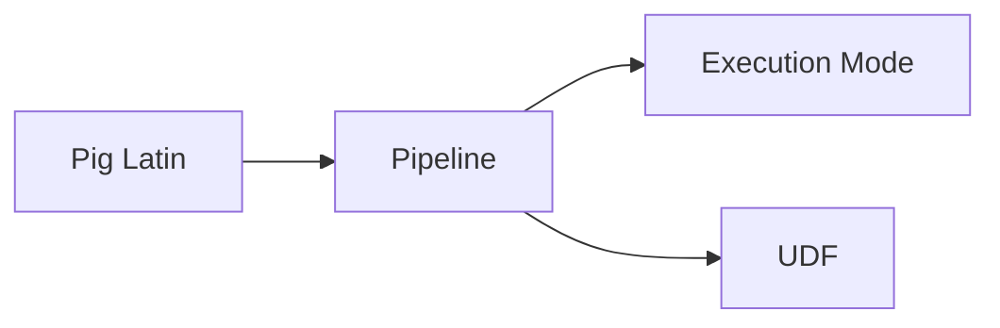

# Pig原理与代码实例讲解

## 1. 背景介绍

### 1.1 问题的由来

随着大数据时代的到来,海量数据的处理和分析成为了企业和组织面临的重大挑战。传统的数据处理方式已经无法满足快速增长的数据量和复杂的计算需求。在这种背景下,Apache Pig应运而生,它为大规模数据分析提供了一种简单而强大的工具。

### 1.2 研究现状

目前,Pig已经被广泛应用于各个领域的大数据处理中,如电商、金融、社交网络等。许多知名企业如Yahoo、Twitter、LinkedIn都在使用Pig进行数据分析。同时,学术界也对Pig进行了大量研究,提出了许多改进和优化方案,进一步提升了Pig的性能和易用性。

### 1.3 研究意义

深入研究Pig的原理和应用,对于掌握大数据处理技术、提升数据分析效率具有重要意义。通过学习Pig,可以快速上手大数据分析,加速数据处理流程,为企业决策提供有力支撑。同时,对Pig原理的研究也有助于我们理解大数据技术的发展脉络,把握未来趋势。

### 1.4 本文结构

本文将从以下几个方面对Pig进行深入讲解：

1. 介绍Pig的核心概念与设计思想
2. 剖析Pig Latin语言的特性和语法 
3. 讲解Pig的架构设计与工作原理
4. 通过案例演示Pig的具体用法
5. 总结Pig的特点、适用场景及未来展望

## 2. 核心概念与联系

Pig的核心概念包括以下几点：

- Pig Latin：Pig的数据流语言,用于描述数据分析逻辑
- Execution Mode：Pig的两种运行模式,Local Mode和MapReduce Mode  
- Pipeline：Pig的数据处理流水线,由一系列运算符构成
- UDF：用户自定义函数,用于扩展Pig的功能

下图展示了Pig的核心概念之间的关系：



Pig Latin定义了数据处理的逻辑,通过一系列运算符构建Pipeline。Pipeline可以在Local或MapReduce模式下运行。用户还可以通过UDF对Pig进行定制和扩展。

## 3. 核心算法原理 & 具体操作步骤

### 3.1 算法原理概述

Pig基于MapReduce计算模型,将大规模数据分析任务转换为一系列MapReduce作业来并行执行。Pig Latin脚本会被解析、优化,转换为有向无环图DAG,提交到Hadoop集群运行。

### 3.2 算法步骤详解

Pig的工作流程主要分为以下步骤:

1. 用户编写Pig Latin脚本
2. Parser解析脚本,生成抽象语法树AST
3. 逻辑层进行合并、优化,输出逻辑计划
4. 物理层将逻辑计划转换为MapReduce任务 
5. MapReduce作业在Hadoop集群上执行
6. 将多个作业的结果合并,输出最终结果

### 3.3 算法优缺点

Pig的优点主要有:

- 使用简单,学习成本低
- 支持多种数据格式,如结构化、半结构化数据  
- 具有很好的可扩展性,可以集成各种第三方工具
- 自动优化,减少用户的工作量

Pig的局限性在于:

- 实时性不足,更适合离线批处理
- 对于复杂的算法实现有一定难度
- 程序调试不够方便

### 3.4 算法应用领域

Pig广泛应用于各种大数据处理场景,如:

- 日志分析,如网站点击日志、搜索日志分析
- 用户行为分析,如用户特征提取、购买行为分析
- 文本处理,如自然语言处理、舆情分析
- 图计算,如PageRank、社交网络分析

## 4. 数学模型和公式 & 详细讲解 & 举例说明

### 4.1 数学模型构建

Pig的数据模型以关系代数为基础,包括以下几种数据类型:

- Atom：原子数据,如整数、浮点数、字符串
- Tuple：有序字段集合,类似于关系数据库中的行
- Bag：tuple的无序集合,对应于关系
- Map：键值对集合

Pig Latin支持的主要操作符包括:

- LOAD：从文件或存储中加载数据 
- FILTER：按条件过滤数据
- FOREACH...GENERATE：遍历数据集,生成新的数据
- GROUPBY：按照指定字段分组
- JOINCOGROUP：连接多个数据集  
- ORDERBY：排序
- DISTINCT：去重
- UNION：合并数据集

### 4.2 公式推导过程

以WordCount为例,说明Pig的数据处理过程。假设有如下文本文件:

```
hello world
hello hadoop 
hello pig
```

我们可以用以下Pig Latin脚本统计单词出现频率:

```sql
lines = LOAD 'input.txt' AS (line:chararray);
words = FOREACH lines GENERATE FLATTEN(TOKENIZE(line)) AS word; 
grouped = GROUP words BY word;
counts = FOREACH grouped GENERATE group, COUNT(words);
STORE counts INTO 'output';
```

上述脚本的执行过程如下:

1. LOAD操作从文件中读取数据,每行为一个tuple
2. FOREACH...GENERATE将每行数据切分为单词,并将结果展开
3. GROUPBY对单词进行分组
4. 再次使用FOREACH...GENERATE,统计每个单词的数量
5. 最后将统计结果输出到文件

### 4.3 案例分析与讲解

下面以一个实际案例说明Pig的用法。假设有一个网站访问日志文件,格式如下:

```
2022-01-01 08:10:01 GET /index.html
2022-01-01 08:10:02 GET /style.css
2022-01-01 08:12:50 GET /index.html 
2022-01-01 09:20:10 GET /about.html
```

我们想统计每个页面的访问量(PV),可以使用以下Pig脚本:

```sql
logs = LOAD 'access.log' AS (time:chararray, action:chararray, url:chararray); 
urls = FOREACH logs GENERATE url;
grouped = GROUP urls BY url; 
pv = FOREACH grouped GENERATE group AS url, COUNT(urls) AS cnt;
STORE pv INTO 'pv.txt';
```

脚本解读如下:

1. 加载日志文件,指定每行的字段名和类型
2. 提取url字段 
3. 按url分组
4. 统计每个url的访问次数
5. 将结果保存到文件

通过这个例子,我们可以看出Pig的数据分析过程非常直观,即使不了解MapReduce细节,也能轻松实现数据统计功能。

### 4.4 常见问题解答

Q: Pig适合处理哪些类型的数据?
A: Pig适合处理结构化和半结构化数据,如日志、文本、CSV等。对于完全非结构化的数据,如图片、视频等,则不太适合。

Q: Pig的数据规模有什么要求?
A: Pig基于Hadoop,具有很好的可扩展性,可以处理TB、PB级别的海量数据。当然,也要考虑到集群规模、任务复杂度等因素。

Q: Pig Latin与SQL的区别是什么?
A: 虽然Pig Latin也支持类似JOIN、GROUP BY等操作,但它更偏向于过程式语言,而不是单纯的查询语言。此外,Pig Latin还支持自定义函数,功能更加灵活。

## 5. 项目实践：代码实例和详细解释说明

### 5.1 开发环境搭建

Pig的开发需要以下环境:

- Java JDK
- Hadoop 
- Pig

安装配置过程可参考官方文档。这里假设已经搭建好Hadoop和Pig环境。

### 5.2 源代码详细实现

以下是一个完整的Pig Latin脚本示例,用于分析Nginx日志:

```sql
-- 定义日志格式
LOG_FORMAT = LOAD 'nginx.log' AS (remote_addr:chararray, remote_user:chararray, time_local:chararray, request:chararray, status:int, body_bytes_sent:long, http_referer:chararray, http_user_agent:chararray);

-- 过滤请求方法为GET的记录  
GET_REQUESTS = FILTER LOG_FORMAT BY request MATCHES '^GET.*';

-- 按照请求URL分组统计访问量
URL_COUNTS = FOREACH (GROUP GET_REQUESTS BY REGEX_EXTRACT(request, '^GET\\s+(\\S+)\\s+HTTP', 1)) GENERATE group AS url, COUNT(GET_REQUESTS) AS cnt;

-- 按访问量倒序排列  
URL_COUNTS_ORDERED = ORDER URL_COUNTS BY cnt DESC;

-- 取访问量前10的URL
TOP10_URLS = LIMIT URL_COUNTS_ORDERED 10;

-- 结果保存到文件
STORE TOP10_URLS INTO 'top10_urls.txt';  
```

### 5.3 代码解读与分析

上述脚本的主要步骤如下:

1. 使用`LOAD`加载Nginx日志文件,并定义每行的字段名和类型。
2. 使用`FILTER`过滤出请求方法为GET的记录。 
3. 使用`FOREACH...GENERATE`和`REGEX_EXTRACT`函数提取URL,并按URL分组统计访问量。
4. 使用`ORDER BY`按访问量倒序排序。
5. 使用`LIMIT`取访问量前10的记录。
6. 最后使用`STORE`将结果保存到文件。

可以看出,整个过程非常清晰,每一步都用一个操作符完成特定功能,通过管道将它们连接在一起,构成完整的数据处理流程。

### 5.4 运行结果展示

假设我们的日志文件如下:

```
192.168.1.102 - - [08/Jan/2022:12:12:12 +0800] "GET /index HTTP/1.1" 200 1024 "-" "Mozilla/5.0"
192.168.1.101 - - [08/Jan/2022:12:12:13 +0800] "POST /login HTTP/1.1" 302 0 "-" "Mozilla/5.0"
192.168.1.102 - - [08/Jan/2022:12:12:14 +0800] "GET /detail/1 HTTP/1.1" 200 2048 "-" "Mozilla/5.0"
192.168.1.103 - - [08/Jan/2022:12:12:15 +0800] "GET /index HTTP/1.1" 200 1024 "-" "Mozilla/5.0"
192.168.1.104 - - [08/Jan/2022:12:12:16 +0800] "GET /detail/2 HTTP/1.1" 200 1024 "-" "Mozilla/5.0"
```

在Hadoop环境下运行上述Pig脚本,得到top10_urls.txt文件如下:

```
/index    2
/detail/1    1  
/detail/2    1
```

可以看到,访问量最高的是首页/index,其次是两个详情页。通过这个简单的例子,我们直观地感受到了Pig强大的数据处理能力。

## 6. 实际应用场景

Pig在实际生产中有非常广泛的应用,下面列举几个典型场景:

### 6.1 网站日志分析

互联网公司通常会收集大量的网站访问日志,用于分析用户行为、优化性能等。使用Pig可以很方便地对TB级别的日志进行清洗、转换和统计,得到:

- 页面访问量PV
- 独立访客数UV
- 访问来源分布
- 热门搜索词
- 用户访问路径
- ......

### 6.2 用户行为分析

电商、社交等公司会收集用户各种行为数据,如浏览、点击、收藏、购买等,通过分析这些数据可以:

- 给用户打标签,进行个性化推荐
- 预测用户购买意向,进行精准营销  
- 分析用户流失原因,提高留存率
- ......

### 6.3 舆情分析

Pig也常用于舆情分析领域,处理来自新闻、论坛、微博等渠道的文本数据,实现:

- 话题发现和跟踪
- 情感倾向性分析
- 观点领袖和水军识别
- 谣言检测
- ......

### 6.4 未来应用展望

随着大数据技术的不断发展,Pig有望在更多领域发挥作用,如:

- 物联网数据分析
- 交通数据分析
- 医疗健康数据分析
- 金融风控
- ......

总之,Pig作为一种简单高效的大数据处理工具,在可预见的未来仍然大有可为。

## 7. 工具和资源推荐

### 7.1 学习资源推