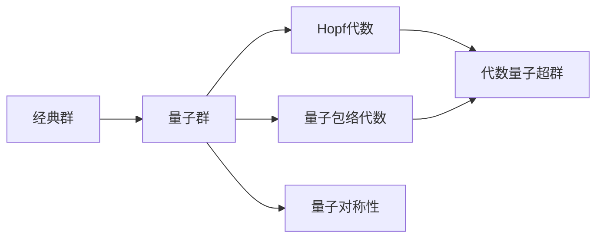

# Pontryagin对偶与代数量子超群：代数量子超群

关键词：Pontryagin对偶、代数量子超群、Hopf代数、量子群、量子包络代数、量子对称性

## 1. 背景介绍
### 1.1  问题的由来
在现代数学和物理学中，对称性扮演着至关重要的角色。从经典力学到量子力学，从微观粒子到宏观宇宙，对称性无处不在。然而，随着量子理论的发展，人们发现经典对称性在量子领域往往会发生"形变"，产生所谓的量子对称性。这种量子对称性可以用量子群来刻画。

### 1.2  研究现状
量子群理论自20世纪80年代由Drinfeld和Jimbo等人提出以来，经历了蓬勃发展。特别是，人们发现量子群与低维拓扑、量子可积系统、共形场论等多个数学物理领域有着深刻联系。近年来，随着范畴论和同调代数等现代数学工具的引入，量子群理论进一步得到了丰富和推广，其中一个重要方向就是代数量子超群的研究。

### 1.3  研究意义 
代数量子超群作为量子群的推广，在数学和物理中有着广泛应用前景。一方面，它为经典超李群和超代数提供了量子类比，有助于更深入理解量子对称性的数学结构；另一方面，它在超对称量子场论、超弦理论等前沿物理领域也有潜在应用。此外，代数量子超群还与非交换几何、量子计算等新兴交叉学科有着密切联系。因此，深入研究代数量子超群具有重要的理论价值和应用前景。

### 1.4  本文结构
本文将围绕Pontryagin对偶与代数量子超群展开讨论。第2节将介绍量子群、Hopf代数等核心概念及其联系；第3节重点讲解代数量子超群的定义和基本性质；第4节给出代数量子超群的数学模型，并举例说明；第5节介绍代数量子超群的计算机代数实现；第6节讨论代数量子超群在数学物理中的应用；第7节推荐相关学习资源；第8节总结全文，并展望代数量子超群的发展前景与挑战；第9节附录常见问题解答。

## 2. 核心概念与联系
要理解代数量子超群，首先需要了解以下几个核心概念：

- 量子群：经典群的量子形变，带有额外的代数结构。数学上可定义为某种Hopf代数。
- Hopf代数：带有乘法、单位元、余乘法、余单位元和反极的双代数。是量子群的代数刻画。
- 量子包络代数：与经典李超代数对应的量子群。如量子通用包络代数 $U_q(\mathfrak{g})$。
- 量子对称性：量子系统所具有的对称性，可用量子群的表示来刻画。

这些概念环环相扣，构成了代数量子超群的理论基础。下图给出了它们之间的逻辑联系：



## 3. 核心算法原理 & 具体操作步骤
### 3.1  算法原理概述
代数量子超群的构造一般采用"量子形变"的方法，即在经典超群或超代数的基础上引入量子参数 $q$，并对代数关系做适当形变，使得在 $q \to 1$ 的极限下回到经典情形。

### 3.2  算法步骤详解
以下是构造代数量子超群的一般步骤：

1) 选取一个经典李超代数 $\mathfrak{g}$，它的泛包络代数记为 $U(\mathfrak{g})$。

2) 在 $U(\mathfrak{g})$ 上引入量子参数 $q$，得到对应的量子包络代数 $U_q(\mathfrak{g})$。具体来说，就是形变 $U(\mathfrak{g})$ 中的代数关系，使得在 $q \to 1$ 极限下回到 $U(\mathfrak{g})$。

3) 在 $U_q(\mathfrak{g})$ 的基础上，引入余乘法、余单位元和反极等额外的代数结构，使其成为一个Hopf代数。这就得到了 $\mathfrak{g}$ 对应的代数量子超群，记为 $G_q$。

4) 研究 $G_q$ 的结构和性质，如表示论、泛函方程、量子对称性等。

5) 考虑 $G_q$ 的各种推广和变形，如双参数量子群、椭圆量子群等。

### 3.3  算法优缺点
上述构造代数量子超群的算法思路清晰，但实际操作中可能会遇到一些困难：

- 形变经典代数关系的过程比较复杂，需要借助量子群的表示论等工具。
- Hopf代数结构的引入需要仔细验证各种代数恒等式。
- $G_q$ 的结构和性质往往依赖于 $\mathfrak{g}$ 的具体类型，难以给出统一的结论。

尽管如此，该算法仍然是构造代数量子超群的一种系统而有效的方法。

### 3.4  算法应用领域
代数量子超群的构造算法在以下领域有重要应用：

- 数学物理：构造各种量子对称性模型，如量子超对称 $\sigma$ 模型、超弦理论等。
- 非交换几何：将经典流形上的几何学推广到非交换代数上。
- 量子计算：构造量子纠错码、量子算法等。

## 4. 数学模型和公式 & 详细讲解 & 举例说明
### 4.1  数学模型构建
代数量子超群 $G_q$ 的数学模型可以用Hopf代数来刻画。设 $\mathfrak{g}$ 是一个李超代数，$\{e_i,f_i,h_i\}$ 是其Chevalley生成元，则 $\mathfrak{g}$ 的量子包络代数 $U_q(\mathfrak{g})$ 由以下关系定义：

$$
\begin{aligned}
[h_i,h_j] &= 0, \quad [h_i,e_j] = a_{ij}e_j, \quad [h_i,f_j] = -a_{ij}f_j, \\
[e_i,f_j] &= \delta_{ij} \frac{q^{h_i}-q^{-h_i}}{q-q^{-1}}, \\
\sum_{k=0}^{1-a_{ij}} (-1)^k \binom{1-a_{ij}}{k}_{q} e_i^k e_j e_i^{1-a_{ij}-k} &= 0, \quad (i \neq j) \\
\sum_{k=0}^{1-a_{ij}} (-1)^k \binom{1-a_{ij}}{k}_{q} f_i^k f_j f_i^{1-a_{ij}-k} &= 0, \quad (i \neq j)
\end{aligned}
$$

其中 $a_{ij}$ 是 $\mathfrak{g}$ 的Cartan矩阵，$[x,y]=xy-yx$ 是Lie括号，$\binom{n}{k}_q$ 是 $q$-二项式系数。

在此基础上，再赋予 $U_q(\mathfrak{g})$ 以下Hopf代数结构：

$$
\begin{aligned}
\Delta(h_i) &= h_i \otimes 1 + 1 \otimes h_i, \\
\Delta(e_i) &= e_i \otimes q^{h_i/2} + q^{-h_i/2} \otimes e_i, \\ 
\Delta(f_i) &= f_i \otimes q^{h_i/2} + q^{-h_i/2} \otimes f_i, \\
\epsilon(h_i) &= \epsilon(e_i) = \epsilon(f_i) = 0, \\
S(h_i) &= -h_i, \quad S(e_i) = -q^{h_i} e_i, \quad S(f_i) = -f_i q^{-h_i}.
\end{aligned}
$$

这里 $\Delta$、$\epsilon$、$S$ 分别为余乘法、余单位元、反极。至此我们就得到了李超代数 $\mathfrak{g}$ 对应的代数量子超群 $G_q$。

### 4.2  公式推导过程
以上代数量子超群的定义公式，可以通过以下步骤推导得到：

1) 首先写出经典李超代数 $\mathfrak{g}$ 的Chevalley生成元关系式。

2) 引入量子形变参数 $q$，对生成元关系式中的结构常数做适当替换，如 $a_{ij} \to [a_{ij}]_q$。

3) 验证形变后的关系式满足Jacobi等恒等式，从而确保量子形变的有效性。

4) 引入余乘法 $\Delta$、余单位元 $\epsilon$ 和反极 $S$，使量子包络代数 $U_q(\mathfrak{g})$ 成为一个Hopf代数。

5) 验证Hopf代数公理，如 $(\Delta \otimes id) \circ \Delta = (id \otimes \Delta) \circ \Delta$ 等。

### 4.3  案例分析与讲解
下面以量子超群 $U_q(\mathfrak{sl}(2))$ 为例，说明代数量子超群的构造过程。

经典李超代数 $\mathfrak{sl}(2)$ 的 Chevalley 生成元 $\{e,f,h\}$ 满足以下关系：

$$
[h,e] = 2e, \quad [h,f] = -2f, \quad [e,f] = h.
$$

引入量子参数 $q$，做如下替换：

$$
[h,e] = 2e, \quad [h,f] = -2f, \quad [e,f] = \frac{q^h-q^{-h}}{q-q^{-1}}.
$$

这就得到了 $\mathfrak{sl}(2)$ 的量子包络代数 $U_q(\mathfrak{sl}(2))$。

进一步引入Hopf代数结构：

$$
\begin{aligned}
\Delta(h) &= h \otimes 1 + 1 \otimes h, \\
\Delta(e) &= e \otimes q^{h/2} + q^{-h/2} \otimes e, \\ 
\Delta(f) &= f \otimes q^{h/2} + q^{-h/2} \otimes f, \\
\epsilon(h) &= \epsilon(e) = \epsilon(f) = 0, \\
S(h) &= -h, \quad S(e) = -q^h e, \quad S(f) = -f q^{-h}.
\end{aligned}
$$

这就得到了量子超群 $U_q(\mathfrak{sl}(2))$ 的完整定义。可以验证，它满足Hopf代数的所有公理。

### 4.4  常见问题解答
Q: 代数量子超群与经典李超代数有何区别？

A: 代数量子超群是经典李超代数的量子形变，带有额外的Hopf代数结构。在 $q \to 1$ 极限下，代数量子超群会退化为经典李超代数。但在一般情况下，代数量子超群的结构更加丰富，如存在非平凡的余乘法和反极等。

Q: 代数量子超群的表示论有何特点？

A: 与经典李超代数类似，代数量子超群的表示论也是研究其模的范畴。但由于量子形变的引入，代数量子超群的表示有其独特之处，如存在非半单表示、辫子群表示等。这是经典理论所不具备的。

## 5. 项目实践：代码实例和详细解释说明
### 5.1  开发环境搭建
研究代数量子超群需要使用计算机代数系统（CAS），如Mathematica、Maple、Sage等。下面以Mathematica为例，说明如何搭建代数量子超群的计算环境。

首先，安装Mathematica。可以从官网下载安装包，按照提示完成安装。

其次，加载Mathematica的代数计算包NCAlgebra。打开Mathematica，在笔记本中输入以下命令：

```mathematica
<< NC`
```

即可加载NCAlgebra包。

### 5.2  源代码详细实现
下面以 $U_q(\mathfrak{sl}(2))$ 为例，演示如何在Mathematica中定义代数量子超群并进行计算。

首先定义量子包络代数 $U_q(\mathfrak{sl}(2))$ 的生成元：

```mathematica
qe = qe ** qh