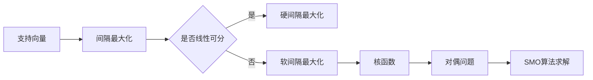

# Python机器学习实战：支持向量机(SVM)的原理与使用

关键词：支持向量机、SVM、机器学习、分类算法、Python实现

## 1. 背景介绍
### 1.1  问题的由来
在机器学习领域,分类问题是一个非常重要且常见的任务。给定一组已标记的训练数据,我们希望训练一个模型,使其能够对新的未标记数据进行准确的分类。传统的分类算法如逻辑回归、决策树等在处理线性可分数据时表现良好,但对于非线性数据,它们的性能往往不尽如人意。支持向量机(Support Vector Machine, SVM)作为一种强大的分类算法,能够很好地解决非线性分类问题。

### 1.2  研究现状
自从1995年Cortes和Vapnik提出支持向量机以来,SVM在理论研究和实际应用中都取得了巨大的成功。SVM已被广泛应用于文本分类、图像识别、生物信息学等诸多领域。近年来,随着大数据时代的到来和计算能力的提升,SVM也被用于解决更加复杂的分类问题。许多研究者对SVM的理论基础、优化算法、核函数选择等方面进行了深入研究,使得SVM的性能不断提升。

### 1.3  研究意义
支持向量机作为一种重要的机器学习算法,掌握其原理和使用方法对于从事机器学习相关工作的人员来说非常必要。通过学习SVM,可以加深对机器学习的理解,提升解决分类问题的能力。此外,SVM的思想也为许多其他机器学习算法提供了借鉴和启发。因此,深入研究SVM具有重要的理论和实践意义。

### 1.4  本文结构
本文将全面介绍支持向量机的原理和Python实现。第2部分介绍SVM的核心概念;第3部分讲解SVM的算法原理;第4部分给出SVM的数学模型和公式推导;第5部分通过Python代码实例演示SVM的具体实现;第6部分讨论SVM的实际应用场景;第7部分推荐SVM相关的工具和资源;第8部分对SVM的研究现状和未来趋势进行总结展望。

## 2. 核心概念与联系
支持向量机的核心思想是在高维空间中构建最优分离超平面,使得不同类别的数据点能够被超平面很好地分开。下面介绍SVM的几个关键概念:

- 支持向量:离分离超平面最近的那些点被称为支持向量,它们决定了分离超平面的位置。

- 间隔:两个异类支持向量到超平面的距离之和为间隔。SVM的目标就是最大化间隔。

- 硬间隔和软间隔:如果训练数据线性可分,SVM学习的目标是硬间隔最大化;如果训练数据近似线性可分,则学习的目标是软间隔最大化。

- 核函数:通过使用核函数,SVM可以解决非线性分类问题。核函数可以将低维空间的数据映射到高维空间,使得在高维空间中线性可分。

- 对偶问题:SVM的学习问题可以表示为一个凸二次规划问题,通过求解对偶问题可以得到原始问题的最优解。

- 序列最小优化算法(SMO):SMO是求解SVM对偶问题的一种有效算法,它将大优化问题分解为多个小优化问题求解。

这些概念之间紧密联系,共同构成了支持向量机的理论基础。下图展示了它们之间的关系:

## 3. 核心算法原理 & 具体操作步骤
### 3.1  算法原理概述
支持向量机的基本想法是在特征空间中找到一个最优分离超平面,使得不同类别的数据点能够被超平面分开,并且间隔最大化。对于线性可分数据,SVM直接在原始特征空间中学习分离超平面;对于非线性数据,SVM先通过核函数将数据映射到高维特征空间,然后在高维空间中学习分离超平面。

### 3.2  算法步骤详解
SVM的学习过程可以分为以下步骤:

1. 准备数据:将数据集表示为$(x_i,y_i),i=1,2,...,N$,其中$x_i$为特征向量,$y_i\in\{-1,+1\}$为类别标签。

2. 选择核函数:对于非线性问题,需要选择合适的核函数将数据映射到高维空间。常用的核函数有线性核、多项式核、高斯核(RBF)等。

3. 构建优化问题:SVM的目标是最大化间隔,可以表示为以下约束优化问题:

$$
\begin{aligned}
\min_{w,b} \quad & \frac{1}{2}||w||^2 \\
s.t. \quad & y_i(w^Tx_i+b) \geq 1, i=1,2,...,N
\end{aligned}
$$

其中$w$是超平面的法向量,$b$是偏置项。

4. 求解对偶问题:上述优化问题的对偶形式为:

$$
\begin{aligned}
\max_{\alpha} \quad & \sum_{i=1}^N \alpha_i - \frac{1}{2}\sum_{i=1}^N\sum_{j=1}^N \alpha_i\alpha_jy_iy_jK(x_i,x_j)\\
s.t. \quad & \sum_{i=1}^N \alpha_iy_i = 0 \\
& 0 \leq \alpha_i \leq C, i=1,2,...,N
\end{aligned}
$$

其中$\alpha_i$是拉格朗日乘子,$C$是惩罚参数,$K(x_i,x_j)$是核函数。通过SMO等算法求解上述对偶问题,可得最优解$\alpha^*$。

5. 构建分类决策函数:分类决策函数为:

$$
f(x) = sign(\sum_{i=1}^N \alpha_i^* y_i K(x,x_i) + b^*)
$$

其中$b^*$可由支持向量计算得到。对于新样本$x$,通过决策函数可预测其类别标签。

### 3.3  算法优缺点
SVM的主要优点有:
- 理论基础严谨,可以很好地解释泛化性能。
- 通过核函数可以处理非线性分类问题。  
- 最终模型只依赖少量支持向量,预测速度快。
- 对高维数据的分类效果好。

SVM的主要缺点有:  
- 训练时间较长,尤其是对大规模数据集。
- 对参数和核函数的选择敏感。
- 原始形式不支持多分类,需要进行推广。
- 难以直接用于特征选择和提取。

### 3.4  算法应用领域
SVM在许多领域都有成功应用,如:
- 文本分类:如邮件分类、情感分析等。
- 图像识别:如人脸识别、目标检测等。
- 生物信息学:如蛋白质结构预测、基因表达数据分析等。
- 语音识别:如说话人识别、语音情感识别等。
- 异常检测:如入侵检测、欺诈检测等。

此外,SVM还可用于回归任务,称为支持向量回归(SVR)。

## 4. 数学模型和公式 & 详细讲解 & 举例说明
### 4.1  数学模型构建
考虑二分类问题,训练集为$\{(x_1,y_1),(x_2,y_2),...,(x_N,y_N)\}$,其中$x_i \in \mathbb{R}^n,y_i \in \{-1,+1\},i=1,2,...,N$。SVM的目标是找到一个超平面$w^Tx+b=0$,使得不同类别的点能够被超平面正确分开,且间隔最大。

对于任意一点$(x_i,y_i)$,若$y_i=1$,则希望$w^Tx_i+b \geq 1$;若$y_i=-1$,则希望$w^Tx_i+b \leq -1$。综合起来,SVM的约束条件可以写为:

$$y_i(w^Tx_i+b) \geq 1, i=1,2,...,N$$

两个异类支持向量到超平面的距离之和为$\frac{2}{||w||}$,称为间隔。SVM的目标是最大化间隔,即:

$$
\max_{w,b} \frac{2}{||w||} \\
s.t. \quad y_i(w^Tx_i+b) \geq 1, i=1,2,...,N
$$

等价地,可以最小化$||w||^2$,于是SVM的优化问题为:

$$
\min_{w,b} \frac{1}{2}||w||^2 \\
s.t. \quad y_i(w^Tx_i+b) \geq 1, i=1,2,...,N
$$

这就是SVM的基本数学模型。对于线性不可分的情况,可以引入松弛变量$\xi_i$,得到软间隔SVM的优化问题:

$$
\min_{w,b,\xi} \frac{1}{2}||w||^2 + C\sum_{i=1}^N \xi_i \\
s.t. \quad y_i(w^Tx_i+b) \geq 1-\xi_i, i=1,2,...,N \\
\xi_i \geq 0, i=1,2,...,N
$$

其中$C$是惩罚参数,控制误分类的惩罚程度。

### 4.2  公式推导过程
为了求解SVM优化问题,通常先将它转化为对偶形式。引入拉格朗日乘子$\alpha_i \geq 0$,定义拉格朗日函数:

$$L(w,b,\alpha) = \frac{1}{2}||w||^2 - \sum_{i=1}^N \alpha_i[y_i(w^Tx_i+b)-1]$$

根据拉格朗日对偶性,原问题的对偶问题是极大极小问题:

$$\max_{\alpha} \min_{w,b} L(w,b,\alpha)$$

先求$\min_{w,b} L(w,b,\alpha)$。分别令$L$对$w$和$b$的偏导为0:

$$
\frac{\partial L}{\partial w} = w - \sum_{i=1}^N \alpha_iy_ix_i = 0 \\
\frac{\partial L}{\partial b} = -\sum_{i=1}^N \alpha_iy_i = 0
$$

得到:

$$
w = \sum_{i=1}^N \alpha_iy_ix_i \\
\sum_{i=1}^N \alpha_iy_i = 0
$$

代入拉格朗日函数,消去$w$和$b$,得到关于$\alpha$的极大化问题:

$$
\max_{\alpha} \sum_{i=1}^N \alpha_i - \frac{1}{2}\sum_{i=1}^N\sum_{j=1}^N \alpha_i\alpha_jy_iy_j(x_i \cdot x_j) \\
s.t. \quad \sum_{i=1}^N \alpha_iy_i = 0 \\
\alpha_i \geq 0, i=1,2,...,N
$$

这就是SVM的对偶问题。求解后得到最优解$\alpha^*$,然后由$w^* = \sum_{i=1}^N \alpha_i^*y_ix_i$得到原问题的最优解$w^*$。对于$b^*$,可以取任意支持向量$(x_s,y_s)$代入$y_s(w^{*T}x_s+b)=1$求得。

最终得到分类决策函数:

$$f(x) = sign(w^{*T}x+b^*) = sign(\sum_{i=1}^N \alpha_i^*y_i(x \cdot x_i)+b^*)$$

对于非线性问题,只需将内积$x_i \cdot x_j$替换为核函数$K(x_i,x_j)$即可,得到:

$$
\max_{\alpha} \sum_{i=1}^N \alpha_i - \frac{1}{2}\sum_{i=1}^N\sum_{j=1}^N \alpha_i\alpha_jy_iy_jK(x_i,x_j) \\
s.t. \quad \sum_{i=1}^N \alpha_iy_i = 0 \\
0 \leq \alpha_i \leq C, i=1,2,...,N
$$

分类决策函数变为:

$$f(x) = sign(\sum_{i=1}^N \alpha_i^*y_iK(