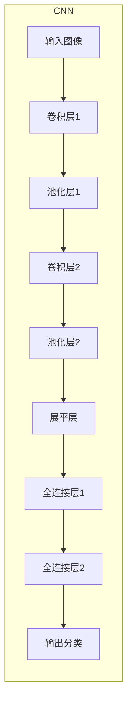

好的,我会严格遵循您提供的约束条件,以"Python深度学习实践:构建深度卷积网络识别图像"为主题,撰写一篇专业的技术博客文章。

# Python深度学习实践:构建深度卷积网络识别图像

## 1. 背景介绍

### 1.1 问题的由来

在当今的数字时代,图像数据无处不在。从社交媒体上的个人照片到卫星遥感图像,从医学影像诊断到自动驾驶汽车的路况检测,图像数据都扮演着越来越重要的角色。然而,对这些海量图像数据进行有效分析和处理,是一个巨大的挑战。

传统的图像处理方法主要依赖于手工设计的特征提取算法,需要专家对不同类型的图像数据进行大量的领域知识总结和特征工程。这不仅费时费力,而且往往难以取得理想的效果。随着深度学习技术的兴起,我们有机会用数据驱动的方式自动学习图像的特征表示,从而极大提高了图像识别的性能和泛化能力。

### 1.2 研究现状  

深度卷积神经网络(Convolutional Neural Networks, CNNs)是深度学习在计算机视觉领域的杰出代表,已经在图像分类、目标检测、语义分割等多个视觉任务中取得了令人瞩目的成就。自2012年AlexNet在ImageNet大赛中横空出世以来,VGGNet、GoogLeNet、ResNet等新型CNN模型层出不穷,在准确率和效率上不断刷新纪录。

与此同时,Python生态系统中诞生了多个优秀的深度学习框架,如TensorFlow、PyTorch、Keras等,极大降低了深度学习模型的开发和应用门槛。得益于算力的飞速发展和框架的不断优化,如今已经有可能在个人计算机上训练和部署复杂的深度卷积网络模型。

### 1.3 研究意义

掌握深度卷积网络的原理和实践技能,对于从事计算机视觉、模式识别等领域的工作者来说是非常宝贵和必要的。本文将全面介绍如何使用Python生态系统中的深度学习框架,从零开始构建深度卷积网络模型,并将其应用于图像识别任务。

通过学习本文,读者将能够:

- 深入理解卷积神经网络的核心概念和数学原理
- 掌握卷积、池化等基本网络层的工作机制
- 熟悉主流深度学习框架的使用方法
- 学习如何设计和训练深度卷积网络模型
- 将所学知识应用于实际的图像识别任务

### 1.4 本文结构

本文共分为9个章节,内容安排如下:

- 第1章简要介绍研究背景和意义
- 第2章阐述卷积神经网络的核心概念
- 第3章详细解析卷积网络的工作原理和算法步骤
- 第4章推导卷积网络中的数学模型和公式
- 第5章实战演示如何用代码构建卷积网络模型
- 第6章列举卷积网络在实际中的应用场景
- 第7章推荐相关的学习资源和开发工具
- 第8章总结研究成果并展望未来发展趋势和挑战
- 第9章回答常见的问题和疑虑

## 2. 核心概念与联系

在深入探讨卷积神经网络的细节之前,我们有必要先了解一些核心概念,为后续的学习打下基础。

卷积神经网络(Convolutional Neural Networks, CNNs)是一种前馈神经网络,它借鉴了生物学中视觉皮层的组织结构和工作原理,在图像和视频识别领域展现出了优秀的性能表现。与传统的全连接神经网络不同,CNN通过三维卷积层和池化层的交替操作,能够有效地从原始图像中自动学习特征模式。

CNN的结构如下所示:

其中:

- **卷积层(Convolutional Layer)**: 通过滑动卷积核在图像上进行卷积操作,提取局部特征。
- **池化层(Pooling Layer)**: 对卷积层的输出进行下采样,减少数据量,提高模型的泛化能力。
- **全连接层(Fully Connected Layer)**: 将前面层的特征映射到最终的分类空间。

除了上述核心层之外,CNN还常常包含其他辅助层,如激活函数层、正则化层等,以提高模型的非线性表达能力和泛化性能。

CNN的关键优势在于:

1. **局部连接(Local Connectivity)**: 每个神经元仅与输入数据的一个局部区域相连,从而大大减少了参数量。
2. **权重共享(Weight Sharing)**: 在同一个卷积层中,所有神经元共享一组权重,这进一步降低了参数数量。
3. **平移不变性(Translation Invariance)**: 卷积操作对输入的平移具有等变性,使得CNN能够有效地检测出图像中的特征,而不受其位置的影响。

通过上述独特的设计,CNN能够在保留空间信息的同时,有效地从图像中自动学习分层次的特征表示,从而在计算机视觉任务上展现出卓越的性能。

## 3. 核心算法原理与具体操作步骤  

### 3.1 算法原理概述

卷积神经网络的核心思想是通过卷积操作从原始图像中提取局部特征,并在网络中层层传递和组合这些特征,最终形成对整个图像的高层次特征表示。具体来说,CNN由以下几个关键步骤组成:

1. **卷积(Convolution)**: 在卷积层中,卷积核(也称滤波器核)在输入数据(如图像)上滑动,对局部区域进行卷积操作,提取局部特征。
2. **激活(Activation)**: 通过非线性激活函数(如ReLU),增加网络的表达能力。
3. **池化(Pooling)**: 在池化层中,对卷积层的输出进行下采样,降低数据维度,提高模型的泛化能力。
4. **全连接(Fully Connected)**: 将前面层的特征映射到最终的分类空间,输出预测结果。

这些步骤在CNN中交替重复,形成了一个多层次的特征提取和组合网络。在训练过程中,CNN会自动学习卷积核的权重参数,使得输出的特征表示对于最终的任务(如图像分类)是最优的。

### 3.2 算法步骤详解

接下来,我们将详细解析CNN中每个关键步骤的具体操作过程。

#### 3.2.1 卷积操作

卷积操作是CNN的核心,它通过在输入数据(如图像)上滑动卷积核,对局部区域进行加权求和,从而提取出该区域的特征。具体来说,给定一个二维输入数据$I$和一个二维卷积核$K$,卷积操作可以表示为:

$$
(I * K)(i, j) = \sum_{m} \sum_{n} I(i+m, j+n) K(m, n)
$$

其中$(i, j)$表示输出特征图上的位置,$(m, n)$表示卷积核的大小。通过在整个输入数据上滑动卷积核,我们可以得到一个新的特征映射,即特征图(Feature Map)。

在实际应用中,我们通常会使用多个卷积核,以提取不同的特征。每个卷积核都会产生一个单独的特征图,这些特征图叠加在一起,就形成了该卷积层的输出。

值得注意的是,卷积操作具有平移不变性,即无论特征在输入数据中的位置如何,只要卷积核能够覆盖到它,就能够被检测出来。这使得CNN在处理平移不变的视觉任务时具有天然的优势。

#### 3.2.2 激活函数

为了增加CNN的非线性表达能力,我们需要在卷积层之后应用非线性激活函数。常用的激活函数包括Sigmoid、Tanh和ReLU(整流线性单元)等。

其中,ReLU函数由于计算简单且能有效避免梯度消失问题,在现代CNN中被广泛采用。ReLU函数的定义如下:

$$
f(x) = \max(0, x)
$$

也就是说,对于输入$x$的每个元素,ReLU函数会保留正值不变,而将负值截断为0。这种简单的非线性变换赋予了CNN强大的特征表达能力。

#### 3.2.3 池化操作

在卷积层提取出特征之后,我们通常会对特征图进行下采样,即池化(Pooling)操作。池化的主要目的是:

1. 减小特征图的维度,降低后续计算的成本。
2. 实现一定程度的平移不变性,提高模型的泛化能力。

常见的池化方法有最大池化(Max Pooling)和平均池化(Average Pooling)。以最大池化为例,它的工作原理是在输入特征图上滑动一个窗口(如$2\times2$),并选取窗口内的最大值作为输出特征图中的一个元素。

通过池化操作,特征图的维度会减小,但是重要的特征信息仍然被保留下来。同时,由于池化窗口的滑动,一定程度上实现了对微小平移的不变性。

#### 3.2.4 全连接层

经过多层卷积和池化操作之后,我们得到了一个高层次的特征表示。为了将这些特征映射到最终的分类空间,我们需要添加全连接层(Fully Connected Layer)。

全连接层的工作方式类似于传统的人工神经网络,它会将前一层的所有神经元与当前层的每个神经元相连,并通过权重矩阵进行加权求和操作。全连接层的输出通常会经过Softmax或其他分类函数,得到最终的类别预测概率。

在实际应用中,CNN通常会在末端使用一到几层全连接层,将高维特征映射到低维的分类空间。全连接层的参数也需要在训练过程中通过反向传播算法进行学习。

### 3.3 算法优缺点

CNN在图像识别等计算机视觉任务上表现出色,但它也存在一些优缺点:

**优点**:

1. **自动特征提取**: CNN能够自动从原始数据中学习分层次的特征表示,无需人工设计特征提取算法。
2. **空间信息保留**: 卷积操作能够很好地保留输入数据的空间结构信息,对于处理图像等结构化数据非常有利。
3. **参数共享**: 卷积核在整个输入数据上共享权重参数,大大减少了模型的参数量,提高了计算效率。
4. **平移不变性**: 卷积操作对输入的平移具有一定的等变性,使得CNN能够有效检测出图像中的特征,而不受其位置的影响。

**缺点**:

1. **训练数据需求量大**: CNN通常需要大量的标注数据进行有效训练,否则容易出现过拟合问题。
2. **计算资源消耗大**:尤其是在训练阶段,CNN对GPU等硬件资源的需求较高,计算成本较大。
3. **对旋转和尺度变化敏感**:虽然CNN对平移具有不变性,但对于旋转、尺度等其他变换,它的鲁棒性较差。
4. **理论分析困难**: CNN是一种端到端的黑箱模型,很难对其内部机制进行理论上的解释和分析。

### 3.4 算法应用领域

由于CNN在处理结构化数据(如图像、视频、语音等)方面表现出色,它在以下领域得到了广泛应用:

- **计算机视觉**: 图像分类、目标检测、语义分割、实例分割、视频理解等。
- **自然语言处理**: 利用一维卷积处理文本序列数据。
- **语音识别**: 利用一维卷积处理语音信号数据。
- **推荐系统**: 将图像、文本等不同模态的数据融合,进行个性化推荐。
- **生成对抗网络(GAN)**: 生成逼真的图像、语音、视频等