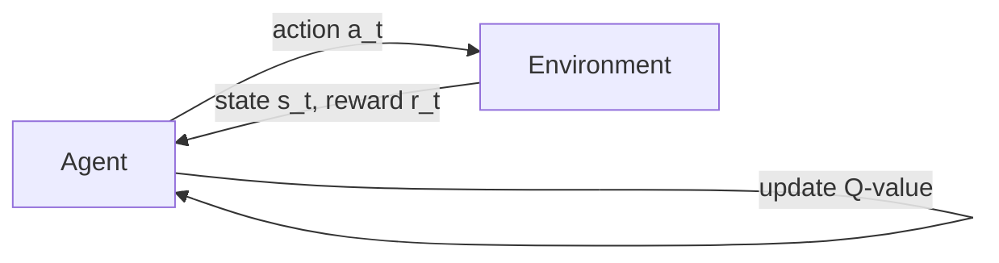

# Q-Learning原理与代码实例讲解

作者：禅与计算机程序设计艺术 / Zen and the Art of Computer Programming

## 1. 背景介绍

### 1.1 问题的由来

在人工智能和机器学习领域,强化学习(Reinforcement Learning)是一个非常重要且充满挑战的研究方向。强化学习旨在让智能体(Agent)通过与环境的交互,学习如何采取最优策略以获得最大的累积奖励。其中,Q-Learning 作为一种经典的无模型、离线策略强化学习算法,因其简洁高效的特点而备受关注。

### 1.2 研究现状

近年来,Q-Learning 在许多领域得到了广泛应用,如自动驾驶、智能控制、游戏AI、推荐系统等。众多研究者对Q-Learning算法进行了深入研究和改进,提出了Double Q-Learning、Dueling DQN等变体,极大地提升了算法的性能和稳定性。同时,将深度学习与Q-Learning相结合,也催生了一系列强大的深度强化学习算法,如DQN、DDPG等。

### 1.3 研究意义

深入理解和掌握Q-Learning算法原理,对于进一步研究强化学习、开发智能系统具有重要意义。通过剖析Q-Learning的数学模型和代码实现,可以加深对强化学习的理论认识,为算法改进和创新提供有力支撑。此外,Q-Learning思想也为其他机器学习和优化问题的求解提供了新的视角和思路。

### 1.4 本文结构

本文将全面系统地介绍Q-Learning算法,内容涵盖算法原理、数学模型、代码实现、应用实践等方面。第2节介绍Q-Learning的核心概念;第3节重点阐述Q-Learning算法原理和操作步骤;第4节给出Q-Learning的数学模型和公式推导;第5节提供Q-Learning的Python代码实现和详解;第6节讨论Q-Learning的实际应用场景;第7节推荐Q-Learning相关的学习资源;第8节总结全文,并展望Q-Learning的未来发展方向。

## 2. 核心概念与联系

在介绍Q-Learning算法之前,我们先来了解几个核心概念:

- 智能体(Agent):与环境交互的决策主体,根据当前状态采取行动,并获得即时奖励。
- 环境(Environment):智能体所处的世界,接收智能体的行动,并反馈下一个状态和奖励。 
- 状态(State):智能体在某个时刻对环境的感知。
- 行动(Action):智能体根据当前状态所采取的动作。
- 奖励(Reward):环境对智能体行动的即时反馈,用于评估行动的好坏。
- 策略(Policy):将状态映射到行动的函数,决定智能体在每个状态下应该采取的行动。
- 价值(Value):衡量状态或状态-行动对的长期累积奖励。

Q-Learning的核心思想是:通过不断与环境交互,学习状态-行动值函数Q(s,a),使得在每个状态下选择Q值最大的行动,最终获得最优策略。Q值反映了在状态s下采取行动a的长期价值,考虑了当前即时奖励和未来累积奖励。

## 3. 核心算法原理 & 具体操作步骤

### 3.1 算法原理概述

Q-Learning通过值迭代的方式,不断更新状态-行动值函数Q(s,a),直到收敛到最优值函数Q*。Q-Learning的更新公式为:

$$
Q(s_t,a_t) \leftarrow Q(s_t,a_t)+\alpha[r_t+\gamma \max_{a}Q(s_{t+1},a)-Q(s_t,a_t)]
$$

其中,$s_t$和$a_t$分别表示t时刻的状态和行动,$r_t$为即时奖励,$\alpha$为学习率,$\gamma$为折扣因子。该公式表明,Q值的更新由两部分组成:当前Q值和时间差分(TD)误差。TD误差衡量了当前Q值和基于下一状态最大Q值的目标值之间的差异,引导Q值向最优值逼近。

### 3.2 算法步骤详解

Q-Learning的具体步骤如下:

1. 初始化Q表,对于所有状态-行动对,令Q(s,a)=0。
2. 重复以下步骤,直到Q值收敛或达到最大训练轮数:
   - 初始化状态 $s_t$
   - 重复以下步骤,直到达到终止状态:
     - 根据 $\epsilon$-greedy 策略选择行动 $a_t$,即以 $\epsilon$ 的概率随机选择行动,否则选择Q值最大的行动。
     - 执行行动 $a_t$,观察奖励 $r_t$ 和下一状态 $s_{t+1}$
     - 根据Q-Learning更新公式更新 $Q(s_t,a_t)$
     - $s_t \leftarrow s_{t+1}$
3. 返回最终学到的Q表和最优策略 $\pi^*$,其中 $\pi^*(s)=\arg\max_a Q(s,a)$

### 3.3 算法优缺点

Q-Learning的主要优点包括:
- 简单易实现,且有理论收敛性保证。
- 通过离线学习,可以利用历史经验数据,提高样本效率。
- 无需知道环境模型,对环境的依赖性小。

Q-Learning的缺点包括:
- 对状态-行动空间的枚举,在大规模问题上难以应用。
- 难以处理连续状态和行动空间。
- 收敛速度慢,需要大量的训练数据和时间。

### 3.4 算法应用领域

Q-Learning在许多领域得到了成功应用,例如:
- 自动驾驶:通过Q-Learning,智能车辆可学习如何在复杂道路环境中做出最优决策,如变道、超车、避障等。
- 智能控制:Q-Learning可用于求解各类最优控制问题,如机器人运动规划、电梯调度、信号控制等。
- 游戏AI:许多棋类、策略类游戏的AI设计都用到了Q-Learning,代表性的如AlphaGo。
- 推荐系统:将推荐问题建模为MDP,通过Q-Learning可以学习最优的推荐策略。

## 4. 数学模型和公式 & 详细讲解 & 举例说明

### 4.1 数学模型构建

Q-Learning算法可以用马尔可夫决策过程(MDP)来描述。一个MDP由以下元素组成:

- 状态空间 $\mathcal{S}$,包含所有可能的状态 s。
- 行动空间 $\mathcal{A}$,包含所有可能的行动 a。
- 状态转移概率 $\mathcal{P}_{ss'}^a=P(s_{t+1}=s'|s_t=s,a_t=a)$,表示在状态s下执行行动a后转移到状态s'的概率。
- 奖励函数 $\mathcal{R}_s^a=E[r_t|s_t=s,a_t=a]$,表示在状态s下执行行动a获得的期望即时奖励。
- 折扣因子 $\gamma \in [0,1]$,表示未来奖励的衰减程度。

在MDP中,智能体与环境交互的过程可以用the following mermaid图表示:



### 4.2 公式推导过程

Q-Learning的目标是学习最优的状态-行动值函数 $Q^*(s,a)$,它满足Bellman最优方程:

$$
Q^*(s,a)=\mathcal{R}_s^a+\gamma \sum_{s' \in \mathcal{S}} \mathcal{P}_{ss'}^a \max_{a'} Q^*(s',a')
$$

然而,Q-Learning作为无模型方法,并不知道状态转移概率 $\mathcal{P}$ 和奖励函数 $\mathcal{R}$。因此,Q-Learning利用采样的方式逼近最优Q函数。考虑到 $\max_{a'}Q(s',a')$ 是 $Q^*(s',a')$ 的无偏估计,Q-Learning的更新公式可以推导如下:

$$
\begin{aligned}
Q(s_t,a_t) & \leftarrow Q(s_t,a_t)+\alpha[r_t+\gamma \max_{a}Q(s_{t+1},a)-Q(s_t,a_t)] \\
& =Q(s_t,a_t)+\alpha[r_t+\gamma \max_{a}Q(s_{t+1},a)-(\mathcal{R}_s^a+\gamma \sum_{s' \in \mathcal{S}} \mathcal{P}_{ss'}^a \max_{a'} Q(s',a'))] \\
& \approx Q(s_t,a_t)+\alpha[(\mathcal{R}_s^a+\gamma \max_{a}Q(s_{t+1},a))-Q(s_t,a_t)] \\
& =Q(s_t,a_t)+\alpha[target-Q(s_t,a_t)]
\end{aligned}
$$

其中,我们用单个样本 $r_t+\gamma \max_{a}Q(s_{t+1},a)$ 来逼近 $\mathcal{R}_s^a+\gamma \sum_{s' \in \mathcal{S}} \mathcal{P}_{ss'}^a \max_{a'} Q(s',a')$,即用单步TD目标值 $r_t+\gamma \max_{a}Q(s_{t+1},a)$ 来更新当前Q值。

### 4.3 案例分析与讲解

下面我们以一个简单的迷宫游戏为例,说明Q-Learning算法的工作流程。如下图所示,智能体的目标是从起点S出发,尽快到达终点G。

```
+---+---+---+
| S |   |   |
+---+---+---+
|   | X |   |
+---+---+---+
|   |   | G |
+---+---+---+
```

- 状态空间 $\mathcal{S}=\{(0,0),(0,1),(0,2),(1,0),(1,2),(2,0),(2,1),(2,2)\}$,其中(1,1)为障碍物。
- 行动空间 $\mathcal{A}=\{up,down,left,right\}$,分别表示向上、下、左、右移动。
- 奖励函数:到达终点G的奖励为+10,撞到障碍物的奖励为-5,其他情况奖励为-1。
- 折扣因子 $\gamma=0.9$,学习率 $\alpha=0.1$。

根据Q-Learning算法,我们初始化一个$8 \times 4$的Q表,用于存储每个状态-行动对的Q值。接着,智能体开始与环境交互:

1. 初始化状态为(0,0)。
2. 根据 $\epsilon$-greedy 策略($\epsilon=0.1$)选择一个行动,如向右。
3. 执行行动,到达新状态(0,1),获得奖励-1。
4. 根据Q-Learning更新公式更新Q((0,0),right):
   
   $Q((0,0),right) \leftarrow Q((0,0),right)+0.1[-1+0.9*\max_{a}Q((0,1),a)-Q((0,0),right)]$

5. 重复步骤2-4,直到到达终点G。

随着训练的进行,智能体逐渐学会了最优策略:右 → 下 → 下 → 右,最短路径到达目标。

### 4.4 常见问题解答

**Q: Q-Learning能否处理连续状态和行动空间?**

A: 原始的Q-Learning只能处理离散的状态和行动空间。对于连续空间,一般需要引入函数逼近,如将Q函数近似为线性函数或神经网络,代表性算法如DQN。此外,也可以对状态和行动进行离散化,将连续空间转化为离散空间。

**Q: Q-Learning能否学习随机策略?**

A: Q-Learning收敛到的是确定性策略,即在每个状态下选择Q值最大的行动。如果要学习随机策略,可以考虑使用Actor-Critic等基于策略梯度的算法。

**Q: 如何提高Q-Learning的训练效率?**

A: 可以从以下几个方面来提升Q-Learning的训练效率:
1. 经验回放:将历史的转移样本(s,a,r,s')存入回放缓冲区,之后从中随机抽取小批量样本进行训练,打破了数据的相关性。
2. 目标网络:构建两个结构相同的Q网络,其中目标网络的参数定期从估计网络复制而来,用于计算TD目标值,提高