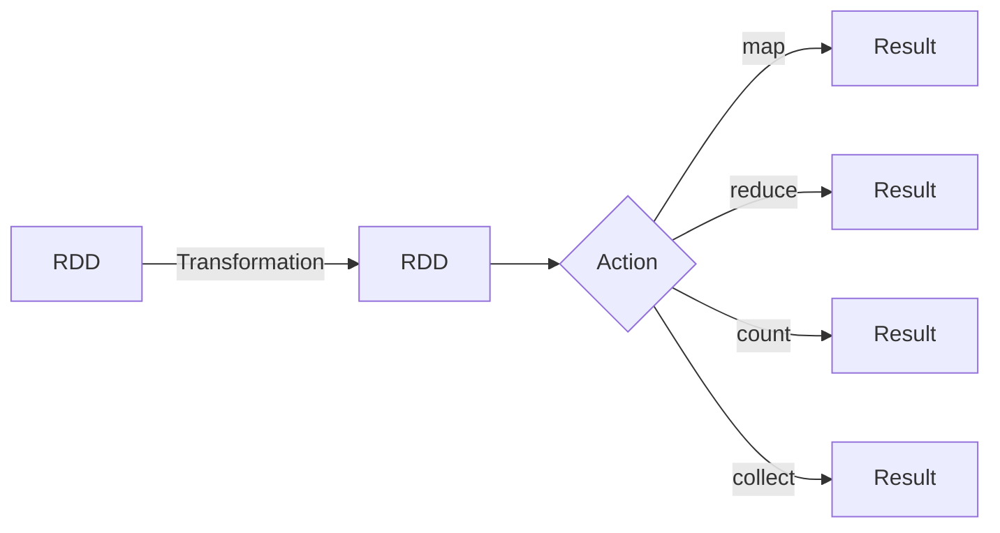

# RDD 原理与代码实例讲解

## 1. 背景介绍

### 1.1 问题的由来

在大数据时代，海量数据的存储和处理成为了一个巨大的挑战。传统的数据处理方式已经无法满足现代应用的需求,因此出现了一种新的大数据处理范式:弹性分布式数据集(Resilient Distributed Dataset,RDD)。RDD是Apache Spark核心抽象,用于在大规模计算机集群上并行处理数据。

### 1.2 研究现状

Apache Spark作为一种新兴的大数据处理框架,凭借其高效、通用和易于使用的特点,已经在学术界和工业界广泛应用。RDD作为Spark的核心数据结构,为大规模数据处理提供了强大的功能支持。目前,已有大量研究致力于探索RDD的原理、优化和应用。

### 1.3 研究意义

深入理解RDD的原理对于充分利用Spark进行大数据处理至关重要。通过掌握RDD的核心概念、算法和实现细节,可以更好地设计和优化Spark应用程序,提高数据处理效率和可靠性。此外,研究RDD还有助于推动大数据处理技术的发展,为解决更多实际问题提供新的思路和方法。

### 1.4 本文结构

本文将全面介绍RDD的原理和实现细节。首先阐述RDD的核心概念和与其他数据结构的联系;然后深入探讨RDD的核心算法原理和操作步骤;接着详细讲解RDD相关的数学模型和公式,并给出实例分析;随后提供RDD的代码实例和详细解释;最后讨论RDD的实际应用场景、工具资源推荐,并总结RDD的发展趋势和面临的挑战。

## 2. 核心概念与联系

RDD(Resilient Distributed Dataset)是Spark中最核心的数据抽象,它是一个不可变、分区的记录集合,可以并行操作。RDD具有以下几个关键特性:

1. **不可变性(Immutable)**: RDD中的数据是只读的,不能直接修改。任何对RDD的转换操作都会生成一个新的RDD。这种不可变性使得RDD具有良好的容错性,可以自动从故障中恢复。

2. **分区(Partitioned)**: RDD中的数据被划分为多个分区,每个分区存储在集群中的不同节点上。这种分区机制使得RDD可以高效地进行并行计算。

3. **延迟计算(Lazy Evaluation)**: RDD的转换操作是延迟计算的,只有在需要计算结果时才会真正执行。这种延迟计算可以减少不必要的计算,提高效率。

4. **容错性(Fault-Tolerant)**: RDD通过记录血统(Lineage)信息来实现容错,可以自动从故障中恢复,保证计算的可靠性。

5. **可缓存(Cacheable)**: RDD可以选择性地将中间结果缓存在内存中,以加速后续的计算。

RDD与其他数据结构的关系:

- **RDD与分布式共享内存(Distributed Shared Memory)**: 与分布式共享内存不同,RDD是一种分布式不可变数据结构,更加灵活和容错。

- **RDD与MapReduce**: RDD提供了比MapReduce更丰富的操作,如filter、join等,并支持更多的数据类型,如Python对象等。RDD还支持流式计算和交互式查询。

- **RDD与Dstream**: Dstream是Spark Streaming中的数据抽象,用于处理实时流数据。Dstream本质上是一系列不断追加的RDD。

- **RDD与DataFrame/Dataset**: DataFrame/Dataset是Spark SQL中的数据抽象,提供了结构化的数据视图。它们内部实现是基于RDD的。



上图展示了RDD的基本工作流程。通过一系列转换(Transformation)操作,如map、filter等,可以从一个RDD生成新的RDD。最终通过行动(Action)操作,如reduce、count、collect等,可以从RDD中获取计算结果。

## 3. 核心算法原理 & 具体操作步骤

### 3.1 算法原理概述

RDD的核心算法原理是基于**有向无环图(DAG)模型**和**血统记录(Lineage)**实现的。当创建一个RDD时,Spark会记录下它的转换操作血统,形成一个DAG。如果RDD的某个分区数据出现丢失,Spark可以根据血统重新计算并恢复该分区的数据。

RDD的计算过程可以概括为以下几个步骤:

1. **创建初始RDD**: 从外部数据源(如HDFS、HBase等)或驱动程序中的集合创建初始RDD。

2. **记录血统**: 对RDD进行转换操作(如map、filter等)时,Spark会记录下操作的血统信息,形成一个DAG。

3. **划分任务**: 当需要计算RDD时,Spark会根据RDD的分区情况,将计算任务划分为多个小任务,分发到不同的Executor上并行执行。

4. **计算分区**: 每个小任务会计算RDD的一个或多个分区,生成新的RDD分区。

5. **容错机制**: 如果某个分区数据丢失,Spark会根据血统信息重新计算该分区。

6. **持久化**: 可选择将RDD的中间结果持久化到内存或磁盘,以加速后续的计算。

### 3.2 算法步骤详解

1. **创建初始RDD**

   初始RDD可以从外部数据源(如HDFS、HBase等)或驱动程序中的集合创建。例如,从HDFS文件创建RDD:

   ```scala
   val textFile = sc.textFile("hdfs://...")
   ```

   或者从驱动程序的集合创建RDD:

   ```scala
   val parallelizedRDD = sc.parallelize(List(1,2,3,4,5))
   ```

2. **记录血统**

   对RDD进行转换操作时,Spark会记录下操作的血统信息,形成一个DAG。例如,对textFile RDD执行map和filter操作:

   ```scala
   val wordRDD = textFile.flatMap(line => line.split(" "))
   val filteredRDD = wordRDD.filter(word => word.contains("spark"))
   ```

   Spark会记录下`flatMap`和`filter`操作的血统,形成一个DAG。

3. **划分任务**

   当需要计算RDD时,Spark会根据RDD的分区情况,将计算任务划分为多个小任务,分发到不同的Executor上并行执行。例如,对filteredRDD执行count操作:

   ```scala
   val count = filteredRDD.count()
   ```

   Spark会将count操作划分为多个小任务,分发到不同的Executor上并行执行。

4. **计算分区**

   每个小任务会计算RDD的一个或多个分区,生成新的RDD分区。例如,在执行count操作时,每个小任务会计算filteredRDD的一个分区中包含"spark"单词的数量。

5. **容错机制**

   如果某个分区数据丢失,Spark会根据血统信息重新计算该分区。例如,如果filteredRDD的某个分区数据丢失,Spark会从wordRDD重新计算该分区,然后应用filter操作,从而恢复丢失的分区数据。

6. **持久化**

   可以选择将RDD的中间结果持久化到内存或磁盘,以加速后续的计算。例如,可以将wordRDD持久化到内存:

   ```scala
   wordRDD.cache()
   ```

   这样,在后续的计算中,wordRDD就可以直接从内存中读取,而不需要重新计算。

### 3.3 算法优缺点

**优点**:

- **容错性强**: 通过记录血统信息,RDD可以自动从故障中恢复,保证计算的可靠性。

- **延迟计算**: RDD的转换操作是延迟计算的,只有在需要计算结果时才会真正执行,可以减少不必要的计算,提高效率。

- **支持多种数据源**: RDD可以从多种数据源(如HDFS、HBase等)创建,支持各种数据格式。

- **支持丰富的操作**: RDD提供了丰富的转换操作(如map、filter、join等)和行动操作(如reduce、count等),可以满足各种计算需求。

**缺点**:

- **不支持细粒度更新**: RDD是不可变的,不支持对数据进行细粒度的更新操作,需要重新计算整个RDD。

- **内存开销较大**: RDD需要存储血统信息,对内存的开销较大,尤其是对于大型DAG。

- **延迟计算可能导致stragglers**: 由于RDD的延迟计算特性,可能会导致某些慢任务(stragglers)拖慢整个作业的执行。

- **不支持增量计算**: RDD不支持增量计算,每次计算都需要从头开始,对于迭代式计算可能效率较低。

### 3.4 算法应用领域

RDD作为Spark的核心数据结构,可以应用于多个领域,包括但不限于:

- **大数据处理**: RDD可以高效地处理TB甚至PB级别的大数据,是大数据处理的核心工具之一。

- **机器学习**: Spark MLlib库基于RDD实现,可以用于大规模机器学习任务,如分类、聚类、推荐系统等。

- **图计算**: Spark GraphX库基于RDD实现,可以用于大规模图计算任务,如PageRank、三角形计数等。

- **流式计算**: Spark Streaming基于RDD实现,可以用于实时流式数据处理,如日志分析、在线机器学习等。

- **SQL查询**: Spark SQL基于RDD实现,可以对结构化数据进行SQL查询。

总的来说,RDD作为一种通用的分布式数据结构,可以广泛应用于需要大规模数据处理的各个领域。

## 4. 数学模型和公式 & 详细讲解 & 举例说明

### 4.1 数学模型构建

为了更好地理解RDD的原理和实现,我们可以构建一个数学模型来描述RDD的计算过程。

假设有一个RDD $R$,它由$n$个分区$\{P_1, P_2, \dots, P_n\}$组成,每个分区包含一组记录。我们定义RDD $R$ 为一个有向无环图(DAG) $G=(V, E)$,其中:

- $V$ 是图 $G$ 中的节点集合,每个节点 $v_i \in V$ 表示一个RDD分区 $P_i$。
- $E$ 是图 $G$ 中的边集合,每条边 $e_{ij} \in E$ 表示分区 $P_i$ 依赖于分区 $P_j$ 的计算结果。

对于任意一个RDD转换操作 $f$,我们可以定义一个函数 $\Phi_f: V \rightarrow V'$,将原RDD $R$ 中的每个节点 $v_i$ 映射到新RDD $R'$ 中的节点 $v_i'$。这个映射函数 $\Phi_f$ 就描述了转换操作 $f$ 对RDD的作用。

例如,对于 `map` 操作,我们可以定义映射函数:

$$
\Phi_{\text{map}}(v_i) = \{f(x) | x \in P_i\}
$$

其中 $f$ 是 `map` 操作中指定的函数。

类似地,对于 `filter` 操作,我们可以定义映射函数:

$$
\Phi_{\text{filter}}(v_i) = \{x \in P_i | p(x) = \text{true}\}
$$

其中 $p$ 是 `filter` 操作中指定的谓词函数。

通过组合多个映射函数,我们可以描述任意一系列RDD转换操作的计算过程。例如,对于一个RDD执行 `map` 和 `filter` 操作:

$$
R' = \Phi_{\text{filter}} \circ \Phi_{\text{map}}(R)
$$

这个数学模型为我们分析和优化RDD的计算过程提供了理论基础。

### 4.2 公式推导过程

在上一节中,我们定义了RDD的数学模型,并给出了 `map` 和 `filter` 操作的映射函数。接下来,我们将推导一些常见RDD操作的公式,以更好地理解它们的计算过程。

1. **Union 操作**

   `union` 操作用于将两个RDD合并为一个新的RDD。我们可以定义 `union` 操