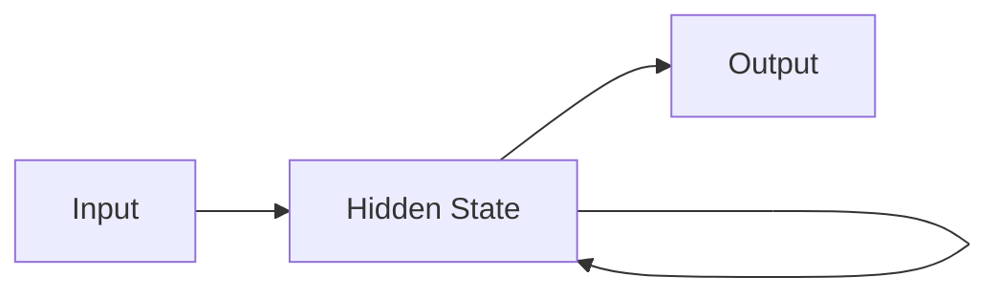
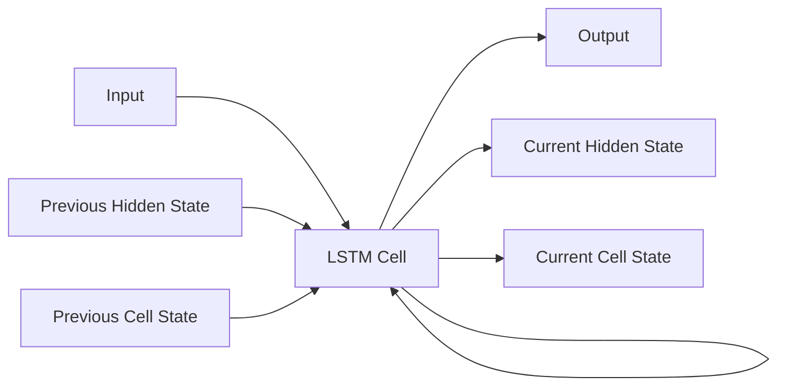
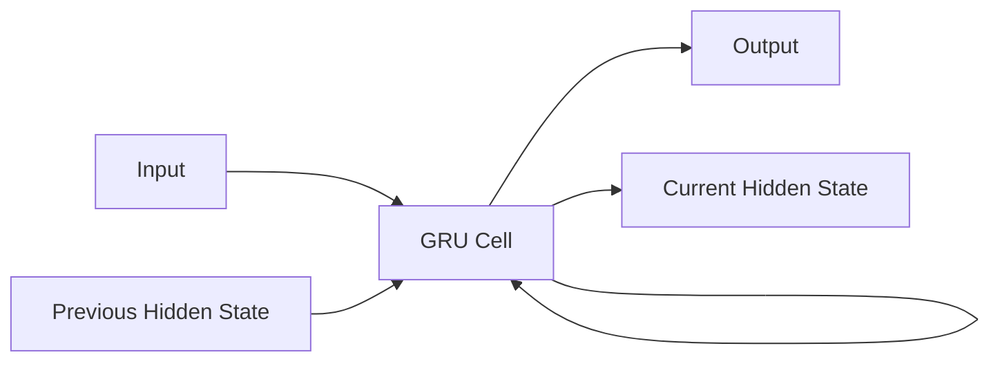

# Recurrent Neural Networks 原理与代码实战案例讲解

关键词：循环神经网络、RNN、长短期记忆网络、LSTM、时间序列、自然语言处理、Tensorflow、Keras

## 1. 背景介绍
### 1.1 问题的由来
在机器学习和人工智能领域,很多问题都涉及到序列数据的处理,如自然语言处理、语音识别、时间序列预测等。传统的前馈神经网络难以有效地处理这类数据,因为它们无法捕捉数据中的时序依赖关系。为了解决这一问题,循环神经网络(Recurrent Neural Networks, RNN)应运而生。

### 1.2 研究现状 
RNN自上世纪80年代提出以来,经历了长期的发展和演进。传统的RNN存在梯度消失和梯度爆炸问题,限制了其处理长序列数据的能力。为了克服这些问题,研究者们提出了长短期记忆网络(Long Short-Term Memory, LSTM)和门控循环单元(Gated Recurrent Unit, GRU)等改进模型。近年来,RNN及其变体在自然语言处理、语音识别、图像描述等领域取得了显著成果,成为了处理序列数据的主流方法之一。

### 1.3 研究意义
深入研究RNN的原理和应用,对于推动人工智能技术的发展具有重要意义。一方面,RNN为处理序列数据提供了有效的解决方案,拓展了机器学习的应用范围。另一方面,RNN的研究也促进了对人类认知机制的探索和理解,为认知科学和神经科学研究提供了新的视角。此外,掌握RNN的原理和实现,也是每个AI从业者必备的基本功之一。

### 1.4 本文结构
本文将全面介绍RNN的原理、变体、应用和实现。第2节介绍RNN的核心概念;第3节讲解RNN的计算过程和训练算法;第4节介绍RNN的数学模型和公式推导;第5节通过代码实例讲解RNN的实现;第6节总结RNN的应用场景;第7节推荐RNN相关的学习资源;第8节展望RNN的未来发展趋势和挑战;第9节为常见问题解答。

## 2. 核心概念与联系
RNN是一类用于处理序列数据的神经网络模型。与前馈神经网络不同,RNN引入了循环连接,使得网络能够记忆之前的信息,从而更好地处理序列数据。RNN主要由三个部分组成:输入层、隐藏层和输出层。其中,隐藏层负责记忆和传递序列信息,是RNN的核心。

在RNN中,每个时间步都有一个隐藏状态,用于记录之前的信息。当前时间步的隐藏状态由当前输入和前一时间步的隐藏状态共同决定。这种循环连接使得RNN能够捕捉序列数据中的长距离依赖关系。然而,这也导致了RNN难以训练的问题,即梯度消失和梯度爆炸。为了解决这些问题,研究者提出了LSTM和GRU等改进模型。

LSTM引入了门控机制来控制信息的流动,包括输入门、遗忘门和输出门。这些门控机制使得LSTM能够选择性地记忆和遗忘信息,从而更好地捕捉长距离依赖关系。GRU是LSTM的一种简化变体,它合并了输入门和遗忘门,减少了参数数量,但仍然保持了LSTM的主要优点。

下图展示了RNN、LSTM和GRU的结构示意图:







## 3. 核心算法原理 & 具体操作步骤
### 3.1 算法原理概述
RNN的核心是隐藏状态的更新和传递。在每个时间步,RNN接收一个输入,并结合前一时间步的隐藏状态,计算当前时间步的隐藏状态和输出。这个过程可以用以下公式表示:

$$
h_t = f(Ux_t + Wh_{t-1} + b) \\
y_t = g(Vh_t + c)
$$

其中,$h_t$表示第$t$个时间步的隐藏状态,$x_t$表示第$t$个时间步的输入,$y_t$表示第$t$个时间步的输出。$U$、$W$、$V$是权重矩阵,$b$和$c$是偏置项。$f$和$g$是激活函数,通常选择tanh或sigmoid函数。

### 3.2 算法步骤详解
RNN的训练过程通常采用反向传播算法(Backpropagation Through Time, BPTT)。具体步骤如下:

1. 前向传播:按时间顺序,依次计算每个时间步的隐藏状态和输出。
2. 损失计算:根据输出和真实标签计算损失函数。
3. 反向传播:按时间逆序,依次计算每个时间步的梯度,并将梯度传递到前一时间步。
4. 参数更新:使用梯度下降法更新模型参数。
5. 重复步骤1-4,直到模型收敛或达到预定的迭代次数。

需要注意的是,由于RNN存在梯度消失和梯度爆炸问题,在实践中通常需要采取一些措施,如梯度裁剪、权重初始化、使用LSTM或GRU等改进模型。

### 3.3 算法优缺点
RNN的主要优点包括:

1. 能够处理任意长度的序列数据。
2. 能够捕捉序列数据中的长距离依赖关系。
3. 参数共享,训练效率高。

RNN的主要缺点包括:

1. 训练难度大,容易出现梯度消失和梯度爆炸问题。
2. 难以并行化,训练速度慢。
3. 对长序列的记忆能力有限。

### 3.4 算法应用领域
RNN广泛应用于各种涉及序列数据的领域,如:

1. 自然语言处理:语言模型、机器翻译、情感分析等。
2. 语音识别:声学模型、语言模型等。
3. 时间序列预测:股票预测、天气预测、销量预测等。
4. 图像描述:根据图像生成文字描述。
5. 推荐系统:基于用户行为序列的推荐。

## 4. 数学模型和公式 & 详细讲解 & 举例说明
### 4.1 数学模型构建
RNN可以看作一个映射函数,将输入序列映射到输出序列:

$$
y_1, y_2, ..., y_T = RNN(x_1, x_2, ..., x_T)
$$

其中,$x_1, x_2, ..., x_T$是输入序列,$y_1, y_2, ..., y_T$是输出序列。RNN通过循环连接,在每个时间步引入隐藏状态$h_t$来记忆之前的信息:

$$
h_t = f(Ux_t + Wh_{t-1} + b) \\
y_t = g(Vh_t + c)
$$

其中,$f$和$g$通常选择非线性激活函数,如tanh或sigmoid:

$$
tanh(x) = \frac{e^x - e^{-x}}{e^x + e^{-x}} \\
sigmoid(x) = \frac{1}{1 + e^{-x}}
$$

### 4.2 公式推导过程
为了训练RNN,我们需要计算损失函数对各个参数的梯度。以均方误差损失函数为例:

$$
L = \frac{1}{T}\sum_{t=1}^T(y_t - \hat{y}_t)^2
$$

其中,$\hat{y}_t$是第$t$个时间步的真实输出。根据链式法则,我们可以推导出损失函数对隐藏状态的梯度:

$$
\frac{\partial L}{\partial h_t} = \frac{\partial L}{\partial y_t}\frac{\partial y_t}{\partial h_t} + \frac{\partial L}{\partial h_{t+1}}\frac{\partial h_{t+1}}{\partial h_t}
$$

进一步,我们可以推导出损失函数对权重矩阵$U$、$W$、$V$的梯度:

$$
\frac{\partial L}{\partial U} = \sum_{t=1}^T\frac{\partial L}{\partial h_t}\frac{\partial h_t}{\partial U} \\
\frac{\partial L}{\partial W} = \sum_{t=1}^T\frac{\partial L}{\partial h_t}\frac{\partial h_t}{\partial W} \\
\frac{\partial L}{\partial V} = \sum_{t=1}^T\frac{\partial L}{\partial y_t}\frac{\partial y_t}{\partial V}
$$

有了这些梯度,我们就可以使用梯度下降法来更新模型参数:

$$
U := U - \alpha\frac{\partial L}{\partial U} \\
W := W - \alpha\frac{\partial L}{\partial W} \\
V := V - \alpha\frac{\partial L}{\partial V}
$$

其中,$\alpha$是学习率。

### 4.3 案例分析与讲解
考虑一个简单的二进制加法问题。给定两个二进制数(如"101"和"011"),要求输出它们的和(即"1000")。我们可以使用RNN来解决这个问题。

首先,我们将二进制数转换为向量序列。例如,"101"转换为$[1, 0, 1]$,"011"转换为$[0, 1, 1]$。然后,我们将这两个向量序列作为RNN的输入,期望RNN输出它们的和$[1, 0, 0, 0]$。

在训练过程中,RNN会学习如何在每个时间步记忆进位信息,并根据当前输入和进位计算当前位的和。经过足够的训练,RNN就能够正确地执行二进制加法运算。

这个例子说明了RNN处理序列数据和记忆历史信息的能力。类似地,RNN还可以应用于更加复杂的序列问题,如自然语言处理和时间序列预测。

### 4.4 常见问题解答
1. 梯度消失和梯度爆炸问题如何解决?
   
   可以采取以下措施:
   - 使用LSTM或GRU等改进模型,引入门控机制缓解梯度问题。
   - 使用梯度裁剪(Gradient Clipping)限制梯度的范围。
   - 合理初始化权重矩阵,如使用Xavier初始化或He初始化。
   - 使用残差连接(Residual Connection)缓解梯度问题。

2. 如何处理可变长度的序列?
   
   可以使用以下方法:
   - 对序列进行填充(Padding),使所有序列长度相同。
   - 使用掩码(Mask)标记序列的有效长度。
   - 使用动态RNN(Dynamic RNN)根据序列长度动态调整计算图。

3. 如何加速RNN的训练?
   
   可以采取以下措施:
   - 使用批量训练(Batch Training)提高并行效率。
   - 使用截断反向传播(Truncated BPTT)减少梯度计算量。
   - 使用GPU加速矩阵运算。
   - 使用模型压缩技术,如量化(Quantization)、剪枝(Pruning)等。

## 5. 项目实践：代码实例和详细解释说明
### 5.1 开发环境搭建
本节我们将使用Python和Tensorflow搭建RNN的开发环境。首先,安装Python和Tensorflow:

```bash
# 安装Python
sudo apt-get install python3

# 安装Tensorflow
pip install tensorflow
```

接下来,导入所需的库:

```python
import tensorflow as tf
import numpy as np
```

### 5.2 源代码详细实现
我们将使用Tensorflow实现一个简单的RNN,用于解决二进制加法问题。首先,定义模型参数:

```python
input_size = 2
hidden_size = 16
output_size = 1
learning_rate = 0.01
```

然后,构建RNN模型:

```python
model = tf.keras.Sequential([
    tf.keras.layers.SimpleRNN(hidden_size, input_shape=(None, input_size)),
    tf.keras.layers.Dense(output_size, activation='sigmoid')
])

model.compile(optimizer=tf.keras.optimizers.Adam(learning_rate),
              loss='binary_crossentropy',
              metrics