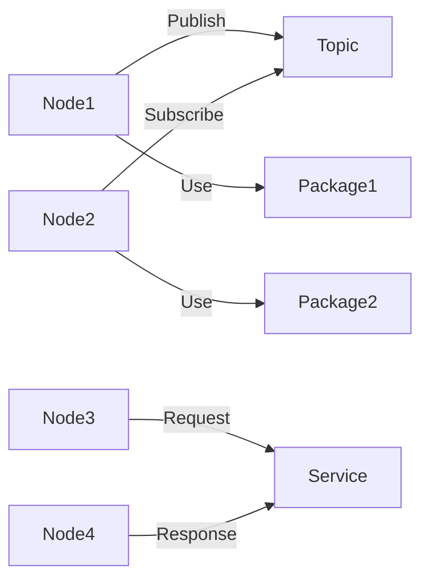

# Robot Operating System (ROS) 原理与代码实战案例讲解

关键词：ROS, 机器人操作系统, 分布式, 消息通信, 节点, 话题, 服务, 动作, TF坐标变换, 实时性, 可移植性, 可扩展性

## 1. 背景介绍
### 1.1  问题的由来
随着机器人技术的快速发展,各种机器人系统和平台不断涌现。但是,不同机器人系统之间缺乏统一的标准和接口,导致机器人软件开发效率低下,代码难以复用。为了解决这一问题,Robot Operating System (ROS)应运而生。

### 1.2  研究现状 
ROS作为一个灵活的机器人软件开发框架,自2007年诞生以来得到了广泛应用。目前,ROS已经成为机器人领域事实上的标准平台,众多机器人厂商和研究机构都在基于ROS进行机器人应用开发。ROS社区也非常活跃,贡献了大量高质量的功能包。

### 1.3  研究意义
深入研究ROS的原理和应用,对于推动机器人软件平台的发展具有重要意义。一方面,ROS为机器人软件开发提供了一套标准化的架构和接口,大大提高了开发效率和代码复用性。另一方面,基于ROS可以方便地集成各种机器人硬件、传感器、算法库,加速机器人系统的开发和部署。

### 1.4  本文结构
本文将全面深入地探讨ROS的原理、架构和开发实践。第2节介绍ROS的核心概念和设计思想。第3节重点讲解ROS的通信机制。第4节介绍ROS常用的坐标系统和TF变换。第5节通过代码实例和案例,演示ROS编程的具体方法。第6节总结ROS在实际机器人系统中的应用。第7节推荐ROS相关的学习资源和开发工具。第8节展望ROS的未来发展趋势和挑战。

## 2. 核心概念与联系
ROS的核心概念包括:
- 节点(Node):ROS网络中的一个进程,负责执行具体的计算任务。
- 话题(Topic):节点间异步通信的渠道,以发布/订阅的方式工作。  
- 服务(Service):节点间同步通信的渠道,以请求/响应的方式工作。
- 消息(Message):节点间传递数据的格式,包括简单数据类型和自定义结构体。
- 功能包(Package):组织ROS代码和资源的基本单元。

下图展示了ROS的基本架构和各个概念之间的关系:



## 3. 核心算法原理 & 具体操作步骤
### 3.1  算法原理概述
ROS通信的核心是基于TCP/IP协议的分布式消息传递。ROS Master作为节点管理器,负责协调各个节点。节点之间通过XML-RPC在Master上注册和查询信息,获取通信对象的网络地址。然后节点之间直接采用TCP或UDP协议传输消息数据。

### 3.2  算法步骤详解
1. 启动ROS Master。
2. 节点向Master注册,声明自己的身份、发布的话题、订阅的话题、提供的服务等信息。  
3. 节点从Master获取通信对象的信息。
4. 对于话题通信,发布节点和订阅节点直接建立TCP连接,传输消息。
5. 对于服务通信,客户端节点发送请求到服务端节点,服务端处理后返回响应。

### 3.3  算法优缺点
ROS通信机制的优点是:
- 分布式:节点可以分布在不同主机,实现并行计算。
- 松耦合:发布方和订阅方解耦,不需要感知对方的存在。
- 灵活性:支持自定义消息类型,可以传输任意结构的数据。

缺点是:
- 实时性:ROS不是实时操作系统,无法保证消息传输的确定性延迟。
- 安全性:ROS默认不加密,容易受到网络攻击。

### 3.4  算法应用领域
ROS通信机制广泛应用于机器人系统的各个模块之间的数据交互,如:
- 传感器数据的采集和分发
- 运动控制指令的发送和执行
- 多机器人之间的协同和信息共享
- 人机交互信息的传递

## 4. 数学模型和公式 & 详细讲解 & 举例说明
### 4.1  数学模型构建
在机器人SLAM和导航中,需要准确表示和转换不同坐标系之间的位置关系。ROS使用TF(Transform)库来管理坐标变换。TF使用四元数和平移向量来描述刚体的位姿,定义如下:

- 四元数 $q=(x,y,z,w)$,满足 $x^2+y^2+z^2+w^2=1$
- 平移向量 $t=(t_x,t_y,t_z)$ 

则两个坐标系之间的变换关系可以用下面的变换矩阵表示:

$$
T=\left[ \begin{matrix} 
R & t\\ 
0 & 1
\end{matrix} \right]
$$

其中,旋转矩阵 $R$ 和四元数 $q$ 的关系为:

$$
R=\left[ \begin{matrix}
1-2(y^2+z^2) & 2(xy-zw) & 2(xz+yw)\\
2(xy+zw) & 1-2(x^2+z^2) & 2(yz-xw)\\
2(xz-yw) & 2(yz+xw) & 1-2(x^2+y^2)
\end{matrix} \right]
$$

### 4.2  公式推导过程
已知两个坐标系A和B,以及它们之间的变换关系 $T_{AB}$,求坐标系B到A的逆变换 $T_{BA}$。

由变换矩阵的定义可知:
$$T_{AB}=\left[ \begin{matrix} R_{AB} & t_{AB}\\ 0 & 1 \end{matrix} \right]$$

$$T_{BA}=\left[ \begin{matrix} R_{BA} & t_{BA}\\ 0 & 1 \end{matrix} \right]$$

由于旋转矩阵是正交矩阵,满足 $R^{-1}=R^T$,所以
$$R_{BA}=R_{AB}^T$$

平移向量的逆变换为:
$$t_{BA}=-R_{BA}t_{AB}=-R_{AB}^Tt_{AB}$$

因此,
$$T_{BA}=\left[ \begin{matrix} R_{AB}^T & -R_{AB}^Tt_{AB}\\ 0 & 1 \end{matrix} \right]$$

### 4.3  案例分析与讲解
假设机器人有两个坐标系:base_link和camera_link。已知base_link到camera_link的变换关系为:
- 平移向量 $t=(0.1,0.2,0.3)$
- 四元数 $q=(0,0,0.383,0.924)$

求camera_link到base_link的逆变换。

代入公式计算可得:

$$
R_{AB}=\left[ \begin{matrix}
0.707 & -0.707 & 0\\
0.707 & 0.707 & 0\\
0 & 0 & 1
\end{matrix} \right]
$$

$$t_{BA}=-R_{AB}^Tt_{AB}=(-0.1,-0.2,-0.3)$$

因此,camera_link到base_link的变换矩阵为:

$$
T_{BA}=\left[ \begin{matrix}
0.707 & 0.707 & 0 & -0.1\\
-0.707 & 0.707 & 0 & -0.2\\
0 & 0 & 1 & -0.3\\
0 & 0 & 0 & 1
\end{matrix} \right]
$$

### 4.4  常见问题解答
- 四元数和欧拉角的区别是什么?
  - 四元数没有万向锁问题,适合插值和球面线性插值。
  - 欧拉角表示直观,但有奇异性,不适合插值。
- 如何发布和订阅TF? 
  - 使用tf2_ros包的TransformBroadcaster类发布TF。
  - 使用tf2_ros包的TransformListener类订阅TF。
- 怎样查看TF树?
  - 使用rqt_tf_tree工具可以可视化查看当前的TF树。
  - 使用rosrun tf view_frames可以生成TF树的PDF文件。

## 5. 项目实践：代码实例和详细解释说明
### 5.1  开发环境搭建
首先需要安装ROS,可以参考ROS官网的安装教程。推荐使用Ubuntu系统和ROS Noetic版本。

创建一个ROS工作空间:
```bash
mkdir -p ~/catkin_ws/src
cd ~/catkin_ws/
catkin_make
```

然后创建一个功能包:
```bash
cd ~/catkin_ws/src
catkin_create_pkg my_pkg rospy std_msgs
```

### 5.2  源代码详细实现
下面通过一个简单的发布订阅例子,演示ROS编程的基本流程。

在功能包的src目录下创建talker.py文件,内容如下:

```python
#!/usr/bin/env python
import rospy
from std_msgs.msg import String

def talker():
    pub = rospy.Publisher('chatter', String, queue_size=10)
    rospy.init_node('talker', anonymous=True)
    rate = rospy.Rate(10) # 10hz
    while not rospy.is_shutdown():
        hello_str = "hello world %s" % rospy.get_time()
        rospy.loginfo(hello_str)
        pub.publish(hello_str)
        rate.sleep()

if __name__ == '__main__':
    try:
        talker()
    except rospy.ROSInterruptException:
        pass
```

在同一目录下创建listener.py文件:

```python
#!/usr/bin/env python
import rospy
from std_msgs.msg import String

def callback(data):
    rospy.loginfo(rospy.get_caller_id() + ' I heard %s', data.data)
    
def listener():
    rospy.init_node('listener', anonymous=True)
    rospy.Subscriber('chatter', String, callback)
    rospy.spin()

if __name__ == '__main__':
    listener()
```

### 5.3  代码解读与分析
talker.py文件实现了一个发布者节点,主要步骤如下:
1. 导入rospy和std_msgs包。
2. 定义一个发布者对象pub,发布名为chatter的话题,数据类型为String。
3. 初始化一个节点,名为talker。
4. 定义发布频率为10hz。
5. 在循环中发布消息,消息内容为字符串"hello world"加上当前时间。

listener.py文件实现了一个订阅者节点:
1. 导入rospy和std_msgs包。
2. 定义一个回调函数callback,打印接收到的消息。
3. 初始化一个节点,名为listener。  
4. 创建一个订阅者对象,订阅chatter话题,绑定callback回调函数。
5. 进入循环,等待话题消息。

可以看出,ROS编程的基本步骤就是:初始化节点、创建发布者/订阅者对象、发布/接收消息、进入事件循环。

### 5.4  运行结果展示
启动ROS Master:
```bash
roscore
```

运行发布者节点:
```bash
rosrun my_pkg talker.py
```

运行订阅者节点:
```bash
rosrun my_pkg listener.py
```

可以看到listener节点输出它接收到的消息:
```
[INFO] [1623667912.947332]: /listener_22873_1623667911795 I heard hello world 1623667912.947280
[INFO] [1623667913.047530]: /listener_22873_1623667911795 I heard hello world 1623667913.047471
...
```

说明话题通信成功实现。

## 6. 实际应用场景
ROS已经在众多机器人系统中得到应用,典型案例包括:
- PR2机器人:Willow Garage开发的研究型机器人,搭载了ROS系统,具备导航、操纵、感知等功能。
- Turtlebot:低成本的ROS移动机器人平台,用于教育和科研。
- ABB工业机器人:通过ROS-Industrial项目,实现ROS与工业机器人控制器的对接。
- Fetch机器人:Fetch Robotics公司的移动操纵机器人,应用于仓储物流领域。
- 无人驾驶汽车:ROS被广泛用于自动驾驶算法的开发和测试。

### 6.4  未来应用展望
随着机器人技术的进步,ROS将在更多领域得到应用,如:
- 服务机器人:医疗康复、家庭服务、教育