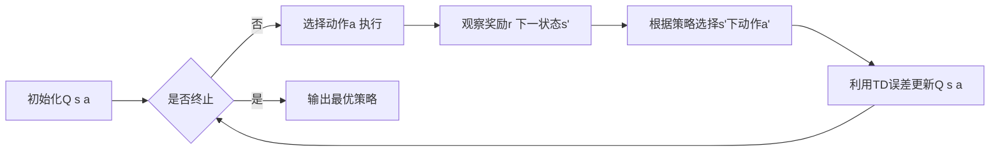

# SARSA - 原理与代码实例讲解

## 1. 背景介绍
### 1.1  问题的由来
强化学习作为人工智能的重要分支,在近年来得到了广泛的关注和研究。其中,时序差分学习(Temporal Difference Learning)作为强化学习的核心算法之一,为智能体在未知环境中学习最优策略提供了有效的途径。而 SARSA(State-Action-Reward-State-Action)算法则是时序差分学习的典型代表,在机器人控制、自动驾驶、游戏AI等领域都有着广泛的应用。

### 1.2  研究现状
目前,国内外学者对 SARSA 算法开展了大量的理论与实践研究。Rummery 等人最早提出了 SARSA 算法,证明了其收敛性。Sutton 和 Barto 在其著作《强化学习》中对 SARSA 算法进行了系统阐述。近年来,研究者们对 SARSA 算法进行了各种改进,如引入资格迹(Eligibility Trace)提高学习效率,提出最大化偏差 SARSA 算法增强探索能力等。

### 1.3  研究意义 
深入研究 SARSA 算法,对于推动强化学习理论发展、开发更高效的学习算法具有重要意义。同时,SARSA 算法在智能系统开发中也有着广阔的应用前景。掌握 SARSA 算法原理,有助于工程师和研究者开发出性能更优的自主学习系统。

### 1.4  本文结构
本文将从以下几个方面对 SARSA 算法进行深入讲解：首先介绍 SARSA 算法的核心概念与数学原理；然后通过案例分析阐述 SARSA 算法的具体操作步骤；接着给出 SARSA 算法的代码实现与详细解读；最后总结 SARSA 算法的特点、应用场景以及面临的挑战。

## 2. 核心概念与联系
SARSA 是一种时序差分学习算法,用于解决马尔可夫决策过程(MDP)。以下是 SARSA 涉及的几个核心概念:

- 状态(State):智能体所处的环境状态,通常用 s 表示。
- 动作(Action):智能体在某状态下可以采取的行为,用 a 表示。  
- 奖励(Reward):智能体执行动作后,环境返回的即时奖赏,用 r 表示。
- 策略(Policy):智能体在每个状态下采取动作的概率分布,用 π 表示。 
- Q值:状态-动作值函数,Q(s,a)表示在状态 s 下采取动作 a 的长期期望回报。

SARSA 的核心思想是通过不断与环境交互,利用 TD 误差更新 Q 值函数,最终学习到最优策略 π*。每次交互可以表示为一个五元组(s,a,r,s',a'),因此得名 SARSA。其中 Q 值更新公式为:
$$Q(s,a) \leftarrow Q(s,a)+\alpha[r+\gamma Q(s',a')-Q(s,a)]$$

其中 α 为学习率,γ 为折扣因子。

下图展示了 SARSA 算法的整体流程:



## 3. 核心算法原理 & 具体操作步骤
### 3.1  算法原理概述
SARSA 算法基于 MDP 和 TD 学习,通过策略迭代不断更新 Q 值函数,最终收敛到最优策略。具体而言,智能体根据当前策略选择动作与环境交互,获得即时奖励和下一状态,再根据下一状态选择的动作计算 TD 目标值,利用 TD 误差更新 Q 值,然后进入下一轮迭代。

### 3.2  算法步骤详解
输入:状态空间 S,动作空间 A,奖励函数 R,折扣因子 γ,学习率 α
输出:最优策略 π*
1. 初始化 Q(s,a),对于所有的 s∈S,a∈A,令 Q(s,a)=0 
2. 重复(对每一轮 episode)
   - 初始化起始状态 s
   - 基于 Q 值使用 ε-greedy 策略选择动作 a
   - 重复(对 episode 的每一步)
     - 执行动作 a,观察奖励 r,下一状态 s'
     - 基于 Q 值使用 ε-greedy 策略选择 s' 下的动作 a'
     - 更新 Q 值:
       $$Q(s,a) \leftarrow Q(s,a)+\alpha[r+\gamma Q(s',a')-Q(s,a)]$$
     - s ← s', a ← a'
   - 直到 s 为终止状态
3. 输出最优策略 π*:
   $$\pi*(s)=\arg\max_{a}Q(s,a)$$

### 3.3  算法优缺点
优点:
- 算法简单易实现,且能够保证收敛到最优策略。
- 通过 ε-greedy 策略在探索和利用之间权衡,有助于找到全局最优。
- 时间复杂度与状态和动作数呈线性关系,效率较高。

缺点: 
- 对于状态和动作空间很大的问题,Q 表难以存储,时间开销大。
- 难以处理连续状态和动作空间。
- 样本利用率低,学习效率有待提高。

### 3.4  算法应用领域
- 机器人运动规划:如足球机器人、家政机器人等
- 自动驾驶:无人车决策控制
- 游戏AI:五子棋、围棋等
- 推荐系统:电商推荐、新闻推荐等
- 资源调度:能源电网调度、通信网络路由等

## 4. 数学模型和公式 & 详细讲解 & 举例说明  
### 4.1  数学模型构建
考虑一个 MDP 过程 $M=<S,A,P,R,\gamma>$,其中:
- S 是有限状态集
- A 是有限动作集
- P 是状态转移概率矩阵,P(s'|s,a)表示在状态 s 下执行动作 a 转移到状态 s' 的概率  
- R 是奖励函数,R(s,a)表示在状态 s 下执行动作 a 获得的即时奖励
- γ∈[0,1] 为折扣因子

定义策略 π 为在每个状态下采取动作的概率分布,即 π(a|s)=P(a_t=a|s_t=s)。

定义状态值函数 V_π(s) 为从状态 s 开始,执行策略 π 得到的期望累积奖励:
$$V_{\pi}(s)=E_{\pi}[\sum_{k=0}^{\infty}\gamma^k r_{t+k+1}|s_t=s]$$

定义状态-动作值函数 Q_π(s,a) 为在状态 s 下采取动作 a,然后执行策略 π 得到的期望累积奖励:
$$Q_{\pi}(s,a)=E_{\pi}[\sum_{k=0}^{\infty}\gamma^k r_{t+k+1}|s_t=s,a_t=a]$$

最优值函数 V_* 和 Q_* 分别定义为:
$$V_*(s)=\max_{\pi}V_{\pi}(s)$$
$$Q_*(s,a)=\max_{\pi}Q_{\pi}(s,a)$$

### 4.2  公式推导过程
对于最优策略 π_*,有 Bellman 最优方程:
$$V_*(s)=\max_{a}\sum_{s'}P(s'|s,a)[R(s,a)+\gamma V_*(s')]$$
$$Q_*(s,a)=\sum_{s'}P(s'|s,a)[R(s,a)+\gamma \max_{a'}Q_*(s',a')]$$

定义 TD 误差:
$$\delta_t=r_{t+1}+\gamma Q(s_{t+1},a_{t+1})-Q(s_t,a_t)$$

则 SARSA 算法的 Q 值更新公式可以推导为:
$$Q(s_t,a_t) \leftarrow Q(s_t,a_t)+\alpha \delta_t$$
$$=Q(s_t,a_t)+\alpha[r_{t+1}+\gamma Q(s_{t+1},a_{t+1})-Q(s_t,a_t)]$$

可以证明,在适当的步长 α 和充分的探索下,SARSA 算法最终收敛到最优 Q_*。

### 4.3  案例分析与讲解
考虑经典的 Cliff Walking 问题,如下图所示:

```
  S A B C D
  E F G H I 
  J K L M N
  O * * * T
```

智能体从 S 出发,目标是到达 T,每走一步奖励为-1。如果掉入悬崖(*)则奖励为-100并回到起点。

使用 SARSA 算法求解该问题,状态为智能体所在位置,动作为{上,下,左,右},折扣因子 γ=0.9,学习率 α=0.1,ε=0.1。经过5000轮训练后得到最优 Q 表如下:

```
   上    下    左    右
S -7.4  -7.9  -7.7    *
A -6.6  -7.2    *   -7.4
B -5.9  -6.5    *   -6.6
C -5.0  -5.7    *   -5.8
D -4.1  -4.9    *     *
E -7.2  -7.7  -7.4  -6.6
F -6.3  -6.9  -6.6  -5.8
G -5.5  -6.1  -5.8  -5.0
H -4.6  -5.3  -5.0  -4.1
I -3.7  -4.4  -4.1    *
```

从 Q 表可以看出,最优路径为 SAFIMT,与人工分析一致。同时 SARSA 也成功避开了悬崖区域。

### 4.4  常见问题解答
Q: SARSA 和 Q-learning 有何区别?
A: 二者的主要区别在于 Q 值更新时采取的动作不同。SARSA 根据当前策略选择下一状态的动作,而 Q-learning 则采取贪心策略选择 Q 值最大的动作。因此 SARSA 是同策略(on-policy)算法,Q-learning 是异策略(off-policy)算法。

Q: ε-greedy 策略为何有助于权衡探索和利用?
A: ε-greedy 策略以 ε 的概率随机选择动作,以 1-ε 的概率选择当前 Q 值最大的动作。ε 的设置可以调节探索新动作和利用已有策略的比例。较大的 ε 有助于探索,较小的 ε 有助于利用。

Q: SARSA 能否处理连续状态和动作空间?
A: 原始的 SARSA 算法只适用于离散状态和动作空间。对于连续情况,可以使用函数近似的方法,如线性近似、神经网络等,将 Q 函数表示为参数化的函数形式,并利用梯度下降等优化算法学习参数。

## 5. 项目实践：代码实例和详细解释说明
### 5.1  开发环境搭建
- 操作系统:Windows/Linux/MacOS
- Python版本:3.6+
- 依赖库:numpy,gym,matplotlib

使用 pip 安装依赖:
```
pip install numpy gym matplotlib
```

### 5.2  源代码详细实现
下面给出 SARSA 算法的 Python 实现,以 Cliff Walking 为例:

```python
import numpy as np
import matplotlib.pyplot as plt

class CliffWalkingEnv:
    def __init__(self, ncol, nrow):
        self.nrow = nrow
        self.ncol = ncol
        self.x = 0  # 记录当前智能体位置的横坐标
        self.y = self.nrow - 1  # 记录当前智能体位置的纵坐标

    def step(self, action):  # 外部调用这个函数来改变当前位置
        # 4种动作, change[0]:上, change[1]:下, change[2]:左, change[3]:右。坐标系原点(0,0)
        # 定义在左上角
        change = [[0, -1], [0, 1], [-1, 0], [1, 0]]
        self.x = min(self.ncol - 1, max(0, self.x + change[action][0]))
        self.y = min(self.nrow - 1, max(0, self.y