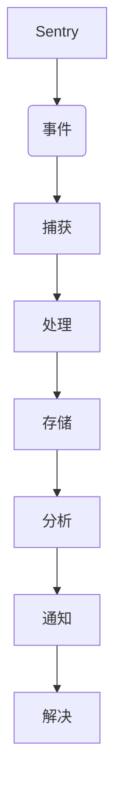

# Sentry原理与代码实例讲解

## 1. 背景介绍

### 1.1 问题的由来

在现代软件开发中,应用程序的复杂性与规模不断增长,导致了错误和异常情况的出现。这些错误不仅会影响用户体验,还可能导致数据丢失、安全漏洞等严重后果。因此,有效地监控、捕获和处理应用程序错误变得至关重要。传统的日志记录方式往往无法满足需求,因为它需要手动查看日志文件,效率低下且容易遗漏关键信息。

### 1.2 研究现状

为了解决这个问题,出现了许多错误监控和报告工具,如Sentry、Rollbar、Airbrake等。其中,Sentry是一款开源的应用程序监控平台,被广泛应用于各种规模的项目中。它能够自动捕获并报告应用程序中的错误,提供详细的错误信息、堆栈跟踪和上下文数据,从而帮助开发人员快速定位和解决问题。

### 1.3 研究意义

深入理解Sentry的原理和实现方式,对于提高应用程序的稳定性和可靠性至关重要。通过学习Sentry,开发人员可以掌握错误监控和报告的最佳实践,提高代码质量和用户体验。此外,Sentry还提供了丰富的集成和自定义功能,可以根据项目需求进行定制和扩展。

### 1.4 本文结构

本文将从以下几个方面详细介绍Sentry:

1. 核心概念与联系
2. 核心算法原理和具体操作步骤
3. 数学模型和公式详细讲解与案例分析
4. 项目实践:代码实例和详细解释说明
5. 实际应用场景
6. 工具和资源推荐
7. 总结:未来发展趋势与挑战
8. 附录:常见问题与解答

## 2. 核心概念与联系

Sentry的核心概念包括:

1. **事件(Event)**: 指应用程序中发生的错误、异常或其他需要监控的情况。事件包含了详细的上下文信息,如错误消息、堆栈跟踪、环境变量等。

2. **捕获(Capture)**: 指从应用程序中捕获事件的过程。Sentry提供了多种语言的SDK,可以seamlessly地集成到应用程序中,自动捕获事件。

3. **处理(Process)**: 指对捕获的事件进行处理和规范化的过程。Sentry会对事件进行去重、分组、添加元数据等操作,以便后续的存储和分析。

4. **存储(Store)**: 指将处理后的事件持久化存储的过程。Sentry支持多种存储后端,如PostgreSQL、MySQL、Redis等。

5. **分析(Analyze)**: 指对存储的事件数据进行分析和可视化的过程。Sentry提供了强大的查询和图表功能,帮助开发人员快速定位和诊断问题。

6. **通知(Notify)**: 指根据配置的规则,将关键事件通知给相关人员的过程。Sentry支持多种通知渠道,如电子邮件、Slack、PagerDuty等。

7. **解决(Resolve)**: 指根据Sentry提供的信息,修复应用程序中的错误并部署新版本的过程。

这些核心概念相互关联,构成了Sentry的完整工作流程。通过自动化的错误捕获、处理、存储、分析和通知,Sentry大大简化了错误监控和报告的过程,提高了开发效率和应用程序质量。

## 3. 核心算法原理 & 具体操作步骤

### 3.1 算法原理概述

Sentry的核心算法原理包括:

1. **事件捕获**: Sentry使用了多种技术来捕获应用程序中的错误和异常,如异常处理、中间件、monkey patching等。这些技术可以无缝集成到各种编程语言和框架中。

2. **事件处理**: 捕获到的事件需要进行处理和规范化,以便后续的存储和分析。Sentry使用了一系列算法,如事件去重、分组、添加元数据等。

3. **事件存储**: 处理后的事件需要持久化存储。Sentry支持多种存储后端,如PostgreSQL、MySQL、Redis等。它使用了高效的索引和分区策略,以优化查询和存储性能。

4. **事件分析**: Sentry提供了强大的查询和可视化功能,帮助开发人员快速定位和诊断问题。它使用了各种数据挖掘和机器学习算法,如聚类、异常检测、模式识别等。

5. **通知和警报**: Sentry根据配置的规则,使用各种算法来判断事件的严重性和优先级,并通过多种渠道(如电子邮件、Slack等)通知相关人员。

6. **数据隐私和安全**: Sentry采用了多种加密和匿名化技术,以保护事件数据的隐私和安全。

这些核心算法紧密结合,共同构建了Sentry的强大功能。下面将详细介绍其中的一些关键算法。

### 3.2 算法步骤详解

#### 3.2.1 事件捕获算法

Sentry使用了多种技术来捕获应用程序中的错误和异常,主要包括:

1. **异常处理**:在应用程序的入口点(如Web服务器、任务队列等)设置全局异常处理器,捕获未处理的异常。

2. **中间件**:在Web框架的中间件层捕获请求处理过程中的异常。

3. **Monkey Patching**:通过修改语言或框架的内置函数,在特定位置注入异常捕获代码。

4. **手动捕获**:在关键代码位置手动调用Sentry SDK的捕获函数。

以Python的Django框架为例,Sentry的捕获算法步骤如下:

1. 在Django的`settings.py`文件中配置Sentry SDK。
2. 在`wsgi.py`或`asgi.py`文件中,使用Sentry SDK提供的中间件包装应用程序。
3. 在视图函数中,使用`try/except`块捕获异常,并使用Sentry SDK的`capture_exception`函数上报异常。
4. 对于第三方库或框架中的异常,可以使用Monkey Patching技术注入捕获代码。

通过这些步骤,Sentry可以seamlessly地集成到应用程序中,自动捕获各种错误和异常。

#### 3.2.2 事件处理算法

捕获到的事件需要进行处理和规范化,以便后续的存储和分析。Sentry使用了一系列算法,包括:

1. **事件去重**:对于相同的错误,Sentry会根据事件的指纹(fingerprint)进行去重,避免重复存储。指纹是根据事件的关键信息(如错误消息、文件路径等)计算得到的哈希值。

2. **事件分组**:Sentry会根据事件的相似性将其分组,方便统一管理和分析。分组算法考虑了多个因素,如错误类型、文件路径、上下文数据等。

3. **添加元数据**:Sentry会自动添加一些元数据,如事件发生的时间、环境变量、用户信息等,以丰富事件的上下文信息。

4. **数据清理**:为了保护隐私和安全,Sentry会对事件数据进行清理,如去除敏感信息、匿名化用户数据等。

5. **数据压缩**:为了优化存储和网络传输,Sentry会对事件数据进行压缩。

这些算法共同确保了事件数据的质量和可管理性,为后续的存储和分析奠定了基础。

### 3.3 算法优缺点

#### 优点

1. **自动化**:Sentry的算法可以自动捕获、处理和分析应用程序中的错误,大大减轻了开发人员的工作量。

2. **准确性**:通过精心设计的算法,Sentry可以准确地识别和分组错误,提高了问题定位的效率。

3. **可扩展性**:Sentry的算法可以很好地支持大规模的事件数据,并且可以通过水平扩展来提高处理能力。

4. **隐私和安全**:Sentry采用了多种加密和匿名化技术,保护了事件数据的隐私和安全。

5. **可定制性**:Sentry提供了丰富的配置选项和扩展点,允许开发人员根据需求定制算法行为。

#### 缺点

1. **性能开销**:Sentry的算法会带来一定的性能开销,尤其是在事件捕获和处理阶段。需要合理配置和优化。

2. **学习曲线**:Sentry的算法相对复杂,需要一定的学习成本来掌握其原理和配置方式。

3. **依赖性**:Sentry依赖于多种第三方库和组件,可能会带来一些兼容性和安全性问题。

4. **数据隐私风险**:尽管Sentry采取了多种措施保护数据隐私,但仍存在一定的风险,需要谨慎配置和管理。

5. **成本**:Sentry的自托管版本需要一定的硬件和运维成本,而云服务版本则需要付费订阅。

总的来说,Sentry的算法优点明显,可以大幅提高应用程序的可靠性和开发效率。但同时也需要注意其潜在的缺点和风险,并采取适当的措施加以缓解。

### 3.4 算法应用领域

Sentry的算法可以应用于各种类型的应用程序,包括但不限于:

1. **Web应用程序**:无论是传统的服务器端渲染还是现代的单页面应用,Sentry都可以seamlessly地集成,监控前端和后端的错误。

2. **移动应用程序**:Sentry提供了iOS、Android和React Native等平台的SDK,可以监控移动应用程序的崩溃和异常。

3. **服务器应用程序**:对于各种后台服务、任务队列、消息中间件等,Sentry都可以进行错误监控和报告。

4. **游戏开发**:在游戏开发中,Sentry可以捕获和分析游戏引擎、渲染器、物理引擎等组件的错误。

5. **物联网和嵌入式系统**:Sentry还可以应用于物联网设备、机器人、车载系统等嵌入式系统中,监控硬件故障和软件异常。

6. **数据科学和机器学习**:在数据科学和机器学习领域,Sentry可以监控数据处理管道、模型训练和部署过程中的错误。

7. **DevOps和基础设施**:Sentry还可以用于监控DevOps工具链和基础设施组件(如Kubernetes、Docker等)中的错误和异常。

总之,只要是需要可靠性和稳定性的应用程序,Sentry的算法都可以发挥作用,提高系统的健壮性和可维护性。

## 4. 数学模型和公式 & 详细讲解 & 举例说明

在Sentry的核心算法中,涉及了一些数学模型和公式,用于事件去重、分组、异常检测等任务。下面将详细介绍其中的一些关键模型和公式。

### 4.1 数学模型构建

#### 4.1.1 事件去重模型

事件去重是Sentry中一个非常重要的任务,它可以避免重复存储相同的错误事件,从而节省存储空间和提高查询效率。Sentry使用了一种基于局部敏感哈希(Locality Sensitive Hashing, LSH)的模型来实现事件去重。

LSH是一种近似最近邻搜索(Approximate Nearest Neighbor Search, ANNS)的技术,它可以将高维数据映射到低维空间,同时保持相似数据点之间的距离关系。在Sentry中,每个事件都被表示为一个高维向量,其中每个维度对应事件的一个特征,如错误消息、文件路径、上下文数据等。

LSH使用一组哈希函数将高维向量映射到低维空间,生成一个签名(signature)。相似的向量在低维空间中的签名也相似,因此可以通过比较签名来快速判断两个事件是否相似。

具体来说,Sentry使用了一种叫做MinHash的LSH变体。MinHash利用了随机排列的性质,可