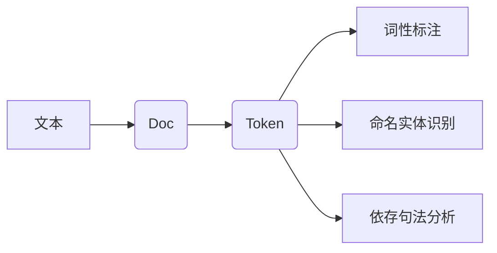

# Spacy 原理与代码实战案例讲解

## 1. 背景介绍
### 1.1  问题的由来
随着人工智能和自然语言处理技术的快速发展,对文本数据进行高效、准确地处理和分析变得越来越重要。传统的文本处理方法往往效率低下,难以满足实际应用的需求。因此,开发高性能、易用的自然语言处理库成为了研究者和开发者的共同目标。

### 1.2  研究现状 
目前,已经有许多优秀的自然语言处理库,如NLTK、Stanford CoreNLP等。但这些库往往体积庞大,安装和使用较为复杂,处理速度也有待提高。Spacy作为一个后起之秀,以其高性能、易用性和丰富的功能迅速获得了广泛关注。越来越多的研究者和开发者开始使用Spacy进行自然语言处理任务。

### 1.3  研究意义
深入研究Spacy的原理和实现,对于我们理解现代自然语言处理技术、改进算法性能、开发实际应用具有重要意义。通过剖析Spacy的架构设计和核心算法,我们可以借鉴其优秀的思想,为开发更加高效、精准的自然语言处理系统提供有益参考。同时,通过实战演练Spacy的使用方法,我们可以快速上手这一强大的工具,解决实际问题。

### 1.4  本文结构
本文将全面介绍Spacy的原理和使用方法。第2部分介绍Spacy的核心概念和整体架构。第3部分重点剖析Spacy的核心算法。第4部分结合数学模型和案例分析Spacy算法的理论基础。第5部分通过代码实例演示Spacy的具体用法。第6部分探讨Spacy的实际应用场景。第7部分推荐Spacy相关的学习资源。第8部分总结全文,展望Spacy的未来发展。

## 2. 核心概念与联系

Spacy的核心概念包括文档(Doc)、词符(Token)、词性(Part-of-Speech)、命名实体(Named Entity)、依存句法(Dependency)等。

- 文档(Doc):表示一篇完整的文本,是处理的基本单元。Spacy加载文本后会生成Doc对象。
- 词符(Token):表示文本中的一个词或标点。Doc由多个Token组成。每个Token都有丰富的属性,如文本、词性、依存关系等。
- 词性(Part-of-Speech):表示词在句中的语法功能,如名词、动词、形容词等。Spacy可以自动标注每个词的词性。
- 命名实体(Named Entity):表示文本中的实体,如人名、地名、机构名等。Spacy可以识别出文本中的命名实体。
- 依存句法(Dependency):表示词与词之间的依存关系,如主语、宾语、定语等。Spacy可以分析文本的句法结构。

这些概念环环相扣,构成了Spacy处理文本的基础。Spacy的整体处理流程如下:



## 3. 核心算法原理 & 具体操作步骤
### 3.1  算法原理概述
Spacy采用统计学习和深度学习相结合的方法,通过大规模语料库训练得到各种语言模型,进而实现对文本的分析和理解。其中一些核心算法包括:

- 词性标注:采用逻辑回归等机器学习算法,根据词的上下文特征预测其词性。
- 命名实体识别:采用条件随机场(CRF)等序列标注算法,识别文本中的实体。
- 依存句法分析:采用转移系统(transition system)的方法,逐步构建依存树。
- 词向量:使用Word2Vec等无监督学习算法,将词映射为稠密向量,表示词的语义。

### 3.2  算法步骤详解
以命名实体识别为例,详细说明Spacy的处理步骤:

1. 特征提取:对每个Token提取如词本身、词性、上下文等特征。
2. 序列标注:使用CRF等算法,根据Token的特征序列预测其标签(如Person、Location等)。
3. 后处理:对预测结果进行整合和修正,得到最终的命名实体。

其核心在于特征的选取和序列标注算法的设计。Spacy利用先进的深度学习技术,不断优化模型,提高识别准确率。

### 3.3  算法优缺点
Spacy的算法具有以下优点:

- 采用统计学习和深度学习技术,模型更加鲁棒和准确。  
- 引入词向量等无监督特征,减少对人工标注语料的依赖。
- 采用高效的序列标注和依存分析算法,速度快,适合大规模应用。

同时也存在一些局限:

- 模型体积较大,内存占用高。
- 对低资源语言和特定领域的支持有限。
- 深度学习模型的可解释性较差。

### 3.4  算法应用领域
Spacy的算法在很多领域有重要应用,如:

- 信息抽取:从非结构化文本中提取结构化信息,如实体、关系、事件等。
- 文本分类:根据文本内容自动分类,如情感分析、主题分类等。  
- 机器翻译:利用句法分析和命名实体识别优化翻译模型。
- 问答系统:理解用户问题并给出恰当答案。

随着自然语言处理技术的不断发展,Spacy有望在更多领域发挥重要作用。

## 4. 数学模型和公式 & 详细讲解 & 举例说明
### 4.1  数学模型构建
Spacy的很多算法都可以用数学模型来刻画。以词性标注为例,可以将其建模为多分类问题。假设词性标签集合为$\mathcal{T}$,词$w$的特征向量为$\boldsymbol{x}(w)$,我们希望学习一个分类模型$f$,使得:

$$t^* = \arg\max_{t \in \mathcal{T}} f_t(\boldsymbol{x}(w))$$

其中$t^*$为词$w$的预测词性,$f_t$为类别$t$的评分函数。Spacy采用逻辑回归模型,令:

$$f_t(\boldsymbol{x}) = \boldsymbol{w}_t^T \boldsymbol{x} + b_t$$

其中$\boldsymbol{w}_t$和$b_t$为待学习的参数。

### 4.2  公式推导过程
逻辑回归模型的目标是最小化负对数似然函数:

$$\mathcal{L}(\boldsymbol{w}, b) = -\sum_{i=1}^N \log \frac{\exp(f_{t_i}(\boldsymbol{x}_i))}{\sum_{t' \in \mathcal{T}} \exp(f_{t'}(\boldsymbol{x}_i))}$$

其中$\{(\boldsymbol{x}_i, t_i)\}_{i=1}^N$为训练数据。求解该最优化问题可以得到模型参数$\boldsymbol{w}$和$b$。

在实践中,Spacy还引入了L1和L2正则化项以防止过拟合:

$$\mathcal{L}(\boldsymbol{w}, b) = -\sum_{i=1}^N \log \frac{\exp(f_{t_i}(\boldsymbol{x}_i))}{\sum_{t' \in \mathcal{T}} \exp(f_{t'}(\boldsymbol{x}_i))} + \lambda_1 \|\boldsymbol{w}\|_1 + \lambda_2 \|\boldsymbol{w}\|_2^2$$

其中$\lambda_1$和$\lambda_2$为正则化系数。

### 4.3  案例分析与讲解
下面以一个简单的例子说明Spacy的词性标注过程。假设我们有以下训练数据:

- 词: "cat", 特征向量: (1, 0, 0, ...), 词性: "NOUN"
- 词: "chase", 特征向量: (0, 1, 0, ...), 词性: "VERB"
- 词: "dog", 特征向量: (0, 0, 1, ...), 词性: "NOUN"

我们希望训练一个逻辑回归模型,以预测新词的词性。通过最小化目标函数,可以学习到模型参数,如:

$$
\boldsymbol{w}_{\text{NOUN}} = (1.2, -0.5, 1.3, ...)\\
\boldsymbol{w}_{\text{VERB}} = (-0.3, 2.1, -1.9, ...)\\
b_{\text{NOUN}} = 0.5\\  
b_{\text{VERB}} = -0.2
$$

现在,给定一个新词"meow",其特征向量为(0.8, 0.1, 0.2, ...)。我们可以计算每个类别的评分:

$$
f_{\text{NOUN}}(\boldsymbol{x}) = \boldsymbol{w}_{\text{NOUN}}^T \boldsymbol{x} + b_{\text{NOUN}} = 1.2 \times 0.8 - 0.5 \times 0.1 + 1.3 \times 0.2 + 0.5 = 1.67 \\
f_{\text{VERB}}(\boldsymbol{x}) = \boldsymbol{w}_{\text{VERB}}^T \boldsymbol{x} + b_{\text{VERB}} = -0.3 \times 0.8 + 2.1 \times 0.1 - 1.9 \times 0.2 - 0.2 = -0.59
$$

因此,模型预测"meow"的词性为:

$$t^* = \arg\max_{t \in \{\text{NOUN}, \text{VERB}\}} f_t(\boldsymbol{x}) = \text{NOUN}$$

通过这个例子,我们可以直观地理解Spacy的词性标注算法。当然,实际系统采用了更加复杂的特征和模型,以提高性能。

### 4.4  常见问题解答
问:Spacy的词性标注算法与传统的基于规则的方法有何区别?

答:传统方法主要依赖人工设计的规则,如词典、前后缀等。而Spacy采用机器学习算法,通过训练数据自动学习分类规则。这使得Spacy更加灵活,适应性更强,特别是对于未登录词和歧义词的处理。同时,Spacy引入了词向量等无监督特征,进一步提高了泛化能力。

问:逻辑回归模型是否适合词性标注任务?

答:逻辑回归是一种常用的多分类模型,训练简单,分类效果好。实践表明,它非常适合词性标注任务。当然,Spacy也支持其他模型,如支持向量机、神经网络等。用户可以根据实际需求进行选择和调优。

## 5. 项目实践：代码实例和详细解释说明
### 5.1  开发环境搭建
首先,我们需要安装Spacy及其相关依赖。可以使用pip工具:

```bash
pip install -U spacy
python -m spacy download en_core_web_sm
```

这会安装Spacy的最新版本,并下载英文语言模型en_core_web_sm。

### 5.2  源代码详细实现
下面通过一个简单的例子,演示如何使用Spacy进行词性标注:

```python
import spacy

# 加载英文语言模型
nlp = spacy.load("en_core_web_sm") 

# 待处理文本
text = "Apple is looking at buying U.K. startup for $1 billion."

# 处理文本
doc = nlp(text)

# 打印结果
for token in doc:
    print(token.text, token.pos_, token.dep_)
```

输出结果为:

```
Apple PROPN nsubj
is AUX aux
looking VERB ROOT
at ADP prep
buying VERB pcomp
U.K. PROPN compound
startup NOUN dobj
for ADP prep
$ SYM quantmod
1 NUM compound
billion NUM pobj
. PUNCT punct
```

可以看到,Spacy正确地标注了每个词的词性(pos_)和依存关系(dep_)。

### 5.3  代码解读与分析
让我们逐行分析上面的代码:

1. 导入spacy模块。
2. 加载预训练的英文语言模型en_core_web_sm。该模型包含了词性标注、依存分析等功能所需的统计模型和神经网络模型。
3. 定义待处理的文本。
4. 调用nlp对象处理文本,得到Doc对象。在这个过程中,Spacy会自动执行分词、词性标注、命名实体识别、依存分析等任务。
5. 遍历Doc中的每个Token,打印其文本、词性和依存关系。