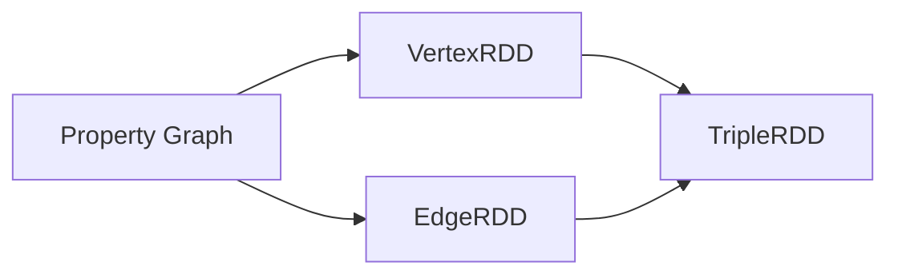
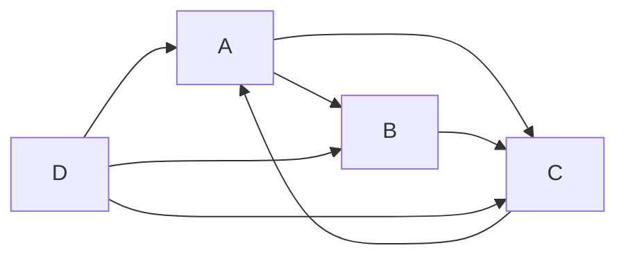

# Spark GraphX原理与代码实例讲解

## 1. 背景介绍
### 1.1 问题的由来
在大数据时代,图计算已经成为了一个非常重要的研究方向。很多实际应用场景,如社交网络分析、推荐系统、欺诈检测等,都可以抽象为图计算问题。然而,传统的图计算框架如Giraph、GraphLab等,在可扩展性和容错性方面存在一定的局限性。于是,Spark GraphX应运而生,它是一个分布式图计算框架,基于Spark平台开发,具有高性能、易用性和可扩展性的特点。

### 1.2 研究现状
目前,国内外已经有很多研究机构和公司开始研究和应用Spark GraphX。例如:

- 加州大学伯克利分校AMPLab实验室开发了GraphX,并将其集成到Spark生态系统中 
- Twitter利用GraphX进行社交网络分析和推荐
- 阿里巴巴利用GraphX构建了大规模的知识图谱
- 腾讯利用GraphX进行海量数据的欺诈检测

可以看出,Spark GraphX在学术界和工业界都得到了广泛的应用和认可。

### 1.3 研究意义
研究Spark GraphX有以下几点意义:

1. 丰富大数据处理生态系统。Spark GraphX作为Spark生态系统的重要组成部分,为Spark提供了图计算能力,丰富了Spark的功能,使得Spark成为一个一站式大数据处理平台。

2. 提高图计算性能。GraphX充分利用了Spark的内存计算和DAG执行引擎的优势,大大提高了图计算的性能,能够支持TB级别的超大规模图数据处理。

3. 简化图计算编程。GraphX提供了一组简洁的图计算原语和API,屏蔽了分布式计算的复杂性,使得开发人员可以像编写单机程序一样编写分布式图计算程序,大大降低了编程门槛。

4. 拓展图计算应用场景。GraphX融合了图论算法和数据挖掘算法,提供了一些高层次的图算法库,如PageRank、连通分量、标签传播等,可以直接应用于实际的场景,极大地拓展了图计算的应用范围。

### 1.4 本文结构
本文将详细介绍Spark GraphX的原理和使用方法,全文分为以下几个部分:

1. 介绍GraphX的核心概念和编程模型
2. 阐述GraphX的系统架构和设计原理
3. 讲解GraphX的核心算法和实现原理
4. 通过一个具体的代码实例演示GraphX的使用方法
5. 总结GraphX的特点和适用场景,展望未来的发展方向

## 2. 核心概念与联系
GraphX是一个分布式图计算框架,它提供了一组基本的抽象概念,构成了GraphX编程模型的基础。主要包括:

- 顶点(Vertex):图中的节点,包含唯一的ID和属性值。
- 边(Edge):连接顶点的有向边,包含源顶点ID、目标顶点ID和属性值。
- 属性图(Property Graph):一个带属性的有向多重图,由一组顶点和边组成。
- 顶点RDD(VertexRDD):以顶点为单位对图进行划分,形成分布式的顶点集合。
- 边RDD(EdgeRDD):以边为单位对图进行划分,形成分布式的边集合。
- 三元组RDD(TripleRDD):将图转换为(srcId, dstId, attr)的三元组形式。

这些概念之间的关系如下图所示:

可以看出,属性图由顶点RDD和边RDD组成,而三元组RDD可以由顶点RDD和边RDD转换而来。这种设计使得GraphX能够以统一的方式处理点和边数据,并实现高效的图计算。

## 3. 核心算法原理 & 具体操作步骤
### 3.1 算法原理概述
GraphX基于Spark平台实现了一系列经典的图算法,主要分为以下几类:

- 图遍历算法:如BFS、DFS等,用于遍历图的顶点和边。
- 连通性算法:如强连通分量、弱连通分量等,用于求解图的连通性问题。
- 路径和距离算法:如最短路径、全对最短路等,用于求解顶点之间的距离。
- 中心性算法:如PageRank、度中心性等,用于度量顶点在图中的重要性。
- 聚类算法:如标签传播、Kmeans等,用于对图进行社区划分。

这些算法大多采用迭代计算的方式,通过反复对图数据进行转换和聚合,最终得到计算结果。GraphX充分利用了Spark的内存计算和DAG执行引擎,使得这些算法能够高效地运行在分布式环境中。

### 3.2 算法步骤详解
下面以PageRank算法为例,详细讲解GraphX中的算法实现步骤。

PageRank是一种经典的链接分析算法,用于度量网页的重要性。其基本思想是:如果一个网页被很多其他网页链接,说明这个网页比较重要,它的PageRank值就比较高。PageRank采用迭代计算的方式,公式如下:

$$PR(i)=\frac{1-d}{N}+d\sum_{j\in B(i)}\frac{PR(j)}{L(j)}$$

其中,$PR(i)$表示网页$i$的PageRank值,$N$表示网页总数,$B(i)$表示指向网页$i$的网页集合,$L(j)$表示网页$j$的出链数,$d$为阻尼系数,一般取0.85。

GraphX中的PageRank算法实现步骤如下:

1. 将图数据加载为边RDD,每条边的属性为1.0。
2. 将边RDD转换为顶点RDD和边RDD。
3. 初始化每个顶点的PageRank值为1.0。
4. 迭代计算PageRank值,每轮迭代分为两步:
   - 第一步:每个顶点将其PageRank值平均分配给出边,并将结果发送给目标顶点。
   - 第二步:每个顶点将收到的PageRank值求和,并乘以阻尼系数,再加上(1-d)/N。
5. 不断重复第4步,直到PageRank值收敛或达到最大迭代次数。
6. 输出每个顶点的最终PageRank值。

可以看出,PageRank算法的核心是迭代计算,每轮迭代需要对所有顶点和边进行转换和聚合操作。GraphX通过顶点RDD和边RDD来分布式存储图数据,并利用Spark的DAG执行引擎来自动调度和执行计算任务,从而实现了高效的分布式PageRank计算。

### 3.3 算法优缺点
GraphX的图算法具有以下优点:

- 易用性好:GraphX提供了一组高层次的图算法API,用户只需要提供输入数据和配置参数,就可以方便地调用这些算法。
- 性能高:GraphX基于Spark平台开发,充分利用了Spark的内存计算和DAG执行引擎,具有很高的计算性能。
- 可扩展性强:GraphX采用了RDD编程模型,可以方便地扩展新的图算法,也可以与Spark生态系统中的其他组件(如MLlib、Streaming等)进行集成。

但是,GraphX的图算法也存在一些局限性:

- 内存消耗大:GraphX采用内存计算,需要将图数据全部加载到内存中,对于超大规模的图,可能会出现内存不足的问题。
- 迭代效率低:很多图算法需要大量的迭代计算,而Spark采用的是微批处理模型,每轮迭代都需要启动新的任务,导致迭代效率较低。
- 调优难度大:GraphX的性能对于参数配置比较敏感,需要用户手动调优,对于复杂的图算法,调优难度比较大。

### 3.4 算法应用领域
GraphX提供的图算法可以应用于多个领域,主要包括:

- 社交网络分析:如社团检测、影响力分析、链路预测等。
- 推荐系统:如基于图的协同过滤、基于随机游走的推荐等。
- 欺诈检测:如金融诈骗、电信诈骗等反欺诈场景。
- 知识图谱:如实体链接、关系抽取、知识推理等。
- 交通网络:如最短路径规划、交通流量预测等。

总之,只要是能够抽象为图结构的问题,都可以利用GraphX提供的图算法进行建模和求解。

## 4. 数学模型和公式 & 详细讲解 & 举例说明
### 4.1 数学模型构建
GraphX中的很多图算法都可以用统一的矩阵运算来表示,这里以PageRank算法为例进行说明。

我们可以将PageRank值看作是一个$N$维向量$\vec{r}$,初始时,所有元素都为$\frac{1}{N}$,经过若干轮迭代后,收敛到平稳分布。假设邻接矩阵为$M$,其中$M_{ij}=\frac{1}{L(j)}$,如果顶点$j$有一条边指向顶点$i$,否则为0。则PageRank的迭代公式可以写成矩阵形式:

$$\vec{r}^{(k+1)}=\beta M^T\vec{r}^{(k)}+(1-\beta)\frac{1}{N}\vec{e}$$

其中,$\vec{r}^{(k)}$表示第$k$轮迭代的PageRank向量,$\beta$为阻尼系数,$\vec{e}$为全1向量。

### 4.2 公式推导过程
下面我们来推导一下PageRank算法的矩阵形式。

根据PageRank的定义,顶点$i$的PageRank值为:

$$r_i=\sum_{j\in B(i)}\frac{r_j}{L(j)}$$

写成矩阵形式为:

$$\vec{r}=M^T\vec{r}$$

考虑到随机游走的阻尼因子,加入阻尼项和随机跳转项,得到:

$$\vec{r}=\beta M^T\vec{r}+(1-\beta)\frac{1}{N}\vec{e}$$

经过$k$轮迭代后,PageRank向量为:

$$\vec{r}^{(k+1)}=\beta M^T\vec{r}^{(k)}+(1-\beta)\frac{1}{N}\vec{e}$$

可以证明,当$k\to\infty$时,PageRank向量会收敛到一个稳定值。

### 4.3 案例分析与讲解
下面我们以一个具体的例子来说明PageRank算法的计算过程。

假设有4个网页A、B、C、D,它们之间的链接关系如下图所示:

我们可以得到邻接矩阵为:

$$M=\begin{bmatrix}
0 & \frac{1}{2} & \frac{1}{3} & \frac{1}{3} \\
0 & 0 & \frac{1}{3} & \frac{1}{3} \\
1 & \frac{1}{2} & 0 & \frac{1}{3} \\
0 & 0 & 0 & 0
\end{bmatrix}$$

初始时,PageRank向量为:

$$\vec{r}^{(0)}=\begin{bmatrix}
0.25 \\ 0.25 \\ 0.25 \\ 0.25
\end{bmatrix}$$

取$\beta=0.8$,经过一轮迭代后,PageRank向量为:

$$\vec{r}^{(1)}=0.8\times\begin{bmatrix}
0 & \frac{1}{2} & \frac{1}{3} & \frac{1}{3} \\
0 & 0 & \frac{1}{3} & \frac{1}{3} \\
1 & \frac{1}{2} & 0 & \frac{1}{3} \\
0 & 0 & 0 & 0
\end{bmatrix}^T\begin{bmatrix}
0.25 \\ 0.25 \\ 0.25 \\ 0.25
\end{bmatrix}+0.2\times\begin{bmatrix}
0.25 \\ 0.25 \\ 0.25 \\ 0.25
\end{bmatrix}=\begin{bmatrix}
0.35 \\ 0.15 \\ 0.35 \\ 0.15
\