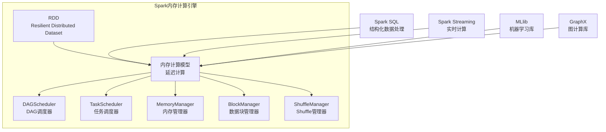

# Spark内存计算引擎原理与代码实例讲解

## 1. 背景介绍

### 1.1 问题的由来

在大数据时代,海量数据的存储和计算成为了一个巨大的挑战。传统的基于磁盘的大数据处理系统,如Hadoop MapReduce,由于频繁的磁盘I/O操作,导致处理效率低下。为了提高大数据处理的效率,内存计算模型应运而生。

Apache Spark作为一种新型的内存计算框架,凭借其优秀的内存计算能力和通用性,在大数据处理领域备受青睐。Spark内存计算引擎是Spark的核心组件之一,负责高效地管理和调度内存资源,实现快速的数据处理。

### 1.2 研究现状

目前,Spark内存计算引擎的研究主要集中在以下几个方面:

1. **内存管理策略优化**:Spark采用统一的内存管理器(UnifiedMemoryManager)来管理各个计算组件的内存使用。研究人员一直在探索更高效的内存管理策略,以提高内存利用率和减少内存开销。

2. **内存数据结构优化**:Spark使用高效的列式数据格式(Columnar Format)存储内存中的数据,例如Parquet和ORC格式。研究人员致力于优化这些数据格式,以提高数据压缩率和查询效率。

3. **内存计算优化**:Spark支持多种内存计算操作,如Map、Filter、ReduceByKey等。研究人员一直在优化这些操作的性能,以加速内存计算。

4. **内存资源调度优化**:在集群环境下,如何高效地调度和分配内存资源是一个重要的研究课题。研究人员探索了多种调度算法和策略,以提高资源利用率。

5. **内存故障恢复机制**:由于内存是有限的,如何在内存不足或发生故障时,快速恢复计算状态也是一个值得关注的研究方向。

### 1.3 研究意义

优化Spark内存计算引擎,对于提高大数据处理效率具有重要意义:

1. **加速数据处理**:高效利用内存资源,可以显著减少磁盘I/O,从而加速数据处理速度。

2. **提高资源利用率**:合理的内存管理和调度策略,可以最大限度地利用集群资源,避免资源浪费。

3. **支持实时计算**:内存计算引擎为实时数据处理提供了坚实的基础,满足了越来越多的实时计算需求。

4. **降低计算成本**:高效的内存计算可以减少计算资源的消耗,从而降低整体的计算成本。

5. **促进大数据创新**:高性能的内存计算引擎将推动大数据技术的创新和发展,为各行各业带来新的机遇。

### 1.4 本文结构

本文将全面介绍Spark内存计算引擎的原理和实现,内容安排如下:

1. 背景介绍
2. 核心概念与联系
3. 核心算法原理与具体操作步骤
4. 数学模型和公式详细讲解与举例说明
5. 项目实践:代码实例和详细解释说明
6. 实际应用场景
7. 工具和资源推荐
8. 总结:未来发展趋势与挑战
9. 附录:常见问题与解答

## 2. 核心概念与联系

在深入探讨Spark内存计算引擎之前,我们需要先了解一些核心概念及其之间的联系。

### 2.1 RDD (Resilient Distributed Dataset)

RDD是Spark的基础数据结构,代表一个不可变、分区的记录集合。RDD支持两种类型的操作:转化操作(Transformation)和行动操作(Action)。

转化操作会生成一个新的RDD,而行动操作则会对RDD进行计算并返回结果。RDD的不可变性使得它可以被高效地缓存在内存中,从而加速迭代计算。

### 2.2 Spark内存计算模型

Spark采用了延迟计算(Lazy Evaluation)模型,即在执行行动操作时才会真正触发计算。这种模型可以让Spark优化执行计划,并充分利用内存进行计算。

Spark内存计算模型包括以下几个关键组件:

1. **DAG调度器(DAGScheduler)**: 负责构建计算逻辑的有向无环图(DAG),并将其分解为更小的任务(Task)。

2. **任务调度器(TaskScheduler)**: 负责将任务分发到各个Executor上执行,并监控任务的执行状态。

3. **内存管理器(MemoryManager)**: 负责管理和分配Executor的内存资源,确保内存的高效利用。

4. **BlockManager**: 负责管理Executor中的数据块(Block),包括内存块和磁盘块。

5. **Shuffle管理器(ShuffleManager)**: 负责管理Shuffle过程中的数据传输和聚合。

这些组件通过紧密协作,实现了高效的内存计算。

### 2.3 Spark SQL

Spark SQL是Spark的一个重要模块,它提供了结构化数据处理能力。Spark SQL可以高效地处理各种格式的数据,如Parquet、ORC、JSON等,并支持SQL查询。

Spark SQL的核心是Catalyst优化器,它可以优化查询计划,并生成高效的内存计算代码。Catalyst优化器与Spark内存计算引擎密切配合,实现了高性能的结构化数据处理。

### 2.4 Spark Streaming

Spark Streaming是Spark的实时计算模块,它可以实现低延迟、高吞吐量的实时数据处理。

Spark Streaming将实时数据流划分为一系列的小批次(Micro-Batch),并将每个小批次转化为RDD进行内存计算。这种微批处理模型结合了Spark内存计算引擎的优势,实现了高效的实时计算。

### 2.5 MLlib和GraphX

MLlib是Spark提供的机器学习库,而GraphX则是Spark的图计算库。它们都依赖于Spark内存计算引擎,利用内存计算的优势加速迭代计算。

MLlib和GraphX的算法通常需要频繁地访问数据,因此内存计算引擎对它们的性能提升至关重要。

### 2.6 Mermaid 核心概念流程图

上图展示了Spark内存计算引擎的核心概念及其之间的关系。RDD作为基础数据结构,支撑了Spark的内存计算模型。内存计算模型由多个组件协作实现,如DAG调度器、任务调度器、内存管理器等。Spark SQL、Spark Streaming、MLlib和GraphX等模块都依赖于内存计算引擎,利用其高效的内存计算能力。

## 3. 核心算法原理与具体操作步骤

### 3.1 算法原理概述

Spark内存计算引擎的核心算法原理可以概括为以下几个方面:

1. **RDD分区原理**

   Spark将RDD逻辑上划分为多个分区(Partition),每个分区存储部分数据。分区是Spark实现并行计算的基础,可以让不同的任务并行执行。

2. **DAG构建原理**

   Spark将用户的计算逻辑表示为有向无环图(DAG),其中每个节点代表一个RDD,边代表RDD之间的依赖关系。DAG调度器负责构建和优化这个DAG。

3. **任务调度原理**

   DAG调度器将DAG分解为更小的任务(Task),任务调度器负责将这些任务分发到各个Executor上执行。任务调度器采用了多种调度策略,如FIFO、Fair等。

4. **内存管理原理**

   Spark采用统一的内存管理器(UnifiedMemoryManager)来管理各个计算组件的内存使用。内存管理器根据内存使用情况动态调整内存区域的大小。

5. **数据块管理原理**

   BlockManager负责管理Executor中的数据块,包括内存块和磁盘块。当内存不足时,BlockManager会将部分数据块存储到磁盘上,以确保内存的高效利用。

6. **Shuffle原理**

   Shuffle是Spark中一种重要的数据重分区操作,常用于ReduceByKey等算子。ShuffleManager负责管理Shuffle过程中的数据传输和聚合,以提高Shuffle效率。

### 3.2 算法步骤详解

下面我们详细解释Spark内存计算引擎的算法步骤:

1. **构建DAG**

   用户提交一个Spark应用程序,Spark会根据用户的计算逻辑构建一个DAG。DAG中的每个节点代表一个RDD,边代表RDD之间的依赖关系。

2. **DAG优化**

   DAG调度器会对DAG进行优化,如合并一些小任务、优化Shuffle操作等,以提高计算效率。

3. **任务分解**

   DAG调度器将优化后的DAG分解为更小的任务(Task),每个任务负责计算一个分区(Partition)的数据。

4. **任务调度**

   任务调度器根据调度策略将任务分发到各个Executor上执行。如果某个任务失败,任务调度器会重新调度该任务。

5. **内存管理**

   在执行任务时,内存管理器会动态调整各个内存区域的大小,以确保内存的高效利用。如果内存不足,内存管理器会将部分数据块存储到磁盘上。

6. **数据块管理**

   BlockManager负责管理Executor中的数据块,包括内存块和磁盘块。它会根据内存使用情况,在内存和磁盘之间移动数据块。

7. **Shuffle管理**

   对于需要Shuffle的操作,如ReduceByKey,ShuffleManager会负责管理Shuffle过程中的数据传输和聚合,以提高Shuffle效率。

8. **结果输出**

   计算完成后,Spark会将结果输出到指定的位置,如文件系统或数据库。

### 3.3 算法优缺点

Spark内存计算引擎的优点:

1. **高效利用内存**:Spark能够充分利用集群的内存资源,避免频繁的磁盘I/O,从而提高计算效率。

2. **容错性强**:Spark采用了RDD的不可变性和lineage机制,可以在发生故障时快速恢复计算状态。

3. **通用性强**:Spark不仅支持批处理,还支持流式计算、机器学习和图计算等多种计算场景。

4. **易于使用**:Spark提供了多种语言的API,如Scala、Java、Python和R,方便开发者使用。

5. **可扩展性强**:Spark可以轻松地扩展到数千个节点的大规模集群,满足大数据计算的需求。

Spark内存计算引擎的缺点:

1. **内存开销大**:Spark需要在内存中存储大量的中间数据,因此内存开销较大。

2. **延迟较高**:由于Spark采用了微批处理模型,因此在实时计算场景下,延迟可能较高。

3. **调优复杂**:为了获得最佳性能,需要对Spark进行大量的参数调优,这增加了使用的复杂性。

4. **小文件处理效率低**:Spark在处理大量小文件时,效率较低,因为小文件会产生大量的任务和元数据开销。

5. **缺乏事务支持**:Spark缺乏对事务的原生支持,这在某些场景下可能会造成一些限制。

### 3.4 算法应用领域

Spark内存计算引擎广泛应用于以下领域:

1. **大数据处理**: