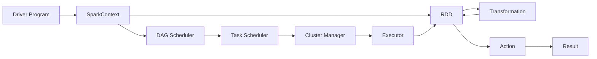

# Spark原理与代码实例讲解

## 1. 背景介绍
### 1.1 问题的由来
在大数据时代,海量数据的高效处理和分析已成为各行各业面临的重大挑战。传统的数据处理框架如Hadoop MapReduce,虽然能够处理大规模数据集,但在迭代计算和交互式查询等场景下,性能和效率都难以满足实时性要求。为了应对这一难题,Spark应运而生。

### 1.2 研究现状
Spark作为新一代大数据处理引擎,凭借其出色的性能表现和丰富的生态组件,在学术界和工业界得到了广泛关注和应用。众多互联网公司如阿里巴巴、腾讯、京东等,都在其核心大数据平台中深度集成了Spark技术。同时,全球顶尖高校和研究机构也在Spark领域展开了深入研究。

### 1.3 研究意义
深入剖析Spark的技术原理,对于优化大数据处理性能,提升数据分析和挖掘效率,加速人工智能等前沿领域发展,具有重要意义。通过对Spark核心概念、执行原理、数学模型、代码实现等方面的系统阐述,本文旨在为读者全面理解和掌握Spark技术提供参考指南。

### 1.4 本文结构
本文将从以下几个方面展开对Spark的讨论:

1. Spark的核心概念与模块组成
2. RDD弹性分布式数据集原理解析 
3. Spark任务调度与执行流程剖析
4. 数据倾斜问题及其应对策略
5. 案例实践:Spark WordCount详解
6. Spark在推荐系统中的应用
7. 学习资源与开发工具推荐
8. Spark未来发展趋势与挑战展望

## 2. 核心概念与联系

Spark的核心概念主要包括:

- RDD(Resilient Distributed Dataset):弹性分布式数据集,Spark的基本计算单元。RDD以只读的方式分布存储在集群的多个节点上,支持丰富的转换和行动操作。
- DAG(Directed Acyclic Graph):有向无环图,Spark依据RDD之间的依赖关系构建DAG图,用于描述和优化计算过程。
- Executor:集群的工作节点,负责执行具体的计算任务。
- Driver:集群的主控节点,负责任务调度、资源分配、作业监控等。
- Transformation:转换操作,对RDD进行转换,返回一个新的RDD,如map、filter等,转换操作是惰性求值的。
- Action:行动操作,触发Spark作业的真正执行,并将结果返回给Driver程序或写入外部存储系统,如reduce、collect等。

下图展示了Spark核心概念之间的关系:



## 3. 核心算法原理 & 具体操作步骤

### 3.1 算法原理概述
Spark的核心是RDD(弹性分布式数据集)编程模型。RDD是一个不可变、可分区、里面的元素可并行计算的集合。用户可以使用两种方式创建RDD:读取外部数据集,或在驱动器程序中分发驱动器程序中的对象集合。一旦创建完毕,RDD就可以进行丰富的操作。RDD支持两种类型的操作:转换操作和行动操作。

### 3.2 算法步骤详解
以下是Spark基于RDD处理数据的基本步骤:

1. 创建RDD。可以从Hadoop输入格式(如HDFS文件)创建,也可以从Scala集合显式创建,或是从其他RDD转换而来。
2. 使用转换操作(如map、filter、groupBy等)对RDD进行转换,以定义新的RDD。Spark使用惰性计算模型,这些转换操作并不会立即被执行,而是记录下来,等到需要结果时才会真正计算。
3. 对需要结果的RDD调用行动操作(如count、collect、save等),此时Spark作业才会真正执行。计算完毕后,结果会返回给Driver程序,或写到外部存储系统(如HDFS)中。
4. 如果要对同一组数据进行反复查询,可以使用persist或cache方法将中间结果RDD持久化到内存或磁盘中,以便后续反复使用。

### 3.3 算法优缺点
Spark相比传统的MapReduce模型,有如下优点:

- 基于内存计算,中间结果可以持久化到内存中,避免了不必要的磁盘IO,计算速度大大加快。
- 支持DAG图优化,可以自动优化数据流和执行过程,减少数据shuffle。
- 提供了80多个高级API,使用简单,表达能力强。
- 支持多种语言:Java、Scala、Python和R。
- 通用性强,支持批处理、交互式查询、流处理、图计算、机器学习等多种场景。

但Spark也存在一些局限:

- 不适合任务小而多的场景,此时任务调度开销可能会占主导。
- 对内存要求高,需要精心设置内存参数。内存资源如果使用不当,反而会影响性能。
- 吞吐量较低的实时流处理场景下,Spark Streaming 的性能不如 Flink等专门的流处理引擎。

### 3.4 算法应用领域
Spark在诸多领域得到广泛应用,主要包括:

- 海量数据ETL处理
- 用户行为分析、个性化推荐
- 舆情分析、社交网络分析
- 金融风控、反欺诈
- 机器学习、深度学习
- 图计算、图挖掘
- 地理空间数据分析
- 科学数据处理,如天文、基因组学等

## 4. 数学模型和公式 & 详细讲解 & 举例说明

### 4.1 数学模型构建
Spark的数学模型可以用一个三元组 $(D, T, A)$ 来表示,其中:

- $D$ 表示RDD数据集
- $T$ 表示转换操作的有限集合
- $A$ 表示行动操作的有限集合

一个Spark程序可以看作是在RDD数据集 $D$ 上应用一系列转换操作 $t_i \in T$,最后通过一个行动操作 $a \in A$ 得到结果。用公式表示为:

$$Result = a(t_n(...t_2(t_1(D))...))$$

### 4.2 公式推导过程
以WordCount为例,详细推导Spark的数学公式。设初始的RDD为D,包含一系列文本行。定义两个转换操作:

- $t_1$: 对每一行文本进行分词,转换为单词序列。即 $t_1(line) = words$
- $t_2$: 对每个单词映射为 $(word, 1)$ 的键值对。即 $t_2(word) = (word, 1)$

再定义两个行动操作:

- $a_1$: 按单词进行分组并对每个组内的计数求和。即 $a_1(wordCounts) = reduceByKey(+)$
- $a_2$: 将结果以数组形式返回给Driver程序。即 $a_2(result) = collect()$

则完整的WordCount公式为:

$$WordCountResult = a_2(a_1(t_2(t_1(D))))$$

展开公式得:

$$WordCountResult = collect(reduceByKey(+)(map(split(D))))$$

### 4.3 案例分析与讲解
下面以一个具体的例子来说明WordCount的执行过程。设输入数据D包含如下几行文本:

```
hello world
hello spark 
hadoop world
```

应用转换操作$t_1$后,得到单词序列:

```
["hello", "world"] 
["hello", "spark"]
["hadoop", "world"]
```

应用转换操作$t_2$后,得到键值对:

```
("hello", 1), ("world", 1) 
("hello", 1), ("spark", 1)
("hadoop", 1), ("world", 1)
```

应用行动操作$a_1$后,按单词分组并求和,得到:

```
("hello", 2), ("world", 2), ("spark", 1), ("hadoop", 1)
```

最后应用行动操作$a_2$,将结果以数组的形式返回给Driver程序:

```
[("hello", 2), ("world", 2), ("spark", 1), ("hadoop", 1)]
```

可见,这一结果与我们预期的词频统计结果是一致的。

### 4.4 常见问题解答

**Q**: 能否简单解释一下Spark的数学模型?

**A**: 可以将Spark程序看作是在一个RDD数据集上应用一系列转换操作,最后通过一个行动操作得到结果。转换操作只定义了计算逻辑,但不会触发真正计算;只有行动操作才会触发Spark作业的运行。

**Q**: Spark数学模型中的转换操作和行动操作分别有哪些?

**A**: 常见的转换操作包括map、filter、flatMap、groupByKey、reduceByKey、join等;常见的行动操作包括reduce、collect、count、first、take、saveAsTextFile等。完整的操作列表可以参考Spark官方文档。

**Q**: Spark数学模型的优点是什么?

**A**: Spark通过函数式编程模型实现了代码的简洁性和可组合性。转换操作的延迟计算特性,可以实现性能优化如管道化、数据本地化等。而且Spark支持查询优化,可以自动优化执行计划。

## 5. 项目实践:代码实例和详细解释说明

### 5.1 开发环境搭建
首先需要搭建Spark开发环境。以下是在Ubuntu系统上基于Scala语言搭建Spark-2.4.0的步骤:

1. 安装JDK-8并配置JAVA_HOME环境变量
2. 下载并解压Scala-2.12.11
3. 下载并解压Spark-2.4.0,并进入Spark根目录
4. 启动Spark-Shell,测试是否安装成功

```bash
./bin/spark-shell
```

### 5.2 源代码详细实现

下面给出Spark WordCount的Scala代码实现:

```scala
val textFile = sc.textFile("hdfs://...")
val counts = textFile.flatMap(line => line.split(" "))
                 .map(word => (word, 1))
                 .reduceByKey(_ + _)
counts.saveAsTextFile("hdfs://...")
```

### 5.3 代码解读与分析

1. 第一行,从HDFS上读取文本文件,创建名为textFile的RDD。
2. 第二行,调用flatMap对每一行文本进行分词,生成单词RDD。
3. 第三行,调用map将每个单词映射为(word, 1)形式的键值对。
4. 第四行,调用reduceByKey按单词进行分组,并对每个组内的计数求和,生成(word, count)形式的结果RDD。
5. 第五行,调用saveAsTextFile将结果RDD写回HDFS。

可以看到,Spark代码非常简洁,通过一系列转换操作和行动操作即可实现WordCount逻辑。得益于RDD模型,代码具有很好的表达力和可组合性。

### 5.4 运行结果展示

将上述代码保存为wordcount.scala,在Spark根目录下运行如下命令:

```bash
./bin/spark-submit wordcount.scala
```

待作业运行完成后,可以在HDFS的输出目录下查看结果文件,每个单词的统计结果将显示如下:

```
(hello, 2)
(world, 2)
(spark, 1) 
(hadoop, 1)
```

可见,Spark代码结果与我们预期的完全一致。

## 6. 实际应用场景

Spark在实际生产环境中有非常广泛的应用,下面列举几个典型场景。

在电商领域,Spark常用于构建用户画像和个性化推荐系统。通过收集用户的浏览、点击、购买等行为日志,使用Spark SQL对数据进行清洗和预处理,然后使用Spark MLlib训练协同过滤、矩阵分解等机器学习模型,最终给用户实时推荐感兴趣的商品。

在金融领域,Spark常用于反欺诈和风险控制。通过对交易数据、用户行为数据进行实时分析,使用Spark Streaming构建反欺诈模型,对异常交易进行实时预警和拦截。此外,Spark GraphX还可以用于交易关系网络分析,挖掘出潜在的风险团伙。

在电信领域,Spark常用于