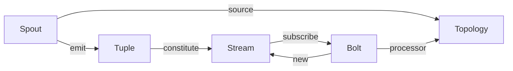

# Storm原理与代码实例讲解

关键词：Storm, 实时流处理, 数据处理, 分布式计算, 容错性, 可扩展性

## 1. 背景介绍
### 1.1 问题的由来
在大数据时代,海量数据的实时处理已成为许多企业和组织面临的重大挑战。传统的批处理模式难以满足实时性要求,而Storm作为一个分布式实时计算系统应运而生。
### 1.2 研究现状 
目前业界已经有多个成熟的实时流处理框架,如Storm、Spark Streaming、Flink等。其中Storm因其简单易用、可靠性高、实时性强等优势而备受青睐,被广泛应用于日志分析、金融风控、物联网等领域。
### 1.3 研究意义
深入研究Storm的原理和应用,对于掌握大数据实时处理技术、构建高性能流处理系统具有重要意义。同时Storm的设计思想和实现技巧也可为其他分布式系统的开发提供有益启示。
### 1.4 本文结构
本文将从Storm的核心概念出发,详细阐述其体系结构、数据模型、容错机制等关键原理,并通过实际代码案例演示Storm编程的基本方法。最后,文章还将讨论Storm的实际应用场景、发展趋势与面临的挑战。

## 2. 核心概念与联系
Storm是一个分布式实时计算系统,借鉴了批处理、消息队列等技术,采用 master-slave 架构,以流(stream)为核心数据模型,支持灵活的拓扑结构。

Storm的几个核心概念包括:
- Tuple(元组):Storm数据流中的基本单元,由一组命名值字段组成。
- Stream(流):一个无界的、持续的Tuple序列。
- Spout(数据源):Storm拓扑的消息来源,负责从外部数据源读取数据,并将其封装成Stream。
- Bolt(处理单元):Storm拓扑的处理逻辑单元,从一个或多个Stream中接收数据,执行转换操作,并可能生成新的Stream。
- Topology(拓扑):由Spout和Bolt构成的一个计算图,定义了数据流的转换过程。

下图展示了Storm核心概念之间的关系:



## 3. 核心算法原理 & 具体操作步骤
### 3.1 算法原理概述
Storm采用了增量处理模型,即每个Tuple的到达都会触发Bolt的执行。这种模型可以实现毫秒级的流处理延迟,非常适合实时计算场景。
Storm基于Tuple的Ack机制实现了"at least once"的数据处理语义,即每个Tuple都至少被处理一次。这主要通过跟踪每个Tuple的处理状态,并在失败时重放Tuple来实现。
### 3.2 算法步骤详解
Storm的Tuple处理流程可分为以下几个步骤:
1. Spout从数据源读取数据,将其封装成Tuple,并提交(emit)给下游Bolt。
2. Bolt收到Tuple后,执行用户定义的处理逻辑。
3. 如果Tuple被成功处理,Bolt会调用ack方法确认;如果处理失败,则调用fail方法标记失败。
4. 对于未被确认的Tuple,Spout会定期重发,直到收到确认为止。
5. Bolt处理完成后,可以将新的Tuple提交给下一个Bolt,重复上述过程。

### 3.3 算法优缺点
Storm基于Tuple的增量处理模型具有如下优点:
- 实时性高:每个Tuple到达就立即触发处理,延迟可达毫秒级。
- 吞吐量大:Spout和Bolt可并行执行,且负载可动态调整,易于横向扩展。 
- 容错性强:Ack机制确保每个Tuple至少被处理一次,不会丢失数据。

但该模型也存在一些局限:
- 状态管理困难:Bolt的处理结果默认不持久化,状态数据易丢失。
- 处理语义较弱:仅支持at-least-once,若需exactly-once语义,需要引入额外机制。
- 延迟可能波动:背压问题可能导致个别Tuple处理延迟较高。

### 3.4 算法应用领域
得益于其实时性和可扩展性,Storm广泛应用于对时效要求高、数据量大的流处理场景,如:
- 实时日志分析:收集服务器日志,进行实时统计和告警。
- 金融风控:实时检测异常交易,预防金融欺诈。
- 物联网数据处理:分析传感器数据,实现设备监控和预测性维护。
- 社交网络数据挖掘:跟踪社交媒体信息,分析热点话题和用户情感。

## 4. 数学模型和公式 & 详细讲解 & 举例说明
### 4.1 数学模型构建
Storm的吞吐量和延迟可用排队论模型刻画。假设Tuple到达率为$\lambda$,Bolt的处理率为$\mu$,则根据Little定律,稳态时的平均队列长度$L$和平均响应时间$W$分别为:

$$
L = \frac{\lambda}{\mu - \lambda} \\
W = \frac{1}{\mu - \lambda}
$$

可见,Storm集群的处理能力应大于Tuple到达率,即$\mu > \lambda$,才能确保系统稳定运行,队列不会无限增长。
### 4.2 公式推导过程
考虑一个具有$n$个并发的简化Storm集群模型,各Bolt的处理率相同,记为$\mu_0$,则整个集群的总处理率$\mu$为:

$$
\mu = n\mu_0
$$

代入前面的响应时间公式,可得:

$$
W = \frac{1}{n\mu_0 - \lambda}
$$

这说明通过增加并发数$n$,可以显著提升Storm集群的处理能力和响应速度。
### 4.3 案例分析与讲解
假设一个Storm集群的Tuple到达率$\lambda=5000$ tuple/s,单个Bolt的处理率$\mu_0=200$ tuple/s,求在保证平均响应时间不超过100ms的情况下,需要多少个Bolt并发?

根据响应时间公式,令$W \leq 0.1$,可得:

$$
\frac{1}{n\mu_0 - \lambda} \leq 0.1
$$

解得:
$$
n \geq \frac{\lambda + 10}{\mu_0} = 25.05
$$

因此,需要至少26个Bolt并发,才能满足延迟要求。这也体现了Storm良好的可扩展性,可以通过增加资源投入,不断提升系统性能。
### 4.4 常见问题解答
问:Storm的处理能力是否可以无限扩展?

答:虽然增加并发数可以提高Storm集群的处理能力,但这种可扩展性不是无限的。一方面,网络传输、任务调度等开销会抵消部分性能收益;另一方面,过多的并发也会加剧资源争用,造成性能下降。因此,需要根据实际情况合理设置并发度。

## 5. 项目实践:代码实例和详细解释说明
### 5.1 开发环境搭建
Storm支持多种编程语言,本文以Java为例。首先需要搭建Storm开发环境,主要步骤如下:
1. 安装JDK,配置JAVA_HOME环境变量。
2. 下载Storm发行版,解压到本地目录。
3. 配置PATH环境变量,使storm命令可用。
4. 安装IDE,如IntelliJ IDEA,并配置Maven。

### 5.2 源代码详细实现
下面通过一个简单的单词计数拓扑,演示Storm编程的基本方法。该拓扑从文本文件中读取句子,并统计每个单词的出现频率。

首先定义Spout,用于读取文本文件:

```java
public class SentenceSpout extends BaseRichSpout {
    private SpoutOutputCollector collector;
    private FileReader fileReader;

    @Override
    public void open(Map conf, TopologyContext context, SpoutOutputCollector collector) {
        this.collector = collector;
        try {
            this.fileReader = new FileReader(conf.get("fileName").toString());
        } catch (FileNotFoundException e) {
            throw new RuntimeException("Error reading file");
        }
    }

    @Override
    public void nextTuple() {
        String line;
        try {
            while ((line = fileReader.readLine()) != null) {
                collector.emit(new Values(line));
            }
        } catch (Exception e) {
            throw new RuntimeException("Error reading tuple", e);
        }
    }

    @Override
    public void declareOutputFields(OutputFieldsDeclarer declarer) {
        declarer.declare(new Fields("line"));
    }
}
```

然后定义两个Bolt,分别用于分割句子和统计单词:

```java
public class SplitSentenceBolt extends BaseRichBolt {
    private OutputCollector collector;

    @Override
    public void prepare(Map stormConf, TopologyContext context, OutputCollector collector) {
        this.collector = collector;
    }

    @Override
    public void execute(Tuple input) {
        String sentence = input.getStringByField("line");
        String[] words = sentence.split(" ");
        for (String word : words) {
            collector.emit(new Values(word));
        }
    }

    @Override
    public void declareOutputFields(OutputFieldsDeclarer declarer) {
        declarer.declare(new Fields("word"));
    }
}

public class WordCountBolt extends BaseRichBolt {
    private OutputCollector collector;
    private Map<String, Integer> counts;

    @Override
    public void prepare(Map stormConf, TopologyContext context, OutputCollector collector) {
        this.collector = collector;
        this.counts = new HashMap<>();
    }

    @Override
    public void execute(Tuple input) {
        String word = input.getStringByField("word");
        Integer count = counts.get(word);
        if (count == null) count = 0;
        count++;
        counts.put(word, count);
        collector.emit(new Values(word, count));
    }

    @Override
    public void declareOutputFields(OutputFieldsDeclarer declarer) {
        declarer.declare(new Fields("word", "count"));
    }
}
```

最后组装拓扑,并提交到Storm集群运行:

```java
public class WordCountTopology {
    public static void main(String[] args) throws Exception {
        TopologyBuilder builder = new TopologyBuilder();
        builder.setSpout("sentence-spout", new SentenceSpout());
        builder.setBolt("split-bolt", new SplitSentenceBolt()).shuffleGrouping("sentence-spout");
        builder.setBolt("count-bolt", new WordCountBolt()).fieldsGrouping("split-bolt", new Fields("word"));

        Config conf = new Config();
        conf.put("fileName", args[0]);
        conf.setDebug(true);

        if (args != null && args.length > 1) {
            conf.setNumWorkers(3);
            StormSubmitter.submitTopology(args[1], conf, builder.createTopology());
        } else {
            LocalCluster cluster = new LocalCluster();
            cluster.submitTopology("word-count", conf, builder.createTopology());
            Thread.sleep(10000);
            cluster.killTopology("word-count");
            cluster.shutdown();
        }
    }
}
```

### 5.3 代码解读与分析
以上代码实现了一个典型的Storm拓扑结构,其要点如下:
- SentenceSpout从文件中读取文本行,并将其作为Tuple发送给下游Bolt。
- SplitSentenceBolt接收文本行Tuple,将其拆分为单词,并发送给WordCountBolt。
- WordCountBolt负责维护单词计数,并将结果输出。
- 主类WordCountTopology定义了拓扑结构,并指定了各组件间的数据流向。
- 通过Config对象可以配置拓扑的并发数、Debug模式等参数。
- 拓扑可以提交到本地集群或远程集群运行,前者用于测试,后者用于生产。

可以看出,Storm编程遵循了几个关键步骤:
1. 定义Tuple格式,即各字段的名称和类型。
2. 实现Spout和Bolt,指定其输入输出。
3. 在主类中构建拓扑,指定数据流向。
4. 配置并提交拓扑到集群运行。

Storm提供了一套简洁的API,屏蔽了底层的分布式细节,使得开发者可以专注于业务逻辑的实现。同时,Storm也支持多语言编程,如Python、Ruby等,进一步降低了开发门槛。

### 5.4 运行结果展示
将以上代码打包运行后,可以在控制台看到单词计数结果,如:

```
the: 8
storm: 6
and: 4
to: 4
of: 3
...
```

这表明拓扑已经成功处理了文本数据,并输出了正确的统计结果。我们还可以通过Storm UI监控拓扑的运行状态,如