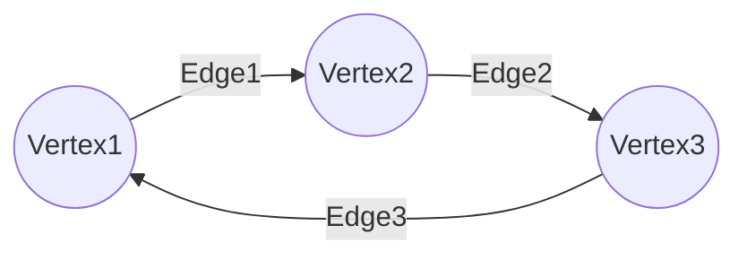
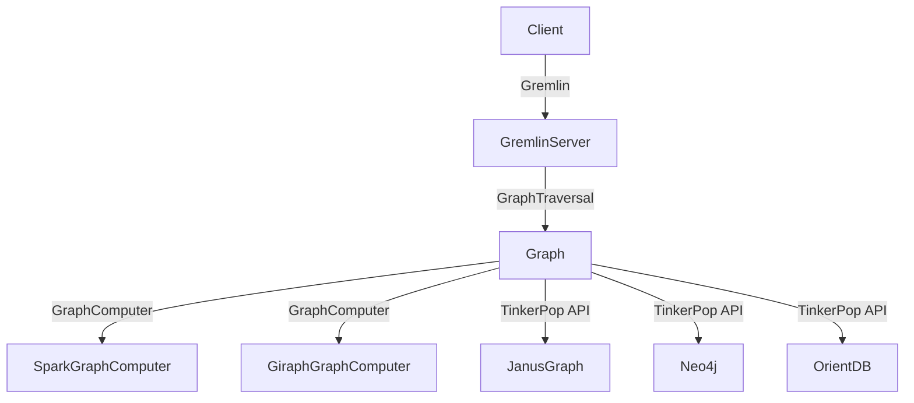
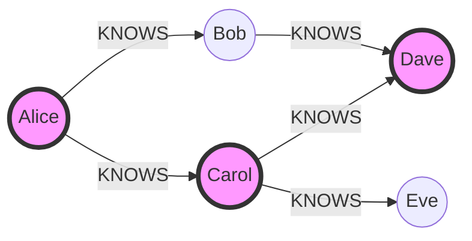

# TinkerPop原理与代码实例讲解

关键词：图数据库, 图计算, Gremlin, TinkerPop, JanusGraph

## 1. 背景介绍 

### 1.1 问题的由来
在大数据时代,越来越多的数据呈现出图结构的特点,传统的关系型数据库已经无法满足复杂的图数据处理需求。图数据库应运而生,成为了处理高度关联数据的利器。然而,不同的图数据库使用不同的查询语言和API,给开发者带来了很大的学习和迁移成本。

### 1.2 研究现状
Apache TinkerPop作为一个通用的图计算框架,提供了一套标准的属性图数据模型和图遍历查询语言Gremlin,让开发者可以用同一套API操作各种图数据库。目前已经有几十种图数据库实现了TinkerPop接口,包括Neo4j、JanusGraph、OrientDB等。TinkerPop已经成为了事实上的图数据库标准,在学术界和工业界得到了广泛应用。

### 1.3 研究意义
深入理解TinkerPop的原理和使用方法,对于开发高性能的图数据库应用具有重要意义。通过本文的学习,读者可以掌握TinkerPop的核心概念、图遍历算法、查询优化技术等,并能够使用Gremlin语言进行复杂的图数据查询和分析。这些知识不仅适用于已经支持TinkerPop的图数据库,也为将来实现自己的图数据库奠定基础。

### 1.4 本文结构
本文将首先介绍TinkerPop的核心概念和体系结构,然后深入分析图遍历的算法原理,并给出数学模型和详细推导过程。在此基础上,我们将通过实际的代码实例来演示如何使用Gremlin语言进行图数据操作,并总结TinkerPop的实际应用场景和最佳实践。最后,我们展望了图数据库技术的未来发展趋势和面临的挑战。

## 2. 核心概念与联系

在正式介绍TinkerPop之前,我们先来了解一下图数据库的一些核心概念:

- 图(Graph):由节点(Vertex)和边(Edge)组成的数据结构,用于描述事物之间的关联关系。
- 节点(Vertex):图中的实体对象,可以包含属性(Property)。
- 边(Edge):连接节点的关联关系,可以是有向的或无向的,也可以包含属性。 
- 属性(Property):节点和边的键值对属性,描述它们的特征。
- 路径(Path):图中节点和边构成的一条遍历路线。

下图展示了图的基本组成要素:



TinkerPop基于属性图模型,定义了一套统一的图数据结构和操作接口:

- Graph:图数据库的顶层抽象,提供对图的CRUD操作。
- GraphTraversalSource:用于创建GraphTraversal图遍历对象的工厂类。
- GraphTraversal:图遍历DSL,用于描述对图的查询和分析逻辑。
- GraphComputer:用于进行并行图计算的框架。
- GremlinServer:通过服务端的方式对外暴露图操作API。

下图描述了TinkerPop的系统架构:



## 3. 核心算法原理 & 具体操作步骤

### 3.1 算法原理概述
图遍历是图数据库最核心的操作之一,TinkerPop使用Gremlin DSL来描述图遍历过程。Gremlin的遍历过程可以分解为一系列的遍历步骤(Step),每一步都以前一步的结果作为输入,通过某种运算逻辑产生新的输出。TinkerPop通过数据流(Dataflow)的方式来实现遍历运算,即每个Step都可以看作数据处理管道中的一个操作。

### 3.2 算法步骤详解
一个完整的Gremlin遍历过程分为以下几个步骤:

1. 创建GraphTraversalSource对象,指定图数据源。
2. 使用GraphTraversalSource的图遍历方法(如V()、E()等)选择遍历的起始元素。
3. 使用各种遍历步骤(如has()、where()、order()等)对上一步选择的元素进行过滤、转换、聚合等操作,产生新的遍历结果。
4. 根据需要重复第3步,直到获得最终的遍历输出。
5. 调用终结方法(如toList()、iterate()等)触发遍历执行并获取结果。

举个例子,下面的Gremlin语句查询图中所有年龄大于30岁且姓名以"A"开头的顶点:

```groovy
g.V().has("age", gt(30)).has("name", startingWith("A")) 
```

其遍历过程如下:

```mermaid
graph LR
  Start((start))--V()-->AllVertices((All Vertices))
  AllVertices--has("age", gt(30))-->FilteredVertices1((Filtered Vertices 1))
  FilteredVertices1--has("name", startingWith("A"))-->FilteredVertices2((Filtered Vertices 2))
```

### 3.3 算法优缺点
Gremlin遍历的优点在于:
1. 语义清晰,遍历逻辑以链式调用的方式直观表达。  
2. 可组合性强,不同的遍历步骤可以灵活组合,适应各种查询需求。
3. 可移植性好,与具体的图数据库解耦,方便迁移。

但Gremlin遍历也有一些局限性:
1. 图遍历的中间结果可能会很大,占用较多内存。
2. 复杂的遍历逻辑不容易优化,查询效率取决于图数据库的实现。

### 3.4 算法应用领域
图遍历算法广泛应用于各种图数据分析场景,例如:
- 社交网络分析:查找节点的邻居、计算节点的重要度等。
- 金融风控:交易关系筛查、反洗钱等。
- 知识图谱:实体查询、关系推理等。

## 4. 数学模型和公式 & 详细讲解 & 举例说明

### 4.1 数学模型构建
图遍历过程可以用有向多重图(directed multigraph)来建模。设图$G=(V,E)$,其中$V$为顶点集,$E$为边集。每个顶点$v \in V$和每条边$e \in E$都可能有一组属性$P_v$和$P_e$。图遍历的目标是找出满足某些条件的一组顶点$V' \subseteq V$或边$E' \subseteq E$。

### 4.2 公式推导过程
以上一节的年龄大于30岁且姓名以"A"开头的顶点查询为例,设查询条件为$C_1$和$C_2$,则数学描述为:

$$
\begin{aligned}
V' = \{v \in V | C_1(v) \wedge C_2(v)\} \\
C_1(v) = v.age > 30 \\
C_2(v) = startsWith(v.name, "A")
\end{aligned}
$$

其中$C_1$和$C_2$都是顶点到布尔值的映射函数,即$C_1: V \to \{true, false\}$,$C_2: V \to \{true, false\}$。

进一步,可以将Gremlin的遍历步骤抽象为一系列映射函数的复合:

$$
V \stackrel{f_1}{\to} V_1 \stackrel{f_2}{\to} V_2 \stackrel{f_3}{\to} ... \stackrel{f_n}{\to} V_n
$$

其中$f_i$表示第$i$个遍历步骤对应的映射逻辑,$V_i$为第$i$步输出的顶点集,最终$V_n$即为遍历的结果顶点集$V'$。

### 4.3 案例分析与讲解
我们以一个实际的图数据库为例来说明Gremlin遍历的过程。假设有一个社交网络图,包含以下数据:

```
Vertex:
Person(1, "Alice", 25)
Person(2, "Bob", 30) 
Person(3, "Carol", 35)
Person(4, "Dave", 40)
Person(5, "Eve", 28)

Edge:
KNOWS(1, 2)
KNOWS(1, 3) 
KNOWS(2, 4)
KNOWS(3, 4)
KNOWS(3, 5)
```

现在我们要查询Alice的所有超过30岁的朋友,Gremlin语句如下:

```groovy
g.V().has("name","Alice").out("KNOWS").has("age",gt(30))
```

遍历过程如下图所示:



黄色高亮的顶点即为满足查询条件的Alice的朋友Carol和Dave。

### 4.4 常见问题解答
Q: Gremlin遍历的时间复杂度是多少?
A: 遍历的时间复杂度取决于具体的数据库实现,一般为$O(n)$,其中$n$为顶点或边的数量。

Q: Gremlin支持哪些类型的遍历?
A: Gremlin支持前向遍历(outE/inV)、后向遍历(inE/outV)、属性遍历(properties)、分支遍历(branch)、循环遍历(repeat/until)等多种类型。

Q: Gremlin如何实现全局聚合操作?
A: 可以使用group()、groupCount()等步骤将遍历结果按key进行分组聚合,也可以用sum()、mean()等方法直接对数值型结果进行聚合计算。

## 5. 项目实践：代码实例和详细解释说明

### 5.1 开发环境搭建
要使用TinkerPop进行图数据库开发,首先需要搭建相应的开发环境。以Java为例,主要步骤如下:

1. 安装JDK 8或更高版本,配置JAVA_HOME环境变量。
2. 在项目中添加TinkerPop的Maven依赖:

```xml
<dependency>
  <groupId>org.apache.tinkerpop</groupId>
  <artifactId>gremlin-core</artifactId>
  <version>3.4.8</version>
</dependency>
```

3. 选择一个TinkerPop兼容的图数据库,如JanusGraph、Neo4j等,根据其文档完成安装和配置。

### 5.2 源代码详细实现
下面我们以JanusGraph为例,演示如何使用Gremlin进行图遍历查询:

```java
// 连接JanusGraph数据库
JanusGraph graph = JanusGraphFactory.open("conf/janusgraph-cassandra.properties");

// 获取遍历源
GraphTraversalSource g = graph.traversal();

// 添加测试数据
Vertex alice = g.addV("person").property("name", "Alice").property("age", 20).next();
Vertex bob = g.addV("person").property("name", "Bob").property("age", 22).next();
Vertex carol = g.addV("person").property("name", "Carol").property("age", 25).next();
g.addE("knows").from(alice).to(bob).property("since", 2018);
g.addE("knows").from(alice).to(carol).property("since", 2019);

// 查询Alice的所有朋友
List<Vertex> friends = g.V().has("name","Alice").out("knows").toList();
System.out.println("Alice's friends: " + friends);

// 查询Alice认识的人中年龄大于22岁的
List<Vertex> olderFriends = g.V().has("name","Alice").out("knows").has("age", gt(22)).toList();
System.out.println("Alice's older friends: " + olderFriends);

// 统计每个人的朋友数量 
Map<String, Long> friendCount = g.V().groupCount().by("name").next();
System.out.println("Friend count: " + friendCount);
```

### 5.3 代码解读与分析
第1-2行代码展示了如何连接JanusGraph数据库并获取GraphTraversalSource遍历源对象。

第4-8行代码添加了3个顶