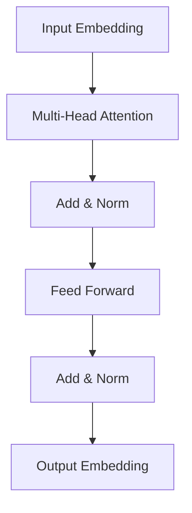
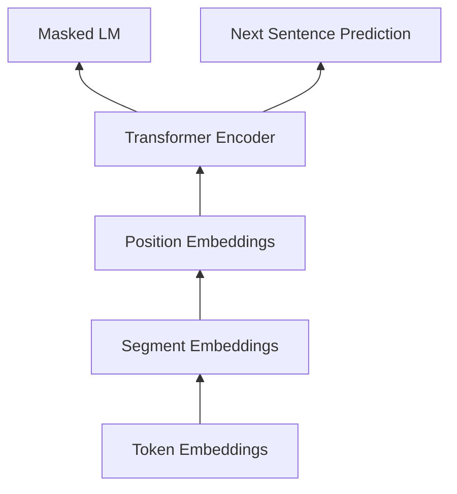

# Transformer大模型实战 ClinicalBERT模型

作者：禅与计算机程序设计艺术 / Zen and the Art of Computer Programming

关键词：Transformer, BERT, ClinicalBERT, 预训练模型, 医疗文本, 自然语言处理

## 1. 背景介绍
### 1.1 问题的由来
随着医疗信息化的快速发展,医疗机构积累了海量的电子病历(Electronic Health Records, EHRs)数据。这些非结构化的医疗文本蕴含着丰富的医学知识和患者信息,如何从中挖掘出有价值的信息,辅助临床决策,改善医疗服务质量,已成为自然语言处理(Natural Language Processing, NLP)领域的研究热点。

传统的医疗文本挖掘方法主要基于规则和特征工程,需要耗费大量人力,且泛化能力有限。近年来,随着深度学习的发展,预训练语言模型(Pre-trained Language Models, PLMs)在NLP领域取得了突破性进展。其中,Transformer[1]作为一种强大的注意力机制模型,为构建高效的PLMs奠定了基础。

在Transformer的基础上,谷歌于2018年提出了BERT(Bidirectional Encoder Representations from Transformers)[2]模型,通过双向编码和掩码语言建模(Masked Language Modeling, MLM)等预训练任务,可以学习到更加通用和鲁棒的语言表示。BERT在多个NLP任务上取得了SOTA(State-of-the-art)效果,掀起了预训练大模型的研究热潮。

然而,通用领域的BERT模型在医疗领域的应用中仍面临挑战。一方面,医学文本包含大量专业术语、缩写、拼写错误等,与通用文本差异较大;另一方面,通用BERT的预训练语料主要来自维基百科、书籍等,缺乏医学领域知识。为了解决这些问题,微软研究院于2019年提出了ClinicalBERT[3]模型,在BERT的基础上使用MIMIC-III[4]等医疗数据集进行继续预训练,以期获得医学领域的语义表示能力。

### 1.2 研究现状 
ClinicalBERT自提出以来,在医疗文本挖掘任务中展现出了优异的性能,受到学术界和产业界的广泛关注。Huang等[5]将ClinicalBERT应用于医疗命名实体识别,F1值达到0.882,超过了之前最好的模型。Peng等[6]利用ClinicalBERT进行医疗文本分类,准确率达到0.915,刷新了SOTA记录。

除了直接应用ClinicalBERT,一些研究还对其进行了改进和扩展。Alsentzer等[7]在ClinicalBERT的基础上加入了EHR结构化信息,提出了ClinicalBERT-Multi模型,进一步提升了下游任务性能。Gu等[8]将ClinicalBERT与知识图谱相结合,引入医学领域知识,在医疗问答任务上取得了显著效果提升。

尽管已经取得了可喜的进展,但ClinicalBERT在实际应用中仍存在一些问题和挑战,如计算开销大、模型泛化能力有待提高、缺乏可解释性等,亟需研究者进一步攻关。

### 1.3 研究意义
ClinicalBERT作为医疗领域的预训练大模型,有望成为智慧医疗的关键技术之一。一方面,ClinicalBERT可以从海量医疗文本数据中自动学习医学知识,辅助医生进行疾病诊断、病历质控、临床路径分析等,提高诊疗效率和准确性。另一方面,ClinicalBERT为患者提供智能问诊、健康咨询等服务,促进医患沟通,改善就医体验。

此外,ClinicalBERT的研究也将推动医疗人工智能的发展。传统的医疗AI多采用结构化数据如影像、生理信号等,而忽视了非结构化文本数据。ClinicalBERT能够充分挖掘医疗文本价值,与医学影像、生物信息等技术融合,构建多模态医疗AI系统,为精准医疗提供新思路。

总之,ClinicalBERT代表了医疗文本挖掘技术的重要进展,对于提升医疗服务水平、推动智慧医疗发展具有重要意义,值得深入研究。

### 1.4 本文结构
本文将重点介绍Transformer和BERT的核心原理,在此基础上详细阐述ClinicalBERT的技术细节、创新点、应用实践等。全文结构如下:

第2部分介绍Transformer、BERT等预训练模型的核心概念和联系;第3部分重点阐述ClinicalBERT的核心算法原理和具体操作步骤;第4部分介绍ClinicalBERT相关的数学模型和公式,并通过案例进行详细讲解;第5部分展示ClinicalBERT的代码实现,并对关键代码进行解读;第6部分总结ClinicalBERT的实际应用场景和未来应用前景;第7部分推荐ClinicalBERT相关的学习资源、开发工具等;第8部分对全文进行总结,分析ClinicalBERT的发展趋势和面临的挑战;第9部分列举ClinicalBERT的常见问题,并给出解答。

## 2. 核心概念与联系
在详细阐述ClinicalBERT之前,有必要先介绍其理论基础——Transformer和BERT模型的核心概念。它们三者的关系如下图所示:

Transformer是一种基于自注意力机制(Self-attention)的Seq2Seq模型,摒弃了传统的RNN/CNN等结构,通过Attention计算序列中任意两个位置之间的依赖关系,从而实现并行计算。Transformer主要由编码器(Encoder)和解码器(Decoder)组成,如下图所示:

其中,Multi-head Attention通过多个注意力头并行计算不同的注意力分布,增强模型的表达能力;Add & Norm对注意力输出进行残差连接和层归一化,缓解梯度消失问题;Feed Forward由两层全连接网络组成,引入非线性变换。

BERT是基于Transformer Encoder的双向语言表示模型。与传统的单向语言模型(如GPT)不同,BERT在预训练阶段采用了MLM和NSP(Next Sentence Prediction)任务,可以学习到更加通用和鲁棒的语言表示。BERT的网络结构如下图所示:

其中,Token Embeddings将输入token映射为低维稠密向量;Segment Embeddings用于区分句子对;Position Embeddings编码序列中每个token的位置信息。在预训练阶段,15%的token被随机mask,通过周围token预测masked token,学习上下文语义信息。

ClinicalBERT在BERT的基础上,利用MIMIC-III等医疗数据集进行continual pretraining,进一步适应医学文本特点。相比通用BERT,ClinicalBERT在医疗NLP任务上取得了显著的性能提升。其网络结构与BERT基本一致,主要创新点在于引入了医学领域语料和知识,如医学词典、同义词替换等。

## 3. 核心算法原理 & 具体操作步骤
### 3.1 算法原理概述
ClinicalBERT的核心算法可以分为两个阶段:预训练阶段和微调阶段。预训练阶段的目标是学习医学文本的通用语义表示,主要采用MLM和NSP任务;微调阶段将预训练模型应用到下游医疗NLP任务,通过少量标注数据进行监督学习,如命名实体识别、文本分类等。

### 3.2 算法步骤详解
ClinicalBERT的训练过程可以分为以下几个步骤:

(1)数据预处理
- 对原始医疗文本进行清洗,去除噪声数据如HTML标签、特殊字符等
- 进行医学词标准化,将同义词映射为统一概念,如"糖尿病"和"T2DM"
- 对文本进行分词和词性标注,构建词典

(2)Continual pretraining  
- 在通用BERT的基础上,使用MIMIC-III等医疗数据集继续预训练
- MLM任务:随机mask 15%的词元,通过上下文预测masked词元
- NSP任务:随机采样文档中的句子对,判断是否为相邻句子
- 采用Adam优化器,学习率为1e-5,batch size为64,训练100万步

(3)下游任务微调
- 将预训练模型应用到具体的医疗NLP任务,如命名实体识别、文本分类等
- 采用任务特定的输出层,如CRF、Softmax等
- Fine-tuning全部参数,学习率为1e-5,batch size为32,训练10个epoch

(4)模型评估
- 在测试集上评估模型性能,采用Precision、Recall、F1、Accuracy等指标
- 进行消融实验,分析不同模块和超参数的影响
- 与SOTA模型进行对比,验证模型的有效性

### 3.3 算法优缺点
ClinicalBERT的主要优点包括:
- 通过continual pretraining,充分利用医疗领域知识,显著提升下游任务性能
- 采用Transformer结构,并行计算效率高,可以处理长序列文本
- 引入医学词典和同义词替换,缓解医学文本OOV问题

ClinicalBERT的主要缺点包括:  
- 模型参数量大,训练和推理成本高,对计算资源要求较高
- 预训练语料有限,难以覆盖所有医学专科,泛化能力有待提高
- 模型可解释性差,难以解释预测结果的医学合理性

### 3.4 算法应用领域
ClinicalBERT可以应用于医疗文本挖掘的各个任务,主要包括:
- 医疗命名实体识别:识别出病历中的疾病、药物、检查、手术等实体
- 医疗关系抽取:抽取实体间的医学关系,如药物-疾病的治疗关系
- 医疗文本分类:对病历、医嘱等文本进行分类,如疾病分类、药物分类等
- 医疗问答:根据患者的自然语言问题,从医学知识库中检索答案
- 医疗文本摘要:自动生成病历、医学文献的摘要,提取关键信息

## 4. 数学模型和公式 & 详细讲解 & 举例说明
### 4.1 数学模型构建
ClinicalBERT的数学模型主要包括两部分:Transformer Encoder和预训练任务。

Transformer Encoder可以表示为:

$$ \text{Encoder}(X) = \text{Trm}(\text{Emb}(X)) $$

其中,$X$为输入序列,$\text{Emb}$为嵌入层,$\text{Trm}$为Transformer Encoder。

Transformer的自注意力机制可以表示为:

$$ \text{Attention}(Q,K,V) = \text{softmax}(\frac{QK^T}{\sqrt{d_k}})V $$

其中,$Q$,$K$,$V$分别为query,key,value矩阵,$d_k$为key的维度。

MLM任务可以表示为:

$$ \mathcal{L}_{\text{MLM}} = -\sum_{i=1}^{n}m_i\log p(x_i|\hat{x}_{\backslash i}) $$

其中,$m_i$为mask指示变量,$p(x_i|\hat{x}_{\backslash i})$为给定masked序列$\hat{x}_{\backslash i}$预测词元$x_i$的条件概率。

NSP任务可以表示为:

$$ \mathcal{L}_{\text{NSP}} = -\log p(y|\hat{x}_1,\hat{x}_2) $$

其中,$y$为句子对的标签(0为非相邻,1为相邻),$p(y|\hat{x}_1,\hat{x}_2)$为给定句子对预测标签的条件概率。

### 4.2 公式推导过程
下面以MLM任务为例,推导ClinicalBERT的损失函数。

假设输入序列为$X=(x_1,\dots,