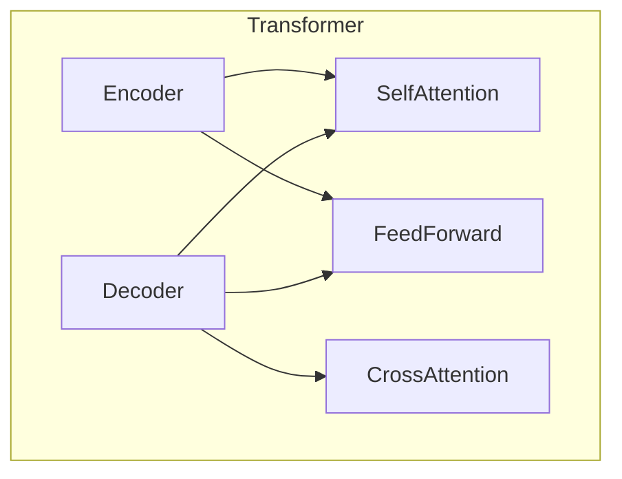

# Transformer大模型实战 理解XLM-R模型

## 1. 背景介绍

### 1.1 问题的由来

在自然语言处理(NLP)领域,传统的序列模型如RNN和LSTM等存在一些固有的缺陷,例如梯度消失/爆炸问题、难以并行计算等。2017年,谷歌大脑提出了Transformer模型,它完全基于注意力机制,摆脱了RNN的递归计算方式,可以高效并行训练。Transformer模型在机器翻译等任务上取得了突破性的成果,极大推动了NLP领域的发展。

随着Transformer模型在各种NLP任务上的卓越表现,人们开始探索如何将其扩展到更大规模的预训练模型中。2019年,Facebook AI研究院提出了XLM-R(Cross-lingual Language Model-Roberta)模型,它是一种基于Transformer的跨语言大型预训练语言模型。

### 1.2 研究现状

XLM-R模型在100种语言的大规模语料库上进行了预训练,展现出了强大的跨语言理解和生成能力。它可以在多种下游NLP任务上进行微调和迁移学习,例如文本分类、序列标注、问答系统等,并取得了令人瞩目的性能。

然而,XLM-R模型的训练和应用仍然面临着一些挑战,例如巨大的计算资源需求、模型优化和压缩的难题、多语种数据的不平衡问题等。此外,如何有效利用XLM-R模型的跨语言能力,在实际应用中发挥其最大潜力,也是一个值得探讨的课题。

### 1.3 研究意义

深入理解XLM-R模型的原理和实现细节,对于推动NLP领域的发展具有重要意义。本文将全面介绍XLM-R模型的背景知识、核心概念、算法原理、数学模型、代码实现等内容,旨在帮助读者掌握这一领先的大型预训练语言模型。

通过本文的学习,读者将能够:

1. 了解Transformer模型和XLM-R模型的发展历程及其在NLP领域的重要地位。
2. 掌握XLM-R模型的核心概念和算法原理,包括自注意力机制、编码器-解码器结构、跨语言预训练等。
3. 深入理解XLM-R模型的数学模型和公式推导过程。
4. 学习如何使用Python和深度学习框架(如PyTorch)实现XLM-R模型的代码。
5. 探讨XLM-R模型在实际应用场景中的使用方法和注意事项。
6. 了解XLM-R模型的未来发展趋势和面临的挑战。

### 1.4 本文结构

本文共分为9个部分,内容安排如下:

1. 背景介绍
2. 核心概念与联系
3. 核心算法原理与具体操作步骤
4. 数学模型和公式详细讲解与举例说明
5. 项目实践:代码实例和详细解释说明
6. 实际应用场景
7. 工具和资源推荐
8. 总结:未来发展趋势与挑战
9. 附录:常见问题与解答

## 2. 核心概念与联系

在深入探讨XLM-R模型的细节之前,我们先来回顾一下与之密切相关的几个核心概念:

### 2.1 Transformer模型

Transformer是一种全新的基于注意力机制的序列模型,它完全摒弃了RNN和CNN等传统模型的结构。Transformer模型主要由编码器(Encoder)和解码器(Decoder)两个部分组成,两者都采用了多头自注意力机制和前馈神经网络。

Transformer模型的自注意力机制可以捕捉序列中任意两个位置之间的依赖关系,避免了RNN的递归计算方式带来的梯度消失/爆炸问题。此外,Transformer模型的计算过程可以高度并行化,大大提高了训练效率。

### 2.2 预训练语言模型

预训练语言模型(Pre-trained Language Model,PLM)是NLP领域的一种重要范式。它通过在大规模语料库上进行无监督预训练,学习通用的语言表示,然后可以在各种下游NLP任务上进行微调和迁移学习,从而显著提高模型的性能。

典型的预训练语言模型包括BERT、GPT、XLNet等。这些模型在自然语言理解和生成任务上都取得了卓越的成绩,推动了NLP技术的快速发展。

### 2.3 多语种预训练

传统的预训练语言模型通常只关注单一语种的语料,难以捕捉跨语言的语义和语法信息。为了解决这一问题,研究人员提出了多语种预训练的方法,即在包含多种语言的大规模语料库上进行联合预训练,使模型能够学习到跨语言的通用表示。

多语种预训练模型不仅能够在单语种任务上取得优异表现,而且可以在机器翻译、跨语言问答等多语种任务中发挥重要作用。XLM-R模型就是一种典型的基于Transformer的多语种大型预训练语言模型。

### 2.4 XLM-R模型

XLM-R(Cross-lingual Language Model-RoBERTa)模型是Facebook AI研究院在2019年提出的一种多语种大型预训练语言模型。它是在XLM模型的基础上,借鉴了RoBERTa模型的优化策略,进一步提升了模型的性能。

XLM-R模型在100种语言的大规模语料库上进行了预训练,展现出了强大的跨语言理解和生成能力。它可以在多种下游NLP任务上进行微调和迁移学习,例如文本分类、序列标注、问答系统、机器翻译等,并取得了令人瞩目的性能。

XLM-R模型的核心思想是通过大规模的多语种预训练,学习到通用的跨语言表示,从而在各种语言和任务之间实现有效的迁移。它继承了Transformer模型的优势,如并行计算、长距离依赖捕捉等,同时采用了一些特殊的预训练策略和优化方法,进一步提高了模型的性能。

## 3. 核心算法原理与具体操作步骤

### 3.1 算法原理概述

XLM-R模型的核心算法原理可以概括为以下几个方面:

1. **基于Transformer的编码器-解码器架构**

   XLM-R模型采用了Transformer模型的编码器-解码器架构。编码器用于将输入序列编码为上下文表示,解码器则根据上下文表示和目标序列进行解码和生成。

2. **多头自注意力机制**

   与原始Transformer模型类似,XLM-R模型在编码器和解码器中都使用了多头自注意力机制。自注意力机制可以捕捉序列中任意两个位置之间的依赖关系,从而更好地建模长距离依赖。

3. **跨语言注意力机制**

   在预训练阶段,XLM-R模型采用了一种特殊的跨语言注意力机制。具体来说,它将多语种语料混合在一起,并在输入序列中添加语言标识符(Language ID),使模型能够学习到跨语言的语义和语法信息。

4. **大规模多语种预训练**

   XLM-R模型在100种语言的大规模语料库上进行了预训练,包括Wikipedia、CommonCrawl、书籍等多种数据源。这种大规模的多语种预训练使得模型能够学习到通用的跨语言表示,从而在各种语言和任务之间实现有效的迁移。

5. **优化策略**

   XLM-R模型借鉴了RoBERTa模型的一些优化策略,如动态遮蔽、BERT预训练损失等,进一步提升了模型的性能。

### 3.2 算法步骤详解

XLM-R模型的训练和应用过程可以分为以下几个主要步骤:

1. **数据预处理**

   首先需要对多语种语料进行预处理,包括文本清洗、分词、构建词表等。同时,还需要为每个语句添加语言标识符(Language ID),以便模型能够区分不同语言的输入。

2. **模型初始化**

   初始化XLM-R模型的参数,包括embedding层、编码器层、解码器层等。可以从预训练好的XLM-R模型加载参数,也可以从头开始训练。

3. **预训练**

   在大规模多语种语料库上对XLM-R模型进行预训练。预训练任务包括掩码语言模型(Masked Language Modeling,MLM)和下一句预测(Next Sentence Prediction,NSP)等。在预训练过程中,模型会学习到通用的跨语言表示。

4. **微调**

   将预训练好的XLM-R模型在特定的下游NLP任务上进行微调,如文本分类、序列标注、问答系统等。微调过程中,模型的大部分参数保持不变,只对最后几层进行微调,以适应特定任务。

5. **评估和优化**

   在验证集上评估模型的性能,根据评估指标(如准确率、F1分数等)对模型进行优化,包括调整超参数、修改损失函数等。

6. **模型部署**

   将优化后的XLM-R模型部署到实际的应用系统中,用于处理新的输入数据。

### 3.3 算法优缺点

XLM-R模型作为一种大型预训练语言模型,具有以下优点:

1. **强大的跨语言能力**:通过大规模的多语种预训练,XLM-R模型能够学习到通用的跨语言表示,在各种语言和任务之间实现有效的迁移。
2. **卓越的性能**:在多种下游NLP任务上,XLM-R模型都展现出了优异的性能,在某些任务上甚至超过了人类水平。
3. **高效的并行计算**:基于Transformer架构,XLM-R模型的计算过程可以高度并行化,大大提高了训练效率。
4. **灵活的任务适应性**:XLM-R模型可以在不同的NLP任务上进行微调和迁移学习,具有很强的灵活性和通用性。

同时,XLM-R模型也存在一些缺点和挑战:

1. **巨大的计算资源需求**:训练XLM-R模型需要消耗大量的计算资源,包括GPU、内存等,对硬件设备要求较高。
2. **模型优化和压缩的难题**:如何在保持模型性能的同时,进一步优化和压缩XLM-R模型的大小和计算复杂度,是一个值得探讨的问题。
3. **多语种数据的不平衡问题**:不同语言的语料数量和质量存在较大差异,可能会导致模型在某些语言上的性能不佳。
4. **领域适应性的挑战**:XLM-R模型的预训练语料主要来自通用领域,在特定领域的任务上可能需要进行进一步的领域适应性调整。

### 3.4 算法应用领域

作为一种通用的大型预训练语言模型,XLM-R模型可以应用于NLP领域的各种任务和场景,包括但不限于:

1. **文本分类**:如新闻分类、情感分析、垃圾邮件过滤等。
2. **序列标注**:如命名实体识别、关系抽取、事件检测等。
3. **问答系统**:如开放域问答、阅读理解等。
4. **机器翻译**:利用XLM-R模型的跨语言能力,可以在多语种机器翻译任务中发挥作用。
5. **文本生成**:如自动文本摘要、对话系统、创作辅助等。
6. **信息检索**:如semantic search、相关性排序等。
7. **其他NLP任务**:如文本纠错、语言生成、语音识别等。

除了NLP领域,XLM-R模型的思想和方法也可以启发和推动其他领域的研究,如计算机视觉、多模态学习等。

## 4. 数学模型和公式详细讲解与举例说明

### 4.1 数学模型构建

XLM-R模型的数学模型主要基于Transformer架构,包括编码器(Encoder)和解码器