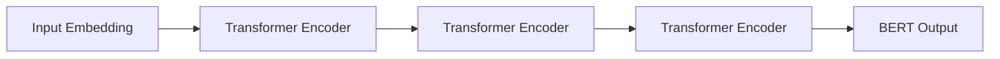

# Transformer大模型实战 芬兰语的FinBERT模型

关键词：Transformer, BERT, FinBERT, 芬兰语, 预训练语言模型, 迁移学习

## 1. 背景介绍
### 1.1  问题的由来
近年来,随着深度学习技术的飞速发展,自然语言处理(NLP)领域取得了突破性进展。尤其是Transformer[1]的提出和BERT[2]等预训练语言模型的出现,极大地推动了NLP在各个任务上的性能提升。然而,大多数先进的NLP模型都是在资源丰富的语言(如英语)上训练的,对于低资源语言而言,由于缺乏大规模标注数据,直接训练模型往往效果不佳。因此,如何利用现有的强大模型,针对特定语言进行适配和优化,成为了NLP研究的一个重要课题。

### 1.2  研究现状 
针对低资源语言的NLP建模,目前主流的做法是在源语言(如英语)上预训练模型,然后通过迁移学习的方式应用到目标语言中。这种跨语言迁移学习可以有效利用源语言中学到的语言知识,减少目标语言所需的标注数据。例如,多语言BERT[3]通过在100多种语言的语料上联合训练,可以实现跨语言的零样本迁移。XLM[4]、XLM-R[5]等模型进一步扩大了预训练语料的规模和语言覆盖面,展现出更强的跨语言迁移能力。

### 1.3  研究意义
芬兰语作为一种高度屈折的语言,具有丰富的形态变化和复杂的语法结构,给NLP任务带来了挑战。目前针对芬兰语的NLP资源和模型还比较匮乏,亟需加强相关研究。本文旨在探索如何利用强大的Transformer语言模型,构建适用于芬兰语的预训练模型FinBERT,并在下游任务中验证其有效性。这不仅可以推动芬兰语NLP的发展,也为其他低资源语言的建模提供了参考。

### 1.4  本文结构
本文后续章节安排如下:第2节介绍Transformer和BERT的核心概念;第3节详细阐述FinBERT的训练算法和流程;第4节给出数学模型和公式推导;第5节展示FinBERT的代码实现;第6节讨论其在实际中的应用场景;第7节推荐相关工具和资源;第8节总结全文并展望未来;第9节列出常见问题解答。

## 2. 核心概念与联系
Transformer[1]是一种基于自注意力机制的序列建模框架,摒弃了传统的RNN/CNN等结构,通过Attention计算序列中元素之间的依赖关系,并行建模序列。其核心是多头自注意力(Multi-head Self-attention)和前馈神经网络(Feed-Forward Network),通过堆叠多个Transformer Block来提取深层特征。

BERT[2]是基于Transformer Encoder结构的大规模预训练语言模型,通过Masked Language Model和Next Sentence Prediction两个预训练任务,在大规模无监督语料上学习通用的语言表示。预训练后的BERT模型可以方便地迁移到下游NLP任务,并以较少的训练数据取得优异的效果。

下图展示了Transformer和BERT的内在联系:

FinBERT是在BERT的基础上,针对芬兰语语料进行继续预训练得到的语言模型。它继承了BERT强大的语言理解和特征提取能力,同时更加适配芬兰语的语言特点。FinBERT可以无缝迁移到芬兰语的各种NLP任务中,有望取得比从头训练更好的效果。

## 3. 核心算法原理 & 具体操作步骤
### 3.1  算法原理概述
FinBERT的训练主要分为两个阶段:预训练阶段和微调阶段。预训练阶段在大规模芬兰语无监督语料上训练语言模型,学习芬兰语的通用语言知识;微调阶段在特定任务的标注数据上训练模型,使其适应具体任务。

预训练阶段采用和BERT类似的Masked Language Model(MLM)任务,随机Mask掉一定比例的Token,让模型根据上下文预测这些Token。这促使模型学习词汇、语法、语义等多方面的语言知识。此外,还可加入Next Sentence Prediction(NSP)任务,预测两个句子是否前后相邻,使模型学习语篇连贯性。

微调阶段将预训练模型应用到下游任务,在任务数据上进一步训练模型。常见任务包括:
- 文本分类:在[CLS]位置的输出接分类器
- 序列标注:对每个Token的输出做标注
- 问答:对Query和Context拼接编码,预测答案范围
- 文本生成:用Decoder解码BERT的输出

### 3.2  算法步骤详解
FinBERT的训练步骤如下:

**Step1:芬兰语语料准备**
- 收集尽可能多的芬兰语无监督语料,如新闻、百科、书籍等
- 对语料进行清洗,去除噪声数据和非芬兰语内容
- 进行分词、truecasing等文本预处理

**Step2:预训练数据构造**  
对每个文本序列:
- 以一定概率(如15%)随机Mask部分Token,替换为[MASK]、随机词或保持不变
- 以一定概率(如50%)随机选择另一个片段作为下一个句子,构成NSP任务的样本

**Step3:模型训练**
- 使用Transformer Encoder作为骨干网络,初始化为多语言BERT的参数
- 在MLM任务上,对Mask位置的输出接softmax层,计算Masked Token的交叉熵损失
- 在NSP任务上,对[CLS]位置的输出接分类器,计算IsNext的交叉熵损失
- 联合优化MLM和NSP任务的损失函数,训练多个epoch直至收敛

**Step4:下游任务微调**
- 将预训练模型应用到目标任务,在任务数据上进一步训练
- 根据任务类型,设计合适的输入表示和输出层
- 以较小的学习率微调全部或部分参数,避免过拟合
- 在验证集上调参选择最优模型,在测试集上评估性能

### 3.3  算法优缺点
优点:
- 继承了BERT强大的语言理解能力,可以更好地建模芬兰语
- 通过迁移学习减少了目标语言的标注数据需求,提高了低资源语言的任务性能
- 可以灵活迁移到各种下游任务,具有广泛的适用性

缺点:  
- 预训练需要大量计算资源和时间,对硬件要求较高
- 模型参数量大,推理速度慢,不适合实时场景
- 仍然依赖一定规模的目标语言语料,对极低资源语言效果有限

### 3.4  算法应用领域
FinBERT可以应用到芬兰语的各种NLP任务中,如:
- 情感分析:判断一段文本的情感倾向
- 命名实体识别:标注文本中的人名、地名、机构名等
- 语法分析:进行词性标注、依存分析等
- 文本摘要:自动生成文章摘要
- 机器翻译:将其他语言翻译成芬兰语
- 问答系统:根据问题从文档中寻找答案
- 对话系统:实现人机自然对话

## 4. 数学模型和公式 & 详细讲解 & 举例说明
### 4.1  数学模型构建
FinBERT的数学模型主要包括输入表示、Transformer Encoder、MLM和NSP任务等部分。

**输入表示**:
对于一个输入序列$\mathbf{x}=(x_1,\ldots,x_n)$,每个Token $x_i$被映射为嵌入向量$\mathbf{e}_i$:

$$
\mathbf{e}_i = \mathbf{E}(x_i) + \mathbf{P}_i + \mathbf{S}_i
$$

其中,$\mathbf{E}$是Token Embedding矩阵,$\mathbf{P}_i$是位置编码向量,$\mathbf{S}_i$是Segment Embedding向量(用于区分两个句子)。

**Transformer Encoder**:
Transformer Encoder由多个相同的Layer堆叠而成,每个Layer包括两个子层:Multi-Head Attention(MHA)和Feed Forward Network(FFN)。

$$
\begin{aligned}
\mathbf{Q},\mathbf{K},\mathbf{V} &= \mathbf{X}\mathbf{W}^Q,\mathbf{X}\mathbf{W}^K,\mathbf{X}\mathbf{W}^V \\
\text{head}_i &= \text{Attention}(\mathbf{Q}_i,\mathbf{K}_i,\mathbf{V}_i) \\
\text{MHA}(\mathbf{X}) &= \text{Concat}(\text{head}_1,\ldots,\text{head}_h)\mathbf{W}^O \\
\text{FFN}(\mathbf{Z}) &= \max(0, \mathbf{Z} \mathbf{W}_1 + \mathbf{b}_1) \mathbf{W}_2 + \mathbf{b}_2
\end{aligned}
$$

其中,Attention函数为:

$$
\text{Attention}(\mathbf{Q},\mathbf{K},\mathbf{V}) = \text{softmax}(\frac{\mathbf{Q}\mathbf{K}^T}{\sqrt{d_k}})\mathbf{V}
$$

**MLM和NSP任务**:
MLM任务对Mask位置的输出$\mathbf{h}_i^M$进行预测:

$$
p(x_i|\mathbf{x}_{\backslash M}) = \text{softmax}(\mathbf{h}_i^M \mathbf{W}_M + \mathbf{b}_M)
$$

NSP任务对[CLS]位置的输出$\mathbf{h}^{CLS}$进行二分类:

$$
p(\text{IsNext}|\mathbf{x}_1,\mathbf{x}_2) = \text{sigmoid}(\mathbf{w}_{NS}^T \mathbf{h}^{CLS} + b_{NS})
$$

最终的损失函数为:

$$
\mathcal{L} = \mathcal{L}_{MLM} + \mathcal{L}_{NSP}
$$

### 4.2  公式推导过程

MHA的计算过程可以推导如下:

$$
\begin{aligned}
\text{Attention}(\mathbf{Q},\mathbf{K},\mathbf{V}) 
&= \text{softmax}(\frac{\mathbf{Q}\mathbf{K}^T}{\sqrt{d_k}})\mathbf{V} \\
&= \text{softmax}(\frac{(\mathbf{X}\mathbf{W}^Q)(\mathbf{X}\mathbf{W}^K)^T}{\sqrt{d_k}})(\mathbf{X}\mathbf{W}^V) \\
&= \text{softmax}(\frac{\mathbf{X}\mathbf{W}^Q\mathbf{W}^{K^T}\mathbf{X}^T}{\sqrt{d_k}})\mathbf{X}\mathbf{W}^V
\end{aligned}
$$

MLM任务的交叉熵损失可以推导如下:

$$
\begin{aligned}
\mathcal{L}_{MLM} &= -\frac{1}{N_M}\sum_{i=1}^{N_M} \log p(x_i|\mathbf{x}_{\backslash M}) \\
&= -\frac{1}{N_M}\sum_{i=1}^{N_M} \log \text{softmax}(\mathbf{h}_i^M \mathbf{W}_M + \mathbf{b}_M)_{x_i}
\end{aligned}
$$

其中$N_M$为Mask的Token数量。

NSP任务的交叉熵损失可以推导如下:

$$
\begin{aligned}
\mathcal{L}_{NSP} &= -y\log p(\text{IsNext}|\mathbf{x}_1,\mathbf{x}_2) - (1-y)\log(1-p(\text{IsNext}|\mathbf{x}_1,\mathbf{x}_2)) \\
&= -y\log \text{sigmoid}(\mathbf{w}_{NS}^T \mathbf{h}^{CLS} + b_{NS}) - (1-y)\log(1-\text{sigmoid}(\mathbf{w}_{NS}^T \mathbf{h}^{CLS} + b_{NS}))
\end{aligned}
$$

其中$y\in\{0,1\}$为句子对是否相邻的标签。

### 4.3  案例分析与