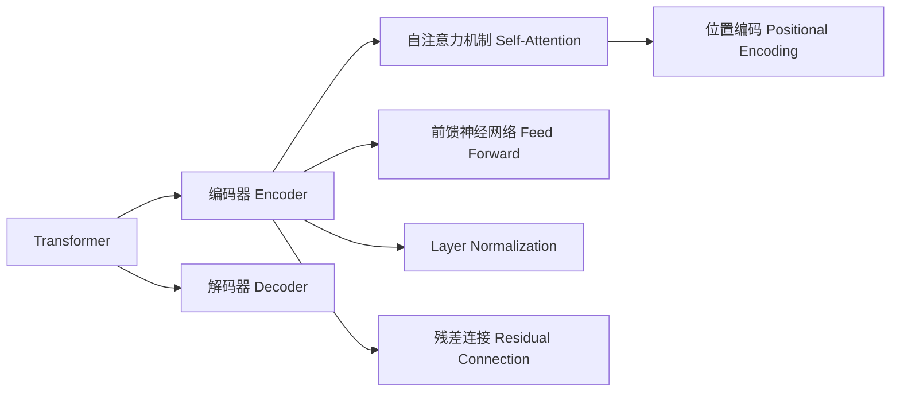

# Transformer架构原理详解：BERT 基于Transformer编码器的双向语言模型

关键词：Transformer, BERT, 注意力机制, 自然语言处理, 预训练语言模型

## 1. 背景介绍
### 1.1 问题的由来
随着人工智能技术的飞速发展,自然语言处理(NLP)领域取得了巨大的突破。传统的NLP任务如文本分类、命名实体识别、情感分析等,都需要大量的人工标注数据和特定领域的知识。为了解决这一问题,研究人员提出了预训练语言模型的概念,通过在大规模无标注语料上进行自监督学习,可以获得语言的通用表示,再将其应用到下游任务中。而BERT(Bidirectional Encoder Representation from Transformers)作为当前最为成功的预训练模型之一,在多项NLP任务上取得了state-of-the-art的表现。

### 1.2 研究现状
近年来,Transformer[1]模型及其变体在NLP领域大放异彩。相比传统的RNN序列模型,Transformer完全基于注意力机制,通过自注意力捕捉词与词之间的依赖关系,且具有更好的并行性。GPT系列[2,3]作为Transformer解码器的代表,在文本生成领域取得了瞩目的成绩。而BERT[4]则是基于Transformer编码器,通过引入Masked Language Model和Next Sentence Prediction两个预训练任务,学习深层双向语言表示。此后,各种BERT变体如RoBERTa[5]、ALBERT[6]、ELECTRA[7]等也被相继提出,进一步提升了模型性能。

### 1.3 研究意义
尽管BERT在学术界和工业界得到了广泛应用,但对于初学者来说,其内部原理和实现细节并不容易掌握。深入理解BERT的架构设计和训练方式,不仅有助于后续研究工作的开展,也能让更多开发者将其应用到实际项目中。同时,BERT的成功也为其他领域的研究提供了新的思路,如将预训练范式拓展到CV、语音等方向。

### 1.4 本文结构
本文将首先介绍Transformer和BERT的核心概念,然后详细阐述BERT的网络架构和预训练任务。在此基础上,给出BERT的数学建模过程和PyTorch代码实现。接着,讨论BERT在实际场景中的应用,并推荐相关学习资源。最后,总结全文内容并展望未来研究方向。

## 2. 核心概念与联系
在讨论BERT之前,我们有必要先了解以下几个核心概念:

- Transformer:一种基于自注意力机制的序列转换模型,摒弃了传统的RNN/CNN结构,计算效率更高。
- 自注意力(Self-Attention):通过计算序列内元素之间的相关性,生成权重矩阵,用于聚合输入信息。
- 位置编码(Positional Encoding):由于Transformer不包含RNN这样的顺序结构,需要额外加入位置信息。
- 残差连接(Residual Connection):将输入信息与经过变换后的信息相加,缓解梯度消失问题。
- Layer Normalization:对神经元的激活值进行归一化,加速收敛并提高泛化能力。

下图展示了这些概念之间的关系:

可以看出,Transformer由编码器和解码器组成,编码器内部利用了自注意力、前馈网络、Layer Norm和残差连接等技术。自注意力机制是整个模型的核心,其中位置编码用于引入序列的先后顺序信息。

而BERT的创新之处在于:
1. 仅使用Transformer编码器构建模型
2. 引入Masked LM和Next Sentence Prediction两个预训练任务
3. 实现真正的双向建模

下一节,我们将详细介绍BERT的网络架构和预训练方式。

## 3. 核心算法原理 & 具体操作步骤
### 3.1 算法原理概述
BERT的核心思想是利用自监督学习,在大规模无标注文本语料上进行预训练,得到通用的语言表示。具体来说,主要包含以下几个关键点:

1. 基于Transformer编码器:相比GPT使用Transformer解码器,BERT采用编码器结构,允许同时利用上下文信息。

2. Masked Language Model(MLM):随机遮挡部分输入token,让模型根据上下文预测被遮挡词,学习双向语言表示。

3. Next Sentence Prediction(NSP):给定两个句子,让模型判断它们在原文中是否相邻,学习句间关系。

4. WordPiece Embedding:将词拆分为更细粒度的subword单元,平衡词汇表大小和OOV问题。

### 3.2 算法步骤详解
接下来,我们对BERT的训练过程做进一步说明。

输入表示:
给定token序列 $\mathbf{x} = \{x_1, \ldots, x_n\}$,BERT首先进行以下处理:
1) 在开头和结尾分别添加特殊符号[CLS]和[SEP]
2) 对每个token做WordPiece分词,得到subword序列 $\mathbf{x}^{(w)} = \{x_1^{(w)}, \ldots, x_m^{(w)}\}$
3) 将subword映射为embedding向量,与位置编码、段落编码相加,得到输入矩阵 $\mathbf{H}^{(0)} \in \mathbb{R}^{m \times d_h}$

Transformer编码:
$L$层Transformer编码器对 $\mathbf{H}^{(0)}$ 进行编码:

$$
\begin{aligned}
\mathbf{H}^{(1)} &= \text{TransformerBlock}(\mathbf{H}^{(0)}) \\
&\ldots \\
\mathbf{H}^{(L)} &= \text{TransformerBlock}(\mathbf{H}^{(L-1)})
\end{aligned}
$$

其中每个TransformerBlock包含多头自注意力(Multi-head Self-attention)和前馈网络(Feed Forward)两个子层,以残差连接和Layer Normalization连接:

$$
\begin{aligned}
\mathbf{Z} &= \text{LayerNorm}(\mathbf{H}^{(l-1)} + \text{MultiHead}(\mathbf{H}^{(l-1)})) \\
\mathbf{H}^{(l)} &= \text{LayerNorm}(\mathbf{Z} + \text{FeedForward}(\mathbf{Z}))
\end{aligned}
$$

预训练任务:
1) MLM:随机选择15%的token进行遮挡,其中80%替换为[MASK],10%替换为随机词,10%保持不变。然后让BERT预测这些token的原始词汇。
2) NSP:从语料中抽取连续两句话作为正样本,随机两句话作为负样本,让BERT判断它们是否相邻。

预训练目标是最小化这两个任务的联合概率:

$$
\mathcal{L} = \mathcal{L}_{MLM} + \mathcal{L}_{NSP}
$$

其中MLM和NSP的损失函数分别为遮挡词的交叉熵和二分类交叉熵。

### 3.3 算法优缺点
BERT相比以往模型的优势在于:
- 双向建模:同时利用上下文信息,得到更好的语义表示
- 预训练任务设计巧妙:MLM克服了传统语言模型的单向局限性,NSP显式建模句间关系
- 模型架构简洁高效:基于Transformer编码器,计算并行度高,且具有较强的泛化能力

但BERT也存在一些不足:
- 计算开销大:模型参数量巨大,训练和推理成本高
- 输入长度受限:由于Transformer的计算复杂度为平方级,BERT只能处理512个token以内的序列
- 训练难度大:模型对超参数、训练技巧敏感,调优困难

### 3.4 算法应用领域
得益于其强大的语言表示能力,BERT在NLP的各个任务上都取得了不错的效果,如:
- 文本分类:情感分析、新闻分类等
- 序列标注:命名实体识别、词性标注等
- 问答系统:基于知识库、阅读理解等
- 文本生成:摘要、对话等
- 机器翻译:将BERT作为编码器,提取源语言表示
- 语义匹配:文本相似度、自然语言推理等

随着研究的不断深入,BERT也被应用到多模态、知识图谱等更广泛的场景中。

## 4. 数学模型和公式 & 详细讲解 & 举例说明
### 4.1 数学模型构建
本节我们对BERT中用到的数学模型做进一步说明。

输入嵌入:
将离散的token序列 $\mathbf{x} = \{x_1, \ldots, x_n\}$ 映射为实值向量表示 $\mathbf{E} = \{\mathbf{e}_1, \ldots, \mathbf{e}_n\}$,其中 $\mathbf{e}_i \in \mathbb{R}^{d_h}$。嵌入矩阵 $\mathbf{E}$ 可以随机初始化,也可以用预训练的word2vec、GloVe等模型初始化。

位置编码:
由于Transformer不包含RNN/CNN等顺序结构,需要显式引入位置信息。BERT采用三角函数形式:

$$
\begin{aligned}
PE_{(pos, 2i)} &= \sin(pos / 10000^{2i/d_h}) \\
PE_{(pos, 2i+1)} &= \cos(pos / 10000^{2i/d_h})
\end{aligned}
$$

其中 $pos$ 表示位置索引,$i$表示向量维度。将位置编码与词嵌入相加,即可得到最终的输入表示。

自注意力:
自注意力用于捕捉序列内任意两个位置之间的依赖关系。具体来说,对于第 $l$ 层第 $i$ 个位置,计算过程如下:

$$
\begin{aligned}
\mathbf{q}_i^{(l)} &= \mathbf{W}_q^{(l)} \mathbf{h}_i^{(l-1)} \\
\mathbf{k}_i^{(l)} &= \mathbf{W}_k^{(l)} \mathbf{h}_i^{(l-1)} \\ 
\mathbf{v}_i^{(l)} &= \mathbf{W}_v^{(l)} \mathbf{h}_i^{(l-1)} \\
\alpha_{ij}^{(l)} &= \frac{\exp(\mathbf{q}_i^{(l)} \cdot \mathbf{k}_j^{(l)} / \sqrt{d_k})}{\sum_{j'=1}^n \exp(\mathbf{q}_i^{(l)} \cdot \mathbf{k}_{j'}^{(l)} / \sqrt{d_k})} \\
\mathbf{z}_i^{(l)} &= \sum_{j=1}^n \alpha_{ij}^{(l)} \mathbf{v}_j^{(l)}
\end{aligned}
$$

其中 $\mathbf{W}_q^{(l)}, \mathbf{W}_k^{(l)}, \mathbf{W}_v^{(l)} \in \mathbb{R}^{d_h \times d_k}$ 为可学习的投影矩阵,$\alpha_{ij}^{(l)}$ 为注意力权重,表示位置 $i$ 到 $j$ 的相关性。

多头注意力则是将 $\mathbf{q}, \mathbf{k}, \mathbf{v}$ 划分为多个子空间,分别计算注意力,再拼接起来:

$$
\begin{aligned}
\mathbf{z}_i^{(l,a)} &= \text{Attention}(\mathbf{W}_q^{(l,a)} \mathbf{h}_i^{(l-1)}, \mathbf{W}_k^{(l,a)} \mathbf{H}^{(l-1)}, \mathbf{W}_v^{(l,a)} \mathbf{H}^{(l-1)}) \\
\mathbf{z}_i^{(l)} &= \text{Concat}(\mathbf{z}_i^{(l,1)}, \ldots, \mathbf{z}_i^{(l,A)}) \mathbf{W}_o^{(l)}
\end{aligned}
$$

其中 $a = 1, \ldots, A$ 为注意力头的编号,$\mathbf{W}_o^{(l)} \in \mathbb{R}^{Ad_v \times d_h}$ 