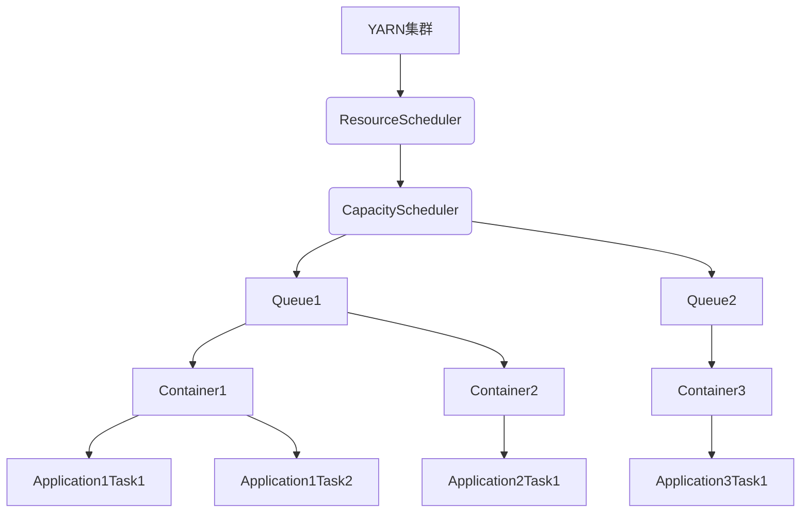

以下是关于《YARN Capacity Scheduler原理与代码实例讲解》的技术博客文章正文内容：

# YARN Capacity Scheduler原理与代码实例讲解

## 1. 背景介绍

### 1.1 问题的由来

随着大数据时代的到来，海量的数据需要被高效处理和计算。Apache Hadoop作为一个分布式计算框架,在大数据领域扮演着重要角色。然而,早期的Hadoop存在资源利用率低、无法根据需求动态分配资源等问题。为了解决这些问题,YARN(Yet Another Resource Negotiator)应运而生。

YARN将资源管理与作业调度解耦,提高了集群资源利用率。在YARN中,Capacity Scheduler作为一种重要的资源调度策略,负责根据队列的资源配置动态分配集群资源,使得不同的应用可以共享同一个集群资源。

### 1.2 研究现状

目前,Capacity Scheduler已经广泛应用于生产环境中。越来越多的公司和组织采用Capacity Scheduler来管理和调度他们的大数据作业。然而,由于Capacity Scheduler涉及复杂的资源分配算法和调度策略,对于初学者来说理解和掌握它仍然是一个挑战。

### 1.3 研究意义

本文旨在深入探讨Capacity Scheduler的原理、算法和实现细节,帮助读者全面理解这一重要的资源调度器。通过代码实例和详细解释,读者可以掌握Capacity Scheduler的使用方法,优化集群资源利用率,提高大数据应用的运行效率。

### 1.4 本文结构

本文首先介绍Capacity Scheduler的核心概念和工作原理,然后详细阐述其算法流程和数学模型。接下来,我们将通过代码实例展示Capacity Scheduler的具体实现,并分析其在实际应用场景中的使用。最后,本文将探讨Capacity Scheduler的发展趋势和面临的挑战,为读者提供学习资源和工具推荐。

## 2. 核心概念与联系

在深入探讨Capacity Scheduler的原理之前,我们需要了解一些核心概念:

1. **队列(Queue)**: Capacity Scheduler将集群资源划分为多个队列,每个队列被分配一定的资源配额。队列可以是父子层级关系,子队列从父队列继承资源配额。

2. **资源配额(Resource Quota)**: 指定了队列可以使用的资源比例,包括内存和CPU核数。配额可以是绝对值或基于集群资源的百分比。

3. **容器(Container)**: 作业中的任务在YARN上运行时,会被分配一个容器,容器封装了CPU、内存等资源。

4. **应用(Application)**: 提交到YARN上运行的分布式程序,由多个任务组成。

5. **资源调度器(ResourceScheduler)**: 负责根据特定的策略将资源分配给应用。Capacity Scheduler就是一种资源调度器。

这些概念之间的关系如下:

Capacity Scheduler根据队列的资源配额,将集群资源分配给各个队列。应用中的任务被封装在容器中运行,容器从所在队列获取资源。通过合理配置队列和资源配额,Capacity Scheduler可以实现资源的公平调度和利用。

## 3. 核心算法原理 & 具体操作步骤

### 3.1 算法原理概述

Capacity Scheduler的核心算法是基于FIFO(先进先出)原则的多队列资源分配算法。它的主要工作流程如下:

1. 将集群资源划分为多个队列,每个队列被分配一定的资源配额。
2. 应用提交到特定的队列中,等待资源分配。
3. 按照队列的优先级,从高到低遍历每个队列。
4. 如果队列有足够的资源配额,则为队列中的应用分配容器。
5. 如果队列用尽了配额,则跳过该队列,继续处理下一个队列。
6. 如果所有队列都被处理完毕,则重新开始新一轮的遍历。

该算法的核心思想是:根据队列的资源配额,按照优先级公平地为每个队列分配资源,从而实现整个集群资源的合理利用。

### 3.2 算法步骤详解

Capacity Scheduler算法的具体步骤如下:

1. **计算集群可用资源**

   首先,Capacity Scheduler需要计算出集群中当前可用的资源量,包括CPU和内存。可用资源是指集群总资源减去已经分配给容器的资源。

2. **按优先级遍历队列**

   接下来,Capacity Scheduler按照队列的优先级(通过配置文件设置)从高到低遍历每个队列。

3. **计算队列资源需求**

   对于每个队列,Capacity Scheduler会计算该队列的资源需求。需求量取决于队列中等待运行的应用数量和应用的资源需求。

4. **计算队列可用资源配额**

   根据队列的资源配额设置(如内存配额为20%),Capacity Scheduler计算出该队列当前可用的资源配额。可用配额 = 集群可用资源 * 队列资源配额。

5. **为队列分配资源**

   如果队列的资源需求小于等于可用配额,则为队列中的应用分配容器,直到用尽配额或满足所有应用的资源需求。如果需求大于配额,则根据特定的策略(如公平共享)为队列中的应用分配资源。

6. **处理剩余资源**

   如果分配给队列后还有剩余资源,则这些资源可以通过预留资源池(Reserved Pool)或其他机制分配给其他队列。

7. **回到第2步**

   如果所有队列都被处理完毕,则重新开始新一轮的遍历,直到所有应用的资源需求被满足或集群资源用尽。

该算法的关键在于根据队列的资源配额和优先级,合理地为每个队列分配资源,从而实现整个集群资源的高效利用和公平调度。

### 3.3 算法优缺点

**优点:**

1. **资源隔离**: 通过将集群资源划分为多个队列,可以实现不同应用之间的资源隔离,避免相互影响。
2. **资源公平分配**: 根据队列的资源配额,Capacity Scheduler可以公平地为每个队列分配资源,防止某些队列占用过多资源。
3. **优先级调度**: 队列的优先级设置允许对重要应用进行优先调度,提高关键任务的执行效率。
4. **弹性伸缩**: 队列的资源配额可以动态调整,使得集群资源能够根据需求灵活分配。

**缺点:**

1. **资源浪费**: 如果某些队列长期空闲,其配额资源将被浪费,降低整体资源利用率。
2. **配置复杂性**: 为了实现精细化的资源调度,需要对队列进行详细的配置,增加了管理复杂度。
3. **响应延迟**: 由于采用FIFO原则,低优先级队列中的应用可能需要等待较长时间才能获得资源。
4. **静态配额**: 队列的资源配额是静态设置的,无法根据实际资源需求动态调整。

### 3.4 算法应用领域

Capacity Scheduler广泛应用于以下领域:

1. **大数据处理**: 在Hadoop生态系统中,Capacity Scheduler被用于调度MapReduce、Spark、Hive等大数据应用的资源。
2. **云计算**: 云服务提供商可以使用Capacity Scheduler在同一个集群中为不同的租户提供资源隔离和公平调度。
3. **科学计算**: 一些科学计算领域(如基因组学、天体物理学等)使用Capacity Scheduler来管理和调度计算密集型作业。
4. **企业级应用**: 许多企业使用Capacity Scheduler来调度内部的大数据应用和分析任务。

总的来说,Capacity Scheduler适用于需要在共享集群资源的场景下实现资源隔离、公平调度和优先级调度的应用领域。

## 4. 数学模型和公式 & 详细讲解 & 举例说明

为了更好地理解Capacity Scheduler的资源分配策略,我们需要建立相应的数学模型和公式。

### 4.1 数学模型构建

假设集群中有 $n$ 个队列,每个队列 $i$ 被分配了 $q_i$ 的资源配额,其中 $\sum_{i=1}^{n}q_i=1$。我们定义以下变量:

- $R$: 集群总资源
- $R_i$: 队列 $i$ 可用资源配额,即 $R_i = q_i \times R$
- $D_i$: 队列 $i$ 中应用的总资源需求

我们的目标是找到一种资源分配方案 $\{x_1, x_2, \dots, x_n\}$,使得:

$$
\begin{align}
&\sum_{i=1}^{n}x_i \leq R \\
&0 \leq x_i \leq \min(D_i, R_i) \quad \forall i=1,2,\dots,n
\end{align}
$$

其中 $x_i$ 表示分配给队列 $i$ 的资源量。

### 4.2 公式推导过程

Capacity Scheduler采用了一种称为"dominantResourceFairShare"的资源分配策略,该策略旨在公平地分配两种资源(CPU和内存)中更加紧缺的那一种资源。

对于队列 $i$,我们定义:

- $C_i$: 队列 $i$ 中应用对CPU的总需求
- $M_i$: 队列 $i$ 中应用对内存的总需求
- $C_r$: 集群总CPU资源
- $M_r$: 集群总内存资源

则队列 $i$ 对CPU和内存的公平份额分别为:

$$
\begin{align}
fairShare_C^i &= q_i \times C_r \\
fairShare_M^i &= q_i \times M_r
\end{align}
$$

定义队列 $i$ 的dominantResourceShare为:

$$
dominantResourceShare^i = \max\left(\frac{C_i}{fairShare_C^i}, \frac{M_i}{fairShare_M^i}\right)
$$

则队列 $i$ 分配到的资源量 $x_i$ 为:

$$
x_i = \min\left(D_i, R_i, \frac{R}{dominantResourceShare^i}\right)
$$

这种分配策略可以确保集群资源被公平地分配给每个队列,并且优先满足资源需求最紧张的那一种资源。

### 4.3 案例分析与讲解

假设我们有一个4节点的YARN集群,每个节点配置了8个CPU核心和32GB内存。因此,集群总资源为:

- $C_r = 4 \times 8 = 32$ (CPU核心)
- $M_r = 4 \times 32 = 128$ (GB内存)

现在,我们定义两个队列:

- 队列A: 资源配额 $q_A = 0.6$,有两个应用在运行,分别需求 `(4 CPU, 16 GB)` 和 `(2 CPU, 8 GB)`
- 队列B: 资源配额 $q_B = 0.4$,有一个应用在运行,需求 `(8 CPU, 16 GB)`

根据公式,我们可以计算出每个队列的公平份额:

- 队列A:
  - $fairShare_C^A = 0.6 \times 32 = 19.2$ (CPU核心)
  - $fairShare_M^A = 0.6 \times 128 = 76.8$ (GB内存)
  - $C_A = 4 + 2 = 6$ (CPU需求)
  - $M_A = 16 + 8 = 24$ (内存需求)
  - $dominantResourceShare^A = \max\left(\frac{6}{19.2}, \frac{24}{76.8}\right) = 0.3125$
- 队列B:
  - $fairShare_C^B = 0.4 \times 32 = 12.8$ (CPU核心)
  - $fairShare_M^B = 0.4 \times 128 = 51.2$ (GB内存)
  - $C_B = 8$ (CPU需求)
  - $M_B = 16$ (内存需求)
  - $dominantResourceShare^B = \max\left(\frac{8}{12.8}, \frac{16}{51.2}\right) = 0.625$

因此,