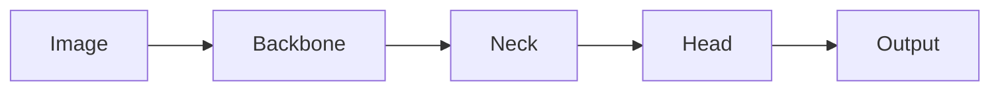

# YOLOv8原理与代码实例讲解

## 1. 背景介绍
### 1.1 问题的由来
目标检测是计算机视觉领域的一个核心问题,旨在从图像或视频中定位和识别感兴趣的目标对象。随着深度学习的蓬勃发展,目标检测技术取得了突破性进展。而YOLO(You Only Look Once)系列算法以其实时性和高精度的优势,成为目标检测领域的重要里程碑。本文将重点介绍YOLO系列的最新进展——YOLOv8,并通过原理解析和代码实例,帮助读者深入理解其内在机制。

### 1.2 研究现状
自2015年YOLO算法诞生以来,其性能和效率不断提升。YOLOv1实现了实时目标检测,YOLOv2引入了anchor box和多尺度训练,YOLOv3进一步改进了骨干网络和损失函数。YOLOv4在此基础上进行了全面优化,使其在速度和精度上达到新的高度。2022年发布的YOLOv5将Mosaic数据增强和Focus结构等新特性融入其中,使其在工业界广泛应用。YOLOv6和YOLOv7分别在骨干网络和目标检测头部做出创新,进一步提升了性能。而最新的YOLOv8在此基础上进行了全面改进,速度和精度再创新高。

### 1.3 研究意义
YOLOv8作为目标检测领域的前沿成果,对学术界和工业界都具有重要意义。从学术角度看,YOLOv8中引入的创新点为目标检测算法的设计提供了新思路,有助于推动该领域的发展。从应用角度看,YOLOv8在实时性和精度方面的优势,使其在自动驾驶、智慧城市、工业质检等场景中具有广阔的应用前景。深入剖析YOLOv8的原理和实现,对于理论研究和工程实践都具有参考价值。

### 1.4 本文结构
本文将围绕YOLOv8的原理和代码实现展开详细论述。第2部分介绍YOLOv8中的核心概念；第3部分重点阐述其算法原理和关键步骤；第4部分给出其数学模型和公式推导过程；第5部分通过代码实例讲解其具体实现；第6部分分析其实际应用场景；第7部分推荐相关的学习资源和开发工具；第8部分对全文进行总结,并展望其未来发展方向。

## 2. 核心概念与联系

YOLOv8是一种基于深度学习的单阶段目标检测算法,其核心是利用卷积神经网络直接从图像中回归出目标的位置和类别。相比经典的两阶段检测器(如Faster R-CNN),YOLO系列算法具有速度快和背景误检率低的优势。

YOLOv8中的一些关键概念包括:
- Backbone: 用于特征提取的骨干网络,YOLOv8采用了先进的CSPDarknet53。
- Neck: 用于融合多尺度特征的颈部结构,YOLOv8使用了PAN(Path Aggregation Network)。
- Head: 用于预测目标位置和类别的检测头,YOLOv8采用了Decoupled Head。
- Anchor-free: 无需预设先验框,直接预测目标的中心点和宽高。
- Label Assignment: 动态标签分配策略,提高正负样本的区分度。
- End-to-end: 整个检测流程在一个网络中完成,无需分步骤训练。

这些概念环环相扣,共同构建起YOLOv8的整体架构。Backbone负责提取图像特征,Neck融合多尺度信息,Head根据特征图预测目标。Anchor-free使得网络设计更加简洁,Label Assignment优化目标函数,End-to-end则保证了检测速度。它们相互配合,使得YOLOv8在速度和精度上达到最佳平衡。

## 3. 核心算法原理 & 具体操作步骤

### 3.1 算法原理概述

YOLOv8的核心思想是将目标检测问题转化为一个回归问题。具体而言,它将输入图像划分为S×S个网格,每个网格负责检测落在其中的目标。如果一个目标的中心点落在某个网格内,则该网格负责预测其位置和类别。YOLOv8采用一个卷积神经网络来提取图像特征,并通过检测头直接输出每个网格的预测结果。相比YOLOv5,它在骨干网络、检测头、损失函数等方面进行了改进,以进一步提升检测性能。

### 3.2 算法步骤详解

YOLOv8的检测流程可分为以下步骤:

1. 图像预处理: 将输入图像缩放到固定尺寸(如640×640),并进行归一化。

2. 骨干网络: 使用CSPDarknet53提取图像特征,获得多尺度的特征图。

3. 颈部结构: 通过PAN将多尺度特征图进行融合,获得丰富的语义信息。

4. 检测头: 使用Decoupled Head对每个特征图进行卷积,输出每个网格的预测结果,包括:
   - 目标中心点坐标(x, y)
   - 目标宽高(w, h)
   - 目标置信度(confidence)
   - 每个类别的概率(class probability)

5. 损失函数: 使用多部分损失函数对预测结果和真实标签进行比较,包括:  
   - 中心坐标损失(Center Coordinate Loss)
   - 宽高损失(Width Height Loss)
   - 置信度损失(Confidence Loss)
   - 分类损失(Classification Loss)

6. 后处理: 对预测框进行非极大值抑制(NMS),去除冗余的检测结果,得到最终的检测框。

7. 输出结果: 将检测框的位置和类别信息输出,完成检测任务。

通过以上步骤,YOLOv8可以高效地检测出图像中的目标,并给出其位置和类别。其中,骨干网络和颈部结构负责提取特征,检测头负责输出预测,损失函数指导网络学习,后处理和输出结果则将检测过程串联起来。

### 3.3 算法优缺点

YOLOv8相比之前的YOLO版本,在速度和精度方面都有显著提升。其主要优点包括:

- 速度快: 单阶段设计和anchor-free策略,使得YOLOv8可以在实时场景下高效检测。
- 精度高: 先进的骨干网络和颈部结构,提升了特征提取和融合能力,从而提高检测精度。 
- 简洁: 去除了复杂的特征金字塔等结构,网络设计更加简单高效。
- 鲁棒: 采用了Mosaic数据增强和Label Assignment策略,提高了对遮挡、小目标等复杂场景的适应性。

但YOLOv8也存在一些局限性,如:

- 对小目标的检测效果有待提升。
- 对密集目标的检测效果不如两阶段方法。
- 训练对数据的标注质量要求较高。

总的来说,YOLOv8在速度和精度之间取得了很好的平衡,但仍有进一步优化的空间。

### 3.4 算法应用领域

得益于其卓越的性能,YOLOv8在很多领域得到了广泛应用,典型场景包括:

- 自动驾驶: 车道线检测、行人检测、交通标志检测等
- 智慧城市: 人流统计、违章检测、异常行为检测等  
- 工业质检: 瑕疵检测、零件计数、产品分类等
- 智能安防: 入侵检测、危险物品检测、异常行为识别等
- 医学影像: 病灶检测、器官分割、影像分类等

除了以上场景,YOLOv8还可应用于机器人、无人机、移动端等多种平台,为各行各业的智能化升级赋能。随着算法的不断演进,其应用领域也将不断拓展。

## 4. 数学模型和公式 & 详细讲解 & 举例说明

### 4.1 数学模型构建

YOLOv8的数学模型可以用以下符号来表示:

- 输入图像: $X \in \mathbb{R}^{H \times W \times 3}$
- 骨干网络: $F_{backbone}(X) \rightarrow T \in \mathbb{R}^{H' \times W' \times C}$
- 颈部结构: $F_{neck}(T) \rightarrow P \in \mathbb{R}^{H' \times W' \times C'}$
- 检测头: $F_{head}(P) \rightarrow \hat{Y} \in \mathbb{R}^{S \times S \times [B \times (4 + 1 + K)]}$
- 真实标签: $Y \in \mathbb{R}^{S \times S \times [B \times (4 + 1 + K)]}$

其中,$H$和$W$为输入图像的高和宽,$C$为骨干网络输出特征图的通道数,$H'$和$W'$为下采样后特征图的高和宽,$C'$为颈部结构输出特征图的通道数,$S$为检测网格的大小,$B$为每个网格的预测框数量,$K$为目标类别数。

$\hat{Y}$和$Y$分别表示预测输出和真实标签,它们都由$S \times S$个网格组成,每个网格包含$B$个预测框,每个预测框由4个位置参数$(x, y, w, h)$、1个置信度参数$conf$和$K$个类别概率参数$cls_1, cls_2, ..., cls_K$组成。

### 4.2 公式推导过程

YOLOv8的训练目标是最小化预测输出$\hat{Y}$和真实标签$Y$之间的损失函数$L$。其中,损失函数由四部分组成:

1. 中心坐标损失:
$$L_{coord} = \sum_{i=0}^{S^2} \sum_{j=0}^B \mathbb{1}_{ij}^{obj} [(x_i - \hat{x}_i)^2 + (y_i - \hat{y}_i)^2]$$

其中,$\mathbb{1}_{ij}^{obj}$表示第$i$个网格的第$j$个预测框是否负责检测目标,如果是则为1,否则为0。$(x_i, y_i)$和$(\hat{x}_i, \hat{y}_i)$分别表示真实和预测的目标中心点坐标。

2. 宽高损失:
$$L_{size} = \sum_{i=0}^{S^2} \sum_{j=0}^B \mathbb{1}_{ij}^{obj} [(\sqrt{w_i} - \sqrt{\hat{w}_i})^2 + (\sqrt{h_i} - \sqrt{\hat{h}_i})^2]$$

其中,$w_i$和$h_i$表示真实的目标宽高,$\hat{w}_i$和$\hat{h}_i$表示预测的目标宽高。这里使用平方根处理,可以缓解大小目标不平衡的问题。

3. 置信度损失:
$$
\begin{aligned}
L_{conf} = & \sum_{i=0}^{S^2} \sum_{j=0}^B \mathbb{1}_{ij}^{obj} (conf_i - \hat{conf}_i)^2 + \\
           & \lambda_{noobj} \sum_{i=0}^{S^2} \sum_{j=0}^B \mathbb{1}_{ij}^{noobj} (conf_i - \hat{conf}_i)^2
\end{aligned}
$$

其中,$conf_i$表示真实的置信度(有目标为1,无目标为0),$\hat{conf}_i$表示预测的置信度。$\lambda_{noobj}$为平衡因子,用于降低负样本的权重。

4. 分类损失: 
$$L_{cls} = \sum_{i=0}^{S^2} \mathbb{1}_i^{obj} \sum_{k=1}^K (cls_{ik} - \hat{cls}_{ik})^2$$

其中,$cls_{ik}$表示第$i$个网格的真实类别概率(One-hot编码),$\hat{cls}_{ik}$表示预测的类别概率。

最终的损失函数为:
$$L = \lambda_{coord} L_{coord} + \lambda_{size} L_{size} + L_{conf} + L_{cls}$$

其中,$\lambda_{coord}$和$\lambda_{size}$为平衡因子,用于控制不同损失项的权重。

在推理阶段,YOLOv8通过阈值化置信度和