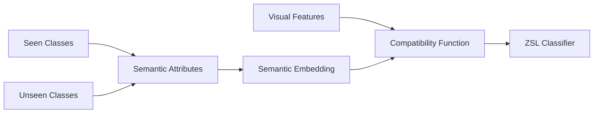

# Zero-Shot Learning原理与代码实例讲解

## 1. 背景介绍
### 1.1  问题的由来
在传统的机器学习和深度学习中,我们通常需要大量的标注数据来训练模型。但在现实世界中,很多场景下获取大量标注数据是非常困难和昂贵的。比如在图像分类任务中,如果要识别一个新的物体类别,就需要收集该类别的大量样本并进行人工标注。这极大地限制了模型的泛化和扩展能力。

Zero-Shot Learning (零样本学习)正是为了解决这一问题而提出的。它希望模型能够识别那些在训练集中没有出现过的新类别,即模型具备泛化到未知类别的能力。这对于实际应用具有重要意义。

### 1.2  研究现状
近年来,Zero-Shot Learning (ZSL)受到了学术界和工业界的广泛关注。一些经典的ZSL方法包括:
- 基于属性的方法:通过学习属性到类别的映射来实现ZSL。代表工作如DAP、IAP等。
- 基于嵌入的方法:学习视觉特征到语义嵌入空间的映射。代表工作如ESZSL、SAE等。
- 基于生成的方法:通过生成模型合成看不见类别的样本。代表工作如f-CLSWGAN等。

此外还有一些改进的ZSL方法,如Generalized ZSL、Transductive ZSL、Open ZSL等。当前的研究主要聚焦在如何提高ZSL的性能以及将ZSL扩展到更多的应用领域。

### 1.3  研究意义
Zero-Shot Learning具有重要的研究意义:
1. 减少对标注数据的依赖,节省人力物力成本。
2. 提高模型的泛化和迁移能力,识别新的未知类别。
3. 探索知识表示和迁移的新方法,推动AI走向通用智能。
4. 在工业界有广泛需求,如商品识别、人脸识别等。

### 1.4  本文结构
本文将全面介绍Zero-Shot Learning的原理和代码实践。内容安排如下:
- 第2部分介绍ZSL的核心概念
- 第3部分介绍ZSL的核心算法原理
- 第4部分介绍ZSL常用的数学模型和公式
- 第5部分通过代码实例讲解ZSL的实现
- 第6部分讨论ZSL的应用场景
- 第7部分推荐ZSL相关的工具和资源
- 第8部分总结全文,展望ZSL的未来
- 第9部分是附录,解答一些常见问题

## 2. 核心概念与联系

在介绍Zero-Shot Learning (ZSL)的核心算法之前,我们先来了解一下ZSL中的一些核心概念:

- Seen Classes:训练集中出现过的类别,模型可以直接用训练集的标注数据学习它们的分类器。
- Unseen Classes:训练集中没有出现过的新类别,没有它们的标注数据。ZSL的目标就是识别Unseen Classes。
- Semantic Attributes:对图像的语义描述,通常是人工定义的高层语义概念,如形状、颜色、纹理等。
- Semantic Embedding:将Attributes映射到语义嵌入空间,将类别表示为语义向量。
- Visual Features:从图像中提取的视觉特征,如CNN特征。
- Compatibility Function:衡量Visual Features和Semantic Embedding之间的相容性,用于ZSL分类。

它们之间的关系如下图所示:



可以看到,通过Semantic Attributes将Seen Classes和Unseen Classes联系起来,再通过学习Compatibility Function来建立Visual Features和Semantic Embedding之间的映射,从而实现Zero-Shot Learning。

## 3. 核心算法原理 & 具体操作步骤
### 3.1  算法原理概述
大多数ZSL算法可以概括为两个步骤:
1. Semantic Embedding学习:将Seen Classes的Semantic Attributes映射到Semantic Embedding空间。
2. Compatibility Function学习:学习Visual Features到Semantic Embedding的映射函数。

具体来说,给定一个Unseen Class的图像,提取其Visual Features,通过学习到的Compatibility Function将其映射到Semantic Embedding空间,然后在Semantic Embedding空间中找到与其最相似的Unseen Class作为预测结果。

### 3.2  算法步骤详解
以经典的线性兼容模型 (Linear Compatibility Model)为例,详细介绍ZSL算法的步骤:
1. 属性标注:人工定义一组Semantic Attributes,标注每个Seen Class的属性向量。
2. 特征提取:用预训练的CNN模型对图像提取Visual Features。记为$x\in \mathbb{R}^d$。
3. Semantic Embedding学习:将每个Seen Class $y$ 的属性向量 $a_y\in\{0,1\}^k$映射到Semantic Embedding $\phi(y)\in \mathbb{R}^m$:
$$
\phi(y)=W_s a_y
$$
其中$W_s\in \mathbb{R}^{m\times k}$是要学习的投影矩阵。
4. Compatibility Function学习:学习将Visual Features映射到Semantic Embedding的线性函数:
$$
F(x,y;W)=\theta(x)^T W \phi(y)
$$
其中$\theta(x)\in \mathbb{R}^d$是$x$的特征表示,$W\in \mathbb{R}^{d\times m}$是要学习的兼容矩阵。目标是优化:
$$
\min_{W} \sum_{i=1}^N \max(0, 1-y_i F(x_i,y_i;W)+\max_{y\neq y_i} F(x_i,y;W))
$$
5. ZSL预测:对于Unseen Class的图像$x$,其预测类别为:
$$
\hat{y}=\arg\max_{y\in \mathcal{Y}_u} F(x,y;W)
$$
其中$\mathcal{Y}_u$是Unseen Classes的集合。

### 3.3  算法优缺点
优点:
- 简单直观,易于实现
- 可解释性强,可以分析每个属性的贡献
- 扩展性好,加入新的类别只需定义属性向量

缺点:  
- 属性定义需要人工参与,成本较高
- 属性空间是线性的,表达能力有限
- 不能end-to-end训练,分为两个阶段

### 3.4  算法应用领域
- 图像分类:识别新的物体、场景类别
- 细粒度识别:识别新的子类别,如鸟类、花卉、车辆等
- 人脸识别:识别新的人脸身份
- 视频分析:识别新的行为、事件类别

## 4. 数学模型和公式 & 详细讲解 & 举例说明
### 4.1  数学模型构建
ZSL可以看作一个条件概率分布估计问题。记$\mathcal{X}$为视觉特征空间,$\mathcal{Y}$为类别标签空间,$\mathcal{A}$为属性空间。ZSL的目标是学习一个概率分布:
$$
P(y|x)=\frac{P(x|y)P(y)}{\sum_{y'\in\mathcal{Y}} P(x|y')P(y')}, \forall y\in \mathcal{Y}_u
$$
其中$y\in \mathcal{Y}_u$是Unseen Class。由于$P(y)$未知,因此退化为估计相容性打分函数:
$$
f(x,y)=\theta(x)^T W \phi(y)
$$

### 4.2  公式推导过程
线性兼容模型的目标函数可以写为:
$$
\mathcal{L}(W)=\sum_{i=1}^N \max(0, 1-y_i f(x_i,y_i)+\max_{y\neq y_i} f(x_i,y))
$$
其中$y_i=1$表示$(x_i,y_i)$匹配,$y_i=-1$表示不匹配。这实际上是一个Structured SVM Loss。

对$W$求梯度,得到:
$$
\frac{\partial \mathcal{L}}{\partial W}=\sum_{i=1}^N -\Delta_i \theta(x_i)(\phi(y_i)-\phi(\bar{y}_i))^T
$$
其中$\Delta_i=\mathbb{I}[1-y_i f(x_i,y_i)+f(x_i,\bar{y}_i)>0]$,$\bar{y}_i=\arg\max_{y\neq y_i} f(x_i,y)$。

使用梯度下降法更新$W$:
$$
W:=W-\eta \frac{\partial \mathcal{L}}{\partial W}
$$

### 4.3  案例分析与讲解
我们以图像分类任务为例,说明ZSL的训练和预测过程。

假设有10个Seen Classes:
- 狗,属性向量$a_1=[1,0,1,0]$
- 猫,属性向量$a_2=[1,0,0,1]$
- 鸟,属性向量$a_3=[0,1,1,0]$
- ...

有3个Unseen Classes:
- 狼,属性向量$a_{11}=[1,0,1,1]$  
- 豹,属性向量$a_{12}=[1,0,0,1]$
- 鹰,属性向量$a_{13}=[0,1,1,0]$

训练阶段:
1. 用CNN提取训练图像的特征$\{x_i\}_{i=1}^N$
2. 学习Semantic Embedding投影矩阵$W_s$,将$\{a_i\}$映射为$\{\phi(y_i)\}$ 
3. 学习Compatibility矩阵$W$,优化Structured SVM Loss

预测阶段:
1. 提取测试图像$x$的特征$\theta(x)$
2. 计算Compatibility Score:$f(x,y)=\theta(x)^T W \phi(y), \forall y\in \mathcal{Y}_u$ 
3. 预测类别:$\hat{y}=\arg\max_{y\in \mathcal{Y}_u} f(x,y)$

例如,对于一张狼的图像,计算它与3个Unseen Classes的Compatibility Score:
- 狼:$f(x,wolf)=\theta(x)^T W \phi(a_{11})$
- 豹:$f(x,leopard)=\theta(x)^T W \phi(a_{12})$ 
- 鹰:$f(x,eagle)=\theta(x)^T W \phi(a_{13})$

取最大值对应的类别作为预测结果。

### 4.4  常见问题解答
Q: ZSL的性能瓶颈在哪里?
A: 主要在于Semantic Embedding学习和Compatibility Function学习。前者需要属性空间足够丰富,后者需要很强的泛化能力。目前的方法在这两点上还有很大提升空间。

Q: 除了属性,还可以用什么作为side information?
A: 文本描述、WordNet层次结构、知识图谱等都可以作为辅助信息提升ZSL性能。

Q: 如何解决Seen Classes和Unseen Classes之间的偏置问题?
A: 这是Generalized ZSL需要解决的问题。主要思路是校准Seen和Unseen的分数分布,使它们更加平衡。

Q: 为什么Transductive ZSL性能通常优于Inductive ZSL?
A: 因为Transductive ZSL可以利用Unseen Classes的unlabeled数据分布信息,而Inductive ZSL只能利用属性信息。

## 5. 项目实践：代码实例和详细解释说明
### 5.1  开发环境搭建
- Python 3.6
- PyTorch 1.7
- CUDA 10.1
- 预训练ResNet-101模型

### 5.2  源代码详细实现
定义Semantic Embedding投影层:
```python
class SemanticEmbedding(nn.Module):
    def __init__(self, attr_dim, emb_dim):
        super().__init__()
        self.embedding = nn.Linear(attr_dim, emb_dim)
        
    def forward(self, attrs):
        return self.embedding(attrs)
```

定义Compatibility Function:
```python
class Compatibility(nn.Module):
    def __init__(self, vis_dim, emb_dim):
        super().__init__()
        self.vis_proj = nn.Linear(vis_dim, emb_dim)
        self.emb_proj = nn.Linear(emb_dim, emb_dim)

    def forward(self, vis_feats, emb_feats):
        proj_vis = self.vis_proj(vis_feats)
        proj_emb = self.emb_proj(emb_feats)
        return torch.sum(proj_vis * proj_emb, dim=-1)
```

定义ZSL模型:
```python
class ZSLModel(nn.Module):
    def __init__(self, backbone, attr_dim, emb_dim):
        super().__init__