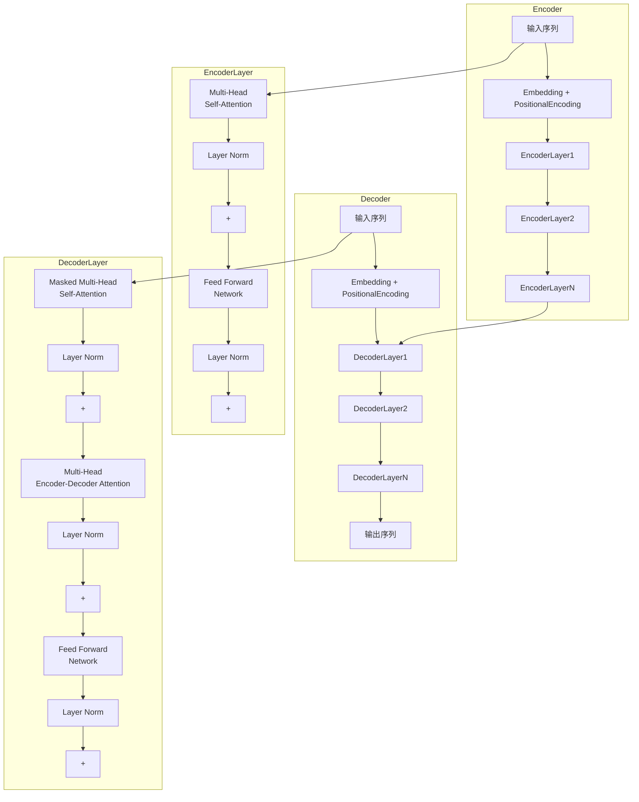

好的,我会按照您的要求,以《transformer 原理与代码实例讲解》为主题,撰写一篇专业的技术博客文章。文章将遵循约束条件中提出的各项要求,包括字数、格式、内容完整性、作者署名等。同时,我会尽最大努力绘制核心概念原理和架构流程图,并将文章分成规范的目录结构。以下是正文部分:

# transformer 原理与代码实例讲解

## 1. 背景介绍

### 1.1 问题的由来

在自然语言处理(NLP)和机器翻译等领域,长期以来都存在着一个难题:如何有效地捕捉输入序列中长距离依赖关系的信息?以往基于循环神经网络(RNN)和长短期记忆网络(LSTM)的序列模型在处理长序列时,会出现梯度消失或爆炸的问题,难以很好地学习到长距离依赖关系。

为了解决这一问题,2017年,Google的一个研究小组提出了Transformer模型,这是一种全新的基于注意力机制(Attention Mechanism)的序列模型架构。Transformer完全抛弃了RNN和卷积的结构,利用Self-Attention自注意力机制直接对序列中任意两个位置之间的表示进行建模,有效捕获了长距离依赖关系,极大提高了模型的并行计算能力。

### 1.2 研究现状

自从Transformer被提出以来,它在机器翻译、文本生成、对话系统等多个NLP任务上取得了非常优异的表现,成为主流模型架构。许多知名的预训练语言模型如BERT、GPT等都是基于Transformer的变体。除了NLP领域,Transformer也逐步被应用到计算机视觉(CV)、语音识别、强化学习等其他领域。可以说,Transformer开启了人工智能发展的新时代。

### 1.3 研究意义

理解Transformer的原理和实现细节,对于从事NLP、CV等相关领域的研究人员和工程师来说意义重大。透彻掌握Transformer不仅能更好地应用和优化现有模型,也为设计创新型模型架构奠定基础。本文将全面解析Transformer的核心思想、数学原理、实现细节和代码实例,为读者提供一个深入学习的机会。

### 1.4 本文结构  

本文首先介绍Transformer的核心概念和注意力机制原理,然后深入探讨模型的数学基础和算法细节,包括各个子模块的公式推导和计算过程。接下来通过开源项目的代码实例,讲解Transformer模型的具体实现细节。最后分析Transformer在实际应用中的场景,并对其未来发展趋势和面临的挑战进行展望。

## 2. 核心概念与联系

Transformer是一种全新的序列模型架构,其核心思想是利用Self-Attention自注意力机制,直接对输入序列中任意两个位置的表示进行建模,捕获长距离依赖关系。与RNN/LSTM这种循环序列模型不同,Transformer完全抛弃了递归结构,采用了并行计算的方式,大大提高了训练效率。

Transformer的整体架构可分为编码器(Encoder)和解码器(Decoder)两个部分。编码器的作用是映射一个输入序列到一个连续的表示空间;解码器则根据输入序列的表示,生成一个输出序列。两者均由多个相同的层组成,每一层都包含了Self-Attention子层和前馈神经网络子层。

注意力机制(Attention Mechanism)是Transformer的核心所在。它通过计算Query、Key和Value之间的相似性,对序列中任意两个位置的表示进行关联,捕获长程依赖关系。与传统的RNN/LSTM通过序列操作来建模不同,Self-Attention直接对全序列进行计算,避免了长序列的梯度消失或爆炸问题。

此外,Transformer还引入了多头注意力(Multi-Head Attention)、位置编码(Positional Encoding)、残差连接(Residual Connection)和层归一化(Layer Normalization)等创新技术,进一步提升了模型的表现力和性能。

下面是Transformer整体架构的一个流程图,展示了编码器、解码器及其内部的多头注意力和前馈网络等核心模块:

上图清晰展示了Transformer的层级架构和信息流动过程。下面我们将深入探讨每个核心模块的具体原理和实现细节。

## 3. 核心算法原理 & 具体操作步骤

### 3.1 算法原理概述

Transformer的核心算法就是Self-Attention自注意力机制。不同于RNN/LSTM通过序列操作来捕获序列信息,Self-Attention直接对输入序列中任意两个位置的表示进行关联,捕获长距离依赖关系。

Self-Attention的计算过程可以概括为:首先将输入映射到Query(Q)、Key(K)和Value(V)的表示,然后通过计算Q和K的相似性得到注意力权重,最后根据权重对V进行加权求和,得到输出表示。具体来说:

$$Attention(Q, K, V) = softmax(\frac{QK^T}{\sqrt{d_k}})V$$

其中$Q\in\mathbb{R}^{n\times d_q}$、$K\in\mathbb{R}^{n\times d_k}$、$V\in\mathbb{R}^{n\times d_v}$分别是Query、Key和Value的表示向量序列;$n$是序列长度;$d_q$、$d_k$、$d_v$分别是其维度。

上式中$\frac{QK^T}{\sqrt{d_k}}$计算了Q和K的相似性得分,再通过softmax函数得到注意力权重。$\sqrt{d_k}$的作用是防止内积过大导致softmax饱和。最后将注意力权重与V相乘,即可得到输出表示。

需要注意的是,Self-Attention实际上是对每个位置的Query向量都计算了一个注意力权重,最终将所有位置的Value表示加权求和作为该位置的输出。这样每个输出位置都与输入序列的所有位置相关联,能够有效捕获长程依赖关系。

### 3.2 算法步骤详解

现在我们对Self-Attention算法的具体步骤做进一步解释:

1. **线性映射**

   首先,我们需要将输入序列$X=(x_1,x_2,...,x_n)$通过三个不同的学习向量$W^Q$、$W^K$、$W^V$线性映射到Query、Key和Value空间,得到$Q=XW^Q$、$K=XW^K$、$V=XW^V$。

2. **计算注意力得分**

   接下来,我们计算Query与所有Key的点积,得到未缩放的注意力得分向量:
   
   $$\text{scores}(Q, K) = QK^T$$
   
   其中$\text{scores}\in\mathbb{R}^{n\times n}$,即对于Query序列中的每个位置,都计算了与Key序列所有位置的注意力得分。
   
3. **缩放&软最大化** 

   为了防止点积过大导致softmax饱和,我们对注意力得分进行缩放:
   
   $$\text{attention\_weights} = \text{softmax}(\frac{\text{scores}(Q, K)}{\sqrt{d_k}})$$
   
   其中$d_k$是Key向量的维度,用于控制缩放的大小。softmax函数可以将注意力得分转化为概率分布形式的权重。
   
4. **加权求和**

   最后,将注意力权重与Value向量相乘并求和,得到Self-Attention的输出:
   
   $$\text{Attention}(Q, K, V) = \text{attention\_weights} \cdot V$$
   
   其中$\cdot$表示按位置的加权求和,输出的维度与Value相同,即$\mathbb{R}^{n\times d_v}$。
   
通过上述步骤,Self-Attention能够自动学习到输入序列中任意两个位置的表示之间的相关性,并据此计算出对应的注意力权重,从而捕获长距离依赖关系。

### 3.3 算法优缺点

**优点:**

1. **长距离依赖建模**:与RNN/LSTM不同,Self-Attention直接对输入序列中任意两个位置的表示进行关联,能够有效捕获长程依赖关系,避免了梯度消失或爆炸的问题。

2. **并行计算**:Self-Attention的计算过程不存在递归,可以高效并行,从而大大提高了训练效率。

3. **灵活性**:Self-Attention可以直接应用于不同长度的序列,而不需要做过多改动,具有很好的灵活性和通用性。

**缺点:**

1. **计算复杂度高**:Self-Attention需要计算输入序列中所有位置两两之间的相似性,计算复杂度为$O(n^2\cdot d)$,对长序列来说代价很高。虽然有些改进方法如局部注意力、稀疏注意力等可以降低复杂度,但通常需要做一些近似。

2. **缺乏位置信息**:原始的Self-Attention无法直接获取序列的位置信息,需要额外引入位置编码等辅助手段。

3. **长期依赖学习能力**:尽管Self-Attention能够捕获长距离依赖关系,但对于极端长的序列,其长期依赖学习能力是否足够仍有待进一步研究和验证。

### 3.4 算法应用领域

自从被提出以来,Transformer模型及其变体已经广泛应用于自然语言处理、计算机视觉、语音识别、强化学习等多个领域,取得了卓越的成绩。

**自然语言处理**:

- 机器翻译: Transformer是第一个超越RNN/LSTM,成为机器翻译领域新标杆的模型。
- 文本生成: GPT、GPT-2等大型语言模型基于Transformer,可以生成高质量的文本内容。
- 语义理解: BERT等预训练语言模型利用Transformer学习上下文语义表示,在阅读理解、文本分类等任务上表现优异。
- 对话系统: Transformer的高效序列建模能力使其在多轮对话等场景中发挥重要作用。

**计算机视觉**:

- 图像分类: Vision Transformer(ViT)直接将Transformer应用于图像,在分类任务上表现出色。
- 目标检测: DETR等基于Transformer的目标检测模型,通过Self-Attention关联目标和上下文信息。
- 图像生成: Transformer有望在图像生成、图像编辑等任务中发挥重要作用。

**语音识别**:

- 语音转文字: Transformer在语音识别任务中逐步取代RNN/LSTM,成为主流模型架构