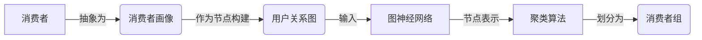

# 【AI大数据计算原理与代码实例讲解】消费者组

关键词：AI、大数据、计算原理、代码实例、消费者组

## 1. 背景介绍
### 1.1  问题的由来
随着大数据时代的到来,海量的用户行为数据被各大互联网公司所收集和利用。如何从这些海量数据中挖掘出有价值的信息,进而对用户进行精准画像和个性化推荐,成为了业界关注的焦点。其中,对消费者进行分组划分是一项重要的基础性工作,直接影响到后续的用户洞察和精准营销等环节。

### 1.2  研究现状
目前业界主流的消费者组划分方法主要有:
- 基于人口统计学的分组:按照年龄、性别、收入等人口属性对消费者进行划分。
- 基于地理位置的分组:按照消费者所在的国家、地区、城市等地理位置进行划分。 
- 基于消费行为的分组:根据消费者的购买频率、消费金额、购买品类等消费行为数据进行聚类分析。
- 基于兴趣爱好的分组:通过分析消费者的浏览、点击、收藏、评论等行为,挖掘其兴趣偏好,然后进行分组。

以上方法各有优劣。基于人口统计学和地理位置的分组较为粗犷,难以精准刻画消费者特征;基于消费行为的分组能够量化用户价值,但缺乏对用户深层次偏好的挖掘;基于兴趣爱好的分组关注用户的潜在需求,但受到数据稀疏性问题的制约。

### 1.3  研究意义
消费者组划分是企业开展精准营销的基石。科学合理的消费者分组,有助于企业全面认知自身用户,洞察不同人群的特点,从而实施差异化、个性化的营销策略,提升用户体验,增强客户粘性,挖掘更多商业价值。

因此,亟需一种能够综合利用多维度数据,高效准确地实现消费者自动化分组的AI算法。这对于企业的用户运营和增长具有重要意义。

### 1.4  本文结构
本文将重点介绍一种基于图神经网络和无监督学习的消费者组划分AI算法。内容安排如下:

- 第2部分介绍相关概念,包括消费者画像、图神经网络、聚类等。
- 第3部分重点阐述该算法的原理和步骤。 
- 第4部分给出算法所基于的数学模型和公式,并辅以案例讲解说明。
- 第5部分提供算法的代码实现,并详细解释关键代码。
- 第6部分分析该算法的实际应用场景。
- 第7部分推荐学习该算法的工具和资源。
- 第8部分对全文进行总结,并展望该算法的未来发展方向。
- 第9部分列举一些常见问题及其解答。

## 2. 核心概念与联系
在详细阐述算法原理之前,我们先来了解几个核心概念:

- 消费者:在本文语境下特指电商平台的注册用户,他们通过浏览、搜索、下单、评价等一系列行为与平台产生交互。
- 消费者画像:对单个消费者从各个角度(如人口属性、消费能力、行为偏好等)进行全面描述的结构化数据。
- 消费者组:通过特定算法将消费者进行聚合所得到的一些子集。组内消费者有较高的相似性,而组间差异较大。
- 图神经网络:一种基于图结构数据的深度学习模型。它能够有效地对图的节点及其连接关系进行表示学习和信息传递。
- 聚类:一种无监督机器学习方法,它能自动地将数据划分成若干组,使组内对象彼此相似而组间对象相异。

这些概念之间的联系可用下图表示:

可见,消费者组划分的核心是通过图神经网络学习到的用户表示向量,再经过聚类算法形成最终的分组结果。下面我们来重点讲解其中的关键算法。

## 3. 核心算法原理 & 具体操作步骤
### 3.1  算法原理概述
本文采用的消费者组划分算法主要包含三个阶段:用户关系图构建、图表示学习、聚类分组。其基本原理如下:

1. 首先,根据消费者的属性画像和行为数据,构建用户关系图。图中节点为消费者,边代表消费者之间的相似关系。
2. 然后,使用图神经网络对用户关系图进行表示学习。通过在图上传播和聚合信息,可以学习到每个节点(即消费者)的低维嵌入表示。
3. 最后,使用聚类算法对学习到的节点嵌入进行划分,得到若干个消费者组。每个组内的消费者在嵌入空间中聚集在一起,表明他们具有相似的特征。

该算法的优势在于:
- 能够充分挖掘消费者多维度的属性和行为数据,构建全面的用户画像。
- 利用图神经网络的强大表示能力,学习到高质量的用户嵌入,克服了数据稀疏性问题。
- 采用无监督聚类方法进行分组,不需要预先定义组的类别和数量,具有很大的灵活性。

### 3.2  算法步骤详解
下面我们对算法的主要步骤进行详细说明:

**Step1:用户关系图构建**
- 定义图 $G=(V,E)$,其中节点集 $V$ 表示所有消费者,边集 $E$ 表示消费者之间的相似关系。
- 对于图中每个节点 $v_i$,其属性向量 $x_i$ 由该消费者的各类属性和行为数据组成,例如:
  - 人口统计学属性:年龄、性别、职业等
  - 消费行为属性:购买频率、消费金额、购买品类等
  - 行为偏好属性:浏览、点击、收藏、评论等
- 对于图中的每条边 $e_{ij}$,其权重 $w_{ij}$ 由节点 $v_i$ 和 $v_j$ 的属性相似度决定。可以使用余弦相似度、欧氏距离等方法来计算。

**Step2:图表示学习**
- 使用图神经网络对用户关系图 $G$ 进行表示学习,得到节点嵌入矩阵 $H$。
- 常用的图神经网络模型包括:GCN、GAT、GraphSAGE等。以最简单的GCN为例,其前向传播公式为:

$$H^{(l+1)} = \sigma(\hat{D}^{-\frac{1}{2}} \hat{A} \hat{D}^{-\frac{1}{2}} H^{(l)} W^{(l)})$$

其中 $\hat{A}=A+I$ 是加入自环的邻接矩阵,$\hat{D}$ 是 $\hat{A}$ 的度矩阵,$W^{(l)}$ 是第 $l$ 层的权重矩阵,$\sigma$ 是激活函数,如ReLU。
- 通过多层的图卷积和非线性变换,可以学习到节点的嵌入表示 $H^{(L)}$,其中 $L$ 为总层数。

**Step3:聚类分组**
- 使用无监督聚类算法对节点嵌入 $H^{(L)}$ 进行划分,得到 $K$ 个消费者组 $\{C_1,C_2,...,C_K\}$。 
- 常用的聚类算法包括:K-Means、DBSCAN、层次聚类等。以K-Means为例,其目标是最小化组内距离平方和:

$$\min \sum^K_{k=1} \sum_{v_i \in C_k} ||h_i^{(L)} - \mu_k||^2$$

其中 $\mu_k$ 是第 $k$ 个簇的中心点,$h_i^{(L)}$ 是节点 $v_i$ 的嵌入向量。

- 聚类结果即为我们所需的消费者分组。组内消费者特征相似,组间差异较大,便于后续开展针对性营销。

### 3.3  算法优缺点
该消费者组划分算法的主要优点有:
- 能够充分利用多源异构的用户属性和行为数据,全面刻画用户特征。
- 引入图神经网络进行表示学习,可以挖掘出用户的高阶相似性,克服数据稀疏问题。
- 采用无监督聚类方法进行分组,不依赖人工标注数据,可扩展性强。
- 算法流程清晰,容易实现和部署。

同时,该算法也存在一些局限性:
- 图神经网络的训练需要较大的计算资源,当用户数量巨大时,可能面临效率瓶颈。
- 聚类算法对初始化敏感,不同的初始中心点可能导致不同的分组结果。
- 缺乏明确的组数确定方法,需要多次实验调优。
- 离线批处理的方式不适合流数据的实时分组。

### 3.4  算法应用领域
该消费者组划分算法可应用于多个领域,例如:
- 电商平台的用户分群和个性化推荐
- 社交网络的用户社群发现和管理
- 金融领域的客户细分和风险控制
- 游戏行业的玩家画像和活动运营

总之,只要有用户数据和营销需求的场景,都可以使用该算法进行消费者组划分,挖掘用户价值。

## 4. 数学模型和公式 & 详细讲解 & 举例说明
### 4.1  数学模型构建
我们使用如下符号来描述消费者组划分问题的数学模型:
- 用 $V=\{v_1,v_2,...,v_N\}$ 表示 $N$ 个消费者节点的集合。
- 用 $X \in \mathbb{R}^{N \times D}$ 表示节点的属性矩阵,其中 $D$ 为属性维度。
- 用 $A \in \mathbb{R}^{N \times N}$ 表示节点之间的邻接矩阵,其中 $A_{ij}$ 为节点 $v_i$ 和 $v_j$ 之间的相似度。
- 用 $H^{(L)} \in \mathbb{R}^{N \times d}$ 表示学习到的节点嵌入矩阵,其中 $d$ 为嵌入维度。
- 用 $C=\{C_1,C_2,...,C_K\}$ 表示最终划分得到的 $K$ 个消费者组。

基于以上定义,我们的目标可以形式化为:

$$\arg \min_C \sum^K_{k=1} \sum_{v_i \in C_k} ||h_i^{(L)} - \mu_k||^2$$

$$s.t. \quad H^{(L)} = GNN(A,X)$$

其中 $GNN$ 表示图神经网络模型,它以邻接矩阵 $A$ 和属性矩阵 $X$ 为输入,输出节点嵌入 $H^{(L)}$。

### 4.2  公式推导过程
下面我们对图神经网络和聚类的关键公式进行推导。

**图神经网络公式推导**
以两层GCN为例,其前向传播公式为:

$$H^{(1)} = \sigma(\hat{D}^{-\frac{1}{2}} \hat{A} \hat{D}^{-\frac{1}{2}} X W^{(0)})$$

$$H^{(2)} = \sigma(\hat{D}^{-\frac{1}{2}} \hat{A} \hat{D}^{-\frac{1}{2}} H^{(1)} W^{(1)})$$

其中 $\hat{A}=A+I$ 是加入自环的邻接矩阵,$\hat{D}$ 是 $\hat{A}$ 的度矩阵:

$$\hat{D}_{ii} = \sum_j \hat{A}_{ij}$$

$W^{(0)} \in \mathbb{R}^{D \times d_1}$ 和 $W^{(1)} \in \mathbb{R}^{d_1 \times d_2}$ 分别是第一层和第二层的