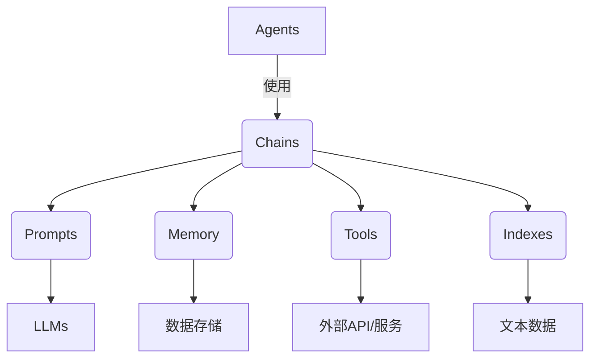

# 【LangChain编程：从入门到实践】LangChain核心概念和模块

## 1. 背景介绍

### 1.1 问题的由来

在当今的数字时代，人工智能(AI)和自然语言处理(NLP)技术已经渗透到各个领域,成为推动创新和提高效率的关键驱动力。随着大型语言模型(LLM)的不断发展,我们获得了强大的文本生成和理解能力,但如何将这些能力与实际应用程序无缝集成,仍然是一个巨大的挑战。

LangChain旨在解决这一挑战,它是一个用于构建应用程序的框架和库,能够轻松地将大型语言模型集成到数据处理管道中。无论是构建智能助手、问答系统、文本摘要还是数据分析应用程序,LangChain都提供了一种简单而强大的方式来利用LLM的能力。

### 1.2 研究现状

虽然LLM已经取得了令人印象深刻的成就,但将它们集成到实际应用程序中仍然存在一些挑战。首先,LLM通常需要大量的计算资源,这可能会增加成本和复杂性。其次,LLM的输出可能不总是可靠或一致的,需要进行后处理和验证。此外,将LLM与其他数据源(如知识库、API或数据库)集成也是一个挑战。

为了解决这些问题,一些框架和库已经出现,旨在简化LLM的集成和应用程序开发过程。例如,Hugging Face的Transformers库提供了对多种LLM的访问,而OpenAI的GPT-3 API允许开发人员直接调用GPT-3模型。然而,这些解决方案通常侧重于特定的LLM或用例,缺乏通用性和灵活性。

### 1.3 研究意义

LangChain的出现旨在提供一种通用且灵活的方式来构建基于LLM的应用程序。它不仅支持多种LLM(如GPT-3、BERT和Claude),还提供了丰富的功能,如数据加载、链式调用、代理和内存管理。通过将这些功能组合在一起,开发人员可以快速构建复杂的数据处理管道,而无需从头开始构建所有基础设施。

此外,LangChain还提供了一种统一的接口,使开发人员能够轻松地在不同的LLM之间切换,从而促进了可移植性和灵活性。这对于比较不同模型的性能或根据特定用例选择最佳模型非常有用。

总的来说,LangChain为开发人员提供了一种强大而灵活的工具,可以充分利用LLM的能力,同时降低了集成和维护的复杂性。它有望推动AI和NLP技术在更多领域的应用,从而释放更多创新潜力。

### 1.4 本文结构

本文将全面介绍LangChain的核心概念和模块,内容安排如下:

1. 背景介绍
2. LangChain核心概念与联系
3. LangChain核心算法原理与具体操作步骤
4. LangChain数学模型和公式详细讲解与举例说明
5. LangChain项目实践:代码实例和详细解释说明
6. LangChain实际应用场景
7. LangChain工具和资源推荐
8. 总结:LangChain未来发展趋势与挑战
9. 附录:LangChain常见问题与解答

## 2. 核心概念与联系

LangChain是一个用于构建基于LLM的应用程序的框架和库。它提供了一系列核心概念和模块,使开发人员能够轻松地将LLM集成到各种数据处理管道中。以下是LangChain的一些核心概念:

1. **Agents(代理)**: Agents是LangChain中的一个关键概念,它代表了一个具有特定目标和能力的智能实体。代理可以执行各种任务,如问答、文本生成、数据分析等。LangChain提供了多种预定义的代理,如Conversational Agent(对话代理)和Analysis Agent(分析代理),也支持自定义代理的创建。

2. **Chains(链)**: Chains是LangChain中的另一个核心概念,它将多个组件(如LLM、数据加载器、工具等)链接在一起,形成一个数据处理管道。链可以是序列式的(一个组件的输出作为下一个组件的输入)或并行式的(多个组件同时运行)。LangChain提供了多种预定义的链,如SQLDatabaseChain(用于与SQL数据库交互)和ConversationChain(用于构建对话系统)。

3. **Prompts(提示词)**: Prompts是向LLM提供的指令或上下文信息,用于引导模型生成所需的输出。LangChain提供了多种方式来构建和管理Prompts,包括模板化、注入和优化等。

4. **Memory(记忆)**: Memory是LangChain中用于存储和检索信息的模块。它允许代理或链在处理过程中保持状态和上下文,从而提高一致性和连贯性。LangChain支持多种内存类型,如ConversationBufferMemory(用于存储对话历史)和ConversationSummaryMemory(用于生成对话摘要)。

5. **Tools(工具)**: Tools是LangChain中用于扩展功能的模块。它们可以是各种外部API、数据库、Web服务或自定义函数。代理可以调用这些工具来执行特定任务,如检索信息、执行计算或与外部系统交互。

6. **Indexes(索引)**: Indexes是LangChain中用于存储和检索文本数据的模块。它们提供了高效的向量相似性搜索功能,使代理能够快速找到与给定查询最相关的文本片段。LangChain支持多种索引类型,如VectorstoreIndexCreator(用于创建向量存储索引)和GPTVectorStoreIndex(用于使用GPT模型进行语义搜索)。

这些核心概念相互关联,共同构建了LangChain的基础架构。开发人员可以灵活地组合和配置这些概念,以满足各种应用程序的需求。例如,一个典型的LangChain应用程序可能包括一个代理、一个或多个链、一些提示词、一个内存模块、一些工具和一个索引。这些组件协同工作,形成了一个强大而灵活的数据处理管道。



## 3. 核心算法原理与具体操作步骤

### 3.1 算法原理概述

LangChain的核心算法原理基于将LLM与其他组件(如数据加载器、工具和内存)集成,形成一个灵活的数据处理管道。这个过程包括以下几个关键步骤:

1. **Prompt Engineering(提示词工程)**: 向LLM提供适当的提示词,以引导它生成所需的输出。LangChain提供了多种方式来构建和优化提示词,包括模板化、注入和微调等。

2. **数据加载和预处理**: 从各种数据源(如文件、数据库或API)加载数据,并进行必要的预处理(如清理、标准化和向量化)。

3. **LLM调用和输出处理**: 将预处理后的数据和提示词提供给LLM,获取其生成的输出。根据需要,对LLM的输出进行后处理和验证。

4. **工具集成**: 根据需要,调用各种外部工具(如API、数据库或自定义函数)来执行特定任务或获取额外信息。

5. **内存管理**: 在处理过程中,将相关信息存储在内存模块中,以保持状态和上下文。这有助于提高一致性和连贯性。

6. **结果输出和反馈**: 将最终结果输出给用户或下游应用程序。根据需要,收集用户反馈并用于优化提示词或LLM微调。

这些步骤可以通过LangChain提供的各种组件和模块进行配置和组合,形成一个完整的数据处理管道。开发人员可以根据特定的应用程序需求,灵活地选择和配置这些组件。

### 3.2 算法步骤详解

LangChain的核心算法可以分为以下几个主要步骤:

1. **Prompt Engineering**

   - **模板化提示词**: LangChain提供了`PromptTemplate`类,允许开发人员使用模板字符串构建提示词。这些模板可以包含占位符,在运行时被替换为实际值。例如:

     ```python
     prompt = PromptTemplate(
         input_variables=["product"],
         template="请为以下产品撰写一个营销文案: {product}",
     )
     ```

   - **注入提示词**: LangChain还支持通过`Few-Shot Examples`注入示例数据,以指导LLM生成所需的输出格式。这对于一些复杂的任务(如文本分类或实体提取)非常有用。

   - **提示词优化**: LangChain提供了一些工具来优化提示词,例如`PromptOptimizer`类,它可以根据一些评估指标(如质量分数或成本)自动微调提示词。

2. **数据加载和预处理**

   - **文本加载**: LangChain支持从各种来源(如文件、网页或数据库)加载文本数据,并提供了多种`TextLoader`类来简化这个过程。

   - **数据预处理**: 加载后的数据通常需要进行预处理,例如清理、标准化和分词等。LangChain提供了一些内置的预处理功能,也支持自定义预处理管道。

   - **向量化**: 对于某些应用程序(如语义搜索),LangChain支持将文本数据向量化,以便进行高效的相似性计算。这通常是通过预训练的语义模型(如Sentence-BERT)来完成的。

3. **LLM调用和输出处理**

   - **LLM集成**: LangChain支持多种LLM,包括GPT-3、BERT、Claude和自定义模型。开发人员可以通过`LLM`类轻松集成和切换不同的LLM。

   - **LLM调用**: 将提示词和数据提供给LLM,并获取其生成的输出。LangChain提供了多种`CallbackManager`类,用于在LLM调用期间执行各种操作(如记录日志或应用约束)。

   - **输出处理**: 根据需要,对LLM的输出进行后处理和验证。LangChain提供了一些内置的输出处理器,如`ResponseSchema`(用于验证输出格式)和`OutputParser`(用于解析结构化输出)。

4. **工具集成**

   - **工具定义**: LangChain允许开发人员定义各种`Tool`类,封装外部API、数据库或自定义函数的功能。每个工具都有一个名称、描述、输入模式和一个执行函数。

   - **工具调用**: 代理可以根据需要调用这些工具,以执行特定任务或获取额外信息。LangChain提供了一些内置的`Agent`类,如`ZeroShotAgent`和`ConversationalAgent`,它们可以自动识别和调用相关工具。

   - **工具组合**: 多个工具可以组合在一起,形成一个`ToolkitChain`,用于执行复杂的任务。例如,一个`AnalyticsToolkit`可能包括用于数据加载、数据转换和可视化的多个工具。

5. **内存管理**

   - **内存类型**: LangChain支持多种内存类型,如`ConversationBufferMemory`(用于存储对话历史)、`ConversationSummaryMemory`(用于生成对话摘要)和`VectorStoreMemory`(用于存储和检索向量化数据)。

   - **内存集成**: 开发人员可以通过`Memory`类将内存模块集成到代理或链中。内存可以在处理过程中持续更新,以保持状态和上下文。

   - **内存检索**: 代理或链可以从内存中检索相关信息,并将其用于后续的处理步骤。这有助于提高一致性和连贯性。

6. **结果输出和反馈**

   - **结果输出**: LangChain提供了多种方式来输出最终结果,如控制台输出、文件写入或API响应。

   - **反馈收集**: 对于某些应用程序(如对话系统),LangChain支持收集用户反馈,并将其用于优化提示词或LLM微调。

   - **持续改进**: 