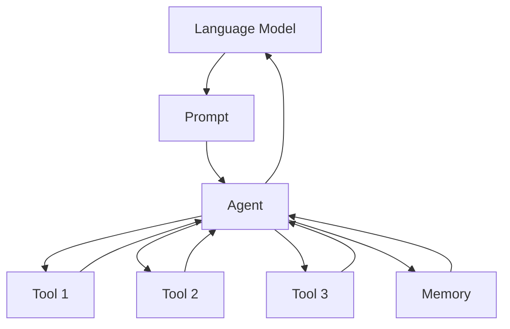

# 【LangChain编程：从入门到实践】LangChain的未来展望

作者：禅与计算机程序设计艺术 / Zen and the Art of Computer Programming

## 1. 背景介绍

### 1.1 问题的由来

随着人工智能技术的飞速发展，特别是大语言模型(LLM)的出现，自然语言处理(NLP)领域迎来了新的突破。然而，如何有效地将LLM与外部知识和工具相结合，构建更加智能化的应用，仍然是一个亟待解决的问题。LangChain应运而生，它为连接LLM和外部世界提供了一套灵活的框架和工具集。

### 1.2 研究现状

目前，LangChain已经成为LLM应用开发领域的热门框架之一。越来越多的开发者和研究人员开始关注LangChain，并利用它构建各种创新性的应用，如智能问答系统、知识图谱构建、文本生成等。然而，LangChain作为一个新兴的框架，其潜力还有待进一步挖掘和探索。

### 1.3 研究意义

深入研究LangChain，对于推动LLM在实际应用中的落地具有重要意义。一方面，LangChain提供了一套标准化的接口和工作流，有助于简化LLM应用的开发过程，提高开发效率。另一方面，LangChain支持多种外部知识源和工具的集成，使得LLM可以更好地利用外部信息，提升模型的理解和生成能力。

### 1.4 本文结构

本文将从以下几个方面对LangChain进行深入探讨：

- 介绍LangChain的核心概念和组件，阐述其内在联系
- 剖析LangChain的核心算法原理，给出具体操作步骤
- 构建LangChain的数学模型，推导关键公式，并结合案例进行详细讲解
- 提供LangChain的代码实例，并进行详细的解释说明
- 探讨LangChain在实际场景中的应用，展望其未来发展前景
- 推荐LangChain相关的学习资源、开发工具和研究论文
- 总结LangChain取得的研究成果，分析其未来趋势和面临的挑战
- 归纳LangChain开发过程中常见的问题，给出解决方案

## 2. 核心概念与联系

LangChain的核心概念包括以下几个方面：

- **语言模型(Language Model)**：指经过海量文本数据训练的大型神经网络模型，如GPT系列模型。它们能够生成和理解自然语言。
- **提示工程(Prompt Engineering)**：是指如何设计和优化输入给语言模型的文本，以引导模型生成期望的输出。
- **代理(Agent)**：是连接语言模型与外部工具的中间件。它负责解析用户输入，调用相应的工具，并将结果返回给语言模型。
- **工具(Tool)**：指语言模型可以调用的外部功能或接口，如搜索引擎、数据库、API等。
- **存储(Memory)**：用于存储对话历史或上下文信息，以便语言模型根据先前的交互生成更连贯的响应。
- **链(Chain)**：将多个组件(如语言模型、代理、工具等)组合成一个完整的执行流程，实现端到端的应用。

下图展示了LangChain的核心组件及其之间的关系：

从图中可以看出，语言模型通过Prompt接收输入，Agent根据Prompt调用相应的Tool并记录Memory，最后将结果返回给语言模型。这种架构使得语言模型可以灵活地与外部世界进行交互，扩展其能力边界。

## 3. 核心算法原理 & 具体操作步骤

### 3.1 算法原理概述

LangChain的核心算法可以概括为以下几个步骤：

1. 接收用户输入的Prompt
2. Agent对Prompt进行解析和分析
3. 根据分析结果，Agent选择合适的Tool进行调用
4. Tool执行任务，返回结果给Agent
5. Agent将Tool的结果整合到Prompt中，形成新的Prompt
6. 将新的Prompt发送给语言模型，生成响应
7. 将语言模型的响应返回给用户，同时更新Memory

这个过程可以不断迭代，直到用户获得满意的结果为止。

### 3.2 算法步骤详解

下面我们对每个步骤进行更详细的说明：

1. **接收用户输入的Prompt**：用户通过界面或API将Prompt发送给LangChain。Prompt通常是一个自然语言问题或指令。

2. **Agent对Prompt进行解析和分析**：Agent会对Prompt进行语义理解和意图识别。常见的方法包括关键词匹配、正则表达式、语义解析等。Agent需要从Prompt中提取关键信息，如操作类型、操作对象、参数等。

3. **根据分析结果，Agent选择合适的Tool进行调用**：根据Prompt的语义信息，Agent会决定调用哪些Tool。例如，如果Prompt中提到了"搜索"，Agent可能会调用搜索引擎相关的Tool。Agent需要将Prompt转化为Tool可接受的输入格式。

4. **Tool执行任务，返回结果给Agent**：Tool根据Agent的输入执行相应的任务，如信息检索、数据查询、计算等。Tool将结果以结构化的格式返回给Agent。

5. **Agent将Tool的结果整合到Prompt中，形成新的Prompt**：Agent需要将Tool返回的结果与原始Prompt进行拼接或替换，形成一个新的Prompt。这个过程可能涉及到一些自然语言生成技术，如模板填充、文本摘要等。

6. **将新的Prompt发送给语言模型，生成响应**：新生成的Prompt被发送给语言模型，语言模型根据Prompt生成自然语言响应。生成过程通常使用Transformer等神经网络模型，结合Beam Search、Top-k Sampling等解码策略。

7. **将语言模型的响应返回给用户，同时更新Memory**：语言模型生成的响应被返回给用户，作为本轮交互的结果。同时，Agent会将本轮Prompt和响应存储到Memory中，作为历史上下文信息，用于下一轮交互。

### 3.3 算法优缺点

LangChain的核心算法具有以下优点：

- 模块化设计，各个组件可以独立开发和优化
- 可扩展性强，可以轻松接入新的语言模型、工具和数据源
- 支持多轮交互，可以处理复杂的多步骤任务
- 引入了Memory机制，使得语言模型可以根据上下文生成更连贯的响应

同时，该算法也存在一些局限性：

- Agent的设计需要大量的领域知识和经验，对开发者的要求较高
- 语言模型生成的响应质量依赖于Prompt的设计，需要进行大量的Prompt Engineering
- 系统的鲁棒性和容错性有待提高，面对意外输入可能会出现异常行为

### 3.4 算法应用领域

LangChain的核心算法可以应用于以下领域：

- 智能客服/助手：通过接入各种知识库和API，LangChain可以构建功能丰富的智能客服或个人助理系统。
- 信息检索与问答：LangChain可以连接搜索引擎、知识图谱等数据源，实现高效的信息检索和问答功能。
- 代码生成与分析：通过接入代码库和开发工具，LangChain可以辅助进行代码编写、代码解释、Bug定位等任务。
- 数据处理与分析：LangChain可以与各种数据处理和分析工具进行集成，如Excel、Python等，用自然语言指令操作和分析数据。

## 4. 数学模型和公式 & 详细讲解 & 举例说明

### 4.1 数学模型构建

我们可以使用一个简化的数学模型来描述LangChain的工作流程。假设我们有以下变量：

- $P$：表示用户输入的Prompt
- $A$：表示Agent对Prompt的理解和分析结果
- $T_i$：表示第$i$个Tool的输出结果
- $M$：表示Memory中存储的历史交互信息
- $R$：表示语言模型生成的最终响应

那么，整个流程可以用以下公式表示：

$$
A = f_a(P, M)
$$

$$
T_i = f_i(A), i=1,2,\cdots,n
$$

$$
P' = f_p(P, T_1, T_2, \cdots, T_n)
$$

$$
R = f_r(P', M)
$$

其中，$f_a$表示Agent的分析函数，$f_i$表示第$i$个Tool的执行函数，$f_p$表示Prompt更新函数，$f_r$表示语言模型的响应生成函数。

### 4.2 公式推导过程

下面我们对每个公式进行更详细的推导和说明：

1. $A = f_a(P, M)$

Agent的分析函数$f_a$接收两个输入：当前Prompt $P$和历史记忆$M$。函数的输出$A$表示Agent对Prompt的理解结果，通常是一个结构化的数据，如意图类别、关键词、参数等。

例如，一个简单的关键词匹配型Agent可以用下面的公式表示：

$$
A = \{(k_1, v_1), (k_2, v_2), \cdots, (k_m, v_m)\}
$$

其中，$k_i$表示识别出的关键词，$v_i$表示对应的值或参数。

2. $T_i = f_i(A), i=1,2,\cdots,n$

每个Tool都有自己的执行函数$f_i$，接收Agent的分析结果$A$作为输入，产生输出结果$T_i$。不同的Tool函数形式各异，取决于具体的功能和接口。

例如，一个简单的搜索引擎Tool可以用下面的公式表示：

$$
T_i = \mathrm{Search}(q), q \in A
$$

其中，$\mathrm{Search}$表示搜索引擎的查询函数，$q$表示从$A$中提取出的查询关键词。

3. $P' = f_p(P, T_1, T_2, \cdots, T_n)$

Prompt更新函数$f_p$接收原始Prompt $P$和所有Tool的输出结果$T_1, T_2, \cdots, T_n$，生成新的Prompt $P'$。这个函数需要将Tool的结果合理地融入到原始Prompt中，形成一个新的自然语言查询。

例如，一个简单的字符串拼接型更新函数可以用下面的公式表示：

$$
P' = P \oplus T_1 \oplus T_2 \oplus \cdots \oplus T_n
$$

其中，$\oplus$表示字符串拼接操作。

4. $R = f_r(P', M)$

语言模型的响应生成函数$f_r$接收更新后的Prompt $P'$和历史记忆$M$，生成最终的自然语言响应$R$。这个函数通常是一个大型的语言模型，如GPT系列模型。

响应生成过程可以用下面的公式表示：

$$
R = \arg\max_R P(R|P',M)
$$

其中，$P(R|P',M)$表示给定$P'$和$M$时，生成响应$R$的条件概率。语言模型的目标是找到使该概率最大化的$R$。

### 4.3 案例分析与讲解

下面我们通过一个具体的案例来说明LangChain的工作流程。

假设用户输入的Prompt是："明天北京的天气如何？"

1. Agent分析Prompt，得到结果：
   
   $A = \{(\mathrm{city}, \mathrm{北京}), (\mathrm{date}, \mathrm{tomorrow}), (\mathrm{intent}, \mathrm{weather})\}$

2. Agent根据意图`weather`，选择调用天气查询Tool，将参数`city`和`date`传入：
   
   $T_1 = \mathrm{WeatherQuery}(\mathrm{city=北京}, \mathrm{date=tomorrow})$

   假设Tool返回结果：
   
   $T_1 = \mathrm{明天北京的天气是晴转多云，最高温度28℃，最低温度20℃。}$

3. 将Tool的结果拼接到原始Prompt中，得到新的Prompt：
   
   $P' = \mat