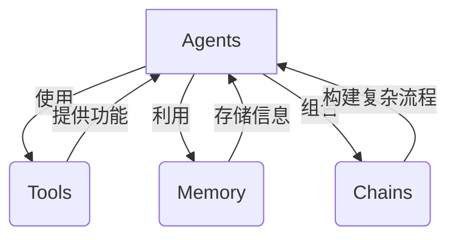
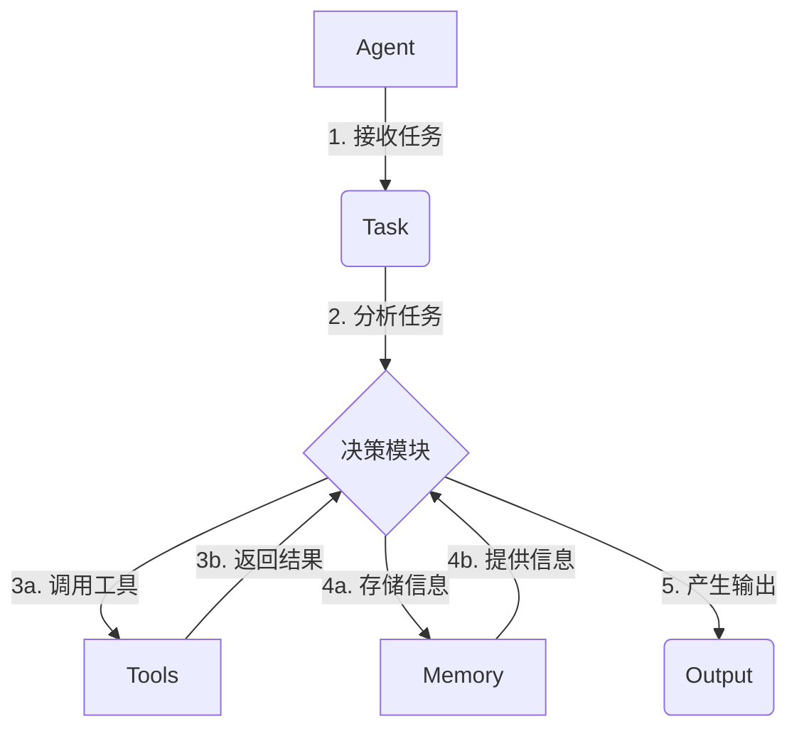

# 【LangChain编程：从入门到实践】使用LangServe提供服务

## 1. 背景介绍

### 1.1 问题的由来

在当今快节奏的数字时代，人工智能(AI)和自然语言处理(NLP)技术正在以前所未有的方式改变着我们的生活和工作方式。随着数据量的不断增长和计算能力的提高,构建智能系统来处理和理解人类语言成为了一个越来越重要的课题。然而,传统的软件开发方法往往难以满足这一需求,因为它们缺乏灵活性和可扩展性。

### 1.2 研究现状

为了解决这一问题,LangChain这个Python库应运而生。它提供了一种模块化和可组合的方式来构建基于人工智能的应用程序,特别是那些涉及自然语言处理的应用程序。LangChain允许开发人员轻松集成各种语言模型、知识库和其他组件,从而构建出功能强大且易于维护的智能系统。

### 1.3 研究意义

LangChain的出现极大地降低了开发人工智能应用程序的门槛,使得这项技术不再仅仅局限于大型科技公司和研究机构。现在,任何有一定编程基础的个人或团队都可以利用LangChain快速构建自己的智能系统,从而解决各种现实世界中的问题。

### 1.4 本文结构

本文将全面介绍LangChain及其核心概念,并深入探讨其底层算法原理和数学模型。我们还将通过实际案例和代码示例,向读者展示如何使用LangChain构建智能应用程序。最后,我们将探讨LangChain的实际应用场景,推荐相关工具和资源,并对其未来发展趋势和挑战进行展望。

## 2. 核心概念与联系

LangChain的核心概念包括代理(Agents)、工具(Tools)、内存(Memory)和链(Chains)。这些概念相互关联,共同构成了LangChain的基础框架。

- **代理(Agents)**: 代理是LangChain中的核心组件,它们负责执行特定的任务或目标。代理可以是基于规则的系统,也可以是基于语言模型的智能系统。它们通过与工具、内存和链的交互来完成任务。

- **工具(Tools)**: 工具是代理可以利用的各种功能模块,例如搜索引擎、数据库、API等。代理可以根据需要调用不同的工具来执行特定的操作。

- **内存(Memory)**: 内存用于存储代理在执行任务过程中产生的中间结果和上下文信息。这些信息可以被代理在后续的操作中利用,从而提高效率和一致性。

- **链(Chains)**: 链是将多个代理、工具和内存组合在一起的方式,用于构建更复杂的流程或应用程序。链可以是顺序执行的,也可以是具有条件逻辑和循环的复杂结构。

通过灵活地组合这些核心概念,LangChain为开发人员提供了一种模块化和可扩展的方式来构建智能系统。它使得开发过程变得更加高效和可维护,同时也为未来的发展留下了足够的空间。

## 3. 核心算法原理 & 具体操作步骤

### 3.1 算法原理概述

LangChain的核心算法原理是基于**代理-工具-内存**的交互模式。代理作为智能系统的核心,通过与工具和内存的交互来完成特定的任务。

1. **接收任务**:代理首先接收到需要完成的任务,可以是一个简单的查询,也可以是一个复杂的目标。

2. **分析任务**:代理通过内置的决策模块分析任务,确定需要执行哪些操作来完成该任务。

3. **调用工具**:根据决策模块的指示,代理调用相应的工具执行特定的操作,例如搜索信息、进行计算或调用API等。工具将结果返回给代理。

4. **利用内存**:代理可以将中间结果和上下文信息存储在内存中,也可以从内存中读取之前存储的信息,以帮助完成当前的任务。

5. **产生输出**:经过一系列的操作和决策后,代理最终产生任务的输出结果。

这种基于代理-工具-内存的交互模式使得LangChain具有很强的灵活性和可扩展性。开发人员可以根据需要定制和替换代理、工具和内存的具体实现,从而构建出满足特定需求的智能系统。

### 3.2 算法步骤详解

下面我们将更详细地介绍LangChain算法的具体步骤:

1. **初始化代理**:首先,需要初始化一个代理实例。LangChain提供了多种预定义的代理类型,例如`ZeroShotAgent`、`ConversationalAgent`和`ReActAgent`等。你可以根据需要选择合适的代理类型,并配置相应的语言模型和其他参数。

2. **加载工具**:接下来,需要加载代理将要使用的工具。LangChain内置了许多常用的工具,如`Wikipedia`、`Serpapi`、`Wolfram Alpha`等。你也可以自定义工具,只需实现一个符合LangChain接口的Python类即可。

3. **设置内存**:为了在执行任务过程中存储和利用上下文信息,你需要为代理设置一个内存实例。LangChain提供了多种内存类型,如`ConversationBufferMemory`、`ConversationEntityMemory`和`ConversationSummaryMemory`等。

4. **运行代理**:配置好代理、工具和内存后,就可以运行代理来执行特定的任务了。你可以调用代理的`run`方法,并传入任务描述作为参数。

5. **监控执行过程**:在代理执行任务的过程中,你可以监控它与工具和内存的交互情况。LangChain提供了详细的日志记录功能,可以帮助你了解代理的决策过程和中间结果。

6. **获取输出结果**:任务执行完毕后,代理将返回最终的输出结果。你可以对结果进行进一步的处理或展示。

通过上述步骤,你可以利用LangChain快速构建出智能系统的原型,并根据需要进行定制和扩展。LangChain的模块化设计使得这个过程变得简单而高效。

### 3.3 算法优缺点

LangChain算法的优点包括:

- **模块化设计**:代理、工具和内存的模块化设计使得整个系统具有很强的灵活性和可扩展性,便于定制和集成新的组件。

- **易于原型开发**:LangChain提供了丰富的预定义组件和工具,大大加快了原型开发的速度。

- **支持多种语言模型**:LangChain支持集成各种流行的语言模型,如GPT、BERT、RoBERTa等,使得开发人员可以根据需求选择合适的模型。

- **可解释性**:通过日志记录和可视化,LangChain算法的执行过程具有一定的可解释性,有助于调试和优化。

但是,LangChain算法也存在一些缺点和限制:

- **性能瓶颈**:由于需要频繁地与语言模型和外部工具交互,LangChain算法在处理大规模任务时可能会遇到性能瓶颈。

- **上下文限制**:虽然LangChain提供了内存机制来存储上下文信息,但语言模型本身对上下文的理解能力仍然有限。

- **决策质量依赖**:算法的决策质量很大程度上依赖于语言模型的能力和工具的准确性,存在一定的不确定性。

- **安全和隐私风险**:由于需要与外部服务交互,LangChain算法可能会面临一些安全和隐私风险,需要采取适当的措施进行防护。

总的来说,LangChain算法为构建智能系统提供了一种灵活和高效的方式,但也存在一些需要注意和改进的地方。开发人员需要根据具体的应用场景,权衡算法的优缺点,并采取相应的策略来确保系统的性能、安全性和可靠性。

### 3.4 算法应用领域

LangChain算法的应用领域非常广泛,包括但不限于:

- **问答系统**:利用LangChain构建智能问答系统,可以从各种数据源中检索相关信息,并以自然语言的形式回答用户的问题。

- **任务自动化**:LangChain可以用于自动化各种重复性的任务,如数据处理、文档生成、电子邮件回复等,从而提高工作效率。

- **决策支持系统**:通过集成各种知识库和专家系统,LangChain可以为决策者提供智能化的建议和支持。

- **个人助理**:将LangChain与语音识别和自然语言生成技术相结合,可以构建智能的个人助理,为用户提供各种服务。

- **教育和学习**:LangChain可以用于开发智能教育系统,根据学生的水平和需求提供个性化的学习资源和指导。

- **客户服务**:在客户服务领域,LangChain可以用于构建智能客服系统,快速响应客户的查询和需求。

- **内容生成**:利用LangChain的自然语言生成能力,可以自动生成各种类型的内容,如新闻报道、营销文案、故事情节等。

- **科研和发现**:LangChain可以帮助科研人员快速检索和整合相关信息,支持新发现和创新的产生。

总之,只要涉及自然语言处理和智能决策的领域,LangChain都可以发挥重要作用。它为构建智能系统提供了一种通用的框架和工具,极大地降低了开发难度和成本。

## 4. 数学模型和公式 & 详细讲解 & 举例说明

虽然LangChain主要是一个基于规则和工具的框架,但它也可以与基于数学模型的语言模型相结合,从而提供更强大的自然语言处理能力。在这一节中,我们将探讨LangChain中常用的一些数学模型和公式,并通过具体案例进行详细讲解。

### 4.1 数学模型构建

LangChain中常用的语言模型通常基于**转换器(Transformer)**架构,该架构由谷歌在2017年提出,并在后续的自然语言处理任务中取得了卓越的成绩。转换器架构的核心思想是利用**自注意力(Self-Attention)机制**来捕获输入序列中的长程依赖关系,从而更好地理解和生成自然语言。

自注意力机制可以用下式表示:

$$
\mathrm{Attention}(Q, K, V) = \mathrm{softmax}\left(\frac{QK^T}{\sqrt{d_k}}\right)V
$$

其中:

- $Q$表示查询(Query)向量
- $K$表示键(Key)向量
- $V$表示值(Value)向量
- $d_k$是缩放因子,用于防止点积过大导致梯度消失

自注意力机制通过计算查询向量与所有键向量的相似性得分,然后对这些得分进行软最大值归一化,最终得到一个注意力权重向量。该向量与值向量相乘,即可获得加权后的表示,捕获了输入序列中的重要信息。

基于自注意力机制,转换器架构通常包括以下几个主要组件:

- **嵌入层(Embedding Layer)**:将输入的词元(Token)映射到连续的向量空间
- **编码器(Encoder)**:由多个编码器层组成,每层包含多头自注意力和前馈神经网络
- **解码器(Decoder)**:由多个解码器层组成,每层包含多头自注意力、编码器-解