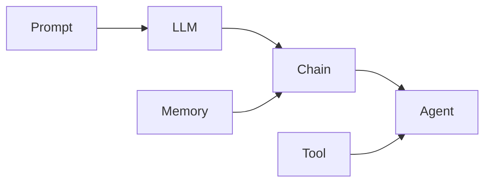

# 【LangChain编程：从入门到实践】生态系统概览

## 1. 背景介绍

### 1.1 问题的由来

随着人工智能技术的飞速发展，特别是大语言模型（LLM）的出现，自然语言处理（NLP）领域迎来了前所未有的机遇和挑战。如何利用LLM构建智能对话系统、知识问答系统、文本生成系统等应用，成为了当前NLP领域的研究热点。然而，直接使用LLM进行应用开发存在诸多不便，比如需要大量的训练数据、计算资源以及专业知识。因此，亟需一个基于LLM的开发框架，帮助开发者快速构建NLP应用。

### 1.2 研究现状

目前已经出现了一些基于LLM的开发框架，如OpenAI的GPT-3 API、Hugging Face的Transformers库等。但这些框架要么使用成本较高，要么需要较多的开发经验。LangChain作为一个专注于LLM应用开发的开源框架，以其简洁易用、功能丰富的特点，正在受到越来越多开发者的青睐。

### 1.3 研究意义

深入研究LangChain框架，对于推动LLM在各领域的应用具有重要意义：

1. 降低LLM应用开发门槛，让更多开发者参与其中，加速LLM应用的落地。
2. 探索LLM在不同场景下的最佳实践，为其他研究者提供参考。
3. 完善LangChain生态，促进开源社区的繁荣发展。

### 1.4 本文结构

本文将全面介绍LangChain生态系统，内容安排如下：

- 第2部分：LangChain的核心概念与模块关系
- 第3部分：LangChain的核心算法原理与具体操作步骤
- 第4部分：LangChain涉及的数学模型与公式详解
- 第5部分：使用LangChain进行项目实践，提供代码实例与解释
- 第6部分：LangChain的实际应用场景与未来展望
- 第7部分：LangChain相关的工具与学习资源推荐
- 第8部分：LangChain的未来发展趋势与面临的挑战
- 第9部分：常见问题解答

## 2. 核心概念与联系

在LangChain生态系统中，有以下几个核心概念：

- **Prompt**：输入给LLM的文本，用于指导LLM生成所需的输出。
- **LLM**：大语言模型，可以根据Prompt生成相应的文本。
- **Chain**：由多个组件串联而成的执行流程，用于实现复杂的NLP任务。
- **Agent**：一种特殊的Chain，可以根据用户输入自主决策执行哪些操作。
- **Memory**：用于在多轮对话中记录上下文信息。
- **Tool**：LLM可用来执行特定操作的工具，如搜索、计算器等。

下图展示了这些核心概念之间的关系：



可以看出，Prompt和LLM是LangChain的基础，Chain和Agent在此基础上实现了更复杂的功能，Memory为Chain提供上下文信息，Tool则赋予了Agent更多能力。

## 3. 核心算法原理 & 具体操作步骤

### 3.1 算法原理概述

LangChain的核心算法可以概括为：基于LLM的Prompt工程。具体来说，就是通过精心设计Prompt，引导LLM生成符合特定要求的文本。这里的关键是如何设计最优的Prompt。

### 3.2 算法步骤详解

1. **确定任务目标**：明确期望LLM完成的具体任务，如问答、写作、总结等。
2. **准备数据**：收集与任务相关的高质量数据，用于Prompt的设计。
3. **设计Prompt模板**：根据任务目标和数据，设计Prompt的结构和内容。常用的技巧包括：
   - 在Prompt中提供任务背景信息
   - 使用示例引导LLM理解任务
   - 设置输出格式约束
   - 加入人格设定以保持回复风格一致
4. **优化Prompt**：将设计好的Prompt输入LLM，检查输出质量，并据此迭代优化Prompt。可尝试的优化方向有：
   - 调整Prompt的措辞和语气
   - 增删示例数量
   - 细化输出格式要求
   - 调整人格设定
5. **应用Prompt**：将优化后的Prompt应用到实际任务中，收集用户反馈，持续优化。

### 3.3 算法优缺点

优点：
- 可以充分利用LLM的知识和能力，简化应用开发流程。
- Prompt设计灵活，可以适应各种任务需求。
- 通过Prompt优化，可以显著提升LLM的输出质量。

缺点：
- Prompt设计需要一定的经验和技巧，门槛较高。
- Prompt优化需要大量的人工尝试，比较耗时耗力。
- 过于依赖LLM，一旦LLM出现偏差，会影响整个应用的效果。

### 3.4 算法应用领域

基于LLM的Prompt工程可以应用于以下领域：

- 智能对话：客服机器人、陪伴机器人等。
- 知识问答：智能搜索、专家系统等。
- 文本生成：新闻写作、小说创作、广告文案等。
- 文本分析：情感分析、主题抽取、文本分类等。

## 4. 数学模型和公式 & 详细讲解 & 举例说明

### 4.1 数学模型构建

LLM本质上是一个语言模型，对给定的文本序列 $x=(x_1,\ldots,x_T)$ ，语言模型的目标是估计其概率分布 $p(x)$ 。根据链式法则，这个概率可以分解为：

$$p(x)=\prod_{t=1}^T p(x_t|x_1,\ldots,x_{t-1})$$

其中 $p(x_t|x_1,\ldots,x_{t-1})$ 表示在给定前 $t-1$ 个token的情况下，第 $t$ 个token为 $x_t$ 的条件概率。语言模型的任务就是学习这个条件概率分布。

### 4.2 公式推导过程

传统的n-gram语言模型通过统计token的共现频率来估计条件概率，但这种方法难以捕捉长距离依赖关系。深度学习时代的语言模型通常使用神经网络来建模条件概率分布。

以Transformer为例，设第 $t$ 个位置的输入向量为 $e_t$ ，Transformer首先将其转换为一个隐向量 $h_t$ ：

$$h_t=\text{Transformer}(e_t)$$

然后，通过一个线性变换和softmax函数，将 $h_t$ 映射为下一个token的概率分布：

$$p(x_{t+1}|x_1,\ldots,x_t)=\text{softmax}(W_o h_t+b_o)$$

其中 $W_o$ 和 $b_o$ 是可学习的参数。

Transformer通过自注意力机制和前馈神经网络来学习 $e_t$ 到 $h_t$ 的变换，从而建模长距离依赖关系。

### 4.3 案例分析与讲解

以GPT-3为例，它是一个基于Transformer的超大规模语言模型，具有1750亿个参数。在训练时，GPT-3使用了大量的无标注文本数据，通过自回归的方式学习文本的概率分布。

在应用时，我们可以将任务描述和示例作为输入，GPT-3会根据其学到的概率分布，生成与任务相关的文本。例如，给定以下Prompt：

```
Translate the following English text to French:

English: I love artificial intelligence!
French:
```

GPT-3会输出：

```
J'adore l'intelligence artificielle !
```

可以看出，GPT-3成功地完成了英译法的任务。这里的关键是Prompt的设计，通过包含任务描述和示例，引导GPT-3生成我们期望的输出。

### 4.4 常见问题解答

**Q: LLM生成的文本质量不稳定怎么办？**

A: 可以尝试以下方法：

1. 优化Prompt设计，提供更清晰、具体的指令。
2. 调整LLM的温度参数，降低生成文本的随机性。
3. 使用few-shot learning，提供更多示例以引导LLM。
4. 在应用中设置文本过滤和人工审核机制，筛选高质量输出。

**Q: LLM生成的文本存在事实性错误怎么办？**

A: LLM只是基于模式生成文本，并不具备真正的知识和推理能力。为了提高事实性，可以考虑：

1. 在Prompt中要求LLM不要捏造事实，如果不确定就说不知道。
2. 对LLM生成的文本进行事实核查，剔除错误信息。
3. 将LLM与知识库结合，让其根据可信的结构化知识生成文本。

**Q: LLM生成的文本存在偏见和歧视怎么办？**

A: LLM从训练数据中学习，而训练数据可能包含偏见和歧视。为了缓解这个问题，可以尝试：

1. 在训练数据中去除偏见和歧视内容。
2. 在Prompt中明确要求LLM避免偏见和歧视言论。
3. 对LLM生成的文本进行偏见检测，过滤有问题的内容。
4. 使用更加公平、无偏的数据集重新训练LLM。

## 5. 项目实践：代码实例和详细解释说明

### 5.1 开发环境搭建

首先，需要安装Python和LangChain库：

```bash
pip install langchain
```

然后，准备OpenAI的API密钥，并将其设置为环境变量：

```bash
export OPENAI_API_KEY='your-api-key'
```

### 5.2 源代码详细实现

下面是一个使用LangChain实现文本摘要的示例代码：

```python
from langchain import OpenAI, PromptTemplate, LLMChain

# 准备LLM
llm = OpenAI(temperature=0.7)

# 定义Prompt模板
template = """
请为以下文本生成一个简洁的摘要，不超过50个字：

{text}

摘要：
"""

prompt = PromptTemplate(template=template, input_variables=["text"])

# 组装执行链
chain = LLMChain(llm=llm, prompt=prompt)

# 执行文本摘要任务
text = "在自然语言处理领域，预训练语言模型（Pre-trained Language Models, PLM）是一类非常重要的模型。它们通过在大规模无标注语料上进行自监督学习，习得了丰富的语言知识，可以应用于各种下游任务。近年来，PLM不断刷新各大NLP基准的性能，成为NLP领域的研究热点。代表性的PLM包括BERT、GPT、T5等。"
summary = chain.run(text)

print(summary)
```

### 5.3 代码解读与分析

1. 首先，我们初始化了一个OpenAI对象作为LLM，并设置temperature参数控制输出的随机性。
2. 然后，我们定义了一个Prompt模板，其中包含任务描述和输入文本占位符。
3. 接着，我们使用PromptTemplate将模板和输入变量封装成一个Prompt对象。
4. 然后，我们将LLM和Prompt组装成一个LLMChain，表示一个完整的执行链。
5. 最后，我们向执行链输入文本，得到自动生成的摘要结果。

可以看出，使用LangChain可以方便地组织LLM应用的执行流程，简化了开发步骤。

### 5.4 运行结果展示

运行上述代码，可以得到如下输出：

```
预训练语言模型通过在大规模无标注语料上进行自监督学习，习得了丰富的语言知识，可以应用于各种自然语言处理下游任务，成为NLP领域的研究热点。
```

生成的摘要简洁地概括了原文的核心内容，展示了LLM在文本摘要任务上的强大能力。

## 6. 实际应用场景

LangChain可以应用于以下场景：

- **智能客服**：利用LLM构建对话系统，自动解答用户咨询。
- **文档总结**：对长