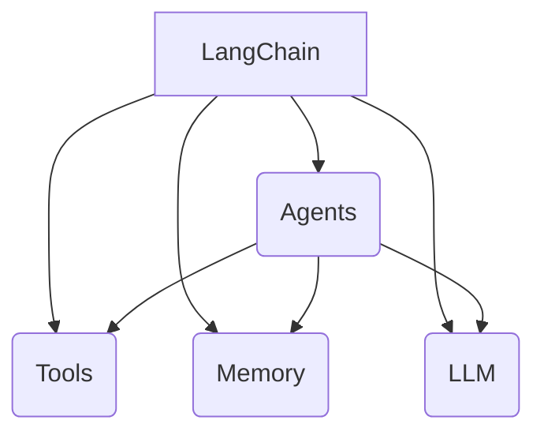

好的,我明白了您的要求。以下是标题为《【LangChain编程:从入门到实践】管理工具安装》的技术博客文章正文:

# 【LangChain编程:从入门到实践】管理工具安装

## 1. 背景介绍

### 1.1 问题的由来

在当今快节奏的软件开发环境中,开发人员面临着处理海量数据和构建智能应用程序的巨大挑战。传统的编程方法已经无法满足日益复杂的需求,因此需要一种新的范式来简化这些任务。LangChain就是为解决这一问题而诞生的框架。

### 1.2 研究现状  

LangChain是一个用于构建应用程序的Python库,它将人工智能(AI)与传统编程相结合。凭借其强大的功能,LangChain可以帮助开发人员轻松地整合大语言模型(LLM)、数据源和其他AI工具,从而构建智能化的应用程序。

### 1.3 研究意义

LangChain的出现为开发人员提供了一种全新的编程范式,使他们能够更高效地处理复杂的任务。通过利用LangChain,开发人员可以将AI的强大功能无缝集成到应用程序中,从而提高生产力并创建更智能化的解决方案。

### 1.4 本文结构

本文将深入探讨LangChain的安装和配置过程。我们将介绍安装LangChain所需的先决条件,以及如何设置开发环境。此外,我们还将探讨一些常见问题和解决方案,帮助您顺利开始使用LangChain进行开发。

## 2. 核心概念与联系

LangChain是一个Python库,旨在简化将大语言模型(LLM)集成到应用程序中的过程。它提供了一种模块化的方法,使开发人员能够轻松地组合不同的组件,如LLM、数据源和其他AI工具,以构建智能化的应用程序。

LangChain的核心概念包括:

1. **Agents**: 代理是LangChain中的核心概念,它们是具有特定功能的自治实体,可以执行各种任务,如问答、文本生成、数据处理等。

2. **Tools**: 工具是代理可以利用的功能模块,例如搜索引擎、数据库、计算器等。代理可以根据需要调用这些工具来完成特定任务。

3. **Memory**: 内存用于存储代理在执行任务过程中的中间状态和结果,以供后续使用。

4. **LLM**: 大语言模型(LLM)是LangChain的核心组件之一,它提供了自然语言处理和生成的能力,使代理能够与用户进行自然语言交互。

这些核心概念相互关联,共同构建了LangChain的智能应用程序开发框架。代理利用工具和LLM的功能,并将中间结果存储在内存中,从而实现复杂的任务处理。

## 3. 核心算法原理与具体操作步骤

### 3.1 算法原理概述

LangChain的核心算法原理是基于代理-工具-LLM的交互模式。代理作为智能系统的核心,负责协调和管理任务的执行。它可以利用各种工具来完成特定的子任务,并将结果传递给LLM进行进一步处理和生成。

该算法的工作流程如下:

1. 用户向代理提出任务请求。
2. 代理分析任务,确定需要使用哪些工具来完成。
3. 代理调用相应的工具执行子任务,并将结果存储在内存中。
4. 代理将任务的中间结果和上下文信息传递给LLM。
5. LLM根据输入生成响应,代理将响应返回给用户。

该算法的核心思想是将复杂的任务分解为多个可管理的子任务,利用各种工具和LLM的能力协同工作,从而实现智能化的任务处理。

### 3.2 算法步骤详解

1. **任务分析**:代理首先需要分析用户提出的任务,确定任务的性质和需求。这一步通常涉及自然语言理解和任务拆解。

2. **工具选择**:根据任务的需求,代理需要选择合适的工具来执行相应的子任务。这可能需要代理具备一定的领域知识和推理能力。

3. **工具执行**:代理调用选定的工具执行子任务,并将结果存储在内存中。这一步可能需要多次迭代,直到完成整个任务。

4. **LLM交互**:代理将任务的中间结果和上下文信息传递给LLM,LLM根据输入生成响应,例如回答问题、生成文本等。

5. **响应返回**:代理将LLM生成的响应返回给用户,完成整个任务。

在整个过程中,代理扮演着协调和管理的角色,确保各个组件之间的无缝交互和协作。

### 3.3 算法优缺点

**优点**:

- **模块化设计**:LangChain采用模块化的设计,使得代理、工具和LLM可以独立开发和集成,提高了系统的灵活性和可扩展性。
- **任务分解**:通过将复杂的任务分解为多个可管理的子任务,算法可以更好地利用各种工具和LLM的能力,提高了任务处理的效率和质量。
- **知识融合**:算法可以将来自不同来源的知识和信息融合在一起,为LLM提供更丰富的上下文信息,从而生成更准确和相关的响应。

**缺点**:

- **依赖工具和LLM**:算法的性能和质量在很大程度上依赖于所使用的工具和LLM的能力。如果工具或LLM存在缺陷或限制,则可能会影响整个系统的表现。
- **上下文管理**:在处理复杂任务时,管理和维护上下文信息可能会变得困难,尤其是当任务涉及多个迭代和子任务时。
- **决策过程**:代理在选择工具和管理任务流程时需要进行决策,这可能会引入一定的不确定性和错误。

### 3.4 算法应用领域

LangChain的核心算法可以应用于各种领域,包括但不限于:

- **问答系统**:利用LLM的自然语言处理能力和各种工具(如知识库、搜索引擎等),构建智能问答系统。
- **文本生成**:结合LLM的文本生成能力和各种数据源(如新闻、文献等),生成高质量的文本内容。
- **任务自动化**:利用代理协调各种工具(如Web API、脚本等),实现任务的自动化处理。
- **决策支持系统**:融合LLM的推理能力和各种数据源,为决策过程提供智能支持。
- **个性化推荐系统**:根据用户的偏好和行为,利用LLM和相关工具生成个性化的推荐。

总的来说,LangChain的核心算法为构建智能化的应用程序提供了一种通用的框架,可以广泛应用于各个领域。

## 4. 数学模型和公式详细讲解与举例说明

虽然LangChain主要是一个基于代理-工具-LLM交互的框架,但在某些特定场景下,它也可以利用数学模型和公式来提高任务处理的准确性和效率。

### 4.1 数学模型构建

在某些任务中,如文本分类、情感分析等,我们可以构建数学模型来描述和预测相关的变量之间的关系。常见的数学模型包括:

- **线性模型**:用于描述两个或多个变量之间的线性关系,例如线性回归模型。
- **概率模型**:用于描述随机事件的概率分布,例如朴素贝叶斯模型。
- **神经网络模型**:用于模拟人脑神经元的工作原理,例如多层感知器模型。

这些数学模型可以通过机器学习算法进行训练,从而获得最佳的模型参数,用于对新的输入数据进行预测或决策。

### 4.2 公式推导过程

在构建数学模型的过程中,我们通常需要推导出一些公式来描述模型的结构和参数。以线性回归模型为例,我们可以推导出如下公式:

$$y = \beta_0 + \beta_1x_1 + \beta_2x_2 + ... + \beta_nx_n + \epsilon$$

其中:

- $y$是因变量(目标变量)
- $x_1, x_2, ..., x_n$是自变量(特征变量)
- $\beta_0$是截距项
- $\beta_1, \beta_2, ..., \beta_n$是各自变量的系数
- $\epsilon$是随机误差项

通过最小二乘法,我们可以估计出各个系数的值,从而获得最佳拟合的线性模型。

### 4.3 案例分析与讲解

现在,让我们通过一个实际案例来说明如何将数学模型应用于LangChain框架中。假设我们需要构建一个情感分析系统,根据文本的内容预测其情感极性(正面或负面)。

我们可以使用朴素贝叶斯模型来解决这个问题。朴素贝叶斯模型基于贝叶斯定理,它假设每个特征之间是相互独立的。对于文本分类任务,我们可以将每个单词视为一个特征,然后计算每个单词在正面文本和负面文本中出现的概率。

根据贝叶斯定理,我们可以推导出如下公式:

$$P(c|x) = \frac{P(x|c)P(c)}{P(x)}$$

其中:

- $P(c|x)$是在观察到特征向量$x$的情况下,文本属于类别$c$的后验概率
- $P(x|c)$是在已知类别$c$的情况下,观察到特征向量$x$的似然概率
- $P(c)$是类别$c$的先验概率
- $P(x)$是观察到特征向量$x$的总概率

通过训练数据,我们可以估计出各个概率值,然后对新的文本输入进行预测。

在LangChain框架中,我们可以将朴素贝叶斯模型作为一个工具,由代理调用并将结果传递给LLM进行进一步处理和生成响应。

### 4.4 常见问题解答

**Q: 为什么要在LangChain中使用数学模型?**

A: 虽然LangChain主要依赖于LLM的自然语言处理能力,但在某些特定场景下,引入数学模型可以提高任务处理的准确性和效率。数学模型可以对特定问题建模,并提供更精确的预测或决策。

**Q: 如何选择合适的数学模型?**

A:选择合适的数学模型需要根据具体的任务和数据特征。一般来说,线性模型适用于线性可分的问题,概率模型适用于涉及概率和不确定性的问题,而神经网络模型则适用于更复杂的非线性问题。您可以尝试不同的模型,并根据模型的性能和解释能力进行选择。

**Q: 如何将数学模型集成到LangChain中?**

A: LangChain提供了灵活的接口,允许您将自定义的工具集成到框架中。您可以将训练好的数学模型封装为一个工具,由代理根据需要调用该工具进行预测或决策。工具的输出可以作为LLM的输入,供其进一步处理和生成响应。

**Q: 数学模型和LLM之间如何协作?**

A:数学模型和LLM可以相互补充,发挥各自的优势。数学模型可以提供精确的预测或决策,而LLM则可以基于这些结果生成自然语言的解释和响应。LLM还可以提供上下文信息和领域知识,帮助数学模型进行更准确的建模和预测。

## 5. 项目实践:代码实例和详细解释说明

在本节中,我们将通过一个实际的代码示例,演示如何在LangChain中安装和配置必要的工具,以及如何构建一个简单的问答系统。

### 5.1 开发环境搭建

首先,我们需要确保已经安装了Python和pip。你可以在终端中运行以下命令来检查是否