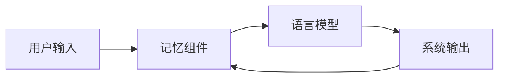

# 【LangChain编程：从入门到实践】记忆组件的应用

## 1. 背景介绍
### 1.1 问题的由来
随着人工智能技术的飞速发展,对话系统正变得越来越智能化。然而,传统的对话系统往往缺乏上下文记忆能力,导致对话体验不连贯,用户体验较差。为了解决这一问题,LangChain引入了记忆(Memory)组件,旨在赋予对话系统一定的"记忆力",使其能够根据之前的对话内容,更好地理解用户意图并给出恰当的回应。

### 1.2 研究现状 
目前,学术界和工业界都在积极探索对话系统中记忆组件的应用。微软、谷歌、OpenAI等科技巨头纷纷推出了自己的对话式AI助手,如微软的小冰、谷歌的Meena和OpenAI的ChatGPT。这些系统都具备一定的上下文记忆能力,能够更自然地与人类进行多轮对话交互。

在学术研究方面,记忆增强的对话系统也受到广泛关注。比如,有研究者提出了一种基于记忆网络(Memory Network)的端到端对话模型,通过将历史对话内容编码到外部存储,使系统能够根据上下文信息动态地生成回复。另有学者探索了层次记忆(Hierarchical Memory)在对话中的应用,模拟人类将记忆划分为长期记忆和短期记忆的认知机制。

### 1.3 研究意义
记忆组件的引入,有望显著提升对话系统的智能化水平。一方面,记忆增强的对话模型能够更好地把握上下文,从而产生更连贯、更符合逻辑的对话;另一方面,记忆机制的加入,使得系统可以累积知识,不断从历史对话中学习,其对话能力将随着时间的推移不断提高。这对于打造更加智能、人性化的对话式AI助手具有重要意义。

同时,记忆组件在对话系统中的研究,也为认知科学、神经科学等学科提供了新的视角。通过借鉴人类记忆的运作机制,构建类脑的认知系统,不仅有助于揭示人类智能的奥秘,也为发展类人的通用人工智能(AGI)提供了重要参考。

### 1.4 本文结构
本文将重点介绍LangChain框架中记忆组件的原理和应用。第2部分阐述记忆组件的核心概念;第3部分详细讲解记忆组件的工作原理和算法实现;第4部分给出记忆组件相关的数学模型和公式推导;第5部分通过代码实例,演示如何使用LangChain构建一个带记忆功能的智能对话系统;第6部分展望记忆组件的实际应用场景;第7部分推荐相关的学习资源和开发工具;第8部分总结全文,并对未来的研究趋势和挑战进行展望。

## 2. 核心概念与联系

在LangChain中,记忆(Memory)是指对话系统存储和管理历史对话信息的机制。通过记忆组件,系统可以跟踪对话的上下文,从而更准确地理解用户意图并作出恰当回应。下面介绍几个与记忆组件密切相关的核心概念:

- 对话历史(Conversation History):指代整个对话过程中产生的所有消息记录,包括用户的输入和系统的输出。记忆组件需要存储和管理这些历史信息。

- 记忆提示(Memory Prompt):在生成回复时,记忆组件会将相关的历史信息整合成一个上下文提示,作为语言模型的附加输入,帮助模型更好地理解当前对话。

- 记忆容量(Memory Capacity):指代记忆组件能够存储的历史对话信息的数量。记忆容量是一个可配置的参数,需要根据具体任务和资源限制进行权衡。

- 记忆更新策略(Memory Update Strategy):定义了记忆组件如何更新存储的历史信息。常见的策略包括先进先出(FIFO)、最近优先(Latest)等。

下图展示了记忆组件在对话系统中的作用:

可以看到,记忆组件位于用户输入和语言模型之间,起到了连接上下文的桥梁作用。它将用户输入和系统输出等历史信息存储起来,并在生成回复时将相关信息提供给语言模型,使其能够根据上下文生成更加连贯、自然的对话。

## 3. 核心算法原理 & 具体操作步骤
### 3.1 算法原理概述
LangChain的记忆组件基于一种称为"上下文记忆"(Contextual Memory)的算法。该算法的核心思想是,将历史对话信息编码为一个上下文向量,并将其与当前输入拼接,作为语言模型的输入,以生成考虑上下文的回复。

具体来说,上下文记忆算法包含以下几个关键步骤:
1. 对话历史编码:将历史对话信息编码为一个固定长度的向量表示。常用的编码方法包括TF-IDF、Word2Vec等。
2. 上下文融合:将编码后的历史向量与当前输入进行拼接,形成一个包含上下文信息的输入序列。 
3. 语言模型推理:将融合后的上下文输入序列送入预训练的语言模型,生成考虑上下文的回复。
4. 记忆更新:将新的对话内容添加到记忆组件中,更新历史信息。

### 3.2 算法步骤详解
下面我们对上下文记忆算法的每一步进行详细说明:

**步骤1:对话历史编码**
假设当前的对话历史为$H=\{x_1,y_1,x_2,y_2,...,x_t,y_t\}$,其中$x_i$表示第$i$轮用户输入,$y_i$表示第$i$轮系统回复。我们首先对每个输入和回复进行编码:

$$E(x_i)=\text{Encode}(x_i), E(y_i)=\text{Encode}(y_i)$$

其中$\text{Encode}(\cdot)$表示编码函数,可以使用预训练的词向量模型如Word2Vec或语言模型如BERT来实现。编码后,每个输入和回复都被表示为一个$d$维向量。

接下来,我们将编码后的向量按照时间顺序拼接,得到一个表示完整对话历史的向量$\mathbf{h}$:

$$\mathbf{h}=[E(x_1);E(y_1);E(x_2);E(y_2);...;E(x_t);E(y_t)]$$

其中$[\cdot;\cdot]$表示向量拼接操作。

**步骤2:上下文融合**
给定当前用户输入$x_{t+1}$,我们首先对其进行编码:

$$E(x_{t+1})=\text{Encode}(x_{t+1})$$

然后,将编码后的当前输入与对话历史向量$\mathbf{h}$拼接,得到一个包含上下文信息的输入向量$\mathbf{c}$:

$$\mathbf{c}=[\mathbf{h};E(x_{t+1})]$$

这个向量$\mathbf{c}$融合了之前的对话历史和当前输入,蕴含了丰富的上下文信息。

**步骤3:语言模型推理**
接下来,我们将上下文向量$\mathbf{c}$输入到一个预训练的语言模型$\mathcal{M}$中,生成考虑上下文的回复$y_{t+1}$:

$$y_{t+1}=\mathcal{M}(\mathbf{c})$$

语言模型$\mathcal{M}$可以是基于Transformer的模型如GPT系列,也可以是基于RNN的序列到序列模型。它接受融合了上下文信息的输入$\mathbf{c}$,并根据上下文生成自然、连贯的回复$y_{t+1}$。

**步骤4:记忆更新**
最后,我们将新的用户输入$x_{t+1}$和系统回复$y_{t+1}$添加到对话历史$H$中,更新记忆组件:

$$H\leftarrow H\cup\{x_{t+1},y_{t+1}\}$$

这样,记忆组件就始终维护着一个包含最新对话内容的历史缓存,供下一轮对话使用。

### 3.3 算法优缺点
上下文记忆算法的优点包括:
- 能够捕捉对话的上下文信息,生成更加连贯、自然的回复。
- 通过编码和融合历史信息,减少了语言模型的输入长度,提高了推理效率。
- 记忆更新机制简单,易于实现和扩展。

同时,该算法也存在一些局限性:
- 对话历史编码是一个固定长度的向量,可能损失一些重要的细节信息。 
- 没有考虑不同历史信息的相关性,平等对待所有的历史内容。
- 记忆容量有限,难以处理很长的对话历史。

### 3.4 算法应用领域
上下文记忆算法在以下领域有广泛的应用:
- 智能客服:通过记忆用户之前的问题和回答,提供更加个性化、连贯的服务。
- 虚拟助手:利用上下文信息,使虚拟助手能够进行多轮对话,执行连续的任务。
- 智能教育:根据学生的学习历史,提供针对性的学习内容和反馈。
- 医疗对话:整合患者的病史和诊疗记录,为医生提供更全面的辅助决策。

## 4. 数学模型和公式 & 详细讲解 & 举例说明
### 4.1 数学模型构建
我们可以使用向量空间模型来刻画上下文记忆算法。设输入空间为$\mathcal{X}$,输出空间为$\mathcal{Y}$,上下文记忆模型$\mathcal{F}$定义为一个映射:

$$\mathcal{F}:\mathcal{X}^t\times\mathcal{X}\rightarrow\mathcal{Y}$$

其中$\mathcal{X}^t$表示$t$轮对话的输入序列,即$\mathcal{X}^t=\mathcal{X}\times\mathcal{X}\times...\times\mathcal{X}$($t$次)。给定一个对话历史$H\in\mathcal{X}^t$和当前输入$x\in\mathcal{X}$,模型$\mathcal{F}$输出一个回复$y\in\mathcal{Y}$。

我们进一步假设存在一个编码函数$\phi:\mathcal{X}\rightarrow\mathbb{R}^d$,将输入空间$\mathcal{X}$映射到$d$维实向量空间。同时,存在一个语言模型$\mathcal{M}:\mathbb{R}^{td+d}\rightarrow\mathcal{Y}$,接受$td+d$维的上下文向量,生成输出$y$。

于是,上下文记忆模型$\mathcal{F}$可以分解为编码函数$\phi$和语言模型$\mathcal{M}$的组合:

$$\mathcal{F}(H,x)=\mathcal{M}([\phi(H);\phi(x)])$$

其中$\phi(H)=[\phi(x_1);\phi(y_1);...;\phi(x_t);\phi(y_t)]$表示对话历史$H$的编码向量。

### 4.2 公式推导过程
下面我们推导上下文记忆算法的数学形式。

首先,对于一个长度为$t$的对话历史$H=\{x_1,y_1,x_2,y_2,...,x_t,y_t\}$,我们逐个对输入和输出进行编码:

$$\phi(x_i)=\text{Encode}(x_i)\in\mathbb{R}^d, \phi(y_i)=\text{Encode}(y_i)\in\mathbb{R}^d$$

然后,将编码后的向量按照时间顺序拼接,得到对话历史的编码向量:

$$\phi(H)=[\phi(x_1);\phi(y_1);\phi(x_2);\phi(y_2);...;\phi(x_t);\phi(y_t)]\in\mathbb{R}^{2td}$$

接下来,对当前输入$x_{t+1}$进行编码:

$$\phi(x_{t+1})=\text{Encode}(x_{t