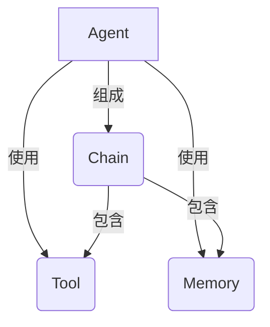
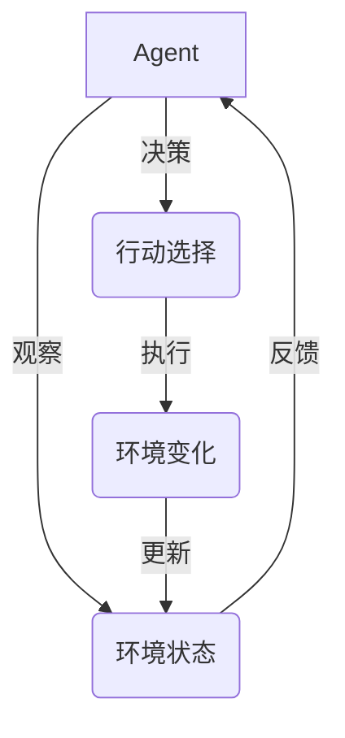

# 【LangChain编程：从入门到实践】链的基本概念

## 1. 背景介绍

### 1.1 问题的由来

在当今的数字时代，数据已经成为企业和个人的重要资产。随着数据量的不断增长和多样化,如何高效地处理和利用这些数据成为了一个巨大的挑战。传统的数据处理方式往往需要大量的人工干预,效率低下且容易出错。因此,迫切需要一种新的方法来解决这个问题。

### 1.2 研究现状

为了应对这一挑战,人工智能(AI)技术应运而生。AI技术可以自动化数据处理过程,提高效率和准确性。然而,现有的AI解决方案往往局限于特定的任务或领域,难以灵活应对多样化的数据处理需求。此外,构建AI系统通常需要大量的专业知识和资源,对于普通用户来说存在着一定的门槛。

### 1.3 研究意义

LangChain是一个新兴的Python库,旨在简化AI系统的构建和应用过程。它提供了一种模块化的方式来组合不同的AI模型、数据源和工具,从而实现灵活且强大的数据处理能力。LangChain的出现为解决上述问题提供了一种全新的思路,具有重要的理论和实践意义。

### 1.4 本文结构

本文将全面介绍LangChain的基本概念和使用方法。首先,我们将探讨LangChain的核心概念和架构设计。接下来,详细阐述LangChain的核心算法原理和数学模型。然后,通过实际的代码示例和案例分析,帮助读者掌握LangChain的实践应用。最后,我们将讨论LangChain的未来发展趋势和面临的挑战。

## 2. 核心概念与联系

LangChain的核心概念包括Agent、Tool、Memory和Chain。这些概念相互关联,共同构建了LangChain的整体架构。下面,我们将详细介绍每个概念及其联系。

### 2.1 Agent

Agent是LangChain中的核心概念,代表一个智能化的数据处理单元。它可以根据特定的任务和上下文,选择合适的工具(Tool)并利用记忆(Memory)来完成相应的数据处理任务。Agent的行为由其内部的决策逻辑所驱动,可以是基于规则的系统,也可以是基于机器学习模型的系统。

### 2.2 Tool

Tool是LangChain中用于执行特定任务的功能模块。它可以是一个API接口、一个数据库查询、一个文本处理函数或任何其他可执行的代码片段。Tool为Agent提供了完成特定任务所需的功能支持。

### 2.3 Memory

Memory是LangChain中用于存储和管理Agent的上下文信息和中间结果的组件。它可以是一个简单的变量存储,也可以是一个复杂的知识库系统。Memory为Agent提供了记忆和学习的能力,使其能够根据历史信息做出更加准确的决策。

### 2.4 Chain

Chain是LangChain中将多个Agent、Tool和Memory组合在一起的高级概念。它定义了这些组件之间的交互逻辑和执行顺序,从而实现更加复杂的数据处理任务。Chain可以嵌套和组合,形成更加灵活和强大的数据处理管道。

## 3. 核心算法原理 & 具体操作步骤

### 3.1 算法原理概述

LangChain的核心算法原理是基于一种称为"代理-环境"(Agent-Environment)的范式。在这种范式中,Agent通过与环境(Environment)进行交互来完成特定的任务。环境包括了所有可用的Tool和Memory,以及任务的上下文信息。

Agent的决策过程可以概括为以下几个步骤:

1. **观察(Observation)**: Agent从环境中获取当前的状态信息,包括任务描述、可用工具、记忆等。
2. **决策(Decision Making)**: 根据观察到的状态信息,Agent决定采取何种行动,例如选择哪个工具、执行何种操作等。
3. **行动(Action)**: Agent执行决策中选择的行动,例如调用特定的工具、更新记忆等。
4. **反馈(Feedback)**: 环境根据Agent的行动产生新的状态,并将反馈传递回Agent。

这个过程会不断重复,直到Agent完成了最终的任务。Agent的决策逻辑可以基于规则、机器学习模型或其他方法来实现。

### 3.2 算法步骤详解

LangChain的核心算法可以分为以下几个具体步骤:

1. **初始化环境**
   - 定义任务描述
   - 加载可用的Tool和Memory
   - 设置初始状态

2. **创建Agent**
   - 选择Agent类型(基于规则或机器学习模型)
   - 配置Agent的决策逻辑

3. **运行Agent**
   - Agent观察当前环境状态
   - Agent根据决策逻辑选择行动
   - 执行选择的行动(调用Tool、更新Memory等)
   - 环境根据行动产生新的状态,并将反馈传递回Agent
   - 重复上述步骤,直到任务完成

4. **输出结果**
   - 返回Agent完成任务的最终结果

### 3.3 算法优缺点

LangChain算法的优点包括:

- **模块化设计**: 通过将不同的组件(Agent、Tool、Memory)解耦,提高了系统的灵活性和可扩展性。
- **可组合性**: 不同的组件可以自由组合,构建出满足各种需求的数据处理管道。
- **易于集成**: 可以方便地集成各种现有的AI模型、API和数据源。
- **提高效率**: 自动化的数据处理过程可以大幅提高效率,减少人工干预。

然而,LangChain算法也存在一些缺点和挑战:

- **决策逻辑复杂性**: 设计高效且准确的Agent决策逻辑是一个挑战。
- **环境状态管理**: 有效地管理和维护环境状态对于保证系统的正确性至关重要。
- **可解释性**: 对于基于机器学习模型的Agent,其决策过程可能缺乏透明度和可解释性。
- **性能瓶颈**: 在处理大规模数据或复杂任务时,系统的性能可能会受到限制。

### 3.4 算法应用领域

LangChain算法可以应用于各种需要处理和利用数据的领域,包括但不限于:

- **自然语言处理(NLP)**: 通过组合不同的NLP模型和工具,可以构建出强大的语言理解和生成系统。
- **知识管理**: 利用LangChain管理和利用各种知识源,实现智能知识检索和推理。
- **任务自动化**: 将多个工具和API组合在一起,自动完成复杂的任务流程。
- **决策支持系统**: 通过整合各种数据源和模型,为决策过程提供智能化支持。
- **个人助理**: 构建智能化的个人助理,帮助用户完成各种日常任务。

## 4. 数学模型和公式 & 详细讲解 & 举例说明

虽然LangChain算法本身不涉及复杂的数学模型,但它可以与各种基于数学模型的AI组件(如机器学习模型)集成。在这一节,我们将介绍一些常见的机器学习模型,并探讨如何将它们与LangChain集成。

### 4.1 数学模型构建

#### 4.1.1 序列到序列模型(Sequence-to-Sequence Model)

序列到序列模型是一种广泛应用于自然语言处理任务的模型,例如机器翻译、文本摘要等。它将输入序列(如源语言句子)映射到输出序列(如目标语言句子)。

序列到序列模型通常由编码器(Encoder)和解码器(Decoder)两部分组成。编码器将输入序列编码为一个向量表示,而解码器则根据该向量生成输出序列。

对于给定的输入序列 $X = (x_1, x_2, \ldots, x_n)$ 和目标输出序列 $Y = (y_1, y_2, \ldots, y_m)$,序列到序列模型的目标是最大化条件概率 $P(Y|X)$。这可以通过以下公式来表示:

$$P(Y|X) = \prod_{t=1}^m P(y_t|y_{<t}, X)$$

其中 $y_{<t}$ 表示截止到时间步 $t-1$ 的输出序列。

在LangChain中,可以将序列到序列模型作为一个Tool集成到Agent中,用于执行各种语言生成任务。

#### 4.1.2 transformer模型(Transformer Model)

Transformer是一种广泛应用于自然语言处理任务的模型架构,例如BERT、GPT等。它基于自注意力(Self-Attention)机制,能够有效地捕获输入序列中的长程依赖关系。

Transformer模型由多个编码器和解码器层组成。每一层都包含一个多头自注意力子层和一个前馈神经网络子层。自注意力机制允许模型在计算每个单词的表示时,关注输入序列中的所有其他单词。

对于给定的输入序列 $X = (x_1, x_2, \ldots, x_n)$,Transformer模型的编码器会计算出一系列向量表示 $H = (h_1, h_2, \ldots, h_n)$,其中每个向量 $h_i$ 编码了输入序列中第 $i$ 个单词及其上下文信息。

解码器则根据编码器的输出 $H$ 和前一时间步的输出 $y_{t-1}$,生成当前时间步的输出 $y_t$。这可以通过以下公式来表示:

$$y_t = \text{Decoder}(y_{t-1}, H)$$

在LangChain中,可以将Transformer模型作为一个Tool集成到Agent中,用于执行各种自然语言处理任务,如文本生成、机器翻译等。

### 4.2 公式推导过程

在这一小节,我们将详细推导序列到序列模型的目标函数及其优化方法。

首先,我们定义模型的目标函数为最大化给定输入序列 $X$ 和目标输出序列 $Y$ 的条件概率 $P(Y|X)$。根据链式法则,我们可以将其分解为:

$$P(Y|X) = \prod_{t=1}^m P(y_t|y_{<t}, X)$$

其中 $y_{<t}$ 表示截止到时间步 $t-1$ 的输出序列。

为了最大化该条件概率,我们可以最小化其负对数似然,也就是交叉熵损失函数:

$$\mathcal{L}(X, Y) = -\sum_{t=1}^m \log P(y_t|y_{<t}, X)$$

在实际计算中,我们通常对损失函数取平均,得到:

$$\mathcal{L}(X, Y) = -\frac{1}{m}\sum_{t=1}^m \log P(y_t|y_{<t}, X)$$

接下来,我们需要计算出每一个条件概率 $P(y_t|y_{<t}, X)$。这可以通过模型的输出层来实现,例如使用softmax函数:

$$P(y_t|y_{<t}, X) = \text{softmax}(g(y_{<t}, X))$$

其中 $g(\cdot)$ 表示模型的编码器和解码器部分,用于计算输出logits。

为了优化模型参数,我们可以使用梯度下降法,通过计算损失函数相对于模型参数的梯度,并沿着梯度的反方向更新参数。具体的优化算法可以是标准的随机梯度下降(SGD)、Adam等。

在LangChain中,可以利用现有的深度学习框架(如PyTorch、TensorFlow等)来实现序列到序列模型的训练和优化过程。

### 4.3 案例分析与讲解

为了更好地理解序列到序列模型在实际应用中的作用,我们将通过一个机器翻译的案例进行分析和讲解。

假设我们需要将一个英文句子翻译成中文。我们可以