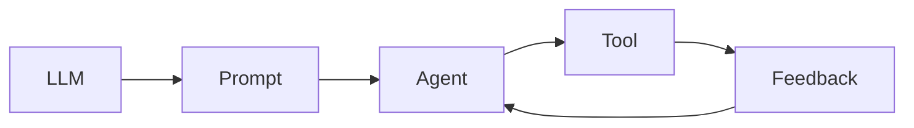

# 【大模型应用开发 动手做AI Agent】AutoGPT

## 1. 背景介绍
### 1.1  问题的由来
随着人工智能技术的飞速发展,尤其是大语言模型(LLM)的出现,AI已经开始渗透到各行各业。但是,目前大多数AI系统仍然是基于特定任务的,缺乏通用性和自主性。如何让AI系统能够像人一样自主思考、规划和执行任务,成为了AI领域的一个重要课题。AutoGPT的出现,为解决这一问题提供了新的思路。

### 1.2  研究现状 
目前,业界已经出现了一些探索通用人工智能(AGI)的尝试,比如OpenAI的GPT系列语言模型、DeepMind的AlphaFold等。这些系统在特定领域取得了突破性进展,展现出了AI的巨大潜力。但它们大多还是基于特定任务的,离真正的AGI还有很长的路要走。

AutoGPT是一个开源项目,旨在探索如何让AI系统具备自主性和通用性。它利用GPT-4等大语言模型作为基础,通过prompt engineering等技术赋予AI规划、执行任务的能力。目前该项目还处于早期阶段,但已经吸引了众多开发者的关注。

### 1.3  研究意义
AutoGPT的研究对于推动AGI的发展具有重要意义:

1. 探索AI自主性的实现路径,为未来AGI系统的设计提供参考
2. 促进prompt engineering等技术的发展,提升LLM的应用潜力
3. 推动AI民主化,让更多开发者参与到AGI的研究中来
4. 加速AI在各领域的应用落地,为社会发展带来新的动力

### 1.4  本文结构
本文将从以下几个方面对AutoGPT进行深入探讨:

- 核心概念与关键技术
- 系统架构与工作原理  
- 实践案例:如何基于AutoGPT构建AI Agent
- AutoGPT的应用场景与未来展望
- 总结与思考

## 2. 核心概念与联系
AutoGPT中有几个核心概念:

- LLM(Large Language Model):大语言模型,AutoGPT的基础。它以自然语言作为输入和输出,具备一定的语义理解和生成能力。目前主要使用GPT-3、GPT-4等模型。

- Prompt:提示/提示工程,通过设计输入文本来引导LLM执行特定任务的技术。AutoGPT通过Prompt让LLM具备任务规划和执行的能力。

- Agent:代理,一个基于LLM的自主系统,能根据用户需求制定和执行计划。它由一个或多个LLM组成,通过Prompt实现任务分解、规划、推理等。

- Tool:工具,Agent用来执行任务的外部接口或系统,比如搜索引擎、计算器、数据库等。Agent通过调用Tool来获取信息、执行操作。

- Feedback Loop:反馈循环,Agent根据执行结果动态调整Prompt、优化执行过程的机制。这是实现Agent自主性的关键。

下图展示了AutoGPT的核心概念及其关系:



## 3. 核心算法原理 & 具体操作步骤
### 3.1  算法原理概述
AutoGPT的核心是利用LLM和Prompt实现Agent的自主任务规划与执行。其基本原理可以概括为:

1. 将用户需求转化为Prompt,引导LLM进行任务分解和规划
2. Agent根据规划逐步执行任务,通过调用Tool获取所需信息和能力
3. 根据执行结果优化Prompt,形成反馈循环,不断提升Agent的效果

### 3.2  算法步骤详解
AutoGPT的工作流程可以分为以下几个步骤:

1. 接收用户输入,提取核心需求,结合场景上下文生成初始Prompt
2. 将Prompt输入LLM,生成初步的任务规划,包括任务分解、执行步骤等
3. Agent根据规划逐步执行任务:
   - 调用相关Tool获取信息或执行操作
   - 将Tool的结果作为新的观察,更新任务状态
   - 根据当前状态生成下一步行动的Prompt
   - 重复上述过程直到任务完成
4. 评估任务执行结果,生成反馈信息
5. 将反馈信息整合到Prompt中,优化下一轮任务执行
6. 重复3-5步骤,直到达到预期效果或达到迭代上限

### 3.3  算法优缺点
AutoGPT算法的主要优点包括:

- 利用LLM强大的语言理解和生成能力,使Agent具备一定的常识和领域知识
- 通过Prompt引导LLM进行任务规划,减少了手工设计的工作量
- 通过反馈循环实现Agent的自主优化,提升了系统的鲁棒性

同时AutoGPT也存在一些局限性:

- Agent的能力受限于LLM和Tool,对于超出其知识范围或无法用Tool实现的任务,效果可能不理想
- Prompt设计需要一定的技巧和经验,否则可能影响Agent的表现
- 反馈循环可能引入误差累积,导致Agent偏离预期目标

### 3.4  算法应用领域
AutoGPT为通用AI系统的构建提供了一种思路,可以应用于多个领域:

- 智能客服:通过Agent实现自动应答、任务处理等
- 数据分析:Agent根据需求自动收集、清洗、分析数据并生成报告
- 智能写作:Agent根据主题和要求自动生成文章、总结等
- 软件开发:Agent根据需求自动生成代码、测试用例等

## 4. 数学模型和公式 & 详细讲解 & 举例说明
### 4.1  数学模型构建
AutoGPT可以用马尔可夫决策过程(MDP)来建模,将Agent视为一个智能体(Agent),与环境(Environment)交互。其核心要素包括:

- 状态(State):Agent当前的任务状态,包括已有信息、执行进度等
- 行动(Action):Agent可以执行的操作,包括调用Tool、生成Prompt等
- 转移概率(Transition Probability):根据当前状态和行动,环境可能转移到的下一个状态的概率分布
- 奖励(Reward):环境对Agent行动的反馈,用于评估行动的效果

形式化地,可以将AutoGPT表示为一个六元组:

$$
\langle S, A, P, R, \gamma, \pi \rangle
$$

其中:
- $S$:状态空间,包含了所有可能的任务状态
- $A$:行动空间,包含了Agent可以执行的所有操作 
- $P$:转移概率函数,$P(s'|s,a)$表示在状态$s$下执行行动$a$后转移到状态$s'$的概率
- $R$:奖励函数,$R(s,a)$表示在状态$s$下执行行动$a$后获得的即时奖励
- $\gamma$:折扣因子,$\gamma \in [0,1]$,表示未来奖励的重要程度
- $\pi$:策略函数,$\pi(a|s)$表示在状态$s$下选择行动$a$的概率

### 4.2  公式推导过程
AutoGPT的优化目标是最大化期望总奖励:

$$
\max_{\pi} \mathbb{E}_{\pi}[\sum_{t=0}^{\infty} \gamma^t R(s_t,a_t)]
$$

其中$s_t$和$a_t$分别表示第$t$步的状态和行动。

根据Bellman方程,可以将上述目标转化为值函数的递归形式:

$$
V^{\pi}(s) = \sum_{a} \pi(a|s) \sum_{s'} P(s'|s,a) [R(s,a) + \gamma V^{\pi}(s')]
$$

其中$V^{\pi}(s)$表示在状态$s$下遵循策略$\pi$的期望总奖励。

AutoGPT通过不断更新Prompt来优化策略函数$\pi$,使其生成的行动能够最大化值函数。一种常见的优化方法是策略梯度(Policy Gradient):

$$
\nabla_{\theta} J(\theta) = \mathbb{E}_{\pi_{\theta}}[\nabla_{\theta} \log \pi_{\theta}(a|s) Q^{\pi_{\theta}}(s,a)]
$$

其中$\theta$表示策略函数的参数,$J(\theta)$表示期望总奖励,$Q^{\pi_{\theta}}(s,a)$表示在状态$s$下执行行动$a$的行动值函数。

### 4.3  案例分析与讲解
下面我们以一个简单的任务为例,说明AutoGPT的工作过程。

假设用户输入:"帮我总结一下AutoGPT的核心原理"。

1. 接收输入,生成初始Prompt:
   
   "你是一名AI研究助理,用户让你总结AutoGPT的核心原理。请分析相关资料,提取关键信息,以列表的形式呈现。"

2. 将Prompt输入LLM,生成初步规划:
   
   "1. 搜索AutoGPT的原理介绍
    2. 阅读3-5篇文章,提取核心观点
    3. 总结要点,以列表形式组织
    4. 审核列表,删除冗余信息
    5. 输出最终结果"

3. Agent执行任务:
   - 调用搜索引擎,搜索"AutoGPT原理"
   - 阅读搜索结果,提取关键信息
   - 生成信息摘要,更新任务状态
   - 根据当前状态,生成下一步Prompt:"请对提取的信息进行汇总,组织成条理清晰的列表。"
   - 审核列表,删除冗余项
   - 输出最终结果

4. 评估结果,生成反馈:
   
   "总结列表条理清晰,涵盖了AutoGPT的核心原理,但在XXX方面还可以补充说明。"

5. 优化Prompt:
   
   "你已经对AutoGPT的原理进行了总结,请参考反馈意见,在XXX方面补充说明,进一步完善列表。"

6. 重复执行过程,直到用户满意为止。

### 4.4  常见问题解答
Q:AutoGPT能否处理任意领域的任务?

A:理论上AutoGPT可以处理任何可以用自然语言描述的任务,但实际效果取决于LLM的知识覆盖范围和Tool的功能。对于一些专业领域或需要特定技能的任务,可能需要引入更专业的模型和工具。

Q:如何评估AutoGPT生成结果的质量?

A:可以从相关性、准确性、完整性等方面评估AutoGPT的结果。比如对结果进行人工审核打分,或将其与人工生成的参考答案进行比对。也可以让用户直接对结果的满意度进行评分。

Q:AutoGPT的训练需要哪些资源?

A:训练AutoGPT主要需要计算资源和数据资源。其中计算资源主要是GPU,用于加速LLM的推理和优化;数据资源包括不同领域的语料库,用于训练LLM。此外还需要开发调试工具、搭建训练平台等。整体而言,训练AutoGPT需要较大的资源投入。

## 5. 项目实践：代码实例和详细解释说明
### 5.1  开发环境搭建
首先需要搭建AutoGPT的开发环境,主要包括:

- Python 3.7+
- PyTorch 1.0+
- Transformers库
- OpenAI API (用于访问GPT模型)
- faiss(可选,用于构建向量数据库)

可以使用pip或conda安装这些依赖:

```bash
pip install torch transformers openai faiss-cpu
```

### 5.2  源代码详细实现
下面是一个简化版的AutoGPT实现,主要包括Agent类和Tool类:

```python
import openai
from typing import List, Dict, Callable

class Tool:
    def __init__(self, name: str, func: Callable):
        self.name = name
        self.func = func
        
    def run(self, arg: str) -> str:
        return self.func(arg)

class Agent:
    def __init__(self, tools: List[Tool], openai_api_key: str):
        self.tools = {t.name: t for t in tools}
        openai.api_key = openai_api_key
        
    def run(self, task: str) -> str:
        prompt = f"""
        你是一个AI助手,你可以使用以下工具来完成任务:
        {self._get_tools_desc()}
        
        你的任务是:{task}