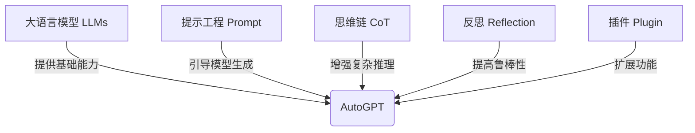

# 【大模型应用开发 动手做AI Agent】AutoGPT实战

## 1. 背景介绍
### 1.1  问题的由来
近年来,随着人工智能技术的飞速发展,大语言模型(LLMs)如GPT-3、PaLM等的出现,为AI应用开发带来了革命性的变革。这些大模型展现出了惊人的自然语言理解和生成能力,使得构建智能对话系统、知识问答系统等AI应用成为可能。然而,如何利用这些大模型来开发真正实用的AI应用,仍然是一个巨大的挑战。

### 1.2  研究现状
目前,业界已经出现了一些利用大模型开发AI应用的尝试,比如Anthropic公司开发的Claude助手,基于GPT-3实现了强大的对话和任务执行能力。但这些应用大多是封闭的,难以进行二次开发和定制。同时,开发者们也缺乏一个完善的工具链和开发框架,导致大模型应用开发门槛较高,难以大规模普及。

### 1.3  研究意义 
在这样的背景下,AutoGPT项目应运而生。AutoGPT旨在打造一个开源的、可扩展的大模型应用开发框架,让开发者能够基于GPT-3等大模型快速构建定制化的AI助手。通过AutoGPT,开发者可以利用简单的配置和插件机制,实现对AI助手的各种能力进行扩展,如联网搜索、数据库查询、文件读写等。这将极大降低大模型应用的开发门槛,推动其在各行各业的落地应用。

### 1.4  本文结构
本文将全面介绍AutoGPT的原理、架构和实战。第2章介绍AutoGPT的核心概念;第3章深入剖析其内部工作原理;第4章给出AutoGPT的系统架构设计;第5章通过一个端到端的实例,手把手教你开发AutoGPT应用;第6章展望AutoGPT的实际应用场景;第7章推荐AutoGPT相关的学习资源;第8章对AutoGPT进行总结展望。

## 2. 核心概念与联系
在介绍AutoGPT的技术细节之前,我们先来了解几个核心概念:

- 大语言模型(LLMs): 以GPT-3、PaLM等为代表的超大规模语言模型,具有强大的自然语言理解和生成能力,是实现AutoGPT的基础。
- 提示工程(Prompt Engineering): 通过精心设计输入文本,引导语言模型生成所需的输出,是利用LLMs进行应用开发的关键技术。
- 思维链(Chain of Thought): 一种提示方法,通过引导模型进行逐步推理,可以显著提升语言模型在复杂推理任务上的表现。
- 反思(Reflection): AutoGPT的一个创新点,让模型对自己的输出进行评估和改进,可以提高应用的鲁棒性。
- 插件机制(Plugin): AutoGPT提供了一套插件体系,可以方便地扩展其功能,如接入搜索引擎、数据库、API服务等。

下图展示了这些概念之间的关系:



AutoGPT正是巧妙地组合运用了这些技术,打造出一个灵活可扩展的大模型应用开发框架。

## 3. 核心算法原理 & 具体操作步骤
### 3.1  算法原理概述
AutoGPT的核心是利用提示工程技术,通过设计精巧的提示模板,引导语言模型进行对话、执行任务。其基本工作流程如下:

1. 接收用户输入,拼接到提示模板中,生成完整的提示文本
2. 将提示文本输入语言模型,生成模型输出
3. 对模型输出进行解析,提取关键信息,如任务类型、参数等 
4. 根据任务类型,调用对应的插件或工具,执行实际操作
5. 将操作结果整合到新的提示文本中,返回步骤2,进行下一轮迭代

通过多轮迭代,AutoGPT可以完成一些复杂的任务,如信息搜集、数据分析、文案撰写等。

### 3.2  算法步骤详解
下面我们来详细解读AutoGPT的算法步骤。

#### 步骤1: 输入处理与提示构造
AutoGPT定义了一个统一的提示模板,主要包含以下几个部分:
- 系统角色设定:通过设定AI助手的角色(如一个得力助手),来引导其行为。
- 任务描述:对用户输入的任务进行总结和澄清。
- 过程记录:记录对话的历史,便于模型理解上下文。
- 思考过程:引导模型进行逐步推理和思考。
- 操作反馈:对之前的操作步骤进行总结反馈。

下面是一个简化版的提示模板示例:

```
Assistant is a helpful AI assistant. 

User's request: {{user_input}}

Previous conversation history:
{{conversation_history}}

Assistant's thought process:
{{thought_process}}

Previous actions:
{{previous_actions}}