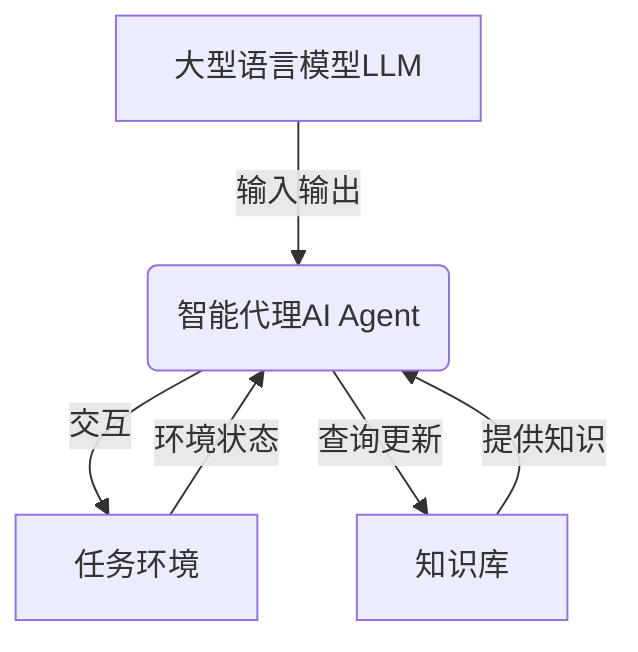

# 【大模型应用开发 动手做AI Agent】CAMEL论文中的股票交易场景

## 1. 背景介绍

### 1.1 问题的由来

随着人工智能技术的快速发展,大型语言模型(Large Language Models, LLMs)在自然语言处理领域取得了令人瞩目的成就。这些模型通过从海量文本数据中学习,掌握了丰富的语义和上下文知识,可以生成看似人类写作的自然语言输出。然而,LLMs在实际应用中仍然面临诸多挑战,例如缺乏持久记忆、推理能力有限、难以掌握长期因果关系等。

为了解决这些问题,研究人员提出了将LLMs与外部数据和知识库相结合的方法,从而赋予LLMs更强大的推理和决策能力。其中,CAMEL(Communicating Agents for Mind Exploration of Large Language Models)是一种创新的人工智能系统架构,旨在将LLMs与外部数据和模拟环境相结合,以构建具有持久记忆、推理和交互能力的智能代理(AI Agent)。

### 1.2 研究现状

目前,已有多项研究探索了将LLMs与外部知识源相结合的方法。例如,一些工作尝试将LLMs与知识库(如Wikipedia)相连接,以提高模型的事实知识覆盖面;另一些工作则将LLMs与任务环境(如游戏、对话系统等)相结合,以增强模型的交互和决策能力。

然而,这些方法通常存在以下局限性:

1. 缺乏统一的架构和标准化接口,难以进行模块化设计和扩展。
2. 知识源和任务环境的集成方式过于简单,无法充分利用LLMs的语义理解能力。
3. 缺乏持久记忆和长期推理机制,难以处理复杂的长期决策任务。

CAMEL架构旨在解决上述问题,提供一种统一的框架,将LLMs与外部知识源和任务环境紧密集成,并引入持久记忆和长期推理机制,从而构建更加智能和通用的AI Agent。

### 1.3 研究意义

CAMEL架构在理论和实践层面均具有重要意义:

- 理论意义:CAMEL架构为LLMs的实际应用提供了一种新的范式,有助于探索LLMs与外部知识源和环境的有效集成方式,推动人工智能系统的发展。
- 实践意义:基于CAMEL架构构建的AI Agent可应用于各种领域,如金融决策、医疗诊断、智能助理等,为解决复杂的实际问题提供了新的思路和工具。

### 1.4 本文结构

本文将重点介绍CAMEL论文中提出的股票交易场景,详细阐述其核心概念、算法原理、数学模型、代码实现等内容。文章结构如下:

1. 背景介绍
2. 核心概念与联系
3. 核心算法原理与具体操作步骤
4. 数学模型和公式详细讲解与举例说明
5. 项目实践:代码实例和详细解释说明
6. 实际应用场景
7. 工具和资源推荐
8. 总结:未来发展趋势与挑战
9. 附录:常见问题与解答

## 2. 核心概念与联系

在介绍CAMEL架构中的股票交易场景之前,我们需要先了解几个核心概念及其相互关系。

1. **大型语言模型(LLM)**: LLM是CAMEL架构的核心组件,负责自然语言理解和生成。它通过从海量文本数据中学习,掌握了丰富的语义和上下文知识。

2. **智能代理(AI Agent)**: AI Agent是CAMEL架构中的中介层,它将LLM与外部知识库和任务环境相连接。AI Agent可以与LLM进行自然语言交互,同时也可以与外部环境进行交互,实现信息的双向流动。

3. **知识库**: 知识库是CAMEL架构中的外部知识源,它可以是结构化数据库、知识图谱或其他形式的知识存储。AI Agent可以从知识库中查询所需的信息,并将其传递给LLM,从而增强LLM的知识覆盖面。

4. **任务环境**: 任务环境是CAMEL架构中模拟的现实世界场景,如股票交易、游戏、对话系统等。AI Agent可以与任务环境进行交互,获取环境状态信息,并根据LLM的输出做出相应的决策和行动。

这些核心概念通过紧密集成,形成了CAMEL架构的基本框架。LLM负责语言理解和生成,AI Agent作为中介层连接LLM与外部知识和环境,实现信息的双向流动和决策制定。

## 3. 核心算法原理与具体操作步骤

### 3.1 算法原理概述

CAMEL架构中的股票交易场景算法原理可以概括为以下几个关键步骤:

1. **环境状态获取**: AI Agent从股票交易环境中获取当前的市场数据、持仓信息等状态数据。

2. **知识库查询**: AI Agent根据当前状态,从知识库中查询相关的金融知识、交易策略等信息。

3. **LLM交互**: AI Agent将环境状态和查询到的知识以自然语言的形式输入给LLM,LLM根据其语义理解能力生成决策建议。

4. **决策执行**: AI Agent解析LLM的输出,并在股票交易环境中执行相应的操作(如买入、卖出等)。

5. **记忆更新**: AI Agent将本次交互的环境状态、知识查询结果和LLM输出存储到持久记忆中,为下一次交互提供历史信息。

该算法的核心在于AI Agent作为中介层,实现了LLM与外部知识库和任务环境的有效集成。通过持久记忆机制,AI Agent可以掌握长期的因果关系和决策历史,从而做出更加明智的决策。

### 3.2 算法步骤详解

下面我们将详细解释CAMEL架构中股票交易场景算法的具体步骤:

1. **环境状态获取**

   AI Agent从股票交易环境中获取当前的市场数据,包括股票代码、价格、交易量等信息,以及当前的持仓情况(已持有的股票及数量)。这些数据将作为算法的输入。

2. **知识库查询**

   AI Agent根据当前的环境状态,从知识库中查询相关的金融知识和交易策略。例如,可以查询某只股票的基本面信息、历史走势、专家评论等,以及不同的交易策略(如移动平均线策略、波浪理论策略等)的详细描述和应用场景。

3. **LLM交互**

   AI Agent将获取到的环境状态数据和查询到的知识,以自然语言的形式输入给LLM。LLM根据其掌握的语义知识和上下文信息,生成对应的决策建议。

   例如,LLM可能输出:"根据当前的股价走势和移动平均线指标,建议对XXX股票进行买入操作。"或"考虑到XXX股票的基本面较差且专家评论负面,建议对其进行卖出。"

4. **决策执行**

   AI Agent解析LLM的自然语言输出,提取出其中的决策建议(如买入、卖出、持有等),并在股票交易环境中执行相应的操作。

5. **记忆更新**

   AI Agent将本次交互的全部信息(包括环境状态、知识查询结果、LLM输出和执行的决策操作)存储到持久记忆中。这些信息将为下一次交互提供历史参考,使AI Agent能够掌握长期的因果关系和决策历史,从而做出更加明智的决策。

该算法通过不断地环境交互、知识查询、LLM决策生成和记忆更新,实现了闭环的智能决策过程。

### 3.3 算法优缺点

**优点**:

1. **融合多源知识**:通过与知识库的集成,算法可以利用结构化的专业知识,提高决策的准确性和可解释性。

2. **长期记忆和推理**:持久记忆机制使算法能够掌握长期的因果关系和决策历史,提高了长期决策的一致性和合理性。

3. **自然语言交互**:与LLM的自然语言交互使得算法具有较强的可解释性,便于人机协作。

4. **可扩展性**:CAMEL架构的模块化设计使得算法易于扩展,可以集成更多类型的知识库和任务环境。

**缺点**:

1. **决策偏差**:LLM生成的决策建议可能存在偏差或错误,需要进一步的人工审核和调整。

2. **知识库覆盖面**:知识库的覆盖面和质量直接影响了算法的决策准确性,需要持续更新和维护知识库。

3. **计算资源需求**:LLM和AI Agent的运行需要大量的计算资源,可能会带来较高的硬件和能源成本。

4. **隐私和安全风险**:算法涉及大量敏感数据(如交易记录、个人信息等),需要注意数据隐私和系统安全问题。

### 3.4 算法应用领域

CAMEL架构中的股票交易场景算法不仅可以应用于金融投资领域,还可以推广到其他需要长期决策和知识融合的领域,如:

1. **医疗诊断**:将LLM与医学知识库和病例数据相结合,辅助医生进行诊断和治疗决策。

2. **智能客服**:将LLM与产品知识库和历史对话记录相结合,提供更加智能和个性化的客户服务。

3. **教育辅导**:将LLM与教学知识库和学生学习记录相结合,为学生提供个性化的学习辅导和答疑解惑。

4. **智能决策系统**:可应用于需要长期决策的各种场景,如供应链管理、项目管理、战略规划等。

总的来说,该算法为将LLM与外部知识源和任务环境相结合提供了一种通用的范式,有助于构建更加智能、通用和可解释的人工智能系统。

## 4. 数学模型和公式详细讲解与举例说明

在CAMEL架构中的股票交易场景中,数学模型和公式主要用于描述和优化交易策略,以及量化投资组合的风险和收益。下面我们将详细介绍几个常用的数学模型和公式。

### 4.1 数学模型构建

#### 移动平均线策略模型

移动平均线策略是股票交易中一种常用的技术分析工具,它通过计算股价的移动平均值来判断买入或卖出的时机。我们可以将其建模为:

$$
MA_n = \frac{1}{n}\sum_{i=0}^{n-1}P_{t-i}
$$

其中:
- $MA_n$为n日移动平均线
- $P_t$为第t日的收盘价
- n为移动平均线的时间窗口大小

当短期移动平均线(如5日或10日均线)上穿长期移动平均线(如20日或60日均线)时,可视为买入信号;反之则为卖出信号。

#### 波浪理论模型

波浪理论是另一种常用的技术分析工具,它将股价的波动视为由不同级别的波浪构成。我们可以使用斐波那契数列来描述波浪的幅度关系:

$$
F_n = F_{n-1} + F_{n-2}, \quad F_0 = 0, F_1 = 1
$$

其中:
- $F_n$为斐波那契数列的第n项
- 相邻波浪的幅度比通常接近0.618或1.618(即$\frac{F_n}{F_{n-1}}$或$\frac{F_{n+1}}{F_n}$)

根据波浪理论,我们可以识别出不同级别的波浪形态(如impulse wave和correction wave),并据此制定交易策略。

#### 资产配置模型

在投资组合管理中,我们需要合理配置不同资产的权重,以实现风险和收益的最佳平衡。一种常用的资产配置模型是均值-方差模型:

$$
\begin{aligned}
\max_{\boldsymbol{w}} \quad&