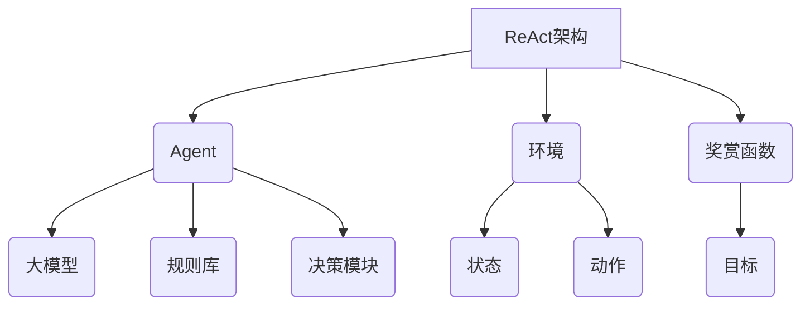

# 【大模型应用开发 动手做AI Agent】何谓ReAct

## 1. 背景介绍

### 1.1 问题的由来

在当今科技飞速发展的时代,人工智能(AI)已经渗透到我们生活的方方面面。从语音助手到自动驾驶汽车,AI系统正在彻底改变着我们与技术的交互方式。然而,构建高质量的AI系统并非易事,尤其是在处理复杂任务时,传统的规则系统和机器学习模型往往会遇到瓶颈。

为了突破这一困境,研究人员提出了一种全新的范式——大模型(Large Model)。大模型是指具有数十亿甚至上万亿参数的巨大神经网络模型,通过在海量数据上进行预训练,可以获得极为丰富的知识表征能力。凭借其强大的泛化能力,大模型可以在看似不相关的任务之间进行迁移学习,从而显著提高了AI系统的性能和灵活性。

### 1.2 研究现状

近年来,随着计算能力的不断提升和数据量的激增,大模型在自然语言处理、计算机视觉、推理等多个领域取得了突破性进展。以GPT-3、DALL-E、PaLM等大模型为代表,它们展现出了令人惊叹的文本生成、图像创作和多模态理解能力,引发了学术界和工业界的广泛关注。

然而,尽管大模型取得了诸多成就,但它们也面临着一些挑战,例如:

1. **可解释性不足**: 大模型的内部机理往往是一个"黑箱",难以解释其决策过程,这在一定程度上影响了人们对大模型的信任度。

2. **数据质量依赖**: 大模型的性能高度依赖于训练数据的质量和多样性,如果训练数据存在偏差或噪声,可能会导致模型产生不可预期的行为。

3. **资源消耗巨大**: 训练和部署大模型需要消耗大量的计算资源,这不仅增加了成本,也对环境造成了一定的影响。

4. **安全性和伦理问题**: 大模型可能会复制或放大训练数据中存在的偏见和有害内容,如何确保其输出的安全性和符合伦理准则仍然是一个亟待解决的问题。

### 1.3 研究意义

为了充分发挥大模型的潜力,同时应对上述挑战,研究人员提出了一种新型AI系统架构——ReAct(Reactive Agent)。ReAct旨在将大模型与符号推理、规划、决策等传统AI技术相结合,构建出一种更加智能、可控、可解释的AI Agent。

ReAct架构不仅可以利用大模型的强大表征能力,同时也能够通过显式的规则和约束来控制Agent的行为,确保其输出符合预期。此外,ReAct还可以通过与人类专家的交互来持续学习和改进,从而不断提高其性能和可解释性。

本文将全面介绍ReAct架构的核心概念、算法原理、数学模型,并通过实际案例和代码示例,深入探讨如何基于ReAct开发智能Agent应用。我们希望这一全新的AI系统架构能够为构建更加安全、可靠、透明的人工智能系统提供新的思路和方法。

### 1.4 本文结构

本文的结构安排如下:

- 第2章介绍ReAct架构的核心概念,包括Agent、环境、奖赏函数等,并阐述它们之间的关系。

- 第3章详细解释ReAct的核心算法原理,包括马尔可夫决策过程、强化学习、规则推理等,并给出具体的操作步骤。

- 第4章构建ReAct的数学模型,包括状态转移概率、奖赏函数、值函数等,并推导出相关公式。

- 第5章提供一个基于ReAct的智能对话Agent的实践案例,包括开发环境搭建、代码实现、运行结果等。

- 第6章探讨ReAct在自然语言处理、机器人控制等领域的实际应用场景。

- 第7章推荐相关的学习资源、开发工具和论文,以供读者进一步深入研究。

- 第8章总结ReAct的研究成果,展望其未来发展趋势,并分析可能面临的挑战。

- 第9章列出常见问题及其解答,帮助读者更好地理解ReAct。

## 2. 核心概念与联系

在深入探讨ReAct的算法原理和数学模型之前,我们先来介绍一些核心概念,为后续内容做好铺垫。

1. **Agent**: Agent是ReAct架构中的核心组件,它是一个智能体,能够感知环境状态,并根据内部策略选择合适的动作。Agent由以下几个部分组成:

   - **大模型**: 通过预训练获得的大规模语言模型或多模态模型,用于提供丰富的知识表征能力。

   - **规则库**: 一组由人类专家定义的规则和约束,用于控制Agent的行为,确保其输出符合预期。

   - **决策模块**: 根据大模型的输出、规则库的约束,结合当前环境状态,通过某种决策算法(如强化学习)选择最优动作。

2. **环境**: 环境是Agent所处的外部世界,它可以是物理环境(如机器人操作场景)或虚拟环境(如对话系统)。环境会随着Agent的动作而发生状态转移,并反馈给Agent相应的奖赏信号。

3. **奖赏函数**: 奖赏函数定义了Agent的目标,它将环境状态映射为一个数值,表示该状态的好坏程度。Agent的目标就是通过选择合适的动作序列,最大化其获得的累积奖赏。

4. **状态**和**动作**: 状态是对环境的数学建模,用于描述环境的当前情况;动作则是Agent为达成目标而采取的行为,会导致环境状态的转移。

上述概念之间的关系如下:Agent根据当前环境状态,结合大模型的知识表征、规则库的约束,通过决策模块选择一个动作。该动作会使环境发生状态转移,并产生一个奖赏信号反馈给Agent。Agent的目标就是学习一个策略,使其在环境中获得的累积奖赏最大化。

ReAct架构的核心思想,就是将大模型的强大表征能力与符号规则推理、决策算法相结合,从而构建出一种更加智能、可控、可解释的AI系统。在后续章节中,我们将详细介绍ReAct是如何实现这一目标的。

## 3. 核心算法原理 & 具体操作步骤

### 3.1 算法原理概述

ReAct架构的核心算法原理是基于**马尔可夫决策过程(Markov Decision Process, MDP)**和**强化学习(Reinforcement Learning)**。

马尔可夫决策过程是一种用于建模决策过程的数学框架,它将环境描述为一系列的状态,Agent通过选择动作来导致状态转移,并获得相应的奖赏。强化学习则是一种基于反馈的机器学习范式,Agent通过与环境的交互,不断尝试并学习如何获得最大的累积奖赏。

在ReAct中,大模型的输出被视为Agent的原始策略,但这种策略往往是不完备和不可控的。因此,ReAct引入了规则库作为约束条件,并通过强化学习算法来优化Agent的策略,使其同时满足大模型的知识表征和规则库的约束。

具体来说,ReAct的工作流程如下:

1. Agent根据当前环境状态,向大模型查询可能的动作及其概率分布。

2. 规则库对大模型的输出进行过滤,剔除违反规则约束的动作。

3. 决策模块基于过滤后的动作集合,结合当前状态和历史经验,通过某种强化学习算法(如Q-Learning或策略梯度)选择一个最优动作。

4. Agent执行选定的动作,环境发生状态转移并返回一个奖赏信号。

5. Agent将当前的状态-动作-奖赏记录到经验池中,用于后续的策略优化。

6. 重复上述过程,直到达成目标或者满足终止条件。

通过上述流程,ReAct架构可以充分利用大模型的知识表征能力,同时又能够通过规则库对其输出进行约束和调整,从而获得一个更加可控和可解释的策略。此外,强化学习算法还能够不断优化和改进这一策略,使其在面对新的环境时也能表现出良好的泛化能力。

### 3.2 算法步骤详解

现在,我们来详细解释一下ReAct算法的具体步骤。为了便于理解,我们将算法分为三个主要阶段:初始化、交互循环和策略优化。

#### 初始化阶段

1. **定义环境**:首先需要明确Agent所处的环境,包括状态空间、动作空间、状态转移概率和奖赏函数等。

2. **加载大模型**:将预训练好的大规模语言模型或多模态模型加载到Agent中,作为其初始策略的基础。

3. **构建规则库**:由人类专家定义一组规则和约束,用于控制Agent的行为,确保其输出符合预期。这些规则可以是硬性约束(如禁止产生违法或不当内容),也可以是软性偏好(如鼓励使用更加礼貌的语言)。

4. **初始化决策模块**:选择合适的强化学习算法(如Q-Learning或策略梯度),并初始化相关参数,如折现因子、探索率等。

5. **设置超参数**:根据具体任务,设置一些超参数,如训练轮数、批大小、学习率等。

#### 交互循环阶段

6. **获取当前状态**:从环境中获取当前的状态信息。

7. **查询大模型**:将当前状态输入到大模型中,获取可能的动作及其概率分布。

8. **应用规则约束**:使用规则库对大模型的输出进行过滤,剔除违反规则约束的动作。

9. **选择动作**:决策模块基于过滤后的动作集合,结合当前状态和历史经验,通过强化学习算法选择一个最优动作。

10. **执行动作并获取反馈**:Agent执行选定的动作,环境发生状态转移并返回一个奖赏信号。

11. **存储经验**:将当前的状态-动作-奖赏记录到经验池中,用于后续的策略优化。

12. **检查终止条件**:判断是否达成目标或满足其他终止条件,如果是,则结束交互循环;否则,返回步骤6,进入下一个循环。

#### 策略优化阶段

13. **采样经验**:从经验池中采样一个批次的状态-动作-奖赏数据。

14. **计算目标值**:根据强化学习算法的具体方法(如Q-Learning的Bellman方程或策略梯度的优势函数),计算每个状态-动作对应的目标值。

15. **更新策略**:使用优化算法(如梯度下降)来最小化目标值与大模型输出之间的差异,从而更新Agent的策略。

16. **重复优化**:重复步骤13-15,直到策略收敛或达到预设的训练轮数。

通过上述步骤,ReAct架构可以在与环境的交互过程中不断优化Agent的策略,使其逐步适应环境的变化,并满足规则库中定义的约束条件。值得注意的是,在实际应用中,我们可以根据具体任务对算法进行一些调整和改进,如引入注意力机制、层次化决策等,以提高Agent的性能和效率。

### 3.3 算法优缺点

ReAct算法具有以下优点:

1. **知识融合**:通过将大模型的知识表征能力与规则推理相结合,ReAct可以充分利用两者的优势,构建出更加智能和可控的AI系统。

2. **可解释性**:由于引入了规则库作为约束条件,ReAct的决策过程更加透明,有助于提