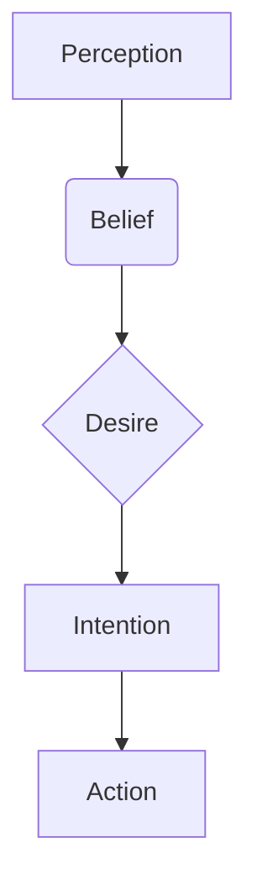

# 【大模型应用开发 动手做AI Agent】其他Agent认知框架

关键词：大模型、AI Agent、认知框架、BDI、Soar、ACT-R、Sigma

## 1. 背景介绍
### 1.1  问题的由来
随着人工智能技术的快速发展,尤其是大语言模型的出现,AI Agent的研究和应用越来越受到广泛关注。AI Agent作为一种智能化的软件程序,能够根据环境的变化自主地完成特定任务。为了让AI Agent具备更强的认知和决策能力,需要为其构建合理的认知框架。
### 1.2  研究现状 
目前,针对AI Agent的认知框架研究已经取得了一定进展。BDI(Belief-Desire-Intention)是一种经典的认知框架,它从信念、欲望和意图三个维度对Agent的认知过程进行建模。此外,Soar、ACT-R、Sigma等认知架构也被广泛应用于AI Agent的开发中。但现有的认知框架还存在一些局限性,如可解释性不强、泛化能力较弱等。
### 1.3  研究意义
探索新的AI Agent认知框架对于提升其智能化水平具有重要意义。合理的认知框架能够赋予Agent更强大的推理、学习和适应能力,使其在复杂多变的环境中完成任务。同时,认知框架的研究也有助于我们深入理解人类的认知机制,促进人工智能与认知科学的交叉融合。
### 1.4  本文结构
本文将重点介绍几种主流的AI Agent认知框架,分析其核心概念、工作原理以及优缺点。同时,结合具体的应用场景和代码实例,讨论认知框架在AI Agent开发中的实践。最后,展望认知框架的未来发展趋势与面临的挑战。

## 2. 核心概念与联系
在 AI Agent 的认知框架研究中,涉及到一些核心概念:
- **认知(Cognition)**: Agent内部用于感知、推理、决策的计算过程,是实现智能行为的基础。
- **信念(Belief)**: Agent对环境状态的内部表征,是推理和决策的依据。  
- **欲望(Desire)**: Agent想要达成的目标状态,体现了Agent的驱动力和意愿。
- **意图(Intention)**: Agent为实现欲望而采取的行动计划,是连接信念和行为的桥梁。
- **认知架构(Cognitive Architecture)**: 一种通用的计算框架,为Agent的感知、推理、学习、决策等认知功能提供支持。

这些概念之间存在紧密的联系。Agent根据感知形成对世界的信念,基于欲望生成意图并采取行动。认知架构则提供了实现上述认知过程的计算基础。下图展示了这些概念之间的关系:



## 3. 核心算法原理 & 具体操作步骤
### 3.1 算法原理概述
BDI是一种典型的Agent认知框架,其核心思想是用信念(Belief)、欲望(Desire)和意图(Intention)来刻画Agent的内部认知状态和推理过程。具体来说:
- **信念**: 描述Agent对当前环境状态的认知,可以用一阶逻辑等知识表示方法来形式化。
- **欲望**: 表示Agent想要达成的目标,可以用效用函数来度量不同欲望的相对重要性。
- **意图**: 代表Agent为实现欲望而采取的行动计划,通常用有向无环图来表示行动之间的依赖关系。

BDI Agent的工作流程可以概括为:根据当前信念生成可能的欲望,根据欲望决定意图,根据意图选择具体的行动。形式化地,可以将BDI Agent表示为一个四元组:

$$\langle B,D,I,P\rangle$$

其中,$B$是信念集合,$D$是欲望集合,$I$是意图集合,$P$是行动计划库。

### 3.2 算法步骤详解
BDI Agent的工作流程可以分为以下几个步骤:

1. **信念修订**: 根据环境感知更新Agent的信念集合$B$,即$B=B'\cup\{b_1,b_2,\ldots\}$,其中$b_i$为新的信念。

2. **欲望生成**: 根据当前信念集合$B$生成可能的欲望集合$D$,每个欲望$d_i$都有一个效用值$u(d_i)$表示其重要程度。

3. **意图选择**: 从欲望集合$D$中选择一个效用最大的欲望$d^*$作为当前意图:

$$d^*=\arg\max_{d_i\in D} u(d_i)$$

4. **行动规划**: 根据意图$d^*$从行动计划库$P$中选择一个最优的行动计划$p^*$:

$$p^*=\arg\max_{p_i\in P} v(p_i,d^*)$$

其中,$v(p_i,d^*)$表示行动计划$p_i$对于达成意图$d^*$的效用值。

5. **行动执行**: 执行选定的行动计划$p^*$,与环境进行交互,并根据反馈更新信念,进入下一个决策周期。

### 3.3 算法优缺点
BDI模型的优点在于:
- 符合人的直觉,易于理解和实现。
- 可以建模复杂的实际推理过程,如实现目标驱动的规划系统。
- 决策过程可解释性强,便于分析和调试。

但BDI模型也存在一些局限性:
- 缺乏学习机制,难以适应动态变化的环境。 
- 可扩展性有限,难以处理大规模的信念、欲望和意图空间。
- 过于依赖领域知识,泛化能力较弱。

### 3.4 算法应用领域
BDI模型在许多领域得到了应用,例如:
- **自主无人系统**: 用BDI Agent来控制无人机、无人车等自主系统,实现灵活的任务规划和决策。
- **虚拟角色**: 在游戏、虚拟现实等场景中,用BDI模型来驱动NPC的自主行为,提升交互体验。
- **智能对话助手**: 用BDI模型来管理对话系统的上下文信息,实现更自然流畅的多轮对话。

## 4. 数学模型和公式 & 详细讲解 & 举例说明
### 4.1 数学模型构建
BDI Agent的数学模型可以用一个四元组$\langle B,D,I,P\rangle$来表示,其中:
- $B=\{b_1,b_2,\ldots,b_n\}$表示Agent的信念集合。
- $D=\{d_1,d_2,\ldots,d_m\}$表示Agent的欲望集合。
- $I\subseteq D$表示Agent的意图集合,通常$|I|=1$。
- $P=\{p_1,p_2,\ldots,p_k\}$表示Agent的行动计划库。

每个行动计划$p_i$都是一个三元组$\langle pre,post,eff\rangle$:
- $pre\subseteq B$表示执行该计划的前提条件。
- $post\subseteq B$表示执行后的效果。
- $eff:D\to \mathbb{R}$表示该计划对不同欲望的效用值。

Agent的决策过程可以建模为一个效用最大化问题:

$$\max_{p_i\in P} \sum_{d_j\in D} eff(p_i,d_j)\cdot u(d_j)$$

其中,$u:D\to \mathbb{R}$表示不同欲望的效用函数。

### 4.2 公式推导过程
为了求解上述效用最大化问题,我们可以将其转化为一个整数规划问题。引入二值决策变量$x_i\in\{0,1\}$表示是否选择行动计划$p_i$,目标函数可以写作:

$$\max \sum_{i=1}^k\sum_{j=1}^m eff(p_i,d_j)\cdot u(d_j)\cdot x_i$$

约束条件为:

$$\sum_{i=1}^k x_i=1,\forall i,pre(p_i)\subseteq B$$

这表示只能选择一个行动计划,且该计划的前提条件必须满足当前信念。

### 4.3 案例分析与讲解
我们以一个简单的场景为例来说明BDI Agent的决策过程。假设一个智能体小明有以下信念:
- $b_1$:今天是周末。
- $b_2$:今天天气晴朗。
- $b_3$:小明在家中。

小明有三个可能的欲望:
- $d_1$:去公园散步,效用值为5。
- $d_2$:在家看电影,效用值为3。
- $d_3$:去图书馆学习,效用值为4。

对应的行动计划库如下:

| 计划   | 前提条件  | 效果                 | 效用值($d_1$,$d_2$,$d_3$) |
|--------|-----------|----------------------|---------------------------|
| $p_1$  | $\{b_2\}$ | $\{b_1,\neg b_3\}$   | (5,0,0)                   |
| $p_2$  | $\{b_3\}$ | $\{\}$               | (0,3,0)                   |
| $p_3$  | $\{b_1\}$ | $\{b_1,\neg b_2,\neg b_3\}$ | (0,0,4)       |

根据效用最大化原则,小明应该选择行动计划$p_1$,即"去公园散步"。

### 4.4 常见问题解答
**Q**: BDI Agent能否处理不确定性信念和效用?

**A**: 传统的BDI模型假设Agent的信念和效用都是确定的。为了处理不确定性,可以引入概率图模型(如贝叶斯网络)来表示信念,用期望效用理论来刻画不确定效用。相关的扩展模型有如POMDP、MOMDP等。

**Q**: 如何在BDI框架中引入学习机制?

**A**: 可以考虑将机器学习模型嵌入到BDI架构中,用于动态调整Agent的信念、欲望和行动计划。例如,可以用强化学习算法来学习最优的行动策略,用概念学习算法来更新信念知识库。

## 5. 项目实践：代码实例和详细解释说明
### 5.1 开发环境搭建
我们使用Python语言来实现一个简单的BDI Agent。首先需要安装Python 3.x 以及 Tkinter 库(用于构建简单的图形界面)。

### 5.2 源代码详细实现
下面是BDI Agent的核心代码:

```python
class BDIAgent:
    def __init__(self):
        self.beliefs = set()  # 信念集合
        self.desires = dict()  # 欲望字典,值为效用
        self.intentions = set()  # 意图集合
        self.plans = dict()  # 行动计划字典
        
    def add_belief(self, belief):
        self.beliefs.add(belief)
        
    def add_desire(self, desire, utility):
        self.desires[desire] = utility
        
    def add_plan(self, plan, precondition, effect, utilities):
        self.plans[plan] = (precondition, effect, utilities)
        
    def belief_revision(self, new_beliefs):
        self.beliefs.update(new_beliefs)
        
    def desire_generation(self):
        return self.desires
    
    def intention_selection(self):
        utilities = {d:u for d,u in self.desires.items() if d not in self.intentions}
        if utilities:
            best_desire = max(utilities, key=utilities.get)
            self.intentions.add(best_desire)
            
    def plan_selection(self):
        applicable_plans = []
        for plan, (precondition, _, _) in self.plans.items():
            if precondition.issubset(self.beliefs):
                applicable_plans.append(plan)
                
        best_plan = None
        max_utility = float("-inf")        
        for plan in applicable_plans:
            _, _, utilities = self.plans[plan]
            total_utility = sum(utilities.get(d,0)*u for d,u in self.desires.items())
            if total_utility > max_utility:
                best_plan = plan
                max_utility = total_utility
                
        return best_plan
```

这个BDI Agent实现了信念、欲望、意图的添加和更新,以及基于效用最大化的意图选择和行动规划。其中:
- `add_belief`、`add_desire`、`add_plan`方法用于添加初始的信念、欲望和行动计划。
- `belief_revision`方法根据感知信息修订信念。
- `desire_generation`方法生成可能的欲望集合。
- `intention_selection`方法选择效用最大的欲望