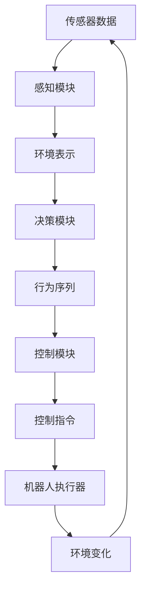

好的,我明白了您的要求。以下是题为《【大模型应用开发 动手做AI Agent】具身智能的发展》的技术博客文章正文部分:

# 【大模型应用开发 动手做AI Agent】具身智能的发展

## 1. 背景介绍

### 1.1 问题的由来

随着人工智能技术的不断发展,大型语言模型和多模态模型的应用越来越广泛。这些大模型具有强大的理解和生成能力,可以用于多种任务,如问答、对话、文本生成、图像理解等。然而,这些模型大多是基于符号化的数据和算法,缺乏对真实世界的直接感知和交互能力,存在着"幻觉智能"的问题。

### 1.2 研究现状  

为了解决这一问题,研究人员提出了"具身智能"(Embodied AI)的概念。具身智能旨在让AI系统能够像人类一样,通过机器人或虚拟化身与真实世界进行感知和交互,获取多模态的环境信息,并作出相应的行为决策。这种AI不仅具有语言理解和推理能力,还能根据环境的变化进行实时响应。

目前,具身智能的研究主要集中在以下几个方面:

1. 机器人平台:设计集成视觉、语音、触觉等传感器的机器人系统,用于采集环境数据。
2. 模拟环境:构建高度真实的3D虚拟环境,为训练具身智能系统提供安全的试验场所。
3. 多模态感知:开发能够融合视觉、语音、触觉等多种模态信息的AI模型。
4. 决策与控制:研究基于环境感知的行为决策和控制算法,实现智能体与环境的交互。
5. 任务基准测试:设计具有一定复杂性的模拟任务,评估具身智能系统的能力。

### 1.3 研究意义

具身智能的发展将极大推动人工智能向通用智能迈进。通过让AI系统真正"具身"于现实世界,它们将获得更加丰富的环境感知和交互能力,不再局限于静态数据和符号化表示。这将为AI系统带来全新的认知和决策方式,使其能够更好地理解和适应复杂的真实环境,为解决诸如机器人控制、智能驾驶、智能家居等实际问题提供新的解决方案。

### 1.4 本文结构

本文将全面介绍具身智能的核心概念、算法原理、数学模型、项目实践、应用场景等内容。首先阐述具身智能的基本概念和发展历程;然后深入探讨其核心算法和数学模型;接着通过代码实例讲解具体的项目实践;最后分析具身智能的应用前景,并对未来的发展趋势和挑战进行展望。

## 2. 核心概念与联系

具身智能(Embodied AI)是一种新兴的人工智能范式,它强调AI系统需要通过身体与环境进行交互,获取多模态感知信息,并作出相应的行为决策。具身智能的核心概念包括:

1. **感知-行为循环(Perception-Action Cycle)**:AI系统通过传感器获取环境信息,经过内部处理后输出行为指令,这种持续的感知-决策-行为循环使系统能够与环境进行实时交互。

2. **多模态融合(Multimodal Fusion)**:具身智能需要整合视觉、语音、触觉等多种模态的感知信息,形成对环境的统一表示和理解。

3. **自主决策(Autonomous Decision Making)**:基于对环境的感知,AI系统需要自主做出合理的行为决策,而不是被动响应。

4. **持续学习(Continual Learning)**:在与环境的持续交互中,AI系统应当不断获取新的经验,更新知识模型,实现在线学习和自我进化。

5. **任务导向(Task-Oriented)**:具身智能系统的设计目标是完成特定的现实任务,如导航、抓取、装配等,而非通用的问答或对话。

这些核心概念相互关联、环环相扣,共同构成了具身智能的基本框架。其中,感知-行为循环是具身智能的核心驱动力,多模态融合提供了丰富的环境信息输入,自主决策赋予了系统智能化的能力,持续学习确保了系统不断进化,而任务导向则规定了系统的最终目标。

## 3. 核心算法原理与具体操作步骤

### 3.1 算法原理概述

具身智能系统的核心算法主要包括三个部分:感知模块、决策模块和控制模块。

1. **感知模块**:接收来自机器人传感器(如视觉、语音、触觉等)的多模态数据,并将其融合成统一的环境表示。常用的感知算法有计算机视觉、语音识别、深度学习等。

2. **决策模块**:根据当前的环境表示,结合任务目标和约束条件,规划出合理的行为序列。决策算法包括强化学习、层次化规划、符号规划等。

3. **控制模块**:将决策模块输出的行为序列转化为可执行的低级控制指令,并发送给机器人执行器(如机械臂、车轮等)。控制算法有PID控制、轨迹规划、运动规划等。

这三个模块通过感知-决策-控制的闭环交互,形成了具身智能系统的核心运行机制。

### 3.2 算法步骤详解

具身智能系统的算法步骤如下:

1. **数据采集**:通过机器人上的各种传感器(视觉、语音、触觉等)采集环境数据,如RGB图像、深度图、点云、语音等。

2. **数据预处理**:对采集的原始数据进行预处理,如去噪、校正、特征提取等,以获得高质量的输入数据。

3. **多模态融合**:将视觉、语音、触觉等不同模态的数据融合成统一的环境表示,如点云拼接、特征级融合、决策级融合等。

4. **状态估计**:基于融合后的环境表示,估计当前的环境状态,如机器人位置、目标物体位置等。

5. **任务规划**:根据任务目标和约束条件,结合当前状态,规划出一系列行为动作序列。常用的规划算法有A*、RRT、POMDP等。

6. **行为控制**:将规划出的行为序列转化为可执行的控制指令,并发送给机器人的执行器,如控制机械臂运动轨迹。

7. **执行监控**:实时监控机器人的执行过程,获取执行反馈,用于调整控制策略。

8. **模型更新**:根据执行过程中获得的新数据和经验,不断优化和更新感知、决策、控制模型。

9. **迭代循环**:重复上述步骤,实现感知-决策-控制的闭环交互,完成复杂任务。

这些步骤构成了具身智能系统的基本运行流程,体现了数据驱动、模型融合、闭环控制等核心理念。

### 3.3 算法优缺点

具身智能算法的优点:

1. **真实交互**:通过机器人与真实环境进行物理交互,避免了仅基于虚拟数据的局限性。

2. **多模态融合**:整合视觉、语音、触觉等多源信息,获得更加丰富和准确的环境表示。

3. **闭环控制**:实现持续的感知-决策-行为循环,能够根据环境变化实时调整策略。

4. **在线学习**:在与环境交互的过程中不断获取新经验,持续优化模型,具有自我进化能力。

5. **任务导向**:专注于解决具体的现实任务,如导航、抓取等,有明确的目标和评估标准。

缺点包括:

1. **研发成本高**:需要昂贵的机器人硬件平台和大量的数据采集与标注工作。

2. **数据分布偏移**:模拟环境与真实环境存在分布差异,模型可能难以直接迁移。

3. **感知噪声**:真实环境中的各种噪声干扰,如光照变化、遮挡等,给感知带来挑战。

4. **决策复杂度高**:需要同时考虑环境状态、物理约束、任务目标等多种因素。

5. **安全隐患**:机器人在物理世界运行时,如果决策失误可能会造成安全风险。

6. **缺乏通用性**:目前多数算法是针对特定任务设计的,通用能力还有待提高。

### 3.4 算法应用领域

具身智能算法的应用领域非常广泛,主要包括:

1. **服务机器人**:如家居服务机器人、医疗护理机器人、酒店服务机器人等。

2. **工业机器人**:用于工厂自动化生产线,如装配、搬运、检测等。

3. **勘探机器人**:在特殊环境(如火场、地下管道等)中执行勘探任务。

4. **人机交互**:通过自然语言、手势等与人类进行自然交互。

5. **智能驾驶**:感知道路环境,自主做出驾驶决策。

6. **智能物流**:实现仓储、分拣、运输等自动化物流流程。

7. **虚拟助理**:在虚拟环境中为用户提供多模态的交互体验。

随着算法的不断发展,具身智能的应用前景将更加广阔。

## 4. 数学模型和公式详细讲解与举例说明

### 4.1 数学模型构建

具身智能系统的建模过程可以概括为马尔可夫决策过程(MDP)。MDP是一种用于描述序列决策问题的数学框架,由一组状态(S)、一组行为(A)、状态转移概率(P)和奖励函数(R)组成。

在具身智能中,状态S表示对环境的观测或表示,如机器人位置、目标物体位置等;行为A是智能体可执行的动作序列,如移动、抓取等;状态转移概率P(s'|s,a)表示在当前状态s下执行行为a后,转移到状态s'的概率;奖励函数R(s,a)则定义了在状态s下执行行为a获得的即时奖励值。

智能体的目标是找到一个策略π,使得在MDP中获得的长期累积奖励最大,即:

$$\max_\pi \mathbb{E}\left[\sum_{t=0}^\infty \gamma^t R(s_t, a_t)\right]$$

其中γ是折现因子,用于权衡即时奖励和长期奖励。

这个最优化问题可以通过强化学习等算法求解。常用的方法包括Q-Learning、策略梯度等。

### 4.2 公式推导过程

以Q-Learning为例,我们推导其核心更新公式。

Q-Learning的目标是学习一个Q函数Q(s,a),表示在状态s下执行行为a的长期累积奖励。根据贝尔曼最优方程:

$$Q^*(s, a) = \mathbb{E}_{s' \sim P(\cdot|s,a)}\left[R(s, a) + \gamma \max_{a'} Q^*(s', a')\right]$$

我们定义TD误差为:

$$\delta = R(s, a) + \gamma \max_{a'} Q(s', a') - Q(s, a)$$

则Q-Learning的更新规则为:

$$Q(s, a) \leftarrow Q(s, a) + \alpha \delta$$

其中α是学习率。这一简单的更新规则保证了Q函数在足够多的样本下收敛到最优Q*函数。

### 4.3 案例分析与讲解

以机器人导航任务为例,我们构建一个简单的MDP模型。

假设机器人在一个10x10的二维网格世界中导航,状态S是机器人的坐标位置,行为A是上下左右四个移动方向。如果机器人到达目标位置,获得+1的奖励;如果撞墙,获得-1的惩罚;其他情况下,