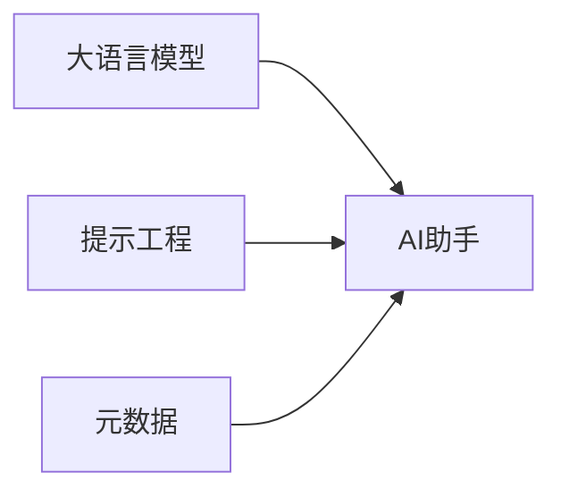

# 【大模型应用开发 动手做AI Agent】拿到助手返回的元数据信息

作者：禅与计算机程序设计艺术 / Zen and the Art of Computer Programming

## 1. 背景介绍
### 1.1 问题的由来
在人工智能的快速发展过程中,大语言模型(Large Language Models, LLMs)的出现掀起了一场革命性的浪潮。这些模型以其强大的自然语言理解和生成能力,展现出广阔的应用前景。然而,如何有效地利用大模型的能力,开发出实用的AI助手应用,仍然是一个亟待解决的问题。
### 1.2 研究现状 
目前,业界已经涌现出一批基于大模型的AI助手应用,如微软的小冰、OpenAI的ChatGPT等。这些应用在特定领域展现出了优异的性能,但在通用性、可控性、安全性等方面仍存在不足。如何进一步提升大模型助手的性能,实现更加智能、安全、可控的人机交互,是当前研究的重点。
### 1.3 研究意义
深入研究大模型在AI助手开发中的应用,对于推动人工智能技术的发展具有重要意义。一方面,它有助于探索大模型的潜力和局限性,为后续的模型优化提供思路;另一方面,打造高质量的AI助手,可以极大地提升人机交互体验,为各行各业赋能,创造巨大的社会和经济价值。
### 1.4 本文结构
本文将围绕大模型在AI助手开发中的应用展开深入探讨。首先,我们将介绍相关的核心概念,阐述它们之间的联系;然后,重点分析大模型助手的核心算法原理和关键技术;接着,我们将以实例的形式,讲解如何利用大模型开发AI助手;最后,展望大模型助手的发展趋势和面临的挑战。

## 2. 核心概念与联系
在探讨大模型助手开发之前,我们有必要对几个核心概念进行必要的了解:

- **大语言模型(Large Language Models, LLMs)**: 是一类基于海量文本数据训练的神经网络模型,具有强大的自然语言理解和生成能力。代表模型包括GPT系列、BERT、T5等。它们通过自监督学习和迁移学习,可以在多种NLP任务上取得优异表现。

- **AI助手(AI Agents)**: 是一类基于人工智能技术,能够与人进行自然语言交互,执行特定任务或提供服务的应用程序。它们一般包括语言理解、对话管理、知识库等多个模块,可以根据用户输入给出相应的回复或执行相关操作。

- **提示工程(Prompt Engineering)**: 是一种利用适当的提示(Prompt)来引导大模型生成所需答案的技术。通过精心设计的提示模板,可以控制大模型的生成过程,使其输出更加符合特定需求。这是开发大模型助手的重要手段。

- **元数据(Metadata)**: 指的是对数据的描述信息,常用于标识数据的属性、特征、结构等。在大模型助手开发中,我们可以利用元数据来组织和管理大模型的输入输出,提高系统的可解释性和可控性。

这些概念之间有着紧密的联系。大语言模型是开发AI助手的基础,提供了强大的语言理解和生成能力;而提示工程则是驾驭大模型的关键,它决定了助手的行为和结果质量;元数据则是实现助手可控可解释的重要手段,它为我们提供了描述和管理数据的方式。三者相辅相成,共同构成了大模型助手开发的核心要素。

## 3. 核心算法原理 & 具体操作步骤
### 3.1 算法原理概述
大模型助手的核心算法主要包括两大类:自然语言理解(NLU)和自然语言生成(NLG)。其中,NLU负责将用户的输入转化为计算机可以理解和处理的结构化信息,一般包括意图识别、槽位填充、命名实体识别等任务;NLG则负责根据NLU的结果,结合背景知识和对话历史,生成符合用户需求的自然语言回复。

目前主流的NLU和NLG算法大多基于深度学习,尤其是Transformer等注意力机制模型。Transformer通过自注意力机制和前馈神经网络,可以有效地捕捉输入序列中的长距离依赖关系,生成高质量的中间表示。在此基础上,可以利用微调、提示学习等技术,进一步提升模型在下游任务上的表现。

### 3.2 算法步骤详解
大模型助手的开发一般包括以下几个关键步骤:

1. **数据准备**: 收集和标注大规模的高质量语料数据,作为大模型训练的基础。数据需要覆盖助手应用的主要场景和任务,并进行必要的清洗和预处理。

2. **模型选择和训练**: 根据任务需求,选择合适的大语言模型架构,如GPT、BERT、T5等。利用准备好的数据对模型进行预训练或微调,使其掌握必要的语言知识和任务技能。

3. **提示工程设计**: 针对具体的应用场景,设计合适的提示模板,引导模型生成所需的答案。提示工程需要考虑任务属性、用户意图、知识库等多方面因素,以提高模型生成的质量和可控性。

4. **元数据管理**: 在助手的输入输出过程中,引入元数据来描述和管理数据的属性、格式、来源等信息。元数据可以帮助我们更好地理解和控制大模型的行为,提高系统的可解释性和可维护性。

5. **对话管理**: 设计合适的对话管理策略,协调NLU、NLG等多个模块,实现多轮交互。需要考虑对话状态跟踪、意图识别、槽位填充、知识库查询等多个方面,以保证对话的连贯性和自然性。

6. **应用集成与优化**: 将训练好的模型与对话系统集成,并在实际应用中不断迭代优化。需要关注模型的推理速度、资源占用、稳定性等工程问题,同时根据用户反馈不断改进模型和系统的性能。

### 3.3 算法优缺点
大模型助手算法的主要优点包括:

- 强大的语言理解和生成能力,可以应对复杂多变的对话场景
- 通过提示工程,可以引导模型生成符合特定需求的答案,提高可控性
- 利用元数据,可以提高系统的可解释性和可维护性
- 基于Transformer等先进模型,具有较好的泛化能力和迁移能力

但同时也存在一些局限性:

- 对大规模高质量数据的依赖,数据获取和标注成本较高
- 模型训练和推理的计算开销大,对硬件资源要求较高
- 提示工程设计需要较强的领域知识和经验,门槛较高
- 在安全性、伦理性等方面还存在挑战,需要谨慎应对

### 3.4 算法应用领域
大模型助手算法可以应用于多个领域,包括但不限于:

- 智能客服:提供自动化的客户服务,解答常见问题,提高人工客服效率
- 虚拟助理:执行日程管理、信息查询、设备控制等个人助理任务
- 智能教育:辅助教学过程,为学生提供个性化的学习指导和反馈
- 医疗健康:协助医生进行病情分析、药物推荐、健康咨询等
- 金融服务:提供理财规划、风险评估、异常检测等智能化服务

随着大模型技术的不断发展,其应用领域也将不断拓展,为更多行业赋能。

## 4. 数学模型和公式 & 详细讲解 & 举例说明
### 4.1 数学模型构建
大模型助手的核心是语言模型,它以概率的方式刻画了自然语言的生成过程。给定一个语句 $S=(w_1,w_2,...,w_n)$,语言模型的目标是估计其概率分布 $P(S)$:

$$
P(S) = P(w_1, w_2, ..., w_n) = \prod_{i=1}^n P(w_i | w_1, w_2, ..., w_{i-1})
$$

其中,$w_i$ 表示语句中的第 $i$ 个词,$P(w_i | w_1, w_2, ..., w_{i-1})$ 表示在给定前 $i-1$ 个词的情况下,第 $i$ 个词出现的条件概率。

大语言模型的目标是学习这个概率分布。传统的 n-gram 语言模型受限于上下文窗口的大小,难以捕捉长距离依赖。而基于深度学习的语言模型,如 RNN、Transformer 等,则可以建模任意长度的上下文信息。

以 Transformer 为例,其核心是自注意力机制和前馈神经网络。对于输入序列 $X=(x_1,x_2,...,x_n)$,自注意力机制首先计算每个位置的查询向量 $q_i$、键向量 $k_i$ 和值向量 $v_i$:

$$
q_i = W_q x_i, \quad k_i = W_k x_i, \quad v_i = W_v x_i
$$

然后,通过查询向量和键向量的点积计算位置 $i$ 和 $j$ 之间的注意力权重 $\alpha_{ij}$:

$$
\alpha_{ij} = \frac{\exp(q_i k_j^T / \sqrt{d_k})}{\sum_{j=1}^n \exp(q_i k_j^T / \sqrt{d_k})}
$$

最后,将注意力权重与值向量加权求和,得到位置 $i$ 的上下文表示 $c_i$:

$$
c_i = \sum_{j=1}^n \alpha_{ij} v_j
$$

通过堆叠多个自注意力层和前馈层,Transformer 可以建模输入序列中的长距离依赖,生成高质量的上下文表示,从而提高语言模型的性能。

### 4.2 公式推导过程
以上是 Transformer 中自注意力机制的核心公式,下面我们对其推导过程进行详细说明。

首先,我们需要将输入序列 $X$ 映射为查询向量 $Q$、键向量 $K$ 和值向量 $V$:

$$
Q = XW_q, \quad K = XW_k, \quad V = XW_v
$$

其中,$W_q$,$W_k$,$W_v$ 是可学习的参数矩阵。

然后,我们计算查询向量和键向量的点积,得到注意力得分矩阵 $A$:

$$
A = QK^T / \sqrt{d_k}
$$

其中,$d_k$ 是键向量的维度,用于缩放点积结果,避免过大的值导致 softmax 函数饱和。

接着,我们对注意力得分矩阵应用 softmax 函数,得到注意力权重矩阵 $\alpha$:

$$
\alpha = \text{softmax}(A)
$$

最后,我们将注意力权重矩阵与值向量相乘,得到上下文表示矩阵 $C$:

$$
C = \alpha V
$$

通过这一系列变换,我们实现了自注意力机制,使得模型可以根据输入序列的内容动态地计算注意力权重,聚焦于不同位置的信息。

### 4.3 案例分析与讲解
下面我们以一个简单的例子来说明 Transformer 中自注意力机制的计算过程。

假设我们有一个输入序列:"The cat sat on the mat"。首先,我们将每个词映射为对应的词嵌入向量,得到输入矩阵 $X$:

$$
X = \begin{bmatrix}
x_{The} \\ x_{cat} \\ x_{sat} \\ x_{on} \\ x_{the} \\ x_{mat}
\end{bmatrix}
$$

然后,我们分别计算查询矩阵 $Q$、键矩阵 $K$ 和值矩阵 $V$:

$$
Q = XW_q, \quad K = XW_k, \quad V = XW_v
$$

接着,我们计算注意力得分矩阵 $A$:

$$
A = QK^T / \sqrt{d_k} = \begin{bmatrix}