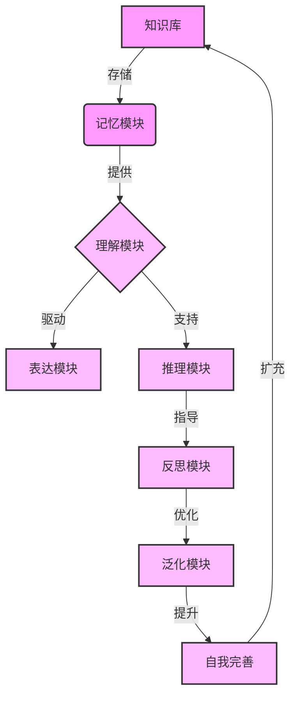

# 【大模型应用开发 动手做AI Agent】知识、记忆、理解、表达、推理、反思、泛化和自我提升

## 1. 背景介绍

### 1.1 问题的由来

在当今的人工智能领域,大型语言模型(Large Language Models, LLMs)正在引领着一场前所未有的技术革命。这些模型通过消化海量的文本数据,展现出惊人的自然语言理解和生成能力,为各种应用程序带来了新的可能性。然而,要真正实现通用人工智能(Artificial General Intelligence, AGI),仅仅拥有强大的语言能力是远远不够的。我们需要一种新型的AI Agent,能够整合知识、记忆、理解、表达、推理、反思、泛化和自我提升等多重认知能力,从而在更广阔的领域发挥作用。

### 1.2 研究现状

目前,研究人员正在探索各种途径来增强大型语言模型的能力,使其更接近人类般的通用智能。一些突破性的工作包括:

1. **记忆增强**: 通过外部记忆模块或注意力机制,赋予模型长期记忆和快速存取能力。
2. **多模态融合**: 将视觉、听觉等多种感知信号融入语言模型,实现多模态理解和交互。
3. **因果推理**: 引入因果建模和推理,使模型能够捕捉事物之间的因果关系。
4. **元学习**: 通过学习如何学习的元过程,提高模型的泛化能力和适应性。
5. **自我监督**: 设计自我监督任务,促使模型形成自我认知和反思能力。

虽然取得了一些进展,但是将这些能力有机融合,构建出真正的AGI系统,仍然是一个巨大的挑战。

### 1.3 研究意义

发展通用人工智能代理不仅是人工智能领域的终极目标,也将为人类社会带来深远的影响。一个拥有多重认知能力的AGI系统,可以在诸多领域发挥作用,包括:

- 科学研究和技术创新
- 教育和知识传播
- 决策辅助和智能规划
- 智能助手和人机交互
- 安全和环境保护等

因此,探索大模型应用开发的新途径,对于推动人工智能的发展和造福人类社会都具有重要意义。

### 1.4 本文结构

本文将围绕"大模型应用开发 动手做AI Agent"这一主题,详细阐述构建通用人工智能代理所需的关键技术和实践方法。我们将从核心概念出发,深入探讨算法原理、数学模型、代码实现,并结合实际应用场景,为读者提供全面的指导。最后,我们将总结发展趋势和面临的挑战,为未来的研究指明方向。

## 2. 核心概念与联系

在构建通用人工智能代理的过程中,我们需要整合多个关键概念,并探索它们之间的内在联系。下图使用Mermaid流程图清晰地展示了这些核心概念及其相互作用:

1. **知识库**：作为整个系统的基础,知识库存储了大量的结构化和非结构化知识,为后续的理解、推理和决策提供支持。

2. **记忆模块**：高效的记忆能力对于智能系统至关重要。记忆模块不仅需要存储新获取的知识,还要能快速准确地检索相关信息。

3. **理解模块**：基于知识库和记忆模块的输入,理解模块需要对输入的自然语言、视觉等信号进行深层次的理解和表示,为下游任务做好准备。

4. **表达模块**：理解的结果需要通过自然语言、图像等形式清晰地表达出来,以实现人机交互和决策输出。

5. **推理模块**：推理能力是智能系统的核心,它通过对已有知识进行逻辑推导、规则匹配和因果建模,得出新的判断和结论。

6. **反思模块**：智能系统需要具备自我反思的能力,评估自身的决策和行为,发现错误和不足,并对知识库和推理策略进行更新。

7. **泛化模块**：通过元学习和迁移学习等技术,泛化模块赋予系统更强的适应性,使其能够将已学习的知识和经验迁移到新的领域和任务中。

8. **自我完善**：基于反思和泛化的结果,智能系统需要不断优化和完善自身,扩充知识库,调整推理策略,提高整体的性能和能力。

这些模块相互依赖、环环相扣,共同构建了一个具有多重认知能力的通用人工智能代理。接下来,我们将详细探讨每个模块的核心算法原理和实现方法。

## 3. 核心算法原理与具体操作步骤

### 3.1 算法原理概述

要构建一个拥有多重认知能力的AI Agent,我们需要整合多种先进的算法和技术,包括:

1. **transformer模型**:用于构建大型语言模型的基础,通过自注意力机制捕捉长距离依赖关系。
2. **记忆增强技术**:如外部记忆模块、注意力记忆等,赋予模型长期记忆和快速存取能力。
3. **多模态融合算法**:将视觉、语音等多种模态信号融合到统一的表示空间中。
4. **因果推理算法**:基于结构化因果模型或神经因果模型,推断事物之间的因果关系。
5. **元学习算法**:通过学习任务之间的共性,提高模型在新任务上的泛化能力。
6. **自监督学习算法**:设计自监督任务,促使模型形成自我认知和反思能力。
7. **迁移学习技术**:将在源域学习到的知识迁移到目标域,加速新任务的学习过程。
8. **强化学习算法**:通过与环境交互获取反馈,优化智能体的决策和行为策略。

这些算法和技术的有机结合,将赋予AI Agent全面的认知能力。下面我们将详细介绍其中的核心算法原理和具体操作步骤。

### 3.2 算法步骤详解

#### 3.2.1 Transformer模型

Transformer模型是构建大型语言模型的基础,其核心是自注意力(Self-Attention)机制。自注意力机制通过计算输入序列中每个元素与其他元素的相关性,捕捉长距离依赖关系,从而更好地建模序列数据。

Transformer模型的训练过程可以概括为以下步骤:

1. **输入embedding**:将输入序列(如文本)转换为词向量表示。
2. **位置编码**:为每个位置添加位置信息,使模型能够捕捉序列的顺序信息。
3. **多头自注意力**:计算查询(Query)、键(Key)和值(Value)之间的注意力分数,获得加权后的值表示。
4. **前馈神经网络**:对注意力输出进行进一步的非线性变换,提取高级特征。
5. **规范化与残差连接**:使用残差连接和层归一化,提高模型的训练稳定性。
6. **掩码多头注意力**(用于解码器):在解码时,掩码未来位置的信息,保证自回归属性。

通过堆叠多个编码器(Encoder)和解码器(Decoder)层,Transformer模型可以高效地对输入序列进行编码,并生成目标序列作为输出。

训练目标是最小化模型在大规模语料库上的交叉熵损失,使用梯度下降等优化算法进行参数更新。预训练过程中,通常采用自监督的方式,预测被掩码的词元(Masked Language Modeling)或是下一句预测(Next Sentence Prediction)等任务。

经过大规模预训练后,Transformer模型可以捕捉到丰富的语义和语法知识,为下游的fine-tuning任务提供有力的基础。

#### 3.2.2 记忆增强技术

尽管Transformer模型具有一定的记忆能力,但仍然存在局限性。为了赋予AI Agent更强大的长期记忆和快速存取能力,我们需要引入专门的记忆增强技术。

常见的记忆增强技术包括:

1. **外部记忆模块**:
    - 将模型与一个可读写的外部存储器(如N-gram或键值存储)相连接
    - 模型可以选择性地读取、写入和更新存储器中的内容
    - 存储器的内容在整个序列处理过程中持续存在
    - 通过注意力机制实现对存储器的读写操作

2. **注意力记忆**:
    - 直接将注意力分数作为记忆的表示
    - 在解码时,将当前时刻的注意力分数与历史注意力分数进行组合
    - 赋予模型对历史信息的显式记忆能力

3. **递归神经网络**:
    - 使用递归神经网络(如LSTM或GRU)构建解码器
    - 递归神经网络具有内在的记忆状态,可累积处理序列信息
    - 适用于需要长期依赖信息的任务,如机器翻译

通过上述技术,AI Agent可以更高效地存储和检索相关信息,为后续的理解、推理和决策提供支持。

#### 3.2.3 多模态融合算法

现实世界是多模态的,仅依赖语言信息是不够的。因此,我们需要将视觉、听觉等多种感知信号融合到AI Agent中,实现多模态理解和交互。

常见的多模态融合算法包括:

1. **早期融合**:
    - 将不同模态的特征在较低层次进行拼接
    - 使用共享的编码器对拼接后的特征进行编码
    - 简单但可能无法充分捕捉模态间的交互关系

2. **晚期融合**:  
    - 使用独立的编码器对每种模态进行编码
    - 在较高层次将不同模态的特征进行融合(如拼接、相加等)
    - 能够较好地保留每种模态的独特信息

3. **自注意力融合**:
    - 在Transformer模型的编码器或解码器层中引入跨模态注意力
    - 计算不同模态特征之间的注意力分数,实现模态间的交互
    - 能够灵活地融合多种模态信息

4. **跨模态对比学习**:
    - 设计无监督的对比学习任务,如视觉与文本之间的对比
    - 通过最大化正样本对的相似性,最小化负样本对的相似性
    - 学习出模态无关的统一表示空间

通过上述算法,AI Agent可以融合多源多模态的感知信号,获得更加全面和丰富的世界表示,为后续的理解、推理和决策奠定基础。

#### 3.2.4 因果推理算法

仅依赖相关性和模式识别是不够的,我们需要赋予AI Agent因果推理的能力,从而理解事物之间的因果关系,支持更高层次的决策和规划。

常见的因果推理算法包括:

1. **结构化因果模型**:
    - 基于经典的因果理论,如确认理论、决策理论等
    - 构建显式的因果图模型,表示变量之间的因果关系
    - 通过做出干预(intervention)来推断因果效应
    - 适用于具有确定性因果结构的问题

2. **神经因果模型**:
    - 使用神经网络来直接从数据中学习因果机制
    - 常见方法包括因果生成网络、归纳因果推理等