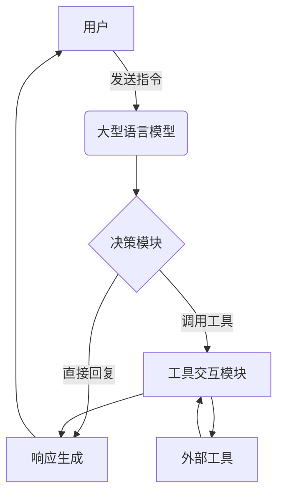

# 【大模型应用开发 动手做AI Agent】第一次调用大模型，向模型发送对话及工具定义，并获取响应

## 1. 背景介绍

### 1.1 问题的由来

在当今的人工智能时代，大型语言模型已经成为各大科技公司和研究机构的研究热点。这些模型通过从海量文本数据中学习,能够生成看似人类写作的自然语言输出。随着模型规模和训练数据的不断扩大,它们展现出了惊人的语言理解和生成能力,在各种自然语言处理任务中表现出色,引发了广泛关注。

然而,直接将这些大型语言模型应用于实际场景并非易事。模型的输出虽然看似合理,但往往缺乏一致性、可控性和可解释性。此外,如何将模型与外部数据源和工具相结合,以提高其功能和可用性,也是一个亟待解决的问题。

### 1.2 研究现状

为了解决上述问题,研究人员提出了将大型语言模型与外部工具和数据源相结合的思路,即所谓的"AI Agent"。AI Agent能够根据用户的指令,与外部系统交互、获取信息、执行任务,并将结果融入对话中。通过这种方式,大型语言模型不再是一个孤立的黑箱,而是可以与外部世界连接,提供更加智能、可控和可解释的服务。

目前,一些知名的AI公司和研究机构已经开始探索AI Agent的开发,如OpenAI的InstructGPT、Anthropic的ConstitutionalAI等。但这一领域仍处于起步阶段,存在诸多挑战亟待解决。

### 1.3 研究意义

开发AI Agent不仅可以充分发挥大型语言模型的潜力,更重要的是它为人工智能系统与现实世界的交互提供了一种新的范式。AI Agent可以应用于各种场景,如智能助手、任务自动化、决策支持等,极大地提高人机协作的效率和质量。

此外,AI Agent的研究也将推动人工智能系统的可解释性、可控性和可靠性的提高,这对于建立人们对AI的信任至关重要。通过与外部工具和数据源的交互,AI Agent的决策过程和输出结果将更加透明,更易于人类理解和把控。

因此,探索AI Agent的开发是一个具有重要理论意义和应用价值的研究方向。

### 1.4 本文结构

本文将详细介绍如何开发一个基于大型语言模型的AI Agent,并重点阐述如何实现模型与外部工具的交互。文章首先介绍AI Agent的核心概念和架构,然后深入探讨与工具交互的算法原理和具体实现步骤。此外,还将介绍相关的数学模型、项目实践、应用场景、工具和资源等内容,为读者提供全面的指导。

## 2. 核心概念与联系

在探讨AI Agent的具体实现之前,我们先来了解一些核心概念和它们之间的联系。

### 2.1 大型语言模型

大型语言模型(Large Language Model,LLM)是一种基于自然语言的人工智能模型,通过从海量文本数据中学习,能够生成看似人类写作的自然语言输出。常见的大型语言模型包括GPT-3、PaLM、ChatGPT等。这些模型展现出了惊人的语言理解和生成能力,但同时也存在一些缺陷,如缺乏一致性、可控性和可解释性。

### 2.2 AI Agent

AI Agent是一种将大型语言模型与外部工具和数据源相结合的智能系统。它能够根据用户的指令,与外部系统交互、获取信息、执行任务,并将结果融入对话中。AI Agent的核心思想是利用语言模型的强大语言能力,同时弥补其缺乏与外部世界交互的不足。

### 2.3 工具(Tool)

在AI Agent中,工具指的是可以被模型调用的外部程序、API或数据源。工具可以执行各种任务,如数据查询、计算、文件操作等。通过与工具的交互,AI Agent可以获取所需的信息和功能,从而提高其能力和可用性。

### 2.4 对话(Conversation)

对话是AI Agent与用户交互的核心。用户通过自然语言向AI Agent发送指令和查询,AI Agent则根据对话上下文和可用工具,生成相应的响应。对话的过程是动态的,AI Agent需要不断理解用户的意图,并决定是直接回复还是调用工具执行任务。

### 2.5 核心架构

AI Agent的核心架构如下所示:



用户向大型语言模型发送指令,模型通过决策模块决定是直接生成响应还是调用外部工具。如果需要调用工具,则通过工具交互模块与外部工具进行交互,获取所需的信息或执行任务。最终,模型将结果融入响应中,并反馈给用户。

该架构的关键在于决策模块和工具交互模块的设计,它们决定了AI Agent的智能水平和可用性。接下来,我们将重点探讨这两个模块的算法原理和实现方式。

## 3. 核心算法原理 & 具体操作步骤

### 3.1 算法原理概述

AI Agent的核心算法原理可以概括为以下几个方面:

1. **意图识别**: 通过自然语言理解技术,识别用户指令中的意图,判断是需要直接回复还是执行任务。

2. **工具选择**: 根据意图和对话上下文,从可用工具集合中选择合适的工具。

3. **工具调用**: 将用户指令和相关上下文信息传递给选定的工具,并获取工具的执行结果。

4. **响应生成**: 将工具执行结果与模型生成的自然语言响应相结合,形成最终的回复。

5. **上下文更新**: 根据本次交互,更新对话上下文,为下一次交互做好准备。

这些步骤环环相扣,构成了AI Agent与用户自然交互的基本流程。下面我们将详细介绍每个步骤的具体算法。

### 3.2 算法步骤详解

#### 3.2.1 意图识别

意图识别是AI Agent理解用户指令的关键步骤。常见的方法是基于序列标注的方式,将用户指令视为一个词序列,对每个词进行意图标注。

具体来说,我们可以构建一个序列标注模型(如BERT+CRF),将用户指令输入到模型中,模型会输出每个词对应的意图标签。例如,对于指令"查询天气预报",模型可能会输出序列"O O B-Query I-Query",表示"查询"和"天气预报"两个词构成了一个查询意图。

通过分析意图标签序列,我们可以判断用户的整体意图。如果没有检测到特殊意图(如查询、执行任务等),则认为是一个普通的对话,直接由语言模型生成响应。否则,进入工具选择和调用的流程。

#### 3.2.2 工具选择

工具选择的目标是从可用工具集合中,找到最合适的工具来执行用户的指令。这可以看作一个retrieving-reranking问题:首先从工具集合中检索出一些候选工具,然后根据用户指令和对话上下文,重新排序这些候选工具,选择分数最高的工具。

具体来说,我们可以构建一个双塔模型(如SBERT),将用户指令和每个工具的描述分别编码为向量,然后计算它们之间的相似度分数。将这些分数排序,选择分数最高的工具作为候选工具。

接下来,我们可以使用一个更大的语言模型(如PALM),将用户指令、对话上下文和候选工具的描述拼接为一个序列,输入到模型中,让模型基于序列的语义信息,对候选工具进行打分和排序。最终选择排名第一的工具。

这种两阶段的检索-重排序方法,可以平衡计算效率和排序质量,是一种常见的工具选择策略。

#### 3.2.3 工具调用

选定工具后,我们需要将用户指令和相关上下文信息传递给工具,并获取工具的执行结果。这个过程需要设计一个通用的工具接口,用于与不同类型的工具进行交互。

一种常见的做法是使用基于JSON的接口,定义一个标准的输入和输出格式。输入格式包括用户指令、对话历史、工具描述等信息,而输出则是工具的执行结果。

例如,对于一个网页查询工具,输入可能是:

```json
{
  "instruction": "查询天气预报",
  "history": [...],
  "tool": {
    "name": "网页查询",
    "description": "可以在网上查询各种信息",
    ...
  }
}
```

工具根据输入中的指令,在网上查询天气预报相关信息,并将结果按照约定的格式返回,如:

```json
{
  "result": "根据查询,未来三天上海地区天气为..."
}
```

通过这种标准化的接口,AI Agent可以方便地与各种工具进行交互,获取所需的信息或执行任务。

#### 3.2.4 响应生成

获取到工具执行结果后,AI Agent需要将其融入自身生成的自然语言响应中,形成最终的回复。这个过程可以看作一个序列到序列(Seq2Seq)的生成任务。

我们可以使用一个经过特殊训练的大型语言模型(如InstructGPT),将工具执行结果、用户指令和对话历史拼接为一个序列,输入到模型中。模型会根据这些信息,生成一个自然语言的响应序列。

例如,对于上面的天气查询示例,输入序列可能是:

```
指令: 查询天气预报
历史: [...] 
工具结果: 根据查询,未来三天上海地区天气为...
响应:
```

模型将学习生成如下的响应:

```
根据查询结果,未来三天上海地区天气情况如下:...
```

在训练该Seq2Seq模型时,我们可以使用大量的人工标注数据,让模型学习如何基于工具结果生成自然的响应。同时,也可以设计一些训练策略,如通过反向翻译等方式增强模型的泛化能力。

#### 3.2.5 上下文更新

每次与用户交互后,AI Agent都需要更新对话上下文,为下一次交互做好准备。上下文信息包括用户的指令、AI Agent的响应、调用的工具及其执行结果等。

我们可以使用一个上下文管理器(Context Manager)来维护对话上下文。上下文管理器是一个数据结构,可以存储历史交互信息,并提供添加、获取和清除上下文的方法。

在每次交互结束时,AI Agent将本次交互的相关信息(如用户指令、响应、工具结果等)添加到上下文管理器中。在下一次交互开始时,AI Agent可以从上下文管理器中获取历史上下文信息,为意图识别、工具选择等步骤提供依据。

此外,上下文管理器还可以实现一些策略,如根据对话长度或时间限制来清除过期的上下文信息,防止上下文过于庞大而影响系统效率。

### 3.3 算法优缺点

上述算法虽然可以实现AI Agent与外部工具的交互,但也存在一些优缺点:

**优点**:

1. **模块化设计**: 将意图识别、工具选择、响应生成等功能模块化,有利于算法的可扩展性和可维护性。

2. **融合多种技术**: 算法融合了自然语言处理、信息检索、序列生成等多种技术,能够发挥大型语言模型的优势。

3. **支持多种工具**: 通过设计通用的工具接口,可以方便地集成各种外部工具,提高AI Agent的功能性。

4. **考虑上下文信息**: 算法中的多个步骤(如工具选择、响应生成)都会利用对话上下文信息,有助于生成更加连贯、合理的响应。

**缺点**:

1. **错误传播**: 由于算法是多步骤的流水线式结