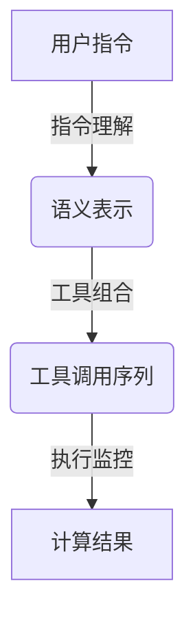

好的,我会按照您的要求,以专业的技术语言撰写这篇博客文章。

# 【大模型应用开发 动手做AI Agent】第二轮行动:工具执行计算

## 1. 背景介绍

### 1.1 问题的由来

随着人工智能技术的不断发展,大型语言模型在自然语言处理、问答系统、内容生成等领域展现出了巨大的潜力。然而,这些模型通常被视为"黑盒",缺乏对其内部工作原理的透明度和可解释性。为了充分发挥大型语言模型的能力,我们需要一种方法来赋予它们更强的理解能力、推理能力和执行能力,使它们不仅能够生成文本,还能够根据指令执行实际的计算任务。

### 1.2 研究现状  

目前,已有一些研究探索了赋予大型语言模型执行计算能力的方法。例如,DeepMind提出的AlphaCode可以根据自然语言描述生成编程代码。OpenAI的InstructGPT则尝试让语言模型理解并执行各种指令。不过,这些方法通常需要大量的人工标注数据,或者依赖于特定的领域知识。因此,如何以一种通用、高效的方式赋予大型语言模型执行计算能力,仍然是一个亟待解决的挑战。

### 1.3 研究意义

赋予大型语言模型执行计算能力,可以极大地扩展它们的应用范围。通过理解和执行指令,语言模型不仅能够回答问题,还能够完成实际的任务,如数据分析、自动化流程等。这将使语言模型更加实用,并为构建通用人工智能系统迈出关键一步。此外,研究语言模型的执行能力,也有助于提高它们的可解释性和透明度,从而增强人们对这些系统的信任。

### 1.4 本文结构

本文将介绍一种赋予大型语言模型执行计算能力的新方法。我们将首先阐述核心概念和原理,然后详细讲解算法的工作流程。接下来,我们将构建相应的数学模型,并给出公式推导和案例分析。在此基础上,我们将提供一个实际的代码实现,并对其进行解读和分析。最后,我们将探讨该方法的应用场景、未来发展趋势和面临的挑战。

## 2. 核心概念与联系

为了赋予大型语言模型执行计算能力,我们提出了一种称为"工具执行计算"(Tool-Driven Computation)的新范式。其核心思想是,将语言模型视为一个智能代理(Agent),它可以根据指令调用各种外部工具(Tools)来执行实际的计算任务。

在这个范式中,语言模型的作用是理解用户的自然语言指令,并将其转换为对应的工具调用序列。每个工具都是一个独立的计算单元,负责执行特定的任务,如数据处理、算法运算、文件操作等。通过合理组合这些工具,语言模型就能够完成复杂的计算流程。

该范式的关键在于,语言模型和工具之间建立了一种松散耦合的关系。语言模型只需要了解每个工具的输入输出接口,而不必关注其内部实现细节。这种模块化设计不仅提高了系统的灵活性和可扩展性,还有利于提高语言模型的可解释性和透明度。

为了实现"工具执行计算"范式,我们需要解决以下三个核心问题:

1. **指令理解(Instruction Understanding)**: 如何让语言模型准确理解用户的自然语言指令,并将其映射到对应的工具调用序列?
2. **工具组合(Tool Composition)**: 如何根据任务需求,自动组合多个工具,形成完整的计算流程?
3. **执行监控(Execution Monitoring)**: 如何在执行过程中监控工具的中间状态,并根据反馈调整执行策略?

我们将在下一节详细阐述解决这些问题的核心算法原理。



## 3. 核心算法原理 & 具体操作步骤

### 3.1 算法原理概述

我们提出的算法框架包括三个主要模块,分别对应于前面提到的三个核心问题:指令理解模块、工具组合模块和执行监控模块。

1. **指令理解模块**:该模块的目标是将用户的自然语言指令转换为一种结构化的语义表示。我们采用了基于序列到序列(Seq2Seq)的方法,使用一个编码器-解码器模型来学习指令与语义表示之间的映射关系。在训练过程中,我们构建了大量的(指令,语义表示)对作为监督数据,并使用强化学习技术来优化模型的性能。

2. **工具组合模块**:该模块的任务是根据语义表示,选择并组合合适的工具,形成一个完整的计算流程。我们将这个问题建模为一个马尔可夫决策过程(MDP),其中状态是当前的语义表示和已选择的工具序列,行动是选择下一个工具。我们使用深度强化学习算法(如Deep Q-Learning)来学习一个策略模型,指导工具的选择和组合。

3. **执行监控模块**:在执行计算流程的过程中,该模块的作用是实时监控每个工具的中间状态,并根据反馈调整后续的执行策略。我们将这个问题建模为一个部分可观测马尔可夫决策过程(POMDP),其中观测是工具的输出,状态是语义表示和已执行的工具序列。我们使用基于策略的深度强化学习算法(如REINFORCE)来学习一个执行策略模型。

这三个模块相互协作,共同实现了"工具执行计算"的功能。下面我们将详细介绍每个模块的算法步骤。

### 3.2 算法步骤详解

#### 3.2.1 指令理解模块

1) **数据准备**:我们首先构建一个大规模的(指令,语义表示)对数据集。语义表示是一种结构化的形式,用于描述指令的意图和参数。例如,对于指令"对文件data.csv中的数值特征做归一化处理,并保存到新文件norm_data.csv",其语义表示可以表示为:

```
{
  "intent": "normalize",
  "input": {
    "file": "data.csv",
    "features": "numerical"
  },
  "output": {
    "file": "norm_data.csv"
  }
}
```

2) **编码器-解码器模型**:我们使用一个基于Transformer的编码器-解码器模型,将指令映射到对应的语义表示。编码器将指令编码为一个连续的向量表示,解码器则根据该向量生成语义表示的序列化形式。

3) **序列到序列学习**:我们将指令理解问题建模为一个序列到序列的学习任务。给定一个指令序列$X = (x_1, x_2, ..., x_n)$,目标是生成一个语义表示序列$Y = (y_1, y_2, ..., y_m)$,使得条件概率$P(Y|X)$最大化。我们使用最大似然估计来学习模型参数$\theta$:

$$\theta^* = \arg\max_\theta \sum_{(X,Y)} \log P(Y|X;\theta)$$

4) **强化学习优化**:为了进一步提高模型的性能,我们引入了强化学习技术。我们将语义表示的质量作为奖赏信号,并使用策略梯度方法(如REINFORCE算法)来优化模型参数,最大化期望奖赏:

$$J(\theta) = \mathbb{E}_{X,Y\sim P_\theta(Y|X)}[r(X,Y)]$$

其中$r(X,Y)$是奖赏函数,用于评估语义表示$Y$对于指令$X$的质量。通过不断优化模型参数$\theta$,我们可以获得一个高质量的指令理解模型。

#### 3.2.2 工具组合模块  

1) **马尔可夫决策过程建模**:我们将工具组合问题建模为一个马尔可夫决策过程(MDP)。其中状态$s_t$是当前的语义表示和已选择的工具序列,行动$a_t$是选择下一个工具,奖赏$r_t$是根据选择的工具序列计算的分数。我们的目标是学习一个策略$\pi(a|s)$,最大化期望的累积奖赏:

$$J(\pi) = \mathbb{E}_\pi\left[\sum_t \gamma^t r_t\right]$$

其中$\gamma$是折现因子,用于平衡即时奖赏和长期奖赏。

2) **深度Q-学习**:我们使用深度Q-网络(Deep Q-Network, DQN)算法来学习最优策略$\pi^*$。DQN使用一个深度神经网络来近似Q函数$Q(s,a)$,表示在状态$s$下执行行动$a$的长期回报。在每个时间步,DQN选择具有最大Q值的行动作为下一步的策略:

$$\pi^*(s) = \arg\max_a Q(s,a;\theta)$$

通过不断与环境交互并更新Q网络的参数$\theta$,DQN可以逐步学习到最优策略。

3) **经验回放和目标网络**:为了提高训练的稳定性和样本利用率,我们采用了经验回放(Experience Replay)和目标网络(Target Network)等技术。经验回放将agent与环境的交互存储在经验池中,并从中随机采样数据进行训练,避免了相关性问题。目标网络是Q网络的一个滞后的拷贝,用于计算目标Q值,增加了训练的稳定性。

4) **层次化抽象**:为了处理复杂的工具组合问题,我们采用了层次化抽象(Hierarchical Abstraction)的方法。我们将工具分为不同的层级,低层工具执行基本操作,高层工具组合低层工具形成复杂流程。在训练过程中,我们先学习低层策略,再在此基础上学习高层策略,最终形成一个端到端的工具组合策略。

通过上述步骤,我们可以学习到一个有效的工具组合策略模型,为给定的语义表示生成合理的工具调用序列。

#### 3.2.3 执行监控模块

1) **部分可观测马尔可夫决策过程建模**:在执行计算流程的过程中,我们无法直接观测到系统的完整状态,只能获取工具的输出作为观测。因此,我们将这个问题建模为一个部分可观测马尔可夫决策过程(POMDP)。其中状态$s_t$是语义表示和已执行的工具序列,观测$o_t$是当前工具的输出,行动$a_t$是选择下一步的执行策略(如继续执行、重新执行、返回等)。我们的目标是学习一个策略$\pi(a|o)$,最大化期望的累积奖赏:

$$J(\pi) = \mathbb{E}_\pi\left[\sum_t \gamma^t r_t\right]$$

2) **基于策略的强化学习**:我们使用基于策略的强化学习算法(如REINFORCE)来直接学习最优策略$\pi^*$。具体而言,我们使用一个策略网络$\pi_\theta(a|o)$来近似最优策略,其中$\theta$是网络参数。在每个时间步,我们根据当前观测$o_t$采样一个行动$a_t$,并根据奖赏信号$r_t$更新策略网络的参数:

$$\theta \leftarrow \theta + \alpha \nabla_\theta \log\pi_\theta(a_t|o_t)R_t$$

其中$\alpha$是学习率,$R_t$是从时间步$t$开始的累积折现奖赏。通过不断与环境交互并更新策略网络,我们可以逐步学习到最优的执行策略。

3) **注意力机制**:为了更好地利用历史信息,我们在策略网络中引入了注意力机制。具体而言,我们使用一个注意力模块来汇总之前工具的输出,作为策略网络的额外输入。这样可以使策略网络能够关注执行过程中的关键信息,做出更明智的决策。

4) **策略蒙特卡罗树搜索**:在一些情况下,我们可以利用模拟技术来提高执行